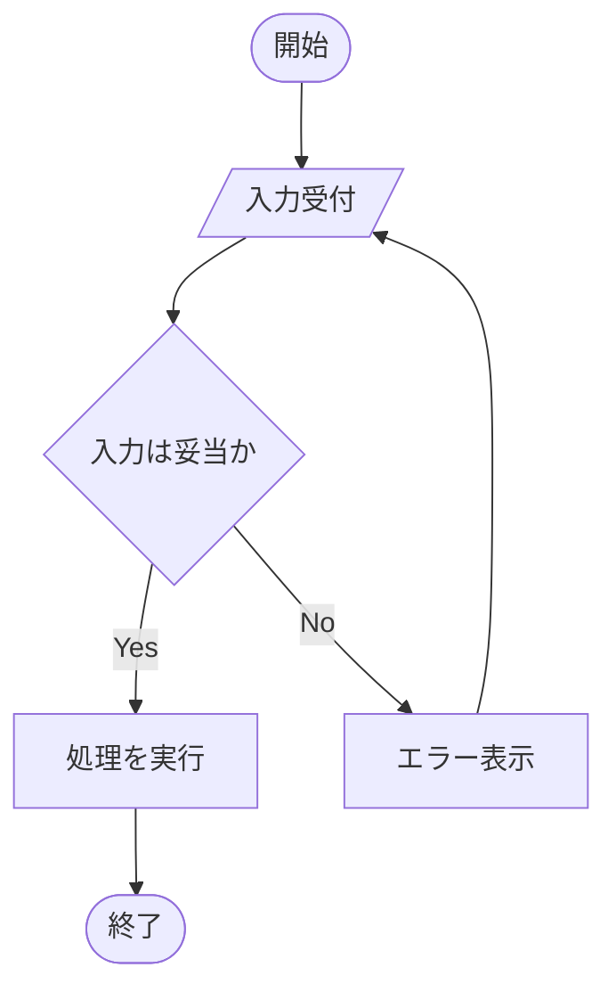
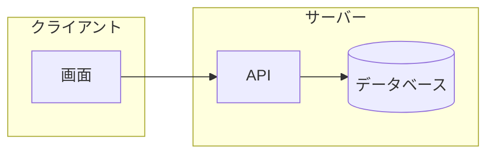

# flowchart

## この教材で身につくこと

- flowchartの基本構文（ノード・矢印・方向指定）
- 分岐（条件ノード）の書き方
- subgraphによるグルーピング

## 概要

flowchartは、処理の流れや構造を箱と矢印で表す最も基本的なMermaid図です。
`TD`（上から下）や`LR`（左から右）で全体の向きを指定します。

## 位置づけ

生成AIでSkillを設計する際、処理フローや条件分岐を最初に整理する
土台として使います。他のMermaid図の前提知識になります。

## 基本文法・プロパティ解説

### ノードの形

| 記法 | 意味 | 例 |
|------|------|-----|
| `[テキスト]` | 四角形 | `A[処理]` |
| `(テキスト)` | 角丸四角形 | `A(処理)` |
| `([テキスト])` | 楕円（開始/終了） | `A([開始])` |
| `{テキスト}` | ひし形（分岐） | `A{条件}` |
| `[(テキスト)]` | 円柱（データベース） | `A[(DB)]` |
| `[/テキスト/]` | 平行四辺形（入出力） | `A[/入力/]` |

### 矢印の種類

| 記法 | 意味 |
|------|------|
| `-->` | 実線矢印 |
| `-.->` | 破線矢印 |
| `==>` | 太線矢印 |
| `-->\|ラベル\|` | ラベル付き矢印 |

## 実ソースコード

**ソースコード:**

```text
flowchart TD
    Start([開始]) --> Input[/入力受付/]
    Input --> Check{入力は妥当か}
    Check -->|Yes| Process[処理を実行]
    Check -->|No| Error[エラー表示]
    Process --> End([終了])
    Error --> Input
```



**コードのポイント:**

- `Start([開始])` は開始ノード（楕円形）、`End([終了])` が終了ノード
- `Input[/入力受付/]` は平行四辺形で入出力を表す
- `Check{入力は妥当か}` はひし形の分岐ノード、`-->|Yes|`/`-->|No|` でラベル付き分岐を表現
- `Error --> Input` で入力からやり直すループになっている

subgraphでグルーピングする例です。

**ソースコード:**

```text
flowchart LR
    subgraph Client[クライアント]
        UI[画面]
    end
    subgraph Server[サーバー]
        API[API]
        DB[(データベース)]
    end
    UI --> API --> DB
```



**コードのポイント:**

- `subgraph Client[クライアント] ... end` でノードをグループ化し、枠付きで表示する
- `DB[(データベース)]` は円柱形でデータベースを表す
- グループ間の矢印（`UI --> API --> DB`）はグループ内ノードを指定するだけでよい

## 演習課題

1. 「ログイン成功/失敗」を分岐させるflowchartを書け
2. subgraphを2つ使い、クライアントとサーバーの処理を分けて表現せよ

## 理解度チェック

- [ ] ノードの形の使い分けが説明できる
- [ ] 分岐ノード（ひし形）とラベル付き矢印を組み合わせて書ける
- [ ] subgraphで処理をグルーピングできる

---

[← 01. Mermaid基礎 目次](00-README.md) | [次へ: sequenceDiagram →](02-sequence-diagram.md)
