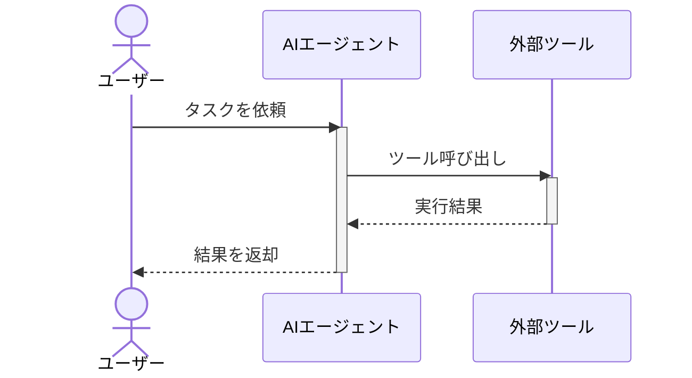
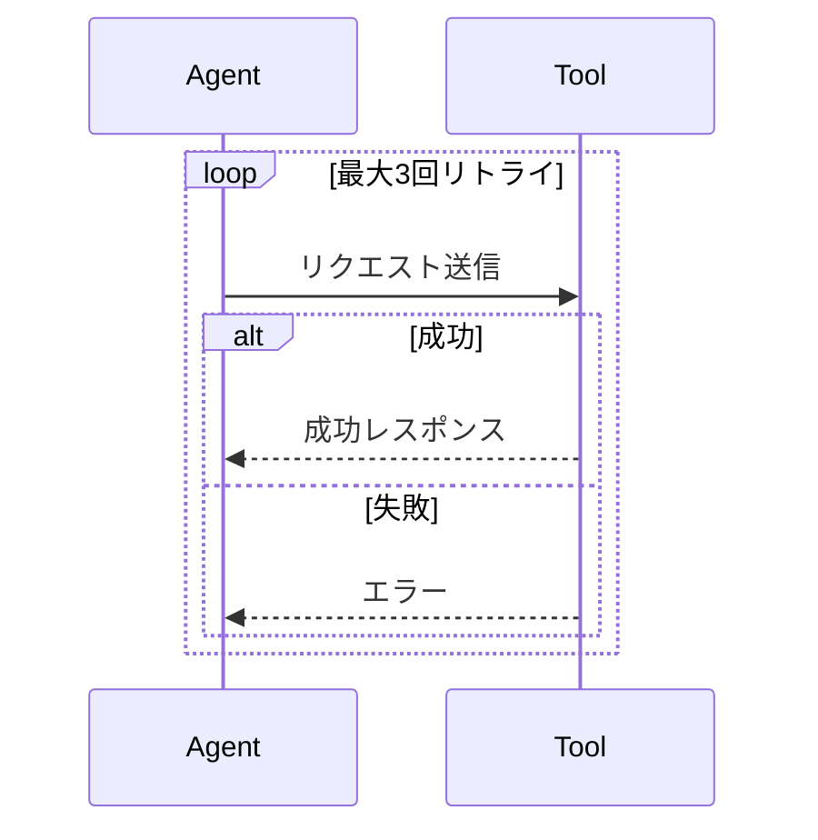

# sequenceDiagram

## この教材で身につくこと

- participant/actorの使い分け
- メッセージ矢印の種類とactivate/deactivate
- loop/altブロックによる繰り返し・条件分岐の表現

## 概要

sequenceDiagramは、複数の登場人物（人・システム・エージェント）の間で
やり取りされるメッセージを時系列に沿って表す図です。

## 位置づけ

生成AIエージェントとツール呼び出しのやり取りなど、「誰が・いつ・何を
呼び出すか」を明確にしたい場面で使います。flowchartでは表現しにくい
時系列の詳細を補います。

## 基本文法・プロパティ解説

### 登場人物の宣言

| 記法 | 意味 |
|------|------|
| `participant X` | システムなどの登場人物 |
| `participant X as 表示名` | 表示名を指定 |
| `actor X as 表示名` | 人型アイコンの登場人物 |

### メッセージ矢印

| 記法 | 意味 |
|------|------|
| `->>` | 実線・非同期メッセージ |
| `-->>` | 破線・応答メッセージ |
| `activate X` / `deactivate X` | 処理中であることを示す帯 |

## 実ソースコード

**ソースコード:**

```text
sequenceDiagram
    actor User as ユーザー
    participant Agent as AIエージェント
    participant Tool as 外部ツール

    User->>Agent: タスクを依頼
    activate Agent
    Agent->>Tool: ツール呼び出し
    activate Tool
    Tool-->>Agent: 実行結果
    deactivate Tool
    Agent-->>User: 結果を返却
    deactivate Agent
```



**コードのポイント:**

- `actor User as ユーザー` は人型アイコン、`participant` はシステムを表す
- `activate Agent` / `deactivate Agent` で処理中の帯を表示する
- `->>` は実線の依頼メッセージ、`-->>` は破線の応答メッセージ

`loop`と`alt`で繰り返し・条件分岐を表現する例です。

**ソースコード:**

```text
sequenceDiagram
    participant Agent
    participant Tool

    loop 最大3回リトライ
        Agent->>Tool: リクエスト送信
        alt 成功
            Tool-->>Agent: 成功レスポンス
        else 失敗
            Tool-->>Agent: エラー
        end
    end
```



**コードのポイント:**

- `loop 最大3回リトライ ... end` で繰り返し区間を囲む
- `alt 成功 ... else 失敗 ... end` で条件分岐を表現する
- ラベル文字列（`最大3回リトライ`、`成功`）はそのまま図に表示される

## 演習課題

1. ユーザー・エージェント・2つのツールが登場するsequenceDiagramを書け
2. `alt`を使い、ツール呼び出しの成功/失敗を分岐させよ

## 理解度チェック

- [ ] participantとactorの違いが説明できる
- [ ] activate/deactivateで処理中区間を表現できる
- [ ] loop/altで繰り返し・条件分岐を表現できる

---

[← 前へ: flowchart](01-flowchart.md) | [次へ: class/stateDiagram →](03-state-and-class-diagram.md)
