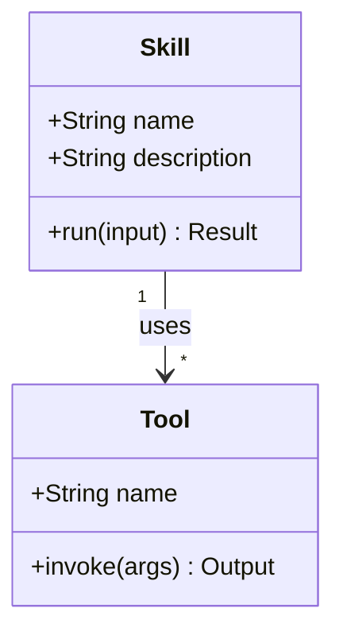
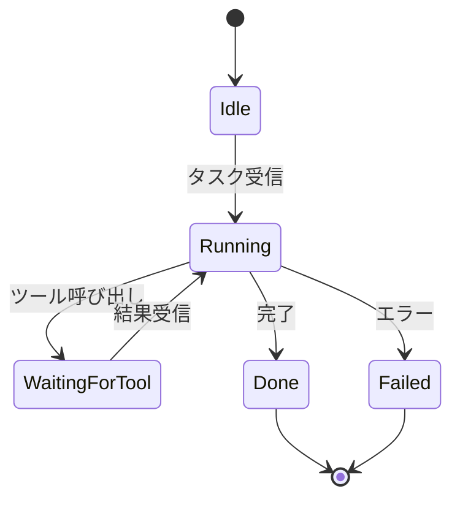

# classDiagram / stateDiagram

## この教材で身につくこと

- classDiagramでの構造・関連の表現
- stateDiagram-v2での状態と遷移条件の表現
- SkillやAgentのようなオブジェクト設計への応用

## 概要

classDiagramは「モノの構造と関係」を、stateDiagramは「モノの状態遷移」
を表す図です。AI Skillの内部設計を整理する際によく使います。

## 位置づけ

flowchart/sequenceDiagramが「処理の流れ」を表すのに対し、
classDiagram/stateDiagramは「構造」と「状態」に焦点を当てます。
04-ai-skill-workflowsでの実践例の前提知識になります。

## 基本文法・プロパティ解説

### classDiagramの関連記法

| 記法 | 意味 |
|------|------|
| `-->` | 関連 |
| `"1" --> "*"` | 多重度付き関連 |
| `+field` | public属性 |
| `+method() 戻り値` | メソッド |

### stateDiagramの記法

| 記法 | 意味 |
|------|------|
| `[*] --> State` | 初期状態 |
| `State --> [*]` | 終了状態 |
| `A --> B : 条件` | 遷移条件ラベル |

## 実ソースコード

## 演習課題

1. Skillが複数のToolを保持するclassDiagramを、多重度付きで書け
2. 「待機中→実行中→完了/失敗」のstateDiagramを書け

## 理解度チェック

- [ ] classDiagramで多重度付き関連が書ける
- [ ] stateDiagramで初期状態と終了状態を表現できる
- [ ] 遷移条件をラベルとして書ける

---

[← 前へ: sequenceDiagram](02-sequence-diagram.md) | [次へ: その他の図 →](04-other-diagrams.md)
