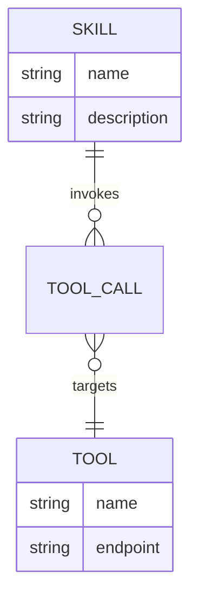
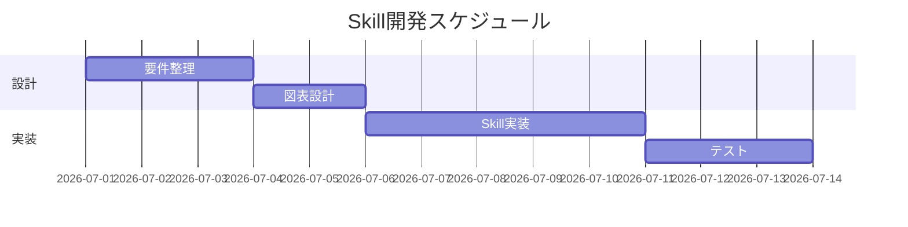
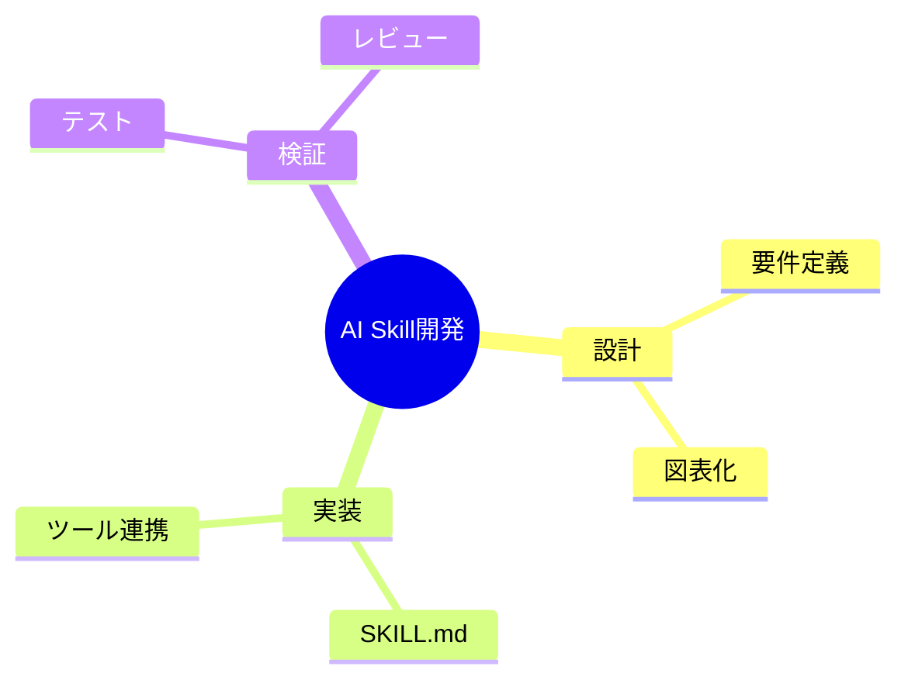
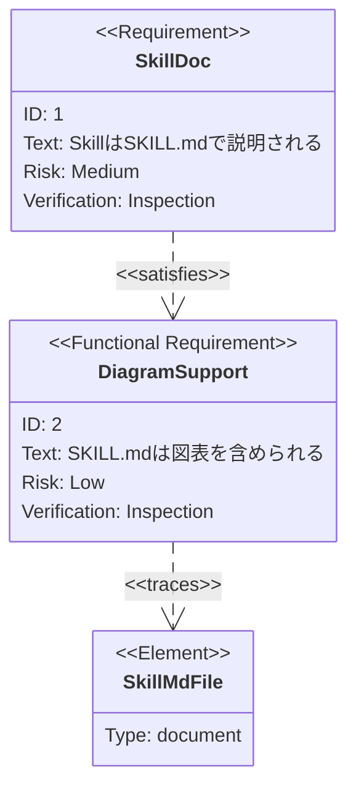

# その他の図（ER・gantt・mindmap・requirementDiagram）

## この教材で身につくこと

- erDiagramでのデータ構造表現
- ganttでのスケジュール表現
- mindmapでのアイデア整理
- requirementDiagramでの要件・実装要素の対応表現

## 概要

Mermaidにはflowchart/sequence/class/state以外にも、目的に応じた
図の種類が用意されています。ここでは代表的な4種を扱います。

## 位置づけ

これらは頻度は低いものの、要件定義・スケジュール調整・
アイデア出しなど、Skill開発の周辺工程で役立ちます。

## 基本文法・プロパティ解説

### 主な要素

| 図の種類 | 主なキーワード | 用途 |
|---|---|---|
| erDiagram | `\|\|--o{`, `}o--\|\|` | データ構造・関連 |
| gantt | `dateFormat`, `section` | スケジュール |
| mindmap | `root((...))` | アイデア整理 |
| requirementDiagram | `requirement`, `element`, `satisfies` | 要件と実装の対応 |

## 実ソースコード

## 演習課題

1. SkillとToolの1対多関係をerDiagramで書け
2. 自分のSkill開発タスクを3つ、mindmapで整理せよ

## 理解度チェック

- [ ] erDiagramの多重度記法（`\|\|`, `o{`）が説明できる
- [ ] ganttでタスクの依存関係（`after`）を表現できる
- [ ] requirementDiagramで要件と実装要素の対応が書ける

---

[← 前へ: class/stateDiagram](03-state-and-class-diagram.md) | [次へ: 02. Graphviz基礎 →](../02-graphviz-basics/00-README.md)
