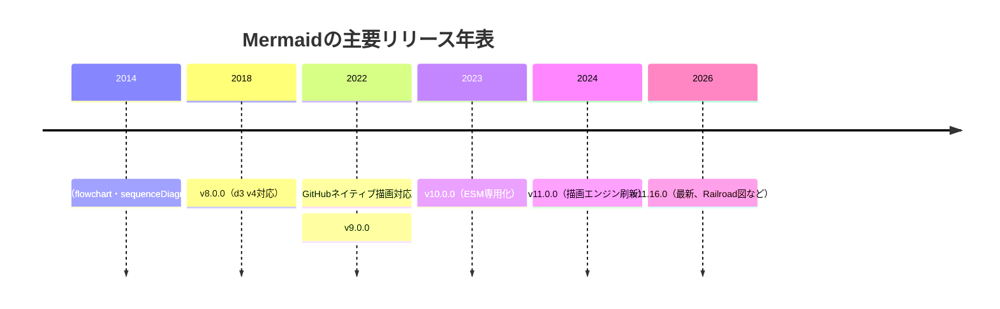

# Mermaidのリリース履歴

## この教材で身につくこと

- Mermaidのバージョンがどう進化してきたかの全体像
- メジャーバージョンごとの破壊的変更・注目機能
- 「今使っているMermaidが古いかどうか」を判断する視点

## 概要

Mermaidは2014年にKnut Sveidqvist氏が個人で作ったツールですが、
2022年のGitHubネイティブ対応を境に採用が急拡大し、
現在も数週間おきにマイナーバージョンがリリースされています。

## 位置づけ

01-04で構文を学んだ上で、「なぜこの書き方ができる/できないのか」を
バージョンの違いから理解するための補足教材です。
新しい構文が動かないときは、まずバージョンを疑う習慣をつけます。

## 基本文法・プロパティ解説

### メジャーバージョンの年表

| バージョン | リリース日 | 主な変更点 |
|---|---|---|
| 最初のリリース | 2014-12 | flowchart・sequenceDiagramの2種類のみ |
| v6.0.0 | 2016-05-29 | 内部構造の整理 |
| v7.0.0 | 2017-01-29 | 内部構造の整理 |
| v8.0.0 | 2018-12-18 | d3.js v4対応、SVGにスタイルをインライン化 |
| （GitHub対応） | 2022-02-14 | GitHubがMarkdown内Mermaidのネイティブ描画に対応 |
| v9.0.0 | 2022-04-07 | mindmap追加（v9.2、2022-11-01） |
| v10.0.0 | 2023-02-21 | ESM専用化（CommonJS廃止）、`render()`が非同期APIに |
| v11.0.0 | 2024-08-23 | 描画エンジン刷新、レイアウトアルゴリズム切替対応、packet図追加 |
| v11.16.0（最新） | 2026-06-25 | Cynefinフレームワーク図、Railroad図、Swimlane単独図 |

### なぜ知る必要があるか

- **`render()`の非同期化（v10）**: v9以前のコールバック前提のコードは
  v10以降そのままでは動かない
- **ESM専用化（v10）**: `require('mermaid')`のCommonJS読み込みが不可になった
- **描画エンジン刷新（v11）**: レイアウトアルゴリズムを`elk`などに
  切り替えられるようになり、大規模フローチャートの見え方が変わる
- **GitHub対応（2022-02-14）**: この日を境にREADME等へMermaidを
  埋め込む文化が急速に広まった

## 実ソースコード

年表をMermaidの`timeline`図で表現します。

**ソースコード:**

```text
timeline
    title Mermaidの主要リリース年表
    2014 : 初版公開（flowchart・sequenceDiagramのみ）
    2018 : v8.0.0（d3 v4対応）
    2022 : GitHubネイティブ描画対応 : v9.0.0
    2023 : v10.0.0（ESM専用化）
    2024 : v11.0.0（描画エンジン刷新）
    2026 : v11.16.0（最新、Railroad図など）
```



**コードのポイント:**

- `title` で年表全体のタイトルを指定する
- `年 : 出来事` の形式で1つの時点に複数の出来事を`:`区切りで並べられる
- 年の指定は昇順である必要があり、逆順にするとレイアウトが崩れる

## 演習課題

1. 自分が使っているMermaidのバージョンを`npm list mermaid`等で確認し、
   このページの年表のどこに位置するか答えよ
2. v10のESM専用化が、自分のプロジェクトに影響するか調査せよ

## 理解度チェック

- [ ] v10でのESM専用化・非同期API化の影響が説明できる
- [ ] v11で描画エンジンが刷新されたことを説明できる
- [ ] `timeline`図で年表を表現できる

---

[← 前へ: その他の図](04-other-diagrams.md) | [次へ: 02. Graphviz基礎 →](../02-graphviz-basics/00-README.md)
