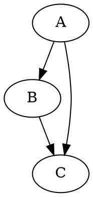

# DOT言語の基本

## この教材で身につくこと

- digraph/graphの違い
- ノードとエッジの最小記法
- コメントの書き方

## 概要

GraphvizはDOT言語でグラフを記述します。有向グラフは`digraph`、
無向グラフは`graph`で宣言します。

## 位置づけ

Mermaidのflowchartに近い役割ですが、DOT言語はより厳密で、
大規模な構造図やレイアウトの自動最適化に強みがあります。

## 基本文法・プロパティ解説

### 基本要素

| 要素 | 意味 |
|------|------|
| `digraph 名前 { ... }` | 有向グラフの宣言 |
| `graph 名前 { ... }` | 無向グラフの宣言 |
| `A -> B;` | 有向エッジ |
| `A -- B;` | 無向エッジ |
| `// コメント` | 1行コメント |

## 実ソースコード

`docs/02-graphviz-basics/examples/01-basic.dot`

## 演習課題

1. 4つのノードを持つ有向グラフを書け（A→B→C→D）
2. 無向グラフ（`graph`）でA-B-Cの関係を書け

## 理解度チェック

- [ ] digraphとgraphの違いが説明できる
- [ ] `->`と`--`の使い分けができる
- [ ] コメントを使って記述を補足できる

---

[← 02. Graphviz基礎 目次](00-README.md) | [次へ: ノード・エッジ属性 →](02-node-edge-attributes.md)
