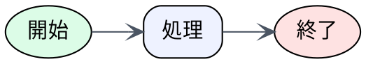
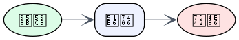

# ノード・エッジ属性

## この教材で身につくこと

- ノード全体・個別ノードへの属性指定
- shape/style/color/labelの使い方
- エッジの矢印・色の制御

## 概要

Graphvizは`node [...]`や`edge [...]`でデフォルト属性を一括指定でき、
個別ノード・エッジで上書きもできます。

## 位置づけ

01で作った最小グラフに「見た目」を加える段階です。
Skillアーキテクチャ図など、意味を色や形で区別したい場面で使います。

## 基本文法・プロパティ解説

### 主なノード属性

| 属性 | 意味 | 例 |
|------|------|-----|
| `shape` | 形 | `box`, `ellipse`, `diamond` |
| `style` | スタイル | `filled`, `rounded`, `dashed` |
| `fillcolor` | 塗りつぶし色 | `"#eef2ff"` |
| `label` | 表示テキスト | `"開始"` |
| `fontname` | フォント | `"Helvetica"` |

### 主なエッジ属性

| 属性 | 意味 | 例 |
|------|------|-----|
| `color` | 線の色 | `"#4b5563"` |
| `arrowhead` | 矢印の形 | `vee`, `normal`, `diamond` |
| `style` | 線種 | `dashed`, `dotted` |

## 実ソースコード

`docs/02-graphviz-basics/examples/02-attributes.dot`

**コードのポイント:**

- `node [...]` で全ノード共通のデフォルト属性（shape/style/fillcolor/fontname）を設定する
- `Start [label="開始", ...]` のように個別ノードで属性を上書きできる
- `edge [color="#4b5563", arrowhead=vee]` でエッジのデフォルト属性を設定する

## 演習課題

1. `node [...]`で全ノード共通のshape/styleを指定せよ
2. 特定のノードだけ`fillcolor`を変えて強調せよ

## 理解度チェック

- [ ] `node [...]`と個別ノード属性の優先順位が説明できる
- [ ] shape/style/fillcolorを組み合わせて意味を区別できる
- [ ] エッジのarrowheadを変更できる

---

[← 前へ: DOT言語の基本](01-dot-language-basics.md) | [次へ: レイアウト制御 →](03-layout-and-rankdir.md)
