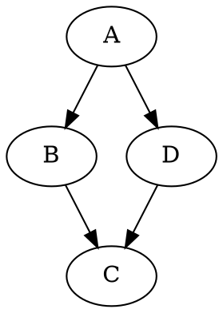
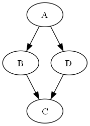
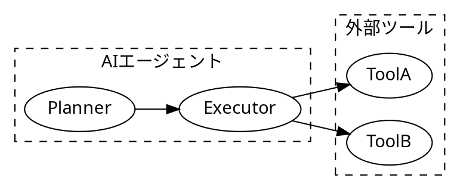
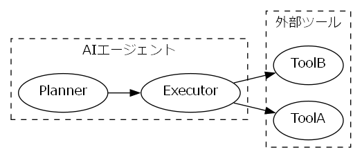

# レイアウト制御

## この教材で身につくこと

- rankdirによる全体方向の制御
- subgraph clusterによるグルーピング
- レイアウトが崩れたときの調整の考え方

## 概要

Graphvizはノード・エッジの配置を自動計算しますが、`rankdir`や
`subgraph cluster_*`で意図した構造に近づけることができます。

## 位置づけ

Mermaidのsubgraphに近い機能ですが、Graphvizは`cluster_`接頭辞と
`rankdir`の組み合わせでより精密にレイアウトを制御できます。

## 基本文法・プロパティ解説

### rankdirの値

| 値 | 方向 |
|----|------|
| `TB` | 上から下（既定） |
| `LR` | 左から右 |
| `BT` | 下から上 |
| `RL` | 右から左 |

### クラスタの書き方

サブグラフ名を`cluster_`で始めると、Graphvizが枠で囲って描画します。

```dot
subgraph cluster_名前 {
  label="表示名";
  style=dashed;
  ノードA;
  ノードB;
}
```

## 実ソースコード

`docs/02-graphviz-basics/examples/03-rankdir.dot`





**コードのポイント:**

- `rankdir=TB` で上から下へのレイアウトになる（既定値と同じ）
- `A -> B -> C;` は `A -> B; B -> C;` と同じ意味のチェーン記法
- `A`から`B`経由と`D`経由の2系統が`C`で合流する構造

`docs/02-graphviz-basics/examples/04-cluster.dot`





**コードのポイント:**

- `subgraph cluster_agent { ... }` のように`cluster_`で始めると枠付きで描画される
- `label="AIエージェント"` でクラスタ内に表示するラベルを指定する
- `Executor -> ToolA;` のようにクラスタ外のノードへもエッジを張れる

## 演習課題

1. `rankdir=LR`と`rankdir=TB`で同じグラフを描き、違いを比較せよ
2. クラスタを2つ使い、「エージェント側」「ツール側」を分けて表現せよ

## 理解度チェック

- [ ] rankdirの4つの値の違いが説明できる
- [ ] `cluster_`接頭辞でグルーピングできる
- [ ] クラスタ間のエッジがどう描画されるか説明できる

---

[← 前へ: ノード・エッジ属性](02-node-edge-attributes.md) | [次へ: 03. 図の選び方と整理法 →](../03-diagram-patterns/00-README.md)
