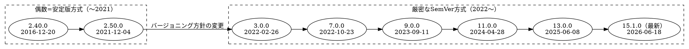

# Graphvizのリリース履歴

## この教材で身につくこと

- Graphvizのバージョン番号の意味と、その変遷
- なぜ短期間でメジャーバージョンが13まで進んだのかの理解
- 「最新版か古い実装か」を見分ける視点

## 概要

Graphvizは1980年代後半にAT&T Bell研究所で生まれた歴史あるツールです。
2021年末まで「偶数マイナー=安定版」という独自の番号方式でしたが、
2022年に厳密なSemVerへ移行し、以降は毎年メジャーバージョンが
上がっています。

## 位置づけ

01-03でDOT言語の基本を学んだ上で、「バージョンによる違い」を
理解し、古い解説記事の情報を鵜呑みにしないための補足教材です。

## 基本文法・プロパティ解説

### バージョン番号方式の変遷

| 期間 | 方式 | 内容 |
|---|---|---|
| 〜2021 | 偶数=安定版 | マイナー番号が偶数なら安定版、奇数なら開発版 |
| 2022〜 | 厳密なSemVer | 破壊的変更があれば必ずメジャー番号を上げる |

厳密なSemVer移行後は、内部API・出力フォーマットの小さな変更でも
メジャー番号が上がるため、「メジャーバージョンが違う=大幅刷新」
とは限らない点に注意してください。

### メジャーバージョンの年表

| バージョン | リリース日 | 備考 |
|---|---|---|
| 1.7.4（最古の記録） | 2000-12-15 | オープンソース公開後の初期バージョン |
| 2.0.0 | 2004-12-11 | |
| 2.40.0 | 2016-12-20 | 偶数=安定版方式の終盤 |
| 2.50.0 | 2021-12-04 | 旧番号方式での最終リリース |
| 3.0.0 | 2022-02-26 | SemVer移行後の最初のメジャーリリース |
| 7.0.0 | 2022-10-23 | |
| 9.0.0 | 2023-09-11 | |
| 11.0.0 | 2024-04-28 | |
| 13.0.0 | 2025-06-08 | |
| 15.1.0（最新） | 2026-06-18 | |

## 実ソースコード

`docs/02-graphviz-basics/examples/05-release-history.dot`

**コードのポイント:**

- `cluster_old`/`cluster_new` の2クラスタで番号方式の前後を分けている
- クラスタ間の`v2_50 -> v3_0`エッジにラベルを付け、移行点を明示している
- チェーン記法（`v3_0 -> v7_0 -> ...`）で同方式内の推移を1行で表現している

## 演習課題

1. `dot -V` で自分の環境のGraphvizバージョンを確認し、年表上の位置を答えよ
2. 旧番号方式（偶数=安定版）と現行のSemVer方式の違いを1文で説明せよ

## 理解度チェック

- [ ] 2021年を境にバージョン番号の付け方が変わったことを説明できる
- [ ] メジャーバージョンが違っても大幅刷新とは限らない理由が説明できる
- [ ] クラスタを使って「方式ごとのグループ」を表現できる

---

[← 前へ: レイアウト制御](03-layout-and-rankdir.md) | [次へ: 03. 図の選び方と整理法 →](../03-diagram-patterns/00-README.md)
