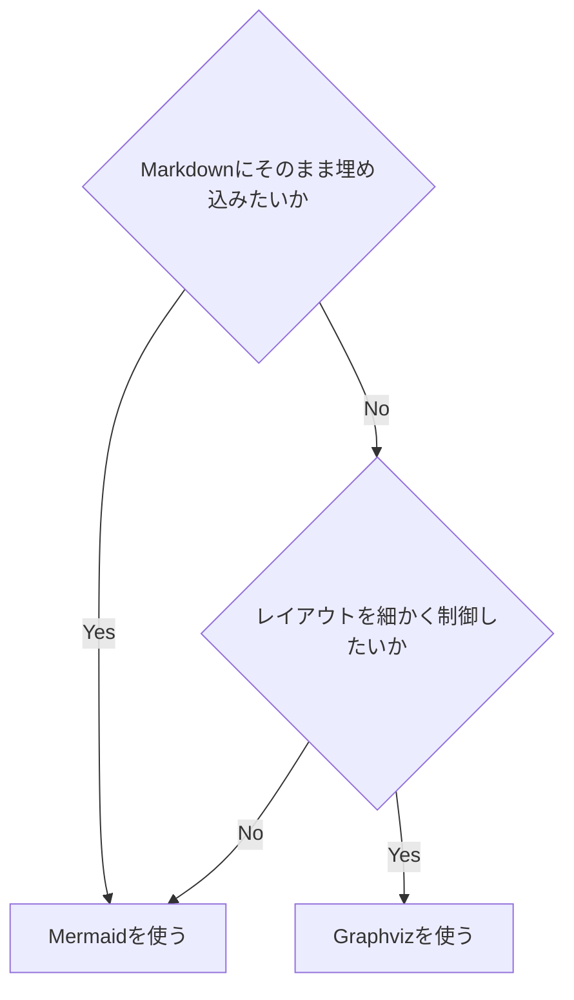

# Mermaid vs Graphviz

## この教材で身につくこと

- MermaidとGraphvizの特性の違い
- どちらを選ぶべきかの判断基準

## 概要

MermaidはMarkdownに埋め込みやすい手軽さが強みで、Graphvizは
レイアウト制御と大規模グラフの描画に強みがあります。

## 位置づけ

01・02カテゴリで両方の基本構文を学んだ上で、実務でどちらを
選ぶかを判断する基準を整理する教材です。

## 基本文法・プロパティ解説

### 特性比較

| 項目 | Mermaid | Graphviz |
|------|---------|----------|
| 用途 | ドキュメント内の簡易図 | 仕様・構造・大規模グラフ |
| 記法 | Markdownに埋め込みやすい | DOT言語 |
| レイアウト | シンプル | 高度に制御しやすい |
| GitHub/VS Codeでの表示 | ネイティブ描画される | されない（画像化が必要） |
| 生成AIとの相性 | 非常に良い、短い指示で生成できる | 良いが構文の厳密さがやや必要 |

## 実ソースコード

判断の目安をflowchartで示します。

**ソースコード:**

```text
flowchart TD
    Q1{Markdownにそのまま埋め込みたいか}
    Q1 -->|Yes| Mermaid[Mermaidを使う]
    Q1 -->|No| Q2{レイアウトを細かく制御したいか}
    Q2 -->|Yes| Graphviz[Graphvizを使う]
    Q2 -->|No| Mermaid
```



**コードのポイント:**

- `Q1{...}`/`Q2{...}` はひし形の判断ノード
- `-->|Yes|`/`-->|No|` のラベルで分岐条件を明示する
- `Q2 -->|No| Mermaid` のように既存ノードへ戻す形で最終的な結論を示せる

## 演習課題

1. 自分が最近作った図を1つ思い出し、Mermaid/Graphvizどちらが
   適していたか理由とともに答えよ

## 理解度チェック

- [ ] MermaidとGraphvizの表示方法の違いが説明できる
- [ ] レイアウト制御の必要性で使い分けを判断できる

---

[← 03. 図の選び方と整理法 目次](00-README.md) | [次へ: 図の選び方 →](02-choosing-the-right-diagram.md)
