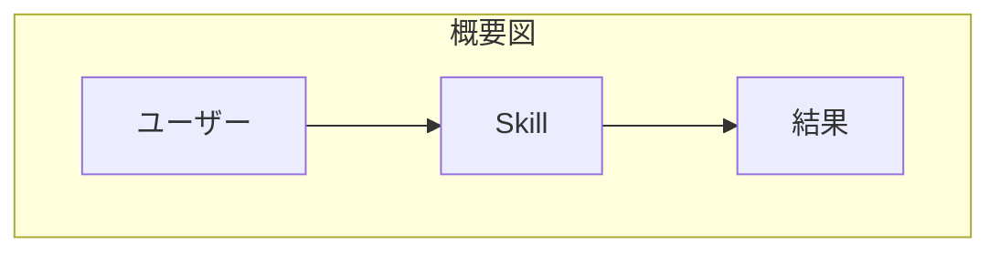
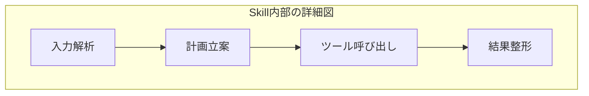

# 複雑な図の整理法

## この教材で身につくこと

- 大きくなった図を分割する判断基準
- subgraph/clusterでのグルーピング整理
- 「1つの図に詰め込みすぎない」ための工夫

## 概要

ノードやエッジが増えすぎた図は読みにくくなります。
分割・グルーピングで可読性を保つ手法を学びます。

## 位置づけ

01・02で選んだ図を、実際に運用可能なレベルまで整理する
仕上げの教材です。05カテゴリの実践例につながります。

## 基本文法・プロパティ解説

### 分割の目安

| 状況 | 対応 |
|------|------|
| ノードが15個を超える | 複数の図に分割する |
| 1つの図に3階層以上の詳細がある | 概要図と詳細図に分ける |
| 同じ意味のグループが繰り返される | subgraph/clusterでまとめる |

## 実ソースコード

概要図と詳細図に分割する例です。

**ソースコード:**

```text
flowchart TD
    subgraph Overview[概要図]
        User[ユーザー] --> Skill[Skill]
        Skill --> Result[結果]
    end
```



**コードのポイント:**

- `subgraph Overview[概要図] ... end` で概要図全体を1つの枠にまとめている
- ノード数は3個のみに抑え、全体の流れだけを示す

**ソースコード:**

```text
flowchart TD
    subgraph SkillDetail[Skill内部の詳細図]
        Input[入力解析] --> Plan[計画立案]
        Plan --> ToolCall[ツール呼び出し]
        ToolCall --> Format[結果整形]
    end
```



**コードのポイント:**

- `subgraph SkillDetail[Skill内部の詳細図] ... end` で概要図の`Skill`ノードを詳細化している
- 4ステップの内部処理（入力解析→計画立案→ツール呼び出し→結果整形）を示す
- 概要図と詳細図を分けることで、それぞれのノード数を少なく保てる

## 演習課題

1. ノード20個規模の図を想定し、どう2つの図に分割するか設計せよ
2. 繰り返し登場するグループをsubgraphでまとめよ

## 理解度チェック

- [ ] 図を分割すべきタイミングが判断できる
- [ ] 概要図と詳細図の役割の違いが説明できる

---

[← 前へ: 図の選び方](02-choosing-the-right-diagram.md) | [次へ: 04. 生成AIでのSkill開発への適用 →](../04-ai-skill-workflows/00-README.md)
