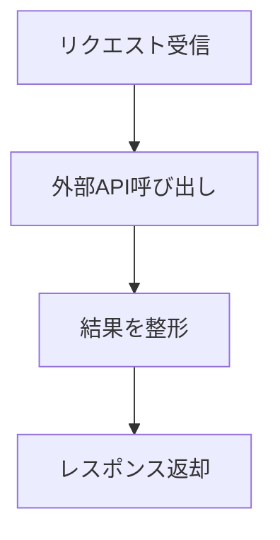
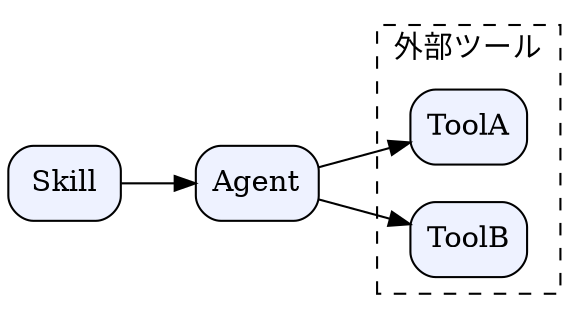

# 生成AIへの図生成プロンプト

## この教材で身につくこと

- 図を生成させるプロンプトに含めるべき要素
- Mermaid/Graphvizそれぞれのプロンプトの違い

## 概要

生成AIに「図の種類」「目的」「対象読者」を明示すると、
一発で使える図に近づきます。

## 位置づけ

01でSKILL.mdへの配置方法を学んだ後、その図を生成AI自身に
書かせる段階です。03の実践的な図の作成につながります。

## 基本文法・プロパティ解説

### プロンプトに含める要素

| 要素 | 例 |
|---|---|
| 図の種類 | 「flowchartで」「sequenceDiagramで」 |
| 対象 | 「ログインAPIの処理フローを」 |
| 対象読者 | 「初めてこのSkillを読む開発者向けに」 |
| 制約 | 「ノードは10個以内に」「日本語ラベルで」 |

## 実ソースコード

プロンプト例とその出力例です。

**プロンプト（Mermaid）:**

```markdown
Skillがユーザーからのリクエストを受け取り、外部APIを呼び出して
結果を返すまでの流れを、flowchartで書いてください。
ノードは日本語ラベル、5個以内にしてください。
```

**出力例:**



**プロンプト（Graphviz）:**

```markdown
SkillとAgentと2つの外部ツールの依存関係を、Graphvizのdigraphで
書いてください。rankdir=LRで、外部ツールはクラスタでまとめてください。
```

**出力例:**



## 演習課題

1. 自分のSkillの構造を説明するプロンプトを、上の表の4要素を
   含めて書け

## 理解度チェック

- [ ] プロンプトに含めるべき4要素が説明できる
- [ ] Mermaid用とGraphviz用でプロンプトの書き方をどう変えるか説明できる

---

[← 前へ: SKILL.mdへの図の組み込み](01-documenting-skill-md-with-diagrams.md) | [次へ: ワークフロー・意思決定図 →](03-workflow-and-decision-diagrams-for-skills.md)
