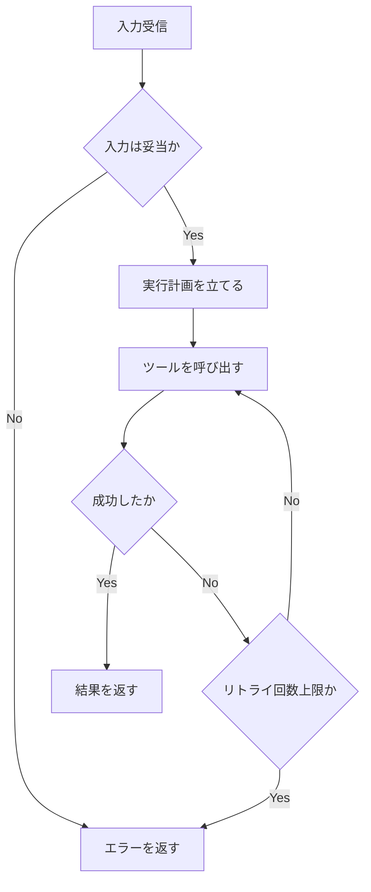
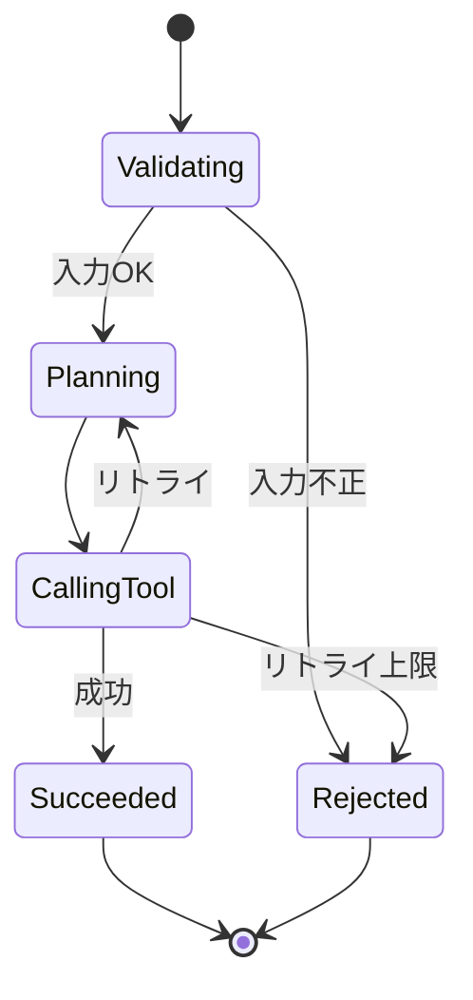

# ワークフロー・意思決定図

## この教材で身につくこと

- Skillの内部ロジックをflowchart/stateDiagramで表現する方法
- 意思決定（条件分岐）を明示的に図示する方法

## 概要

Skillは「入力を受けて、条件によって処理を分岐し、結果を返す」
構造を持つことが多く、flowchart/stateDiagramと相性が良いです。

## 位置づけ

02で学んだプロンプト設計を使い、実際にSkillのロジックを
図として完成させる段階です。

## 基本文法・プロパティ解説

### Skillロジックとの対応

| Skillの要素 | 対応する図の要素 |
|---|---|
| 入力の検証 | 分岐ノード（ひし形） |
| ツール呼び出し | 平行四辺形ノード or sequenceDiagram |
| 状態（待機中/実行中/完了） | stateDiagram |
| エラー処理 | 分岐 + エラーノード |

## 実ソースコード

**プロンプト例:** 「入力検証→実行計画→ツール呼び出し→リトライ→結果返却、
という一連の処理をflowchartで書いてください。リトライは3回までとし、
上限に達したらエラーを返すようにしてください。」

**ソースコード:**

```text
flowchart TD
    Input[入力受信] --> Validate{入力は妥当か}
    Validate -->|No| Reject[エラーを返す]
    Validate -->|Yes| Plan[実行計画を立てる]
    Plan --> Call[ツールを呼び出す]
    Call --> CheckResult{成功したか}
    CheckResult -->|No| Retry{リトライ回数上限か}
    Retry -->|No| Call
    Retry -->|Yes| Reject
    CheckResult -->|Yes| Return[結果を返す]
```



**コードのポイント:**

- `Retry -->|No| Call` でツール呼び出しに戻るリトライループを表現している
- `Retry{リトライ回数上限か}` の分岐で無限ループを防いでいる
- 成功時（`CheckResult -->|Yes|`）と失敗時（`Reject`）で異なる終端に到達する

**プロンプト例:** 「同じロジックをstateDiagram-v2で書いてください。
状態はValidating・Planning・CallingTool・Succeeded・Rejectedの
5つにしてください。」

**ソースコード:**

```text
stateDiagram-v2
    [*] --> Validating
    Validating --> Rejected : 入力不正
    Validating --> Planning : 入力OK
    Planning --> CallingTool
    CallingTool --> Planning : リトライ
    CallingTool --> Succeeded : 成功
    CallingTool --> Rejected : リトライ上限
    Succeeded --> [*]
    Rejected --> [*]
```



**コードのポイント:**

- 5つの状態（`Validating`/`Planning`/`CallingTool`/`Succeeded`/`Rejected`）がプロンプト通り宣言されている
- `CallingTool --> Planning : リトライ` で失敗時に計画立案へ戻る遷移を表す
- `Succeeded --> [*]` / `Rejected --> [*]` の2通りの終了状態がある

## 演習課題

1. 自分のSkillの「入力検証→実行→結果返却」のflowchartを書け
2. 同じSkillをstateDiagramでも表現し、両者の違いを比較せよ

## 理解度チェック

- [ ] Skillのロジックをflowchartの分岐ノードで表現できる
- [ ] リトライ処理をflowchart/stateDiagram双方で表現できる

---

[← 前へ: 生成AIへの図生成プロンプト](02-prompting-ai-to-generate-diagrams.md) | [次へ: AIとの反復修正 →](04-iterative-refinement-with-ai.md)
