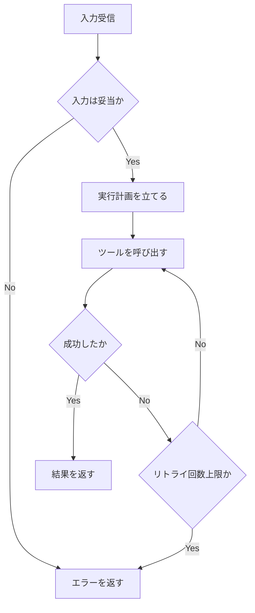
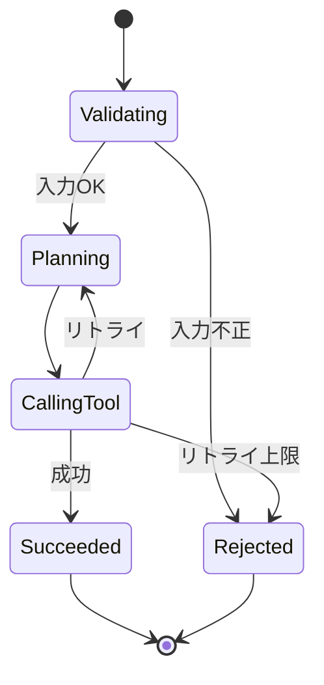

# ワークフロー・意思決定図

## この教材で身につくこと

- Skillの内部ロジックをflowchart/stateDiagramで表現する方法
- 意思決定（条件分岐）を明示的に図示する方法

## 概要

Skillは「入力を受けて、条件によって処理を分岐し、結果を返す」
構造を持つことが多く、flowchart/stateDiagramと相性が良いです。

## 位置づけ

02で学んだプロンプト設計を使い、実際にSkillのロジックを
図として完成させる段階です。

## 基本文法・プロパティ解説

### Skillロジックとの対応

| Skillの要素 | 対応する図の要素 |
|---|---|
| 入力の検証 | 分岐ノード（ひし形） |
| ツール呼び出し | 平行四辺形ノード or sequenceDiagram |
| 状態（待機中/実行中/完了） | stateDiagram |
| エラー処理 | 分岐 + エラーノード |

## 実ソースコード

## 演習課題

1. 自分のSkillの「入力検証→実行→結果返却」のflowchartを書け
2. 同じSkillをstateDiagramでも表現し、両者の違いを比較せよ

## 理解度チェック

- [ ] Skillのロジックをflowchartの分岐ノードで表現できる
- [ ] リトライ処理をflowchart/stateDiagram双方で表現できる

---

[← 前へ: 生成AIへの図生成プロンプト](02-prompting-ai-to-generate-diagrams.md) | [次へ: AIとの反復修正 →](04-iterative-refinement-with-ai.md)
