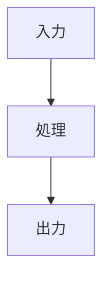
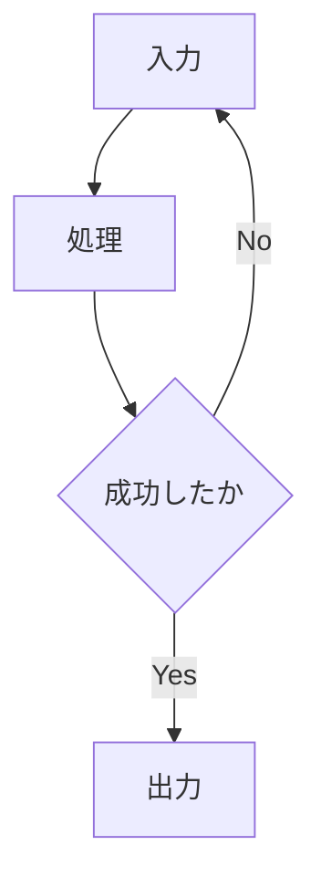

# AIとの反復修正

## この教材で身につくこと

- 生成された図を修正指示で改善する進め方
- 修正指示を具体的にするコツ

## 概要

生成AIが最初に出す図は完璧ではないことが多く、
具体的な修正指示を繰り返すことで精度を上げます。

## 位置づけ

02-03で作った図を、実際に使える品質まで磨き上げる
最後の教材です。05カテゴリの実践例に接続します。

## 基本文法・プロパティ解説

### 修正指示の型

| 悪い指示 | 良い指示 |
|---|---|
| 「もっと分かりやすくして」 | 「ノードXとYの間に条件分岐を追加して」 |
| 「見た目を整えて」 | 「rankdirをLRにして、エラー系ノードを赤系の色にして」 |
| 「図を直して」 | 「sequenceDiagramのactivate/deactivateが抜けているので追加して」 |

## 実ソースコード

修正前後の例です。

**修正前:**

**修正指示:** 「BとCの間にエラー分岐を追加し、エラー時はAに戻すようにして」

**修正後:**

## 演習課題

1. 自分が作った図を1つ選び、「悪い指示」「良い指示」の
   両方の例文を書け

## 理解度チェック

- [ ] 曖昧な修正指示と具体的な修正指示の違いが説明できる
- [ ] 修正前後の図を比較し、変更点を言語化できる

---

[← 前へ: ワークフロー・意思決定図](03-workflow-and-decision-diagrams-for-skills.md) | [次へ: 05. 実践例 →](../05-real-world-examples/00-README.md)
