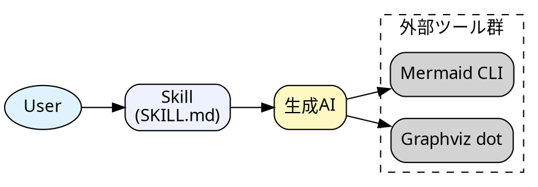
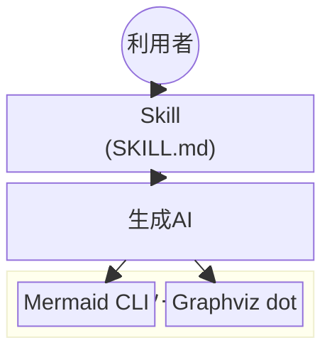

# Skillアーキテクチャ図

## この教材で身につくこと

- 実務規模のSkillアーキテクチャをGraphvizで表現する方法
- クラスタを使った関心事の分離
- Mermaidのネイティブ記法（block-beta）とGraphvizの使い分けを判断できる

## 概要

ユーザー・Skill・生成AI・外部ツール群の関係を、
02-03カテゴリの知識を使って1つの図にまとめます。

## 位置づけ

このカテゴリの最初の教材として、02カテゴリ（Graphviz基礎）と
03カテゴリ（整理法）の総仕上げに位置づけられます。

## 基本文法・プロパティ解説

この図で使っている要素は、すべて02カテゴリで学んだものです。

| 要素 | 用途 |
|---|---|
| `rankdir=LR` | 左から右への流れを表現 |
| `subgraph cluster_tools` | 外部ツール群をグルーピング |
| `fillcolor` | 役割ごとに色分け |
| `block:id["..."]...end`（block-beta） | ブロックのグルーピング（Mermaidネイティブ版） |

## 実ソースコード

`docs/05-real-world-examples/examples/01-skill-architecture.dot`




**コードのポイント:**

- `rankdir=LR`で左から右の流れ（User→Skill→生成AI→外部ツール）を表現している
- `subgraph cluster_tools { ... }`で外部ツール群をグルーピングしている
- `fillcolor`で役割ごとに色分け（User/Skill/生成AI）している

同じ構成をMermaidの`block-beta`で書いた例です。依存パッケージなしで
GitHub上にそのままプレビューできます。

**ソースコード:**

```text
block-beta
  columns 1
  User(("利用者"))
  Skill["Skill\n(SKILL.md)"]
  LLM["生成AI"]
  block:tools["外部ツール群"]
    Mermaid["Mermaid CLI"]
    Graphviz["Graphviz dot"]
  end

  User --> Skill
  Skill --> LLM
  LLM --> Mermaid
  LLM --> Graphviz
```



**コードのポイント:**

- `block:tools["外部ツール群"] ... end` でGraphvizの`subgraph cluster_tools`と
  同じグルーピングを表現する
- `columns 1`で縦方向のレイアウトを指定する（列数を変えると横並びにできる）
- Graphviz版と比べ、`dot`コマンドのインストールが不要でGitHub上に直接
  プレビューできる一方、レイアウトの自由度（`rankdir`のような細かい制御）は劣る
- block-betaは導入時はベータ機能として追加された（本教材ではv11.3系以降を目安とする）

## 演習課題

1. 自分のSkillの構成要素を洗い出し、同様の構造図を書け
2. 同じ構成図をblock-betaで書き、Graphviz版との書きやすさの違いを比較せよ

## 理解度チェック

- [ ] クラスタで外部ツール群をまとめられる
- [ ] 役割ごとに色分けして意味を伝えられる
- [ ] block-betaとGraphvizの使い分け基準（依存関係・レイアウト自由度）を説明できる

---

[← 05. 実践例 目次](00-README.md) | [次へ: マルチエージェントのシーケンス図 →](02-multi-agent-sequence-diagram.md)
