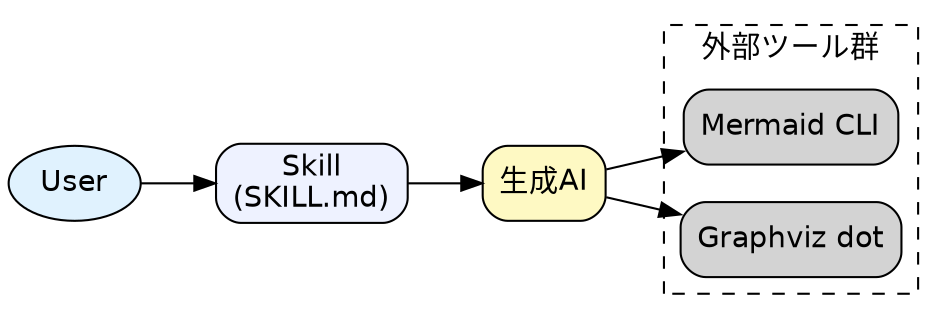
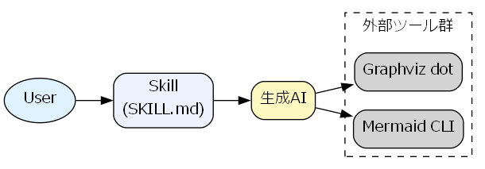

# Skillアーキテクチャ図

## この教材で身につくこと

- 実務規模のSkillアーキテクチャをGraphvizで表現する方法
- クラスタを使った関心事の分離

## 概要

ユーザー・Skill・生成AI・外部ツール群の関係を、
02-03カテゴリの知識を使って1つの図にまとめます。

## 位置づけ

このカテゴリの最初の教材として、02カテゴリ（Graphviz基礎）と
03カテゴリ（整理法）の総仕上げに位置づけられます。

## 基本文法・プロパティ解説

この図で使っている要素は、すべて02カテゴリで学んだものです。

| 要素 | 用途 |
|---|---|
| `rankdir=LR` | 左から右への流れを表現 |
| `subgraph cluster_tools` | 外部ツール群をグルーピング |
| `fillcolor` | 役割ごとに色分け |

## 実ソースコード

`docs/05-real-world-examples/examples/01-skill-architecture.dot`

**コードのポイント:**

- `rankdir=LR`で左から右の流れ（User→Skill→生成AI→外部ツール）を表現している
- `subgraph cluster_tools { ... }`で外部ツール群をグルーピングしている
- `fillcolor`で役割ごとに色分け（User/Skill/生成AI）している

## 演習課題

1. 自分のSkillの構成要素を洗い出し、同様の構造図を書け

## 理解度チェック

- [ ] クラスタで外部ツール群をまとめられる
- [ ] 役割ごとに色分けして意味を伝えられる

---

[← 05. 実践例 目次](00-README.md) | [次へ: マルチエージェントのシーケンス図 →](02-multi-agent-sequence-diagram.md)
