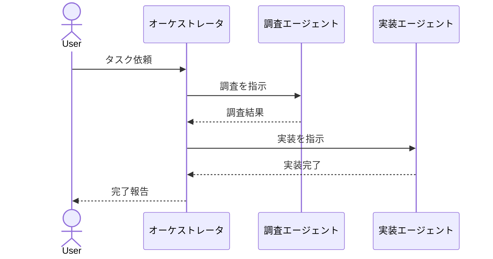

# マルチエージェントのシーケンス図

## この教材で身につくこと

- 複数エージェントが登場するsequenceDiagramの書き方
- オーケストレータを介した処理委譲の表現

## 概要

オーケストレータが複数のサブエージェントにタスクを振り分ける
構成を、MermaidのsequenceDiagramで表現します。

## 位置づけ

01カテゴリのsequenceDiagram、04カテゴリのSkillワークフロー
知識を組み合わせた実践例です。

## 基本文法・プロパティ解説

このシーケンス図で使う要素はすべて01カテゴリで学んだものです。

| 要素 | 用途 |
|---|---|
| `actor` | エンドユーザーを表す |
| `participant` | オーケストレータ・各エージェントを表す |
| `->>` / `-->>` | 依頼・結果報告のメッセージ |

## 実ソースコード

## 演習課題

1. 3つ目のエージェント（レビューエージェント）を追加した
   シーケンス図を書け

## 理解度チェック

- [ ] オーケストレータを介した処理委譲を表現できる
- [ ] 複数エージェントが登場する図を破綻なく書ける

---

[← 前へ: Skillアーキテクチャ図](01-skill-architecture-diagram.md) | [次へ: Skill開発ドキュメントのサンプル →](03-skill-development-doc-sample.md)
