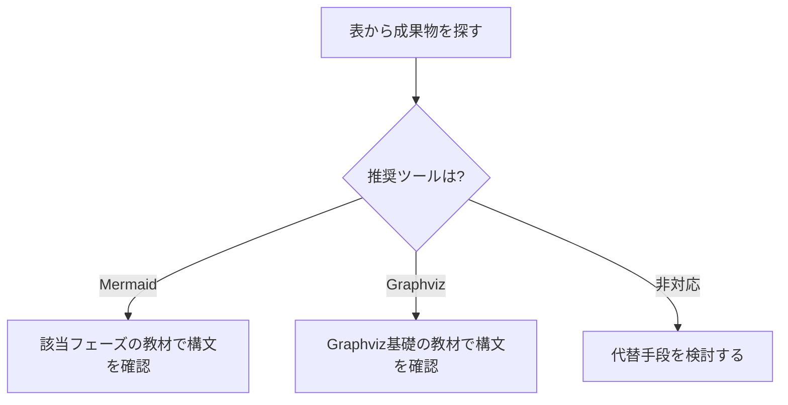

# 開発フェーズ×図カタログ 全体マッピング

## この教材で身につくこと

- 開発フェーズごとの成果物と、対応するMermaid/Graphvizの図の種類を一覧できる
- 表から自分の担当フェーズに必要な図の種類をすぐに引ける
- Mermaid/Graphvizで表現できない成果物とその代替手段を把握する

## 概要

このカテゴリ全体で扱う20種類の成果物と、対応する推奨ツール・図の種類を
一覧できるマッピング表を提供します。02〜07の各教材は、この表の該当行を
深掘りする構成になっています。

## 位置づけ

既存の「03. 図の選び方と整理法」が「伝えたいこと」起点のマッピングであるのに
対し、本カテゴリは「開発フェーズ」起点のマッピングです。本教材はその全体像を
示す索引であり、個々の成果物の実例・実ソースコードは02〜07の各教材で扱います。

## 基本文法・プロパティ解説

### フェーズ×成果物×図 全体マッピング表

| フェーズ | 主な成果物 | 推奨ツール | 図の種類 | 備考 |
|---|---|---|---|---|
| 要件定義 | 業務フロー図 | Mermaid | flowchart | スイムレーンは`subgraph`で代用 |
| 要件定義 | 概念データモデル | Mermaid | erDiagram | 詳細化は基本設計のER図で行う |
| 要件定義 | 要件トレーサビリティ | Mermaid | requirementDiagram | [その他の図](../01-mermaid-basics/04-other-diagrams.md)参照 |
| 要件定義 | ユースケース図 | ─ | 非対応 | 専用記法なし。flowchartでの代替表現を示す |
| 基本設計 | システム構成図 | Mermaid/Graphviz | flowchart / DOT | 外部連携が多い場合はGraphviz推奨 |
| 基本設計 | 画面遷移図 | Mermaid | stateDiagram | 画面を状態として表現 |
| 基本設計 | ER図（論理） | Mermaid | erDiagram | |
| 基本設計 | シーケンス概要図 | Mermaid | sequenceDiagram | |
| 詳細設計 | クラス図 | Mermaid | classDiagram | |
| 詳細設計 | ステートマシン図 | Mermaid | stateDiagram | 複合状態を扱う |
| 詳細設計 | 詳細シーケンス図 | Mermaid | sequenceDiagram | alt/loopを扱う |
| 詳細設計 | DFD（データフロー図） | Graphviz | DOT | Mermaid非対応のため代替 |
| 実装・テスト | モジュール依存図 | Graphviz | DOT | 複雑化時は[複雑な図の整理法](../03-diagram-patterns/03-complex-diagram-organization.md)を参照 |
| 実装・テスト | テストケース分岐図 | Mermaid | flowchart | デシジョンテーブルの可視化 |
| 実装・テスト | テストスケジュール | Mermaid | gantt | |
| リリース・運用 | デプロイフロー図 | Mermaid | flowchart | |
| リリース・運用 | インフラ構成図 | Mermaid/Graphviz | architecture-beta / DOT | シンプルな構成はMermaid、複雑なネットワーク階層はGraphviz推奨。v11.1+必須。詳細は[リリース・運用保守フェーズ](06-release-operations-phase.md)参照 |
| リリース・運用 | 障害対応フロー | Mermaid | flowchart | |
| アジャイル | スプリント計画 | Mermaid | gantt | |
| アジャイル | バーンダウンチャート | Mermaid（制約あり） | xychart-beta | 日付軸非対応・累積値は事前計算が必要。v10.6+必須。詳細は[アジャイル開発での当てはめ](07-agile-artifacts.md)参照 |

「非対応」の項目は隠さず明記しています。Mermaid/Graphvizの限界を理解した上で、
必要に応じて他ツールと併用してください。

## 実ソースコード

表の読み方を示す例です。成果物から推奨ツールへとたどる判断フローです。

**ソースコード:**

```text
flowchart TD
    A[表から成果物を探す] --> B{推奨ツールは?}
    B -->|Mermaid| C[該当フェーズの教材で構文を確認]
    B -->|Graphviz| D[Graphviz基礎の教材で構文を確認]
    B -->|非対応| E[代替手段を検討する]
```



**コードのポイント:**

- `B{推奨ツールは?}` のひし形ノードが表の「推奨ツール」列に対応する分岐
- 「Mermaid/Graphviz」のように2つ並ぶ行は、規模に応じて選択することを示す
- 「非対応」の行は隠さず、代替手段を検討する分岐として明示する

## 演習課題

1. 表から自分が過去に作成したことのある成果物を1つ選び、対応する図の種類と
   その理由を書け
2. 「非対応」の項目を1つ選び、代替手段（他ツール名）を調べて書け

## 理解度チェック

- [ ] 表の「フェーズ」「成果物」「推奨ツール」「図の種類」「備考」列の意味を説明できる
- [ ] 「非対応」の項目がなぜMermaid/Graphvizで表現できないか説明できる
- [ ] 自分の担当フェーズでどの成果物にどの図を使うか、表からすぐに引ける

---

[← 06. プロジェクト開発フェーズと図 目次](00-README.md) | [次へ: 要件定義フェーズ →](02-requirements-phase.md)
