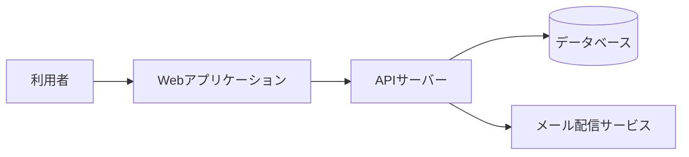
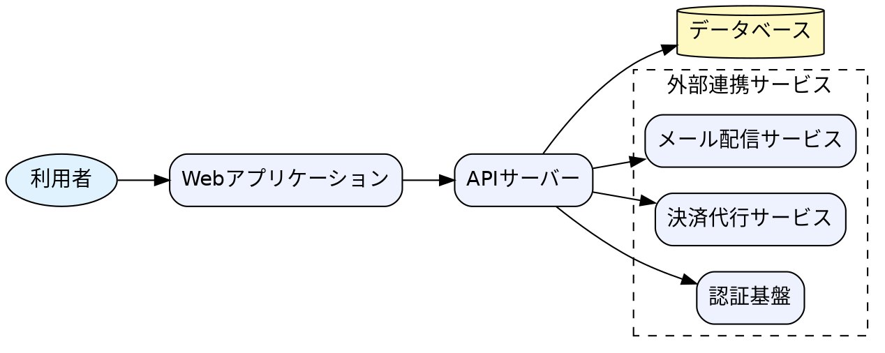
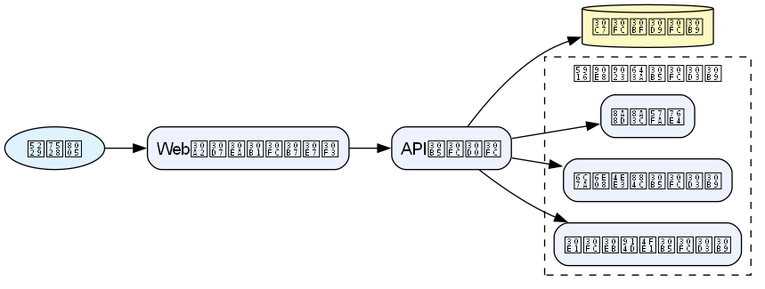
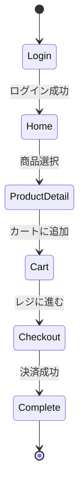
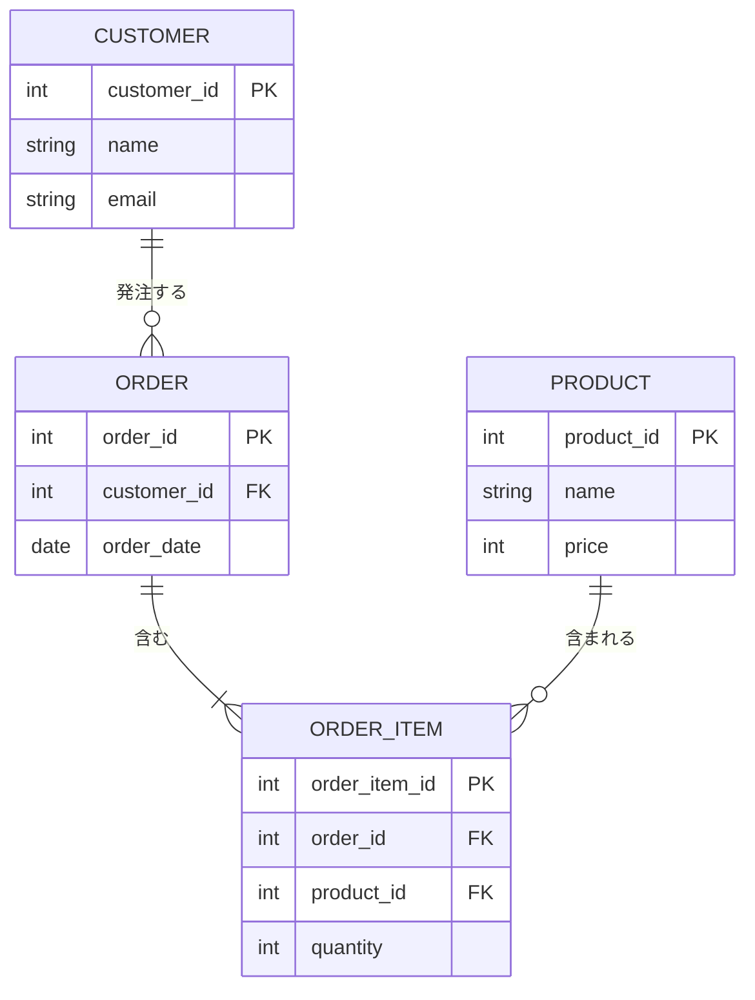

# 基本設計フェーズ

## この教材で身につくこと

- 基本設計フェーズの主な成果物を把握する
- システム構成図をMermaid/Graphviz双方で書き分けられる
- 画面遷移図・ER図（論理）・シーケンス概要図をMermaidで書ける

## 概要

基本設計フェーズでは、システム全体の構造や画面・データ・処理の
概要を整理した成果物が作られます。ここでは代表的な4つの成果物を扱います。

## 位置づけ

[00-README.md](00-README.md)の全体マッピング表のうち「基本設計」行を
深掘りする教材です。要件定義フェーズ（[01](01-requirements-phase.md)）の
概念データモデルを、ここでは属性付きの論理ER図へと詳細化します。

## 基本文法・プロパティ解説

### 成果物別の対応表

| 成果物 | 図の種類 | 適する理由 |
|---|---|---|
| システム構成図（シンプル） | flowchart | 主要コンポーネントの関係を素早く共有できる |
| システム構成図（複雑） | Graphviz DOT | 外部連携が多い場合、自動レイアウトで整理しやすい |
| 画面遷移図 | stateDiagram | 画面を状態、遷移操作をラベル付き矢印で表現できる |
| ER図（論理） | erDiagram | エンティティの属性・関連を明確化できる |

## 実ソースコード

システム構成図（シンプル版）です。コンポーネント数が少ないうちはMermaidで
十分に表現できます。

**ソースコード:**

```text
flowchart LR
    User[利用者] --> WebApp[Webアプリケーション]
    WebApp --> API[APIサーバー]
    API --> DB[(データベース)]
    API --> Mail[メール配信サービス]
```



**コードのポイント:**

- `flowchart LR` で左から右へのデータ・処理の流れを表す
- `DB[(データベース)]` は円柱形でデータベースを表す
- 外部サービス（`Mail`）が増えるとノードが横に伸び、読みにくくなっていく

外部連携が増えて複雑になった場合の、Graphviz版です。クラスタで
外部サービスをグルーピングし、レイアウトが崩れにくくしています。

`docs/06-project-phase-diagrams/examples/01-system-architecture.dot`





**コードのポイント:**

- `subgraph cluster_external { ... }` で外部連携サービスをグルーピングしている
- 外部サービスが増えても`cluster_external`内に追加するだけでよく、
  Graphvizが自動的にレイアウトを整理する
- どちらを使うかの判断基準は
  [03-diagram-patterns/01](../03-diagram-patterns/01-mermaid-vs-graphviz.md)を参照

> **補足:** Mermaidにはアーキテクチャ専用記法の`C4Context`もあります。
> コンテキスト図（システムと利用者・外部システムの関係を示す図）を
> 標準化された記法で書きたい場合の選択肢です。本教材では扱わず、
> 詳細は[ROADMAP.md](../../ROADMAP.md)の将来拡張候補を参照してください。

画面遷移図の例です。

**ソースコード:**

```text
stateDiagram-v2
    [*] --> Login
    Login --> Home : ログイン成功
    Home --> ProductDetail : 商品選択
    ProductDetail --> Cart : カートに追加
    Cart --> Checkout : レジに進む
    Checkout --> Complete : 決済成功
    Complete --> [*]
```



**コードのポイント:**

- 画面（`Login`, `Home`など）を状態として扱い、`stateDiagram-v2`で表現する
- `A --> B : 条件`の`:`以降が画面遷移のきっかけ（ボタン操作等）になる
- `[*]`はアプリの起動・終了に対応する

ER図（論理）の例です。要件定義段階のモデルに属性を追加して詳細化します。

**ソースコード:**

```text
erDiagram
    CUSTOMER {
        int customer_id PK
        string name
        string email
    }
    ORDER {
        int order_id PK
        int customer_id FK
        date order_date
    }
    ORDER_ITEM {
        int order_item_id PK
        int order_id FK
        int product_id FK
        int quantity
    }
    PRODUCT {
        int product_id PK
        string name
        int price
    }
    CUSTOMER ||--o{ ORDER : "発注する"
    ORDER ||--|{ ORDER_ITEM : "含む"
    PRODUCT ||--o{ ORDER_ITEM : "含まれる"
```



**コードのポイント:**

- `PK`/`FK`で主キー・外部キーを明示する
- [要件定義フェーズ](01-requirements-phase.md)の概念モデルに属性を追加して詳細化している
- 型（`int`/`string`/`date`）を明記し、実装時のカラム定義の土台にする

## 演習課題

1. 自分の身近なシステム（例: 予約サイト）のシステム構成図を、まずMermaidの
   flowchartで書き、次に外部連携を3つ以上追加してGraphvizのcluster版に
   書き直せ
2. 3画面以上のstateDiagramで画面遷移図を書け

## 理解度チェック

- [ ] システム構成図をMermaid/Graphviz両方で書ける
- [ ] 複雑さに応じてMermaidとGraphvizを使い分ける判断ができる
- [ ] stateDiagramで画面遷移を表現できる
- [ ] ER図に主キー・外部キーを明記できる

---

[← 前へ: 要件定義フェーズ](01-requirements-phase.md) | [次へ: 詳細設計フェーズ →](03-detailed-design-phase.md)
