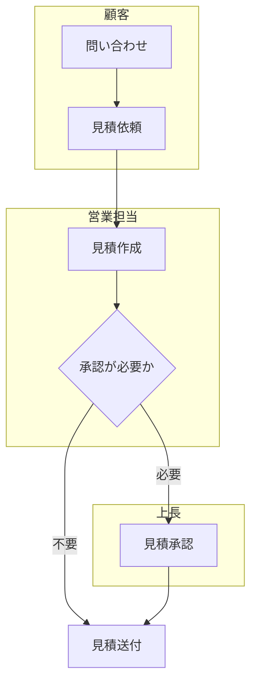
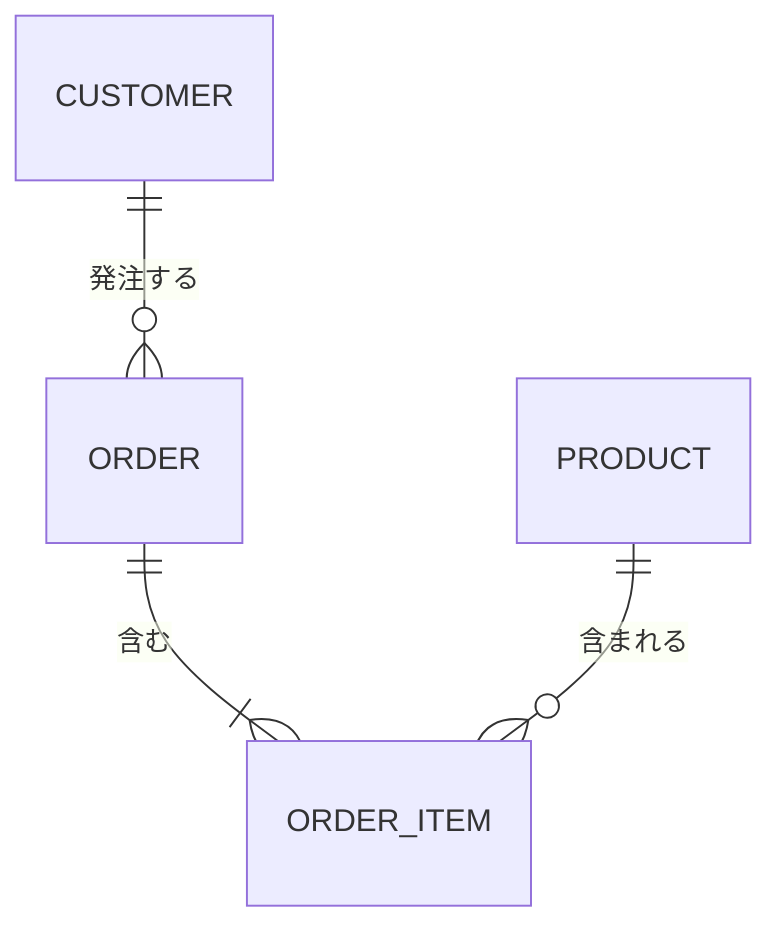
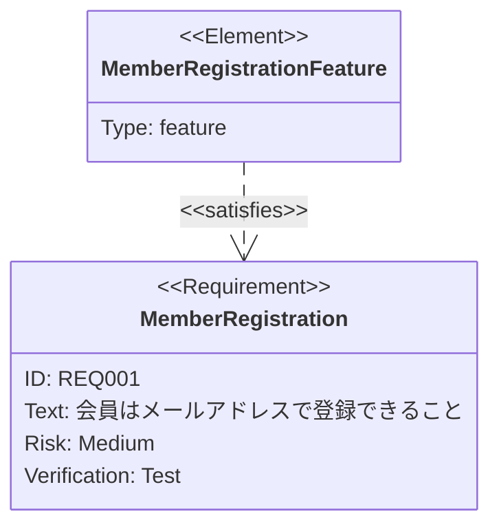
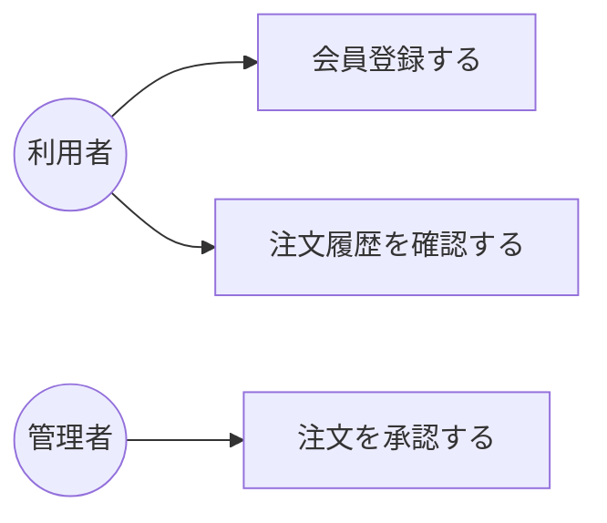
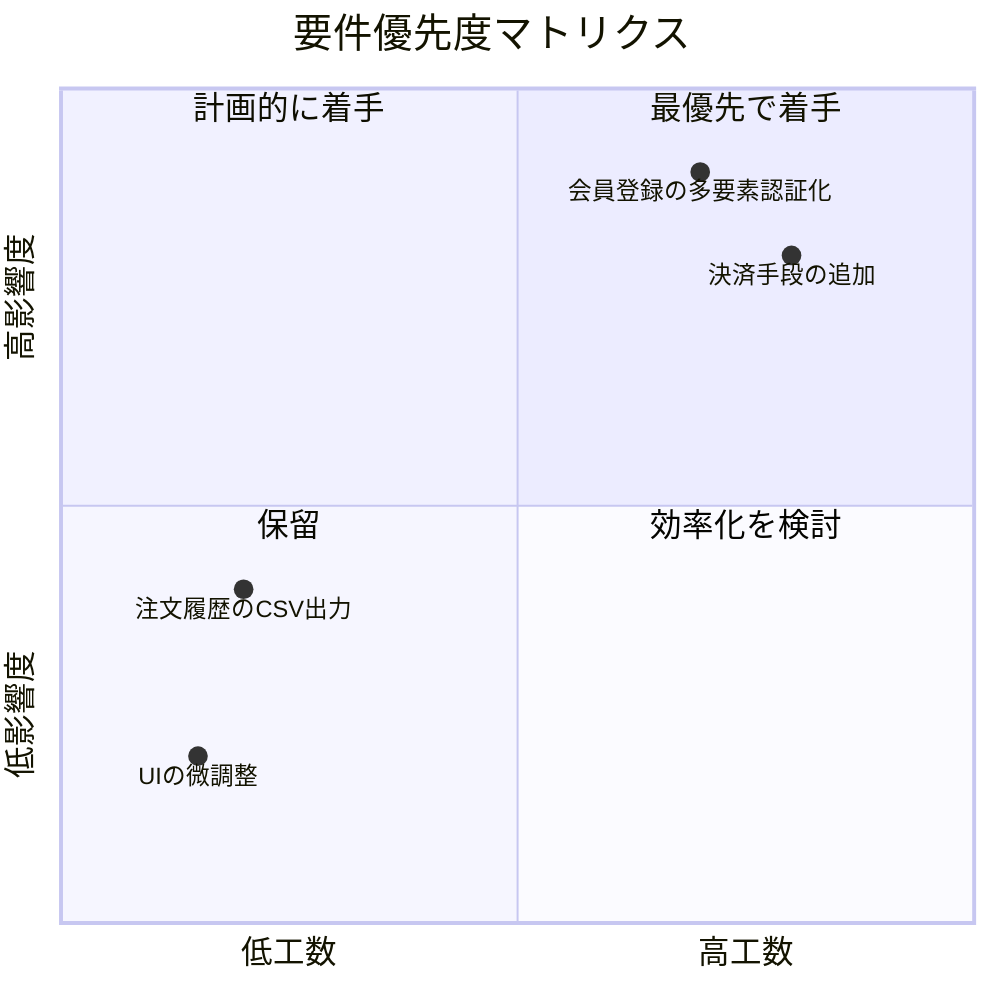

# 要件定義フェーズ

## この教材で身につくこと

- 要件定義フェーズの主な成果物を把握する
- 業務フロー図・概念データモデル・要件トレーサビリティをMermaidで書ける
- ユースケース図（Mermaid非対応）の代替表現を選べる
- quadrantChartで要件の優先順位を可視化できる

## 概要

要件定義フェーズでは、業務の流れやデータの概念構造、要件そのものを
整理した成果物が作られます。ここでは代表的な4つの成果物を扱います。

## 位置づけ

[開発フェーズ×図カタログ 全体マッピング](01-diagram-catalog-overview.md)の全体マッピング表のうち「要件定義」行を
深掘りする教材です。個々の図の詳細構文は
[01. Mermaid基礎](../01-mermaid-basics/00-README.md)を参照してください。

## 基本文法・プロパティ解説

### 成果物別の対応表

| 成果物 | 図の種類 | 適する理由 |
|---|---|---|
| 業務フロー図 | flowchart | 担当者ごとの処理順序・分岐を可視化できる |
| 概念データモデル | erDiagram | エンティティ間の関連を早期に整理できる |
| 要件トレーサビリティ | requirementDiagram | 要件と満足関係を追跡できる |
| ユースケース図 | 非対応（flowchartで代替） | 専用記法はないが、アクターと機能をノードで表現できる |
| 要件優先度マトリクス | quadrantChart | 影響度×工数の2軸で要件の優先順位を可視化できる |

## 実ソースコード

業務フロー図の例です。`subgraph`で担当者ごとの処理をグルーピングし、
スイムレーンのように表現します。

**ソースコード:**

```text
flowchart TD
    subgraph Customer[顧客]
        A[問い合わせ] --> B[見積依頼]
    end
    subgraph Sales[営業担当]
        B --> C[見積作成]
        C --> D{承認が必要か}
    end
    subgraph Manager[上長]
        D -->|必要| E[見積承認]
    end
    D -->|不要| F[見積送付]
    E --> F
```



**コードのポイント:**

- `subgraph Customer[顧客] ... end` のように担当者ごとにグループ化し、スイムレーンを表現する
- `D{承認が必要か}` はひし形の分岐ノードで、`-->|必要|`/`-->|不要|`と対応させる
- グループをまたぐ矢印（`B --> C`）はグループ内ノードを指定するだけでよい

概念データモデルの例です。要件定義段階では属性は最小限にとどめます。

**ソースコード:**

```text
erDiagram
    CUSTOMER ||--o{ ORDER : "発注する"
    ORDER ||--|{ ORDER_ITEM : "含む"
    PRODUCT ||--o{ ORDER_ITEM : "含まれる"
```



**コードのポイント:**

- `CUSTOMER ||--o{ ORDER` は「顧客1人が0件以上の注文を持つ」を表す
- `ORDER_ITEM`を中間エンティティとして`ORDER`と`PRODUCT`をつないでいる
- 要件定義段階では属性（`{ }`）は書かず、関連の整理に集中する

要件トレーサビリティの例です。要件と実装予定機能の対応を早期に記録します。

**ソースコード:**

```text
requirementDiagram
    requirement MemberRegistration {
        id: REQ001
        text: "会員はメールアドレスで登録できること"
        risk: medium
        verifymethod: test
    }

    element MemberRegistrationFeature {
        type: feature
    }

    MemberRegistrationFeature - satisfies -> MemberRegistration
```



**コードのポイント:**

- `requirement MemberRegistration { ... }` で要件をID・本文・リスク付きで宣言する
- `element MemberRegistrationFeature { type: feature }` が要件を満たす実装要素
- `- satisfies ->` で「どの実装要素がどの要件を満たすか」を対応付ける

ユースケース図の代替表現です。Mermaidに専用記法がないため、
flowchartでアクターとユースケースをノードとして表現します。

**ソースコード:**

```text
flowchart LR
    Actor((利用者)) --> UC1[会員登録する]
    Actor --> UC2[注文履歴を確認する]
    Admin((管理者)) --> UC3[注文を承認する]
```



**コードのポイント:**

- `Actor((利用者))` の円形ノードでアクターを表す（UML本来の記法とは異なる代替表現）
- `UC1[会員登録する]`のように四角ノードでユースケースを表す
- 汎化・包含・拡張などUML特有の関係線は表現できない点に注意する

要件優先度マトリクスの例です。影響度×工数の2軸で要件を配置し、
着手順序の合意形成に使います。

**ソースコード:**

```text
quadrantChart
    title 要件優先度マトリクス
    x-axis "低工数" --> "高工数"
    y-axis "低影響度" --> "高影響度"
    quadrant-1 "最優先で着手"
    quadrant-2 "計画的に着手"
    quadrant-3 "保留"
    quadrant-4 "効率化を検討"
    "会員登録の多要素認証化": [0.7, 0.9]
    "注文履歴のCSV出力": [0.2, 0.4]
    "決済手段の追加": [0.8, 0.8]
    "UIの微調整": [0.15, 0.2]
```



**コードのポイント:**

- `x-axis "低工数" --> "高工数"` / `y-axis "低影響度" --> "高影響度"` で軸のラベルと向きを定義する
- `quadrant-1`〜`quadrant-4` で各象限（右上/左上/左下/右下の順）に名前を付ける
- `"会員登録の多要素認証化": [0.7, 0.9]` は `[x座標, y座標]`（0〜1の範囲）で要件を配置する
- quadrantChartは早期のMermaidバージョン（v10.4系）から利用可能な安定機能

## 演習課題

1. 自分の業務や身近な手続きから1つの業務フローを選び、`subgraph`で
   担当者ごとにグルーピングしたflowchartを書け
2. 「利用者」「管理者」の2アクターを持つユースケース図を、flowchartの
   代替表現で書け
3. 自分が担当する要件を3件選び、影響度×工数でquadrantChartにプロットせよ

## 理解度チェック

- [ ] 業務フロー図をflowchartの`subgraph`で表現できる
- [ ] 要件定義段階の概念データモデルをerDiagramで書ける
- [ ] requirementDiagramで要件と実装要素の対応を書ける
- [ ] ユースケース図がMermaidで非対応であることと、その代替表現を説明できる
- [ ] quadrantChartで要件を影響度×工数の2軸に配置できる

---

[← 前へ: 開発フェーズ×図カタログ 全体マッピング](01-diagram-catalog-overview.md) | [次へ: 基本設計フェーズ →](03-basic-design-phase.md)
