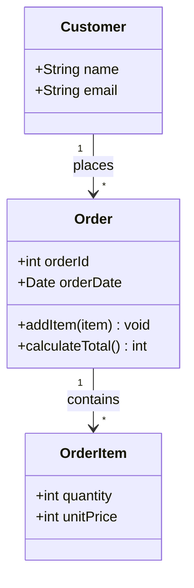
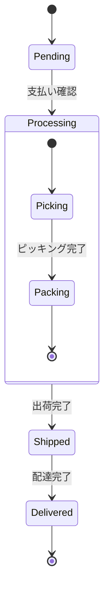
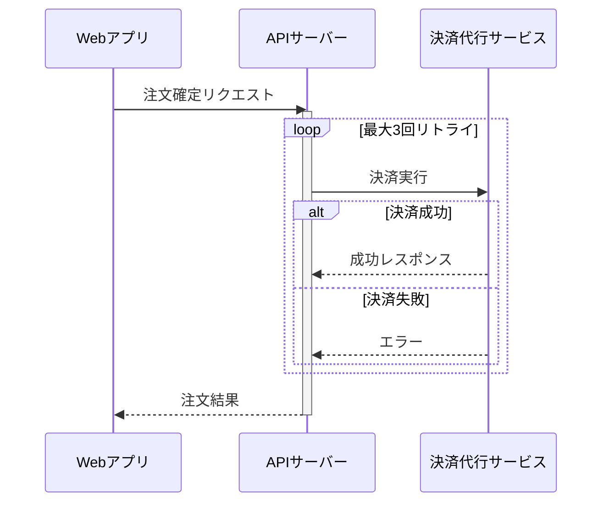
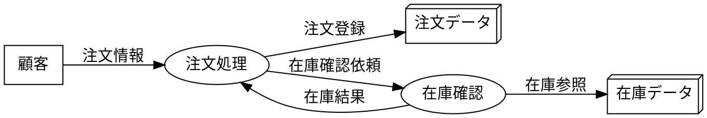
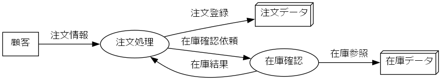

# 詳細設計フェーズ

## この教材で身につくこと

- 詳細設計フェーズの主な成果物を把握する
- クラス図・複合状態を含むステートマシン図・詳細シーケンス図をMermaidで書ける
- DFD（データフロー図）をGraphvizで書ける

## 概要

詳細設計フェーズでは、基本設計で決めた構造をさらに掘り下げ、
クラスやオブジェクトの内部構造・状態遷移・処理のやり取りを
具体化した成果物が作られます。

## 位置づけ

[00-README.md](00-README.md)の全体マッピング表のうち「詳細設計」行を
深掘りする教材です。[基本設計フェーズ](02-basic-design-phase.md)の
シーケンス概要図・画面遷移図を、ここではより詳細な条件分岐・複合状態を
含む形に発展させます。

## 基本文法・プロパティ解説

### 成果物別の対応表

| 成果物 | 図の種類 | 適する理由 |
|---|---|---|
| クラス図 | classDiagram | オブジェクトの属性・メソッド・関連を表現できる |
| ステートマシン図 | stateDiagram | 複合状態（サブ状態）で処理の内部段階を表現できる |
| 詳細シーケンス図 | sequenceDiagram | alt/loopでリトライや分岐を含むやり取りを表現できる |
| DFD（データフロー図） | Graphviz DOT | Mermaid非対応のため、形状指定で代替表現する |

## 実ソースコード

クラス図の例です。

**ソースコード:**

```text
classDiagram
    class Order {
        +int orderId
        +Date orderDate
        +addItem(item) void
        +calculateTotal() int
    }
    class OrderItem {
        +int quantity
        +int unitPrice
    }
    class Customer {
        +String name
        +String email
    }
    Customer "1" --> "*" Order : places
    Order "1" --> "*" OrderItem : contains
```



**コードのポイント:**

- `class Order { ... }` にメソッド（`addItem`, `calculateTotal`）を含めて実装レベルに近づける
- `Customer "1" --> "*" Order : places` は「顧客1人が複数の注文を持つ」多重度付き関連
- [基本設計フェーズ](02-basic-design-phase.md)のER図（CUSTOMER/ORDER/ORDER_ITEM）と
  対応する構造になっている

複合状態を含むステートマシン図の例です。「処理中」の内部段階を
サブ状態として表現します。

**ソースコード:**

```text
stateDiagram-v2
    [*] --> Pending
    Pending --> Processing : 支払い確認
    state Processing {
        [*] --> Picking
        Picking --> Packing : ピッキング完了
        Packing --> [*]
    }
    Processing --> Shipped : 出荷完了
    Shipped --> Delivered : 配達完了
    Delivered --> [*]
```



**コードのポイント:**

- `state Processing { ... }` で複合状態（サブ状態を持つ状態）を宣言する
- サブ状態内にも独自の`[*]`（開始・終了）を持てる
- 外側から見ると`Processing`は1つの状態のままなので、全体像を保ったまま詳細化できる

詳細シーケンス図の例です。決済のリトライを`loop`/`alt`で表現します。

**ソースコード:**

```text
sequenceDiagram
    participant WebApp as Webアプリ
    participant API as APIサーバー
    participant Payment as 決済代行サービス

    WebApp->>API: 注文確定リクエスト
    activate API
    loop 最大3回リトライ
        API->>Payment: 決済実行
        alt 決済成功
            Payment-->>API: 成功レスポンス
        else 決済失敗
            Payment-->>API: エラー
        end
    end
    API-->>WebApp: 注文結果
    deactivate API
```



**コードのポイント:**

- `loop 最大3回リトライ ... end` の中に`alt`を入れ子にし、リトライ処理を表現する
- `activate API`/`deactivate API`で注文確定リクエスト全体の処理区間を示す
- 基本設計の「シーケンス概要図」に対し、リトライという実装詳細を追加している

DFD（データフロー図）の例です。Mermaidに専用記法がないため、Graphvizの
`shape`でプロセス・データストア・外部エンティティを描き分けます。

`docs/06-project-phase-diagrams/examples/02-dfd.dot`





**コードのポイント:**

- `shape=box`は外部エンティティ（顧客）、`shape=ellipse`はプロセス（注文処理・在庫確認）
- `shape=box3d`はデータストア（注文データ・在庫データ）を表す、DFDでよく使われる形状の代替
- エッジのラベル（`label="注文情報"`等）がデータフローの名前になる

## 演習課題

1. [基本設計フェーズ](02-basic-design-phase.md)のER図に対応するクラス図を、
   メソッドを2つ以上加えて書け
2. 「処理中」に相当する状態を1つ選び、複合状態として2段階以上のサブ状態に
   分解したstateDiagramを書け
3. 何らかの外部APIリクエストを題材に、`loop`と`alt`を組み合わせた
   詳細シーケンス図を書け

## 理解度チェック

- [ ] classDiagramでメソッドを含む詳細なクラス構造を書ける
- [ ] `state 名前 { ... }`で複合状態を表現できる
- [ ] `loop`と`alt`を組み合わせた詳細シーケンス図を書ける
- [ ] DFDをGraphvizの`shape`使い分けで表現できる

---

[← 前へ: 基本設計フェーズ](02-basic-design-phase.md) | [次へ: 実装・テストフェーズ →](04-implementation-testing-phase.md)
