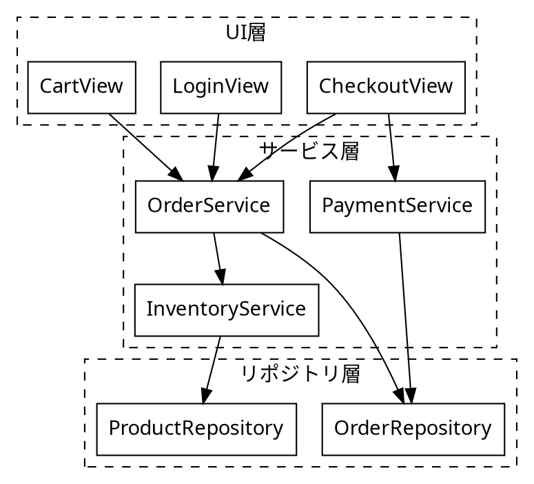
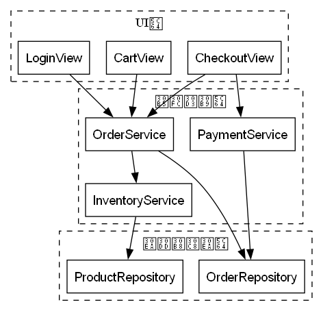
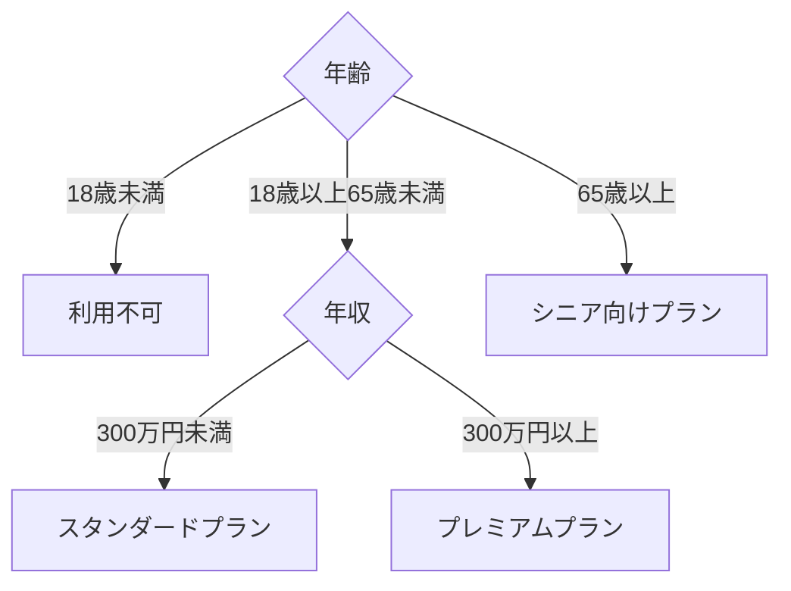
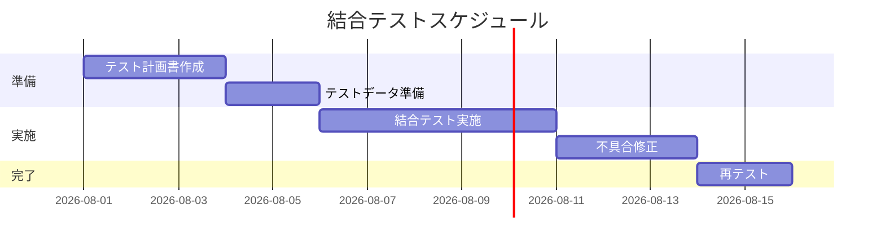

# 実装・テストフェーズ

## この教材で身につくこと

- 実装・テストフェーズの主な成果物を把握する
- モジュール依存図をGraphvizのクラスタで書ける
- テストケース分岐図・テストスケジュールをMermaidで書ける

## 概要

実装フェーズではモジュール間の依存関係を整理し、テストフェーズでは
テストケースの網羅性やスケジュールを可視化した成果物が作られます。

## 位置づけ

[開発フェーズ×図カタログ 全体マッピング](01-diagram-catalog-overview.md)の全体マッピング表のうち「実装・テスト」行を
深掘りする教材です。[詳細設計フェーズ](04-detailed-design-phase.md)の
クラス図をもとに、実際のモジュール構成へ落とし込みます。

## 基本文法・プロパティ解説

### 成果物別の対応表

| 成果物 | 図の種類 | 適する理由 |
|---|---|---|
| モジュール依存図 | Graphviz DOT | クラスタで層を分け、大規模でも自動整理できる |
| テストケース分岐図 | flowchart | デシジョンテーブルの条件組み合わせを可視化できる |
| テストスケジュール | gantt | タスクの依存関係・期間を時系列で共有できる |

## 実ソースコード

モジュール依存図の例です。UI層・サービス層・リポジトリ層をクラスタで
分けています。

`docs/06-project-phase-diagrams/examples/03-module-dependency.dot`





**コードのポイント:**

- `rankdir=TB`でUI層→サービス層→リポジトリ層という上位から下位への依存方向を表す
- 3つの`cluster_*`で層ごとにグルーピングし、層をまたぐ依存が視覚的にわかる
- モジュールが増えて依存が複雑化した場合の整理法は
  [複雑な図の整理法](../03-diagram-patterns/03-complex-diagram-organization.md)を参照

テストケース分岐図の例です。デシジョンテーブル（年齢×年収の組み合わせ）を
flowchartの分岐として可視化します。

**ソースコード:**

```text
flowchart TD
    Age{年齢} -->|18歳未満| Reject[利用不可]
    Age -->|18歳以上65歳未満| Income{年収}
    Age -->|65歳以上| SeniorPlan[シニア向けプラン]
    Income -->|300万円未満| StandardPlan[スタンダードプラン]
    Income -->|300万円以上| PremiumPlan[プレミアムプラン]
```



**コードのポイント:**

- `Age{年齢}`と`Income{年収}`の2つの分岐ノードで条件の組み合わせを表す
- 終端ノード（`Reject`/`SeniorPlan`/`StandardPlan`/`PremiumPlan`）の数が
  テストケース数の目安になる
- 条件の組み合わせ漏れ・重複がないかを図で確認できる

テストスケジュールの例です。

**ソースコード:**

```text
gantt
    title 結合テストスケジュール
    dateFormat YYYY-MM-DD
    section 準備
    テスト計画書作成 :t1, 2026-08-01, 3d
    テストデータ準備 :t2, after t1, 2d
    section 実施
    結合テスト実施 :t3, after t2, 5d
    不具合修正 :t4, after t3, 3d
    section 完了
    再テスト :t5, after t4, 2d
```



**コードのポイント:**

- `section 準備`/`section 実施`/`section 完了`でテスト工程をグルーピングする
- `after t2`のように前タスクの完了を起点にでき、依存関係を表現できる
- 不具合修正・再テストのように手戻りタスクも1つのタスクとして計画に組み込める

## 演習課題

1. [詳細設計フェーズ](04-detailed-design-phase.md)のクラス図（Order/OrderItem/Customer）
   をもとに、4層以上のモジュール依存図をGraphvizで書け
2. 3つ以上の条件を組み合わせたデシジョンテーブルを、flowchartの分岐として書け
3. 単体テスト→結合テスト→受入テストの3段階を含むganttチャートを書け

## 理解度チェック

- [ ] Graphvizのクラスタでモジュールを層ごとに分けられる
- [ ] デシジョンテーブルをflowchartの分岐として可視化できる
- [ ] ganttでタスクの依存関係を含むテストスケジュールを書ける

---

[← 前へ: 詳細設計フェーズ](04-detailed-design-phase.md) | [次へ: リリース・運用保守フェーズ →](06-release-operations-phase.md)
