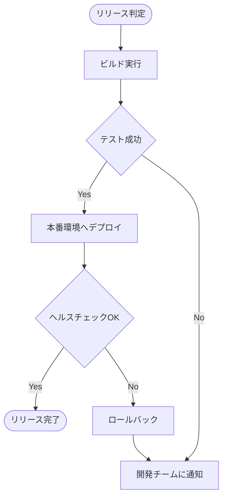
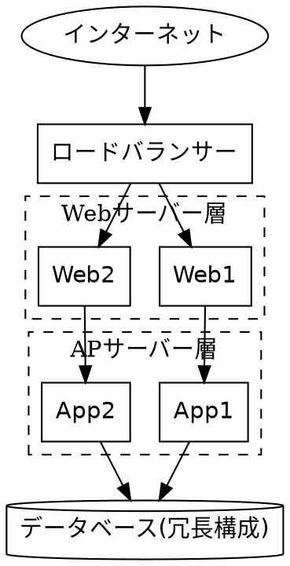
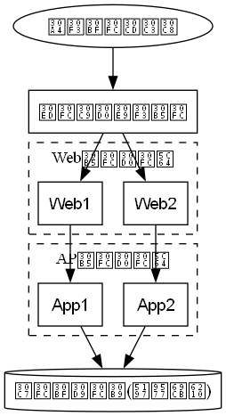
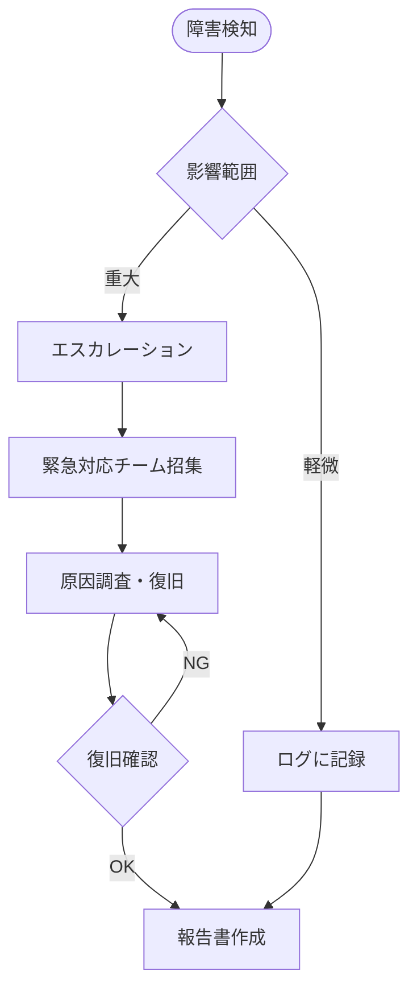

# リリース・運用保守フェーズ

## この教材で身につくこと

- リリース・運用保守フェーズの主な成果物を把握する
- デプロイフロー図・障害対応フローをMermaidで書ける
- インフラ構成図をGraphvizで書ける

## 概要

リリース・運用保守フェーズでは、デプロイの手順やインフラの構成、
障害発生時の対応手順を整理した成果物が作られます。

## 位置づけ

[00-README.md](00-README.md)の全体マッピング表のうち「リリース・運用」行を
深掘りする教材です。[基本設計フェーズ](02-basic-design-phase.md)の
システム構成図を、ここでは実際のサーバー冗長構成にまで具体化します。

## 基本文法・プロパティ解説

### 成果物別の対応表

| 成果物 | 図の種類 | 適する理由 |
|---|---|---|
| デプロイフロー図 | flowchart | ビルド〜デプロイ〜検証の手順と分岐を表現できる |
| インフラ構成図 | Graphviz DOT | サーバー冗長構成など階層的な構造を整理しやすい |
| 障害対応フロー | flowchart | 検知から復旧までの対応手順・エスカレーションを表現できる |

## 実ソースコード

デプロイフロー図の例です。

**ソースコード:**

```text
flowchart TD
    Start([リリース判定]) --> Build[ビルド実行]
    Build --> Test{テスト成功}
    Test -->|Yes| Deploy[本番環境へデプロイ]
    Test -->|No| Notify[開発チームに通知]
    Deploy --> Verify{ヘルスチェックOK}
    Verify -->|Yes| Done([リリース完了])
    Verify -->|No| Rollback[ロールバック]
    Rollback --> Notify
```



**コードのポイント:**

- `Test{テスト成功}`と`Verify{ヘルスチェックOK}`の2段階で成功可否を判定する
- `Verify -->|No| Rollback` のように失敗時はロールバックに分岐させる
- `Rollback --> Notify` で失敗時も通知フローに合流させている

インフラ構成図の例です。Webサーバー・APサーバーを冗長化した構成を
クラスタで表現します。

`docs/06-project-phase-diagrams/examples/04-infra-architecture.dot`





**コードのポイント:**

- `LB -> Web1; LB -> Web2;` でロードバランサーから冗長化されたWebサーバーへの
  分岐を表現する
- `cluster_web`/`cluster_app`で層ごとにサーバーをグルーピングしている
- `DB [shape=cylinder, label="データベース(冗長構成)"]` のようにラベル文字列に
  補足情報（冗長構成であること）を含められる

障害対応フローの例です。

**ソースコード:**

```text
flowchart TD
    Detect([障害検知]) --> Assess{影響範囲}
    Assess -->|軽微| Log[ログに記録]
    Assess -->|重大| Escalate[エスカレーション]
    Escalate --> WarRoom[緊急対応チーム招集]
    WarRoom --> Fix[原因調査・復旧]
    Fix --> Verify{復旧確認}
    Verify -->|OK| Report[報告書作成]
    Verify -->|NG| Fix
    Log --> Report
```



**コードのポイント:**

- `Assess{影響範囲}`の分岐で軽微/重大の対応を分ける
- `Verify -->|NG| Fix` のように復旧確認に失敗した場合は原因調査に戻すループがある
- 軽微・重大どちらの経路も最終的に`Report`（報告書作成）へ合流する

## 演習課題

1. ロールバック処理を含むデプロイフロー図を、自分のプロジェクトを想定して書け
2. Webサーバーを3台以上に冗長化したインフラ構成図をGraphvizで書け
3. 「検知」「影響範囲判定」「復旧」「報告」の4段階を含む障害対応フローを書け

## 理解度チェック

- [ ] デプロイフロー図に成功/失敗の分岐とロールバックを含められる
- [ ] Graphvizのクラスタで冗長化されたインフラ構成を表現できる
- [ ] 障害対応フローに検知からエスカレーション・復旧確認までの流れを書ける

---

[← 前へ: 実装・テストフェーズ](04-implementation-testing-phase.md) | [次へ: アジャイル開発での当てはめ →](06-agile-artifacts.md)
