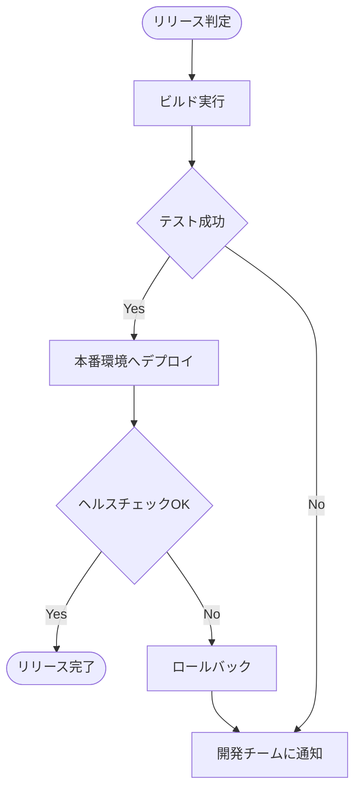
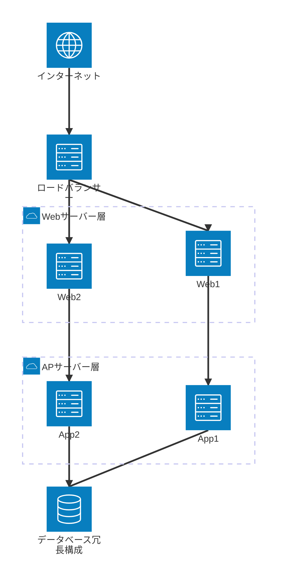
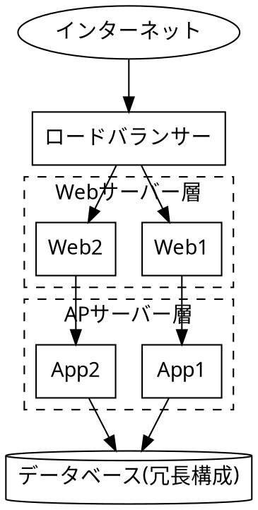
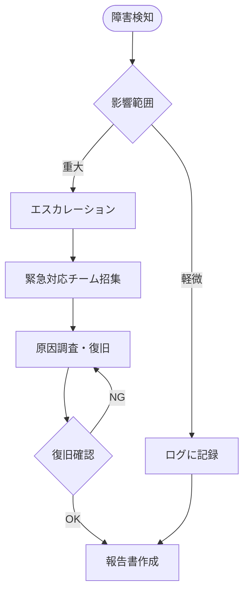
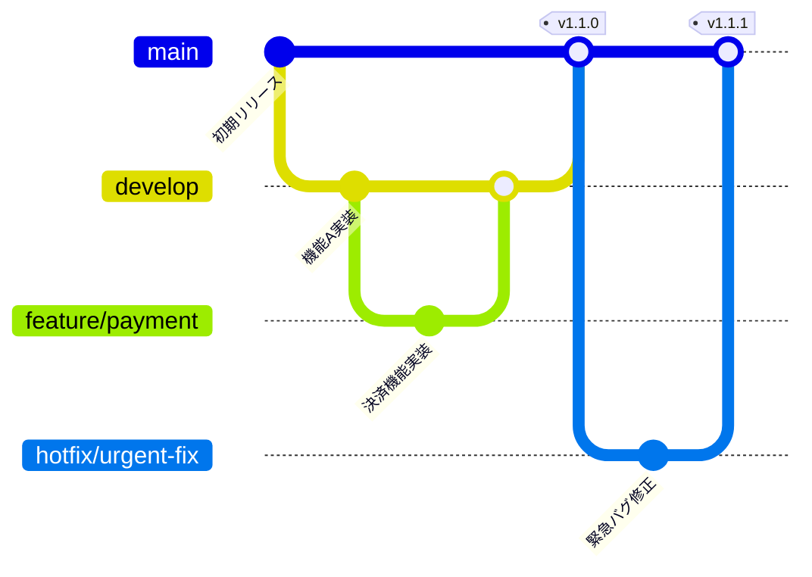

# リリース・運用保守フェーズ

## この教材で身につくこと

- リリース・運用保守フェーズの主な成果物を把握する
- デプロイフロー図・障害対応フローをMermaidで書ける
- インフラ構成図をMermaid（architecture-beta）またはGraphvizで書ける
- gitGraphでブランチ戦略・リリースタイミングを可視化できる

## 概要

リリース・運用保守フェーズでは、デプロイの手順やインフラの構成、
障害発生時の対応手順を整理した成果物が作られます。

## 位置づけ

[開発フェーズ×図カタログ 全体マッピング](01-diagram-catalog-overview.md)の全体マッピング表のうち「リリース・運用」行を
深掘りする教材です。[基本設計フェーズ](03-basic-design-phase.md)の
システム構成図を、ここでは実際のサーバー冗長構成にまで具体化します。

## 基本文法・プロパティ解説

### 成果物別の対応表

| 成果物 | 図の種類 | 適する理由 |
|---|---|---|
| デプロイフロー図 | flowchart | ビルド〜デプロイ〜検証の手順と分岐を表現できる |
| インフラ構成図 | Mermaid architecture-beta / Graphviz DOT | シンプルな冗長構成はMermaidで書けるが、サブネットや自由な形状を含む複雑な階層はGraphvizが得意 |
| 障害対応フロー | flowchart | 検知から復旧までの対応手順・エスカレーションを表現できる |
| ブランチ戦略図 | gitGraph | ブランチの分岐・マージ・リリースタイミングを可視化できる |

## 実ソースコード

デプロイフロー図の例です。

**ソースコード:**

```text
flowchart TD
    Start([リリース判定]) --> Build[ビルド実行]
    Build --> Test{テスト成功}
    Test -->|Yes| Deploy[本番環境へデプロイ]
    Test -->|No| Notify[開発チームに通知]
    Deploy --> Verify{ヘルスチェックOK}
    Verify -->|Yes| Done([リリース完了])
    Verify -->|No| Rollback[ロールバック]
    Rollback --> Notify
```



**コードのポイント:**

- `Test{テスト成功}`と`Verify{ヘルスチェックOK}`の2段階で成功可否を判定する
- `Verify -->|No| Rollback` のように失敗時はロールバックに分岐させる
- `Rollback --> Notify` で失敗時も通知フローに合流させている

インフラ構成図の例です。シンプルな冗長構成であれば、Mermaidの
`architecture-beta`で書けます。

**ソースコード:**

```text
architecture-beta
    service internet(internet)["インターネット"]
    service lb(server)["ロードバランサー"]

    group web(cloud)["Webサーバー層"]
    service web1(server)["Web1"] in web
    service web2(server)["Web2"] in web

    group app(cloud)["APサーバー層"]
    service app1(server)["App1"] in app
    service app2(server)["App2"] in app

    service db(database)["データベース冗長構成"]

    internet:B --> T:lb
    lb:B --> T:web1
    lb:B --> T:web2
    web1:B --> T:app1
    web2:B --> T:app2
    app1:B --> T:db
    app2:B --> T:db
```



**コードのポイント:**

- `group web(cloud)["Webサーバー層"]`でグループを作り、`service web1(server)["Web1"] in web`のように`in`で所属させる
- ラベルは`["インターネット"]`のように二重引用符で囲む。日本語など非ASCII文字を引用符なしで書くと`Syntax error in text`になる（flowchartと異なる制約）
- エッジは`internet:B --> T:lb`のように接続元・接続先の側面（`T`/`B`/`L`/`R`）を指定してつなぐ
- 組み込みアイコンは`cloud`/`database`/`disk`/`internet`/`server`の5種類のみ。追加の見た目が必要な場合はアイコンパックの追加設定が要る
- `architecture-beta`はMermaid v11.1.0以降が必要。ビルドに使うmermaid-cliのバージョン対応を事前に確認する

より複雑なネットワーク階層（サブネットや自由な形状のノードなど）を
表現する場合は、次のようにGraphvizの`cluster`を使います。

`docs/06-project-phase-diagrams/examples/04-infra-architecture.dot`




**コードのポイント:**

- `LB -> Web1; LB -> Web2;` でロードバランサーから冗長化されたWebサーバーへの
  分岐を表現する
- `cluster_web`/`cluster_app`で層ごとにサーバーをグルーピングしている
- `DB [shape=cylinder, label="データベース(冗長構成)"]` のようにラベル文字列に
  補足情報（冗長構成であること）を含められる

障害対応フローの例です。

**ソースコード:**

```text
flowchart TD
    Detect([障害検知]) --> Assess{影響範囲}
    Assess -->|軽微| Log[ログに記録]
    Assess -->|重大| Escalate[エスカレーション]
    Escalate --> WarRoom[緊急対応チーム招集]
    WarRoom --> Fix[原因調査・復旧]
    Fix --> Verify{復旧確認}
    Verify -->|OK| Report[報告書作成]
    Verify -->|NG| Fix
    Log --> Report
```



**コードのポイント:**

- `Assess{影響範囲}`の分岐で軽微/重大の対応を分ける
- `Verify -->|NG| Fix` のように復旧確認に失敗した場合は原因調査に戻すループがある
- 軽微・重大どちらの経路も最終的に`Report`（報告書作成）へ合流する

ブランチ戦略図の例です。リリースブランチの運用と、緊急修正（hotfix）の
分岐・マージタイミングを可視化します。

**ソースコード:**

```text
gitGraph
    commit id: "初期リリース"
    branch develop
    checkout develop
    commit id: "機能A実装"
    branch feature/payment
    checkout feature/payment
    commit id: "決済機能実装"
    checkout develop
    merge feature/payment
    checkout main
    merge develop tag: "v1.1.0"
    branch hotfix/urgent-fix
    checkout hotfix/urgent-fix
    commit id: "緊急バグ修正"
    checkout main
    merge hotfix/urgent-fix tag: "v1.1.1"
```



**コードのポイント:**

- `branch feature/payment` → `checkout feature/payment` で作業用ブランチに切り替える
- `merge feature/payment` で`develop`に機能ブランチを取り込み、
  `merge develop tag: "v1.1.0"` でmainへのリリースにタグを付ける
- `branch hotfix/urgent-fix` のように、mainから直接切る緊急修正ブランチも表現できる
- gitGraphの基本機能はMermaidの早期バージョンから安定して利用できる

## 演習課題

1. ロールバック処理を含むデプロイフロー図を、自分のプロジェクトを想定して書け
2. Webサーバーを3台以上に冗長化したインフラ構成図を、Mermaid（architecture-beta）
   またはGraphvizで書け
3. 「検知」「影響範囲判定」「復旧」「報告」の4段階を含む障害対応フローを書け
4. featureブランチ2本とhotfixブランチ1本を含むブランチ戦略図を、
   自分のプロジェクトを想定して書け

## 理解度チェック

- [ ] デプロイフロー図に成功/失敗の分岐とロールバックを含められる
- [ ] Mermaidの`architecture-beta`でシンプルな冗長構成を表現できる
- [ ] Graphvizのクラスタで、より複雑な階層を持つインフラ構成を表現できる
- [ ] 障害対応フローに検知からエスカレーション・復旧確認までの流れを書ける
- [ ] gitGraphでブランチの分岐・マージ・タグ付けを表現できる

---

[← 前へ: 実装・テストフェーズ](05-implementation-testing-phase.md) | [次へ: アジャイル開発での当てはめ →](07-agile-artifacts.md)
