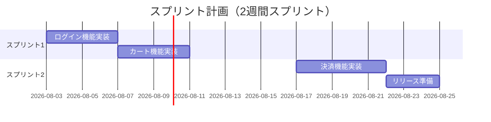
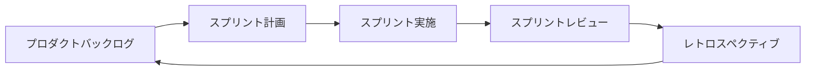

# アジャイル開発での当てはめ

## この教材で身につくこと

- アジャイル開発特有の成果物（スプリント計画・開発サイクル）を把握する
- 02〜06で学んだ図のカタログを、アジャイルの反復サイクルに当てはめられる
- Mermaid/Graphvizで表現できないアジャイル成果物（バーンダウンチャート等）を把握する

## 概要

アジャイル開発ではウォーターフォールのような明確なフェーズ区切りがなく、
短いサイクル（スプリント）を繰り返します。02〜06で扱った成果物の多くは
「フェーズ」ではなく「タイミング」を変えてアジャイルの中でも作られます。

## 位置づけ

[01-diagram-catalog-overview.md](01-diagram-catalog-overview.md)の全体マッピング表のうち「アジャイル」行を
深掘りする教材です。02〜06（ウォーターフォール型フェーズ）の内容を
前提とします。

## 基本文法・プロパティ解説

### 成果物別の対応表

| 成果物 | 図の種類 | 適する理由 |
|---|---|---|
| スプリント計画 | gantt | 短期間のタスクと期間を時系列で共有できる |
| 開発サイクル図 | flowchart | バックログ→計画→実施→レビュー→改善の反復を表現できる |
| バックログ優先度 | 表（図ではなく表が適する） | Mermaid/Graphvizに専用の一覧表現はない |
| バーンダウンチャート | 非対応 | 日次の残作業量推移はMermaid/Graphvizで表現できない |

### 02〜06カタログのアジャイルへの対応付け

| ウォーターフォールでの成果物 | アジャイルでの当てはめタイミング |
|---|---|
| [業務フロー図](02-requirements-phase.md) | プロダクトバックログ作成時に、対象業務の理解のため作成 |
| [システム構成図](03-basic-design-phase.md) | 最初のスプリント計画前に、全体アーキテクチャの合意として作成 |
| [クラス図・詳細シーケンス図](04-detailed-design-phase.md) | 各スプリント内で、対象機能の実装直前に必要な範囲だけ作成 |
| [テストケース分岐図](05-implementation-testing-phase.md) | 各スプリントのテストタスクで、対象機能分だけ作成 |
| [デプロイフロー図・インフラ構成図](06-release-operations-phase.md) | 継続的デリバリー環境の構築時に作成し、以降のスプリントで再利用 |

ウォーターフォールでは「フェーズの成果物」として一括で作られていたものが、
アジャイルでは「スプリントごとに必要な範囲だけ」作られる点が違いです。

## 実ソースコード

スプリント計画の例です。

**ソースコード:**

```text
gantt
    title スプリント計画（2週間スプリント）
    dateFormat YYYY-MM-DD
    section スプリント1
    ログイン機能実装 :s1, 2026-08-03, 4d
    カート機能実装 :s2, after s1, 4d
    section スプリント2
    決済機能実装 :s3, 2026-08-17, 5d
    リリース準備 :s4, after s3, 3d
```



**コードのポイント:**

- `section スプリント1`/`section スプリント2`でスプリントごとにタスクを分ける
- [実装・テストフェーズ](05-implementation-testing-phase.md)のganttと違い、
  対象期間は1〜2スプリント分（数週間）に短くなる
- タスク名は機能単位（ログイン機能実装など）で、実装からテストまで含む粒度にする

開発サイクル図の例です。

**ソースコード:**

```text
flowchart LR
    Backlog[プロダクトバックログ] --> Planning[スプリント計画]
    Planning --> Sprint[スプリント実施]
    Sprint --> Review[スプリントレビュー]
    Review --> Retro[レトロスペクティブ]
    Retro --> Backlog
```



**コードのポイント:**

- `Retro --> Backlog` で最後のノードから最初のノードへ戻し、反復サイクルを表現する
- 02〜06のフェーズ別成果物は、この`Sprint[スプリント実施]`の中で
  必要な範囲だけ作られる
- ウォーターフォールのflowchart（直線的な流れ）との違いは、終端が
  開始点に戻る点

## 演習課題

1. 自分のチーム（または想定のチーム）で2スプリント分のスプリント計画を
   ganttで書け
2. [01-diagram-catalog-overview.md](01-diagram-catalog-overview.md)の全体マッピング表から成果物を3つ選び、
   それぞれがアジャイルのどのタイミング（バックログ作成時/スプリント内/
   継続的デリバリー環境構築時）で作られるかを表にまとめよ

## 理解度チェック

- [ ] スプリント計画をganttで書ける
- [ ] 開発サイクル図で反復（レトロスペクティブから次のバックログへの戻り）を表現できる
- [ ] 02〜06のフェーズ別カタログがアジャイルのどのタイミングに対応するか説明できる
- [ ] バーンダウンチャートがMermaid/Graphvizで非対応であることを説明できる

---

[← 前へ: リリース・運用保守フェーズ](06-release-operations-phase.md) | [06. プロジェクト開発フェーズと図 目次へ →](00-README.md)
