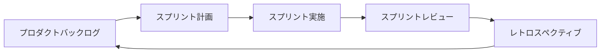
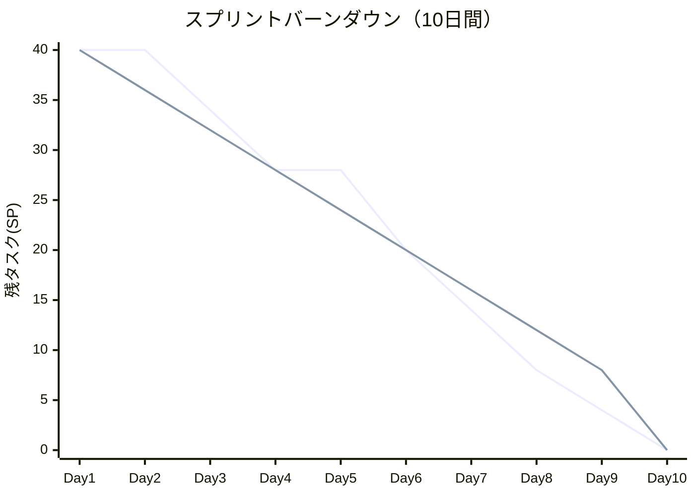
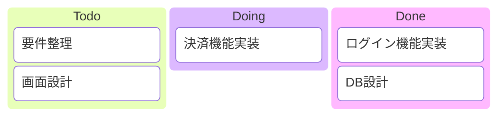

# アジャイル開発での当てはめ

## この教材で身につくこと

- アジャイル開発特有の成果物（スプリント計画・開発サイクル）を把握する
- 02〜06で学んだ図のカタログを、アジャイルの反復サイクルに当てはめられる
- kanbanでスプリント中のタスク状態（Todo/Doing/Done）を可視化できる
- Mermaid/Graphvizでは十分に表現できないアジャイル成果物（バーンダウンチャート等）とその制約・代替手段を把握する

## 概要

アジャイル開発ではウォーターフォールのような明確なフェーズ区切りがなく、
短いサイクル（スプリント）を繰り返します。02〜06で扱った成果物の多くは
「フェーズ」ではなく「タイミング」を変えてアジャイルの中でも作られます。

## 位置づけ

[開発フェーズ×図カタログ 全体マッピング](01-diagram-catalog-overview.md)の全体マッピング表のうち「アジャイル」行を
深掘りする教材です。02〜06（ウォーターフォール型フェーズ）の内容を
前提とします。

## 基本文法・プロパティ解説

### 成果物別の対応表

| 成果物 | 図の種類 | 適する理由 |
|---|---|---|
| スプリント計画 | gantt | 短期間のタスクと期間を時系列で共有できる |
| 開発サイクル図 | flowchart | バックログ→計画→実施→レビュー→改善の反復を表現できる |
| バックログ優先度 | 表（図ではなく表が適する） | Mermaid/Graphvizに専用の一覧表現はない |
| バーンダウンチャート | xychart-beta（制約あり） | 折れ線2本で理想線・実績線を表現できるが、日付軸非対応・累積値は事前計算が必要 |
| カンバンボード | kanban | Todo/Doing/Doneのタスク状態遷移を可視化できる |

### 02〜06カタログのアジャイルへの対応付け

| ウォーターフォールでの成果物 | アジャイルでの当てはめタイミング |
|---|---|
| [業務フロー図](02-requirements-phase.md) | プロダクトバックログ作成時に、対象業務の理解のため作成 |
| [システム構成図](03-basic-design-phase.md) | 最初のスプリント計画前に、全体アーキテクチャの合意として作成 |
| [クラス図・詳細シーケンス図](04-detailed-design-phase.md) | 各スプリント内で、対象機能の実装直前に必要な範囲だけ作成 |
| [テストケース分岐図](05-implementation-testing-phase.md) | 各スプリントのテストタスクで、対象機能分だけ作成 |
| [デプロイフロー図・インフラ構成図](06-release-operations-phase.md) | 継続的デリバリー環境の構築時に作成し、以降のスプリントで再利用 |

ウォーターフォールでは「フェーズの成果物」として一括で作られていたものが、
アジャイルでは「スプリントごとに必要な範囲だけ」作られる点が違いです。

## 実ソースコード

スプリント計画の例です。

**ソースコード:**

```text
gantt
    title スプリント計画（2週間スプリント）
    dateFormat YYYY-MM-DD
    section スプリント1
    ログイン機能実装 :s1, 2026-08-03, 4d
    カート機能実装 :s2, after s1, 4d
    section スプリント2
    決済機能実装 :s3, 2026-08-17, 5d
    リリース準備 :s4, after s3, 3d
```


**コードのポイント:**

- `section スプリント1`/`section スプリント2`でスプリントごとにタスクを分ける
- [実装・テストフェーズ](05-implementation-testing-phase.md)のganttと違い、
  対象期間は1〜2スプリント分（数週間）に短くなる
- タスク名は機能単位（ログイン機能実装など）で、実装からテストまで含む粒度にする

開発サイクル図の例です。

**ソースコード:**

```text
flowchart LR
    Backlog[プロダクトバックログ] --> Planning[スプリント計画]
    Planning --> Sprint[スプリント実施]
    Sprint --> Review[スプリントレビュー]
    Review --> Retro[レトロスペクティブ]
    Retro --> Backlog
```



**コードのポイント:**

- `Retro --> Backlog` で最後のノードから最初のノードへ戻し、反復サイクルを表現する
- 02〜06のフェーズ別成果物は、この`Sprint[スプリント実施]`の中で
  必要な範囲だけ作られる
- ウォーターフォールのflowchart（直線的な流れ）との違いは、終端が
  開始点に戻る点

バーンダウンチャートの例です。

**ソースコード:**

```text
xychart-beta
    title "スプリントバーンダウン（10日間）"
    x-axis [Day1, Day2, Day3, Day4, Day5, Day6, Day7, Day8, Day9, Day10]
    y-axis "残タスク(SP)" 0 --> 40
    line [40, 40, 34, 28, 28, 20, 14, 8, 4, 0]
    line [40, 36, 32, 28, 24, 20, 16, 12, 8, 0]
```



**コードのポイント:**

- 1本目の`line`が実績線、2本目の`line`が理想線（毎日均等に消化した場合の直線）
- `x-axis`はカテゴリラベル（`Day1`など）のみで、Ganttの`dateFormat`のような日付型は使えない
- 各`line`の値は残タスク数を事前に計算した配列で、日次消化量からの自動集計はされない
- `xychart-beta`はMermaid v10.6.0以降が必要。ビルドに使うmermaid-cliのバージョン対応を事前に確認する
- スプリントを跨ぐ複数スプリント分の推移や、日次の自動更新が必要な場合は表計算/BIツールを使う

カンバンボードの例です。スプリント内のタスクを状態別に管理します。

**ソースコード:**

```text
kanban
    Todo
        task1[要件整理]
        task2[画面設計]
    Doing
        task3[決済機能実装]
    Done
        task4[ログイン機能実装]
        task5[DB設計]
```



**コードのポイント:**

- `Todo`/`Doing`/`Done`のように見出し（コロンなし）を書くと列（レーン）になる
- `task1[要件整理]` のように `id[表示ラベル]` でタスクカードを表現する
- ganttがスケジュール（期間）、kanbanが状態（進捗）を表す点で役割が異なる
- kanbanはMermaid v11.4.0で追加された比較的新しい機能

## 演習課題

1. 自分のチーム（または想定のチーム）で2スプリント分のスプリント計画を
   ganttで書け
2. [開発フェーズ×図カタログ 全体マッピング](01-diagram-catalog-overview.md)の全体マッピング表から成果物を3つ選び、
   それぞれがアジャイルのどのタイミング（バックログ作成時/スプリント内/
   継続的デリバリー環境構築時）で作られるかを表にまとめよ
3. 現在進行中のタスクを5件洗い出し、kanbanでTodo/Doing/Doneに分類せよ

## 理解度チェック

- [ ] スプリント計画をganttで書ける
- [ ] 開発サイクル図で反復（レトロスペクティブから次のバックログへの戻り）を表現できる
- [ ] 02〜06のフェーズ別カタログがアジャイルのどのタイミングに対応するか説明できる
- [ ] バーンダウンチャートをxychart-betaで表現する際の制約（日付軸非対応・累積値の事前計算）を説明できる
- [ ] kanbanでTodo/Doing/Doneのタスク状態を表現できる

---

[← 前へ: リリース・運用保守フェーズ](06-release-operations-phase.md) | [トップに戻る →](../../README.md)
