# diagram-as-code-tutorial Implementation Plan

> **For agentic workers:** REQUIRED SUB-SKILL: Use superpowers:subagent-driven-development (recommended) or superpowers:executing-plans to implement this plan task-by-task. Steps use checkbox (`- [ ]`) syntax for tracking.

**Goal:** Build a complete, self-contained Japanese tutorial repository (`diagram-as-code-tutorial`) that teaches Mermaid and Graphviz for use in generative-AI Skill development, matching `css-tutorial`'s folder/file structure and publishing pipeline, and prove the ebook build actually produces EPUB/PDF output.

**Architecture:** A `docs/`-rooted, numbered-category Markdown curriculum (5 categories, `00-README.md` + numbered lessons each) following `css-tutorial/00_STYLE_GUIDE.md`, plus the same top-level index files, plus a reused `shared-copilot-skills/ebook-build` pipeline wired through `.github/skills-config/ebook-build/`. Mermaid diagrams stay as native `mermaid` fences (GitHub/VS Code render them, and the ebook pipeline auto-converts them via `mmdc`). Graphviz diagrams are pre-rendered to PNG with a small Node script wrapping the local `dot` binary, since nothing auto-renders DOT.

**Tech Stack:** Markdown, Mermaid, Graphviz (DOT + `dot` CLI), Node.js (`tools/render-graphviz.js`), PowerShell 7 (`pwsh`) + Pandoc via the shared `ebook-build` skill, Git.

## Global Constraints

- Repo root: `c:\Dev\tutorials\diagram-as-code-tutorial` (already `git init`-ed; do not push to any remote).
- Follow `css-tutorial/00_STYLE_GUIDE.md` heading order for every numbered lesson file: この教材で身につくこと → 概要 → 位置づけ → 基本文法・プロパティ解説 → 実ソースコード → 演習課題 → 理解度チェック. For 03/04/05 category lessons that are conceptual rather than syntax lessons, keep this order but rename "基本文法・プロパティ解説" section content to fit the topic (still keep 7 sections in the same order).
- Every code block must have a language tag (`mermaid`, `dot`, `bash`, `json`, `yaml`, `markdown`).
- Sentences ≤ 60 characters where practical (Japanese). No duplicated sections. Every lesson has at least one runnable code example.
- Every category `00-README.md` lists its lessons in a table and states the learning order.
- Every lesson file ends with prev/next navigation links.
- Mermaid diagrams: written directly as ` ```mermaid ` fences, never pre-rendered to images in-repo.
- Graphviz diagrams: every `.dot` file under `docs/**/examples/` must have a matching `.png` in the same folder, generated by `tools/render-graphviz.js` (never hand-drawn or faked).
- This is a documentation project, not a software project: "tests" mean (a) required headings/code-fences are present (grep-verified), (b) `.dot` files render successfully with `dot`, (c) the ebook build pipeline completes and produces non-empty `.epub`/`.pdf` files. There is no unit-test framework.
- No GitHub remote push, no real KDP submission, no AI-generated cover image — those stay as TODOs in `docs/superpowers/specs/2026-07-11-diagram-as-code-tutorial-design.md` section 8.

---

### Task 1: Root scaffolding files

**Files:**
- Create: `LICENSE`
- Create: `.gitattributes`
- Create: `.gitignore`
- Create: `package.json`
- Create: `CONTRIBUTING.md`
- Create: `PUBLISHING.md`

**Interfaces:**
- Produces: `package.json` scripts (`graphviz:render`, `ebook:build`, `ebook:step1`, `ebook:step2`, `ebook:step2b`, `ebook:step3`) consumed by Task 6 and Task 13.
- Consumes: nothing.

- [ ] **Step 1: Copy LICENSE from css-tutorial and adjust copyright holder if needed**

```bash
cp /c/Dev/tutorials/css-tutorial/LICENSE /c/Dev/tutorials/diagram-as-code-tutorial/LICENSE
```

Open the copied file and confirm it is the MIT license text with the same copyright holder as `css-tutorial/LICENSE`. If a name/year needs updating, edit it directly.

- [ ] **Step 2: Create `.gitattributes`**

```
* text=auto eol=lf
*.png binary
*.jpg binary
*.epub binary
*.pdf binary
```

- [ ] **Step 3: Create `.gitignore`**

```
node_modules/
ebook-output/*.epub
ebook-output/*.pdf
ebook-output/*.manuscript.md
ebook-output/images/
*.log
```

- [ ] **Step 4: Create `package.json`**

```json
{
  "name": "diagram-as-code-tutorial",
  "version": "1.0.0",
  "description": "生成AIでのSkill開発においてMermaid/Graphvizで図を書く力を体系的に学ぶ教材です。",
  "main": "index.js",
  "directories": {
    "doc": "docs"
  },
  "scripts": {
    "graphviz:render": "node tools/render-graphviz.js",
    "ebook:build": "powershell -ExecutionPolicy Bypass -File ./.github/skills-config/ebook-build/invoke-build.ps1",
    "ebook:step1": "powershell -ExecutionPolicy Bypass -File ./.github/skills-config/ebook-build/invoke-build.ps1 -BuildStep step1",
    "ebook:step2": "powershell -ExecutionPolicy Bypass -File ./.github/skills-config/ebook-build/invoke-build.ps1 -BuildStep step2",
    "ebook:step2b": "powershell -ExecutionPolicy Bypass -File ./.github/skills-config/ebook-build/invoke-build.ps1 -BuildStep step2b",
    "ebook:step3": "powershell -ExecutionPolicy Bypass -File ./.github/skills-config/ebook-build/invoke-build.ps1 -BuildStep step3"
  },
  "keywords": ["mermaid", "graphviz", "diagrams-as-code", "ai-skill"],
  "author": "",
  "license": "MIT",
  "type": "commonjs"
}
```

- [ ] **Step 5: Create `CONTRIBUTING.md`**

```markdown
# コントリビューションガイド

## 教材の追加・修正

1. `00_STYLE_GUIDE.md` の構成ルールに従ってください。
2. 新しい教材ファイルは対象カテゴリの `00-README.md` に一覧を追加してください。
3. `MASTER-INDEX.md` にリンクを追加してください。
4. Graphviz例を追加した場合は `npm run graphviz:render` を実行し、PNGを最新化してください。

## レビュー基準

`00_STYLE_GUIDE.md` の「6. レビュー用チェックリスト」を満たしていることを確認してください。
```

- [ ] **Step 6: Create `PUBLISHING.md`**

```markdown
# 公開情報

## ドキュメント形式

本チュートリアルはMarkdown形式で提供されます。

## 推奨閲覧環境

- GitHub
- VS Code（Markdown Preview、Mermaidはネイティブ描画されます）
- 任意のMarkdownビューワ

## 電子書籍版

`npm run ebook:build` で EPUB/PDF を `ebook-output/` に生成できます。詳細は
`.github/skills-config/ebook-build/` の設定ファイルと
`shared-copilot-skills/ebook-build/SKILL.md` を参照してください。

## ライセンス

[MIT License](LICENSE)
```

- [ ] **Step 7: Verify JSON is valid**

Run: `node -e "require('./package.json')"` from the repo root.
Expected: no output, exit code 0.

- [ ] **Step 8: Commit**

```bash
git add LICENSE .gitattributes .gitignore package.json CONTRIBUTING.md PUBLISHING.md
git commit -m "Add root scaffolding files"
```

---

### Task 2: Style guide

**Files:**
- Create: `00_STYLE_GUIDE.md`

**Interfaces:**
- Produces: the heading-order and code-block rules every later content task must follow.
- Consumes: `css-tutorial/00_STYLE_GUIDE.md` as a base template.

- [ ] **Step 1: Write `00_STYLE_GUIDE.md`**

```markdown
# 教材スタイルガイド

このガイドは、教材を体系化・簡潔・読みやすく保つための最小ルールです。
css-tutorial の00_STYLE_GUIDE.mdをベースに、図表教材向けのルールを追加しています。

## 1. ファイル構成ルール

- カテゴリ先頭は必ず `00-README.md`
- 個別教材は `01-*.md`, `02-*.md` の連番
- Graphviz例は `examples/` 配下に `.dot` と、対応する `.png`（`dot`コマンドで生成）を並べて置く
- Mermaid例はファイル内に ` ```mermaid ` フェンスとして直接記述する（画像化しない）

## 2. 見出しの標準順序（個別教材）

個別教材ファイルは、原則として次の順序で記述します。

1. この教材で身につくこと
2. 概要
3. 位置づけ
4. 基本文法・プロパティ解説
5. 実ソースコード（Mermaid/Graphviz/Markdown）
6. 演習課題
7. 理解度チェック

補足:
- 構文表・属性表は表形式で整理する
- 重要なコードは抜粋を含め、全体の概要を理解できる量を目安に
- 「良い例」と「悪い例」を対比して示す

## 3. 文体ルール

- 1文は短く保つ（目安: 60文字以内）
- 同じ意味のセクションを重複させない
- 抽象語だけで終わらず、1つ以上のコード例を示す

## 4. コードブロックルール

- 言語指定を必ず付ける（`mermaid`, `dot`, `bash`, `json`, `yaml`, `markdown`）
- コピペ可能な最小セットに絞る
- 存在しないファイル名やパスを記載しない
- コードブロック内は1行90文字以内を目安にする

## 5. ナビゲーションルール

- 各ファイル末尾に前後リンクを置く
- カテゴリREADMEには教材リンク一覧を置く
- トップREADMEから全カテゴリへ1クリックで移動可能にする

## 6. 図表教材固有ルール

- Mermaidのコード例は、GitHub/VS CodeでそのままプレビューできることをPRの前に確認する
- Graphvizのコード例を追加・変更したら `npm run graphviz:render` を実行し、`.png` を最新化してからコミットする
- 04-ai-skill-workflows配下の教材は、「生成AIへのプロンプト例」と「そのプロンプトから得られる図」を必ずセットで示す

## 7. レビュー用チェックリスト

- 体系化: 学習目標・完了条件がある
- 簡潔: 重複説明や冗長な全文転載がない
- 読みやすさ: 見出し順と用語が統一されている
- 実用性: 最小実行手順がある
- 整合性: 本文の説明とサンプルコードが矛盾しない
- 図表: Mermaidはプレビュー確認済み、GraphvizはPNGが最新化されている
```

- [ ] **Step 2: Commit**

```bash
git add 00_STYLE_GUIDE.md
git commit -m "Add style guide"
```

---

### Task 3: Cover files

**Files:**
- Create: `docs/00-COVER.md`
- Create: `docs/01-cover-prompt.md`

**Interfaces:**
- Consumes: nothing.
- Produces: `coverFile`/`coverImagePromptSourceFile` referenced by Task 11's `diagram-as-code-tutorial.build.json`.

- [ ] **Step 1: Write `docs/00-COVER.md`**

```markdown
# Diagrams as Code 実践チュートリアル

## Mermaid & Graphvizで学ぶ、生成AI時代のSkill設計図

生成AIでSkill開発を行うとき、フロー・シーケンス・構造をどう図で示すかが
設計品質を大きく左右します。本チュートリアルは、Mermaidの手軽さと
Graphvizの制御力を使い分け、AI Skillのドキュメントに落とし込む力を
段階的に養います。

## この教材で学べること

- Mermaidの主要な図（flowchart / sequence / state / class / ER / gantt / mindmap / requirement）
- GraphvizのDOT言語とレイアウト制御
- 図の選び方・複雑な図の整理手法
- 生成AIへのプロンプト設計とSKILL.mdへの図の組み込み方
- 実務を想定したSkillアーキテクチャ図・シーケンス図の作成

## 対象読者

- 生成AIでSkill・エージェントを開発するエンジニア
- 設計ドキュメントを図で整理したいテックリード
- Mermaid/Graphvizを基礎から体系的に学びたい人
```

- [ ] **Step 2: Write `docs/01-cover-prompt.md`**

```markdown
# 表紙画像生成プロンプト

## 目的

`ebook-build` スキルの `coverMode: "ai-image"` が参照するプロンプト
ソースファイルです。実際の画像生成は本チュートリアルのスコープ外
（`docs/superpowers/specs/2026-07-11-diagram-as-code-tutorial-design.md`
セクション8を参照）ですが、ビルドパイプラインが参照するファイルとして
配置します。

## プロンプト

ダークネイビーの背景に、白い線で描かれたシンプルなフローチャートと
ネットワークグラフが重なり合うミニマルな技術書表紙。中央に
「Diagrams as Code」というタイトルが太いサンセリフ体で配置され、
副題に「Mermaid & Graphviz」と入る。ノードは角丸の四角形、エッジは
細い曲線で、AIエージェントの設計図を思わせる幾何学的な構成にする。
```

- [ ] **Step 3: Commit**

```bash
git add docs/00-COVER.md docs/01-cover-prompt.md
git commit -m "Add cover and cover-prompt files"
```

---

### Task 4: Category 01 — Mermaid basics

**Files:**
- Create: `docs/01-mermaid-basics/00-README.md`
- Create: `docs/01-mermaid-basics/01-flowchart.md`
- Create: `docs/01-mermaid-basics/02-sequence-diagram.md`
- Create: `docs/01-mermaid-basics/03-state-and-class-diagram.md`
- Create: `docs/01-mermaid-basics/04-other-diagrams.md`

**Interfaces:**
- Consumes: `tutorials/ideas/mermaid-study-notes.md` sections 3, 4, 5 as source material to adapt.
- Produces: lesson filenames/titles consumed by Task 10 (`MASTER-INDEX.md`, `README.md`).

- [ ] **Step 1: Write `docs/01-mermaid-basics/00-README.md`**

```markdown
# 01. Mermaid基礎

このカテゴリでは、Mermaidの主要な図の種類と基本構文を体系的に学びます。
GitHubやVS Codeでそのままプレビューできる手軽さを活かし、
設計ドキュメントに図をすぐ組み込めるようになることを目指します。

## 学習目標

- flowchartでフロー・分岐・グルーピングを表現できる
- sequenceDiagramでやり取りの順序を表現できる
- classDiagram/stateDiagramで構造と状態遷移を表現できる
- ER図・ガントチャート・マインドマップ・要件図の使いどころを知る

## 教材一覧

| # | 教材 | 内容 |
|---|------|------|
| 01 | [flowchart](01-flowchart.md) | ノード・分岐・subgraphの基本 |
| 02 | [sequenceDiagram](02-sequence-diagram.md) | メッセージ順序・loop/altブロック |
| 03 | [class/stateDiagram](03-state-and-class-diagram.md) | クラス構造・状態遷移 |
| 04 | [その他の図](04-other-diagrams.md) | ER図・gantt・mindmap・requirementDiagram |

## 学習の進め方

01 → 04 の順に進めることを推奨します。
各教材の「理解度チェック」で習得状況を確認してください。
```

- [ ] **Step 2: Write `docs/01-mermaid-basics/01-flowchart.md`**

```markdown
# flowchart

## この教材で身につくこと

- flowchartの基本構文（ノード・矢印・方向指定）
- 分岐（条件ノード）の書き方
- subgraphによるグルーピング

## 概要

flowchartは、処理の流れや構造を箱と矢印で表す最も基本的なMermaid図です。
`TD`（上から下）や`LR`（左から右）で全体の向きを指定します。

## 位置づけ

生成AIでSkillを設計する際、処理フローや条件分岐を最初に整理する
土台として使います。他のMermaid図の前提知識になります。

## 基本文法・プロパティ解説

### ノードの形

| 記法 | 意味 | 例 |
|------|------|-----|
| `[テキスト]` | 四角形 | `A[処理]` |
| `(テキスト)` | 角丸四角形 | `A(処理)` |
| `([テキスト])` | 楕円（開始/終了） | `A([開始])` |
| `{テキスト}` | ひし形（分岐） | `A{条件}` |
| `[(テキスト)]` | 円柱（データベース） | `A[(DB)]` |
| `[/テキスト/]` | 平行四辺形（入出力） | `A[/入力/]` |

### 矢印の種類

| 記法 | 意味 |
|------|------|
| `-->` | 実線矢印 |
| `-.->` | 破線矢印 |
| `==>` | 太線矢印 |
| `-->\|ラベル\|` | ラベル付き矢印 |

## 実ソースコード

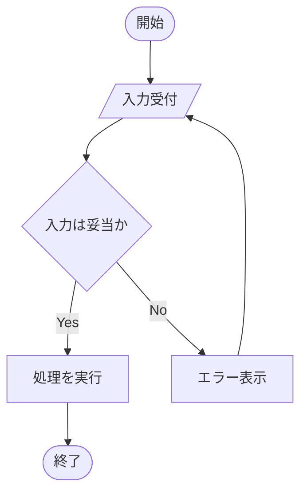

subgraphでグルーピングする例です。

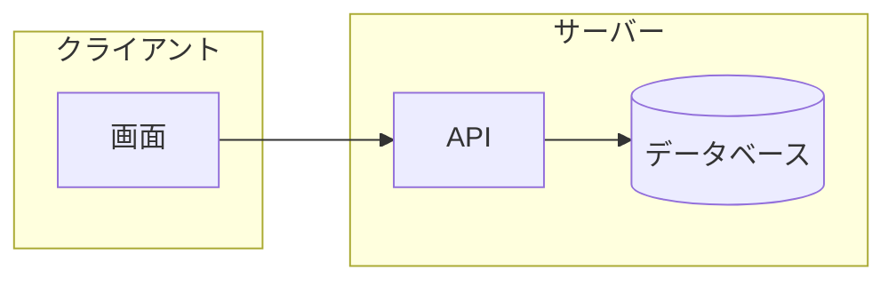

## 演習課題

1. 「ログイン成功/失敗」を分岐させるflowchartを書け
2. subgraphを2つ使い、クライアントとサーバーの処理を分けて表現せよ

## 理解度チェック

- [ ] ノードの形の使い分けが説明できる
- [ ] 分岐ノード（ひし形）とラベル付き矢印を組み合わせて書ける
- [ ] subgraphで処理をグルーピングできる

---

[← 01. Mermaid基礎 目次](00-README.md) | [次へ: sequenceDiagram →](02-sequence-diagram.md)
```

- [ ] **Step 3: Write `docs/01-mermaid-basics/02-sequence-diagram.md`**

```markdown
# sequenceDiagram

## この教材で身につくこと

- participant/actorの使い分け
- メッセージ矢印の種類とactivate/deactivate
- loop/altブロックによる繰り返し・条件分岐の表現

## 概要

sequenceDiagramは、複数の登場人物（人・システム・エージェント）の間で
やり取りされるメッセージを時系列に沿って表す図です。

## 位置づけ

生成AIエージェントとツール呼び出しのやり取りなど、「誰が・いつ・何を
呼び出すか」を明確にしたい場面で使います。flowchartでは表現しにくい
時系列の詳細を補います。

## 基本文法・プロパティ解説

### 登場人物の宣言

| 記法 | 意味 |
|------|------|
| `participant X` | システムなどの登場人物 |
| `participant X as 表示名` | 表示名を指定 |
| `actor X as 表示名` | 人型アイコンの登場人物 |

### メッセージ矢印

| 記法 | 意味 |
|------|------|
| `->>` | 実線・非同期メッセージ |
| `-->>` | 破線・応答メッセージ |
| `activate X` / `deactivate X` | 処理中であることを示す帯 |

## 実ソースコード

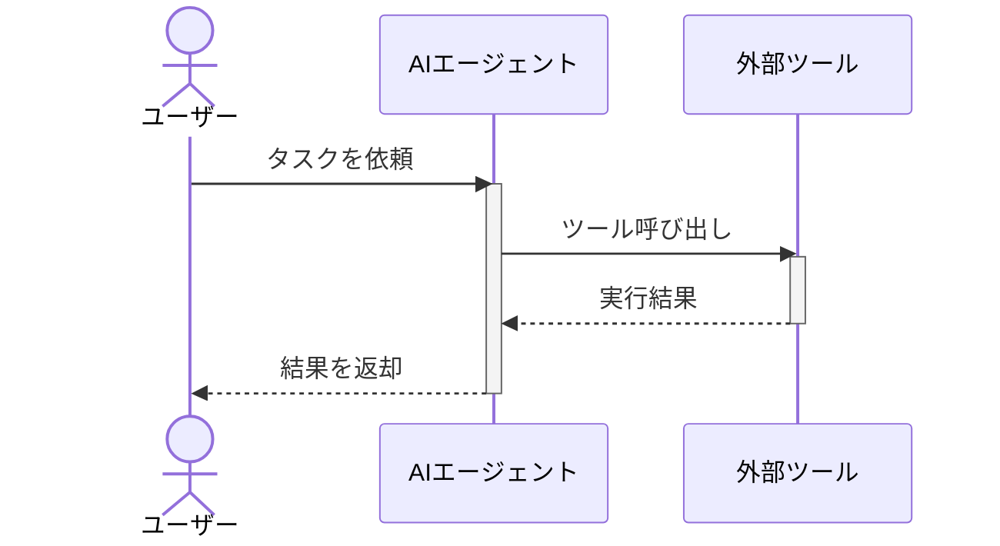

`loop`と`alt`で繰り返し・条件分岐を表現する例です。

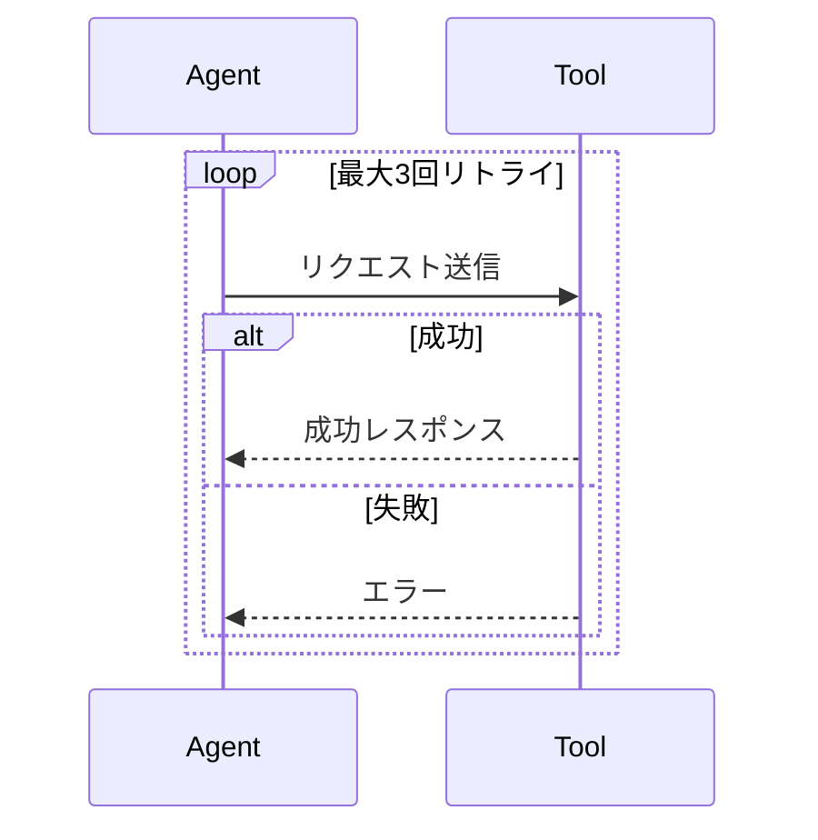

## 演習課題

1. ユーザー・エージェント・2つのツールが登場するsequenceDiagramを書け
2. `alt`を使い、ツール呼び出しの成功/失敗を分岐させよ

## 理解度チェック

- [ ] participantとactorの違いが説明できる
- [ ] activate/deactivateで処理中区間を表現できる
- [ ] loop/altで繰り返し・条件分岐を表現できる

---

[← 前へ: flowchart](01-flowchart.md) | [次へ: class/stateDiagram →](03-state-and-class-diagram.md)
```

- [ ] **Step 4: Write `docs/01-mermaid-basics/03-state-and-class-diagram.md`**

```markdown
# classDiagram / stateDiagram

## この教材で身につくこと

- classDiagramでの構造・関連の表現
- stateDiagram-v2での状態と遷移条件の表現
- SkillやAgentのようなオブジェクト設計への応用

## 概要

classDiagramは「モノの構造と関係」を、stateDiagramは「モノの状態遷移」
を表す図です。AI Skillの内部設計を整理する際によく使います。

## 位置づけ

flowchart/sequenceDiagramが「処理の流れ」を表すのに対し、
classDiagram/stateDiagramは「構造」と「状態」に焦点を当てます。
04-ai-skill-workflowsでの実践例の前提知識になります。

## 基本文法・プロパティ解説

### classDiagramの関連記法

| 記法 | 意味 |
|------|------|
| `-->` | 関連 |
| `"1" --> "*"` | 多重度付き関連 |
| `+field` | public属性 |
| `+method() 戻り値` | メソッド |

### stateDiagramの記法

| 記法 | 意味 |
|------|------|
| `[*] --> State` | 初期状態 |
| `State --> [*]` | 終了状態 |
| `A --> B : 条件` | 遷移条件ラベル |

## 実ソースコード

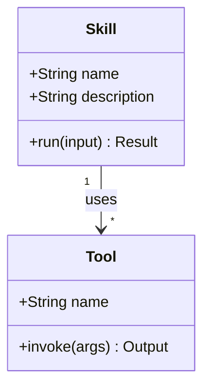

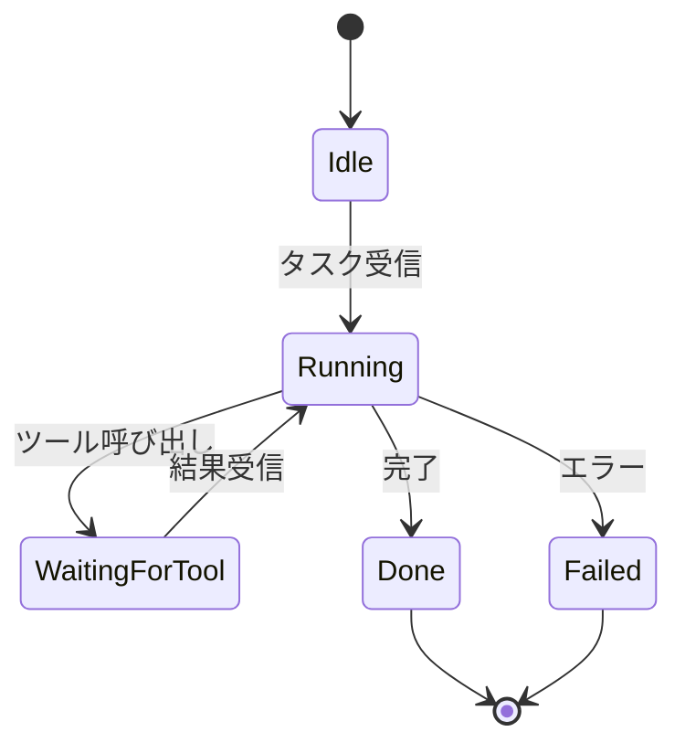

## 演習課題

1. Skillが複数のToolを保持するclassDiagramを、多重度付きで書け
2. 「待機中→実行中→完了/失敗」のstateDiagramを書け

## 理解度チェック

- [ ] classDiagramで多重度付き関連が書ける
- [ ] stateDiagramで初期状態と終了状態を表現できる
- [ ] 遷移条件をラベルとして書ける

---

[← 前へ: sequenceDiagram](02-sequence-diagram.md) | [次へ: その他の図 →](04-other-diagrams.md)
```

- [ ] **Step 5: Write `docs/01-mermaid-basics/04-other-diagrams.md`**

```markdown
# その他の図（ER・gantt・mindmap・requirementDiagram）

## この教材で身につくこと

- erDiagramでのデータ構造表現
- ganttでのスケジュール表現
- mindmapでのアイデア整理
- requirementDiagramでの要件・実装要素の対応表現

## 概要

Mermaidにはflowchart/sequence/class/state以外にも、目的に応じた
図の種類が用意されています。ここでは代表的な4種を扱います。

## 位置づけ

これらは頻度は低いものの、要件定義・スケジュール調整・
アイデア出しなど、Skill開発の周辺工程で役立ちます。

## 基本文法・プロパティ解説

### 主な要素

| 図の種類 | 主なキーワード | 用途 |
|---|---|---|
| erDiagram | `\|\|--o{`, `}o--\|\|` | データ構造・関連 |
| gantt | `dateFormat`, `section` | スケジュール |
| mindmap | `root((...))` | アイデア整理 |
| requirementDiagram | `requirement`, `element`, `satisfies` | 要件と実装の対応 |

## 実ソースコード

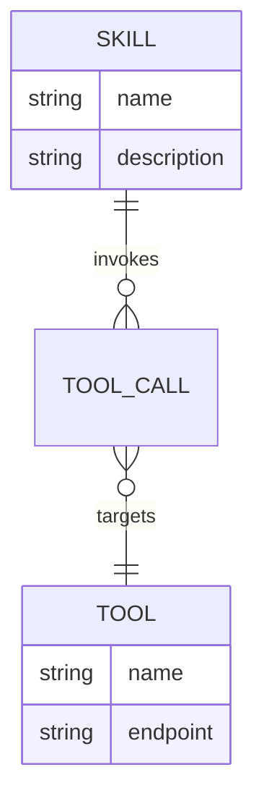

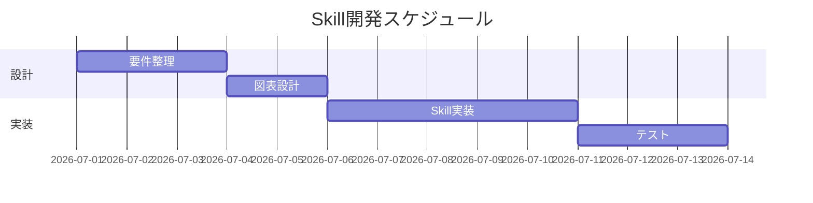

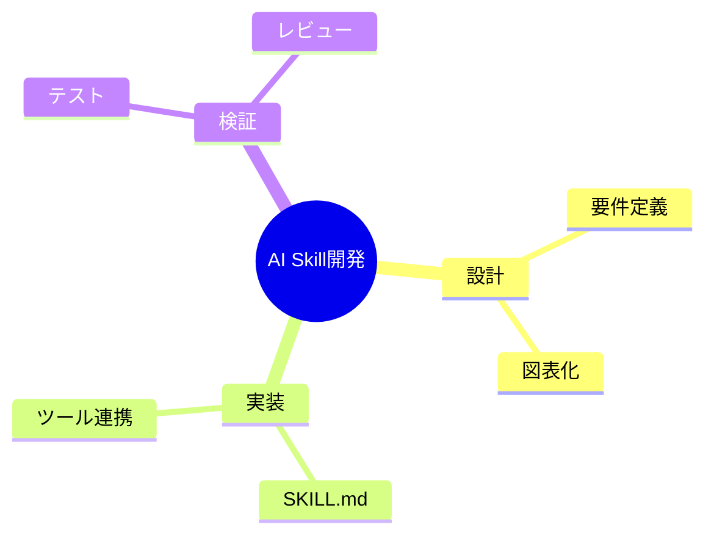

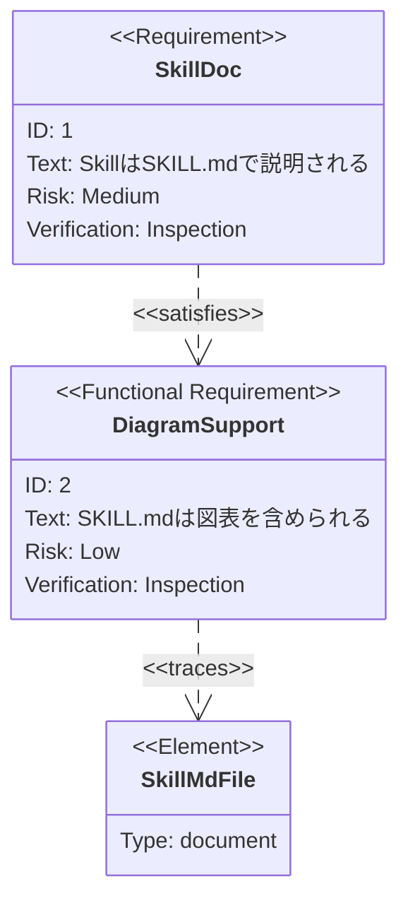

## 演習課題

1. SkillとToolの1対多関係をerDiagramで書け
2. 自分のSkill開発タスクを3つ、mindmapで整理せよ

## 理解度チェック

- [ ] erDiagramの多重度記法（`\|\|`, `o{`）が説明できる
- [ ] ganttでタスクの依存関係（`after`）を表現できる
- [ ] requirementDiagramで要件と実装要素の対応が書ける

---

[← 前へ: class/stateDiagram](03-state-and-class-diagram.md) | [次へ: 02. Graphviz基礎 →](../02-graphviz-basics/00-README.md)
```

- [ ] **Step 6: Verify every Mermaid fence in the category is syntactically well-formed**

Run this from the repo root (requires Node.js only, no install):

```bash
node -e "
const fs = require('fs');
const files = fs.readdirSync('docs/01-mermaid-basics').filter(f => f.endsWith('.md'));
let total = 0;
for (const f of files) {
  const text = fs.readFileSync('docs/01-mermaid-basics/' + f, 'utf8');
  const matches = text.match(/\`\`\`mermaid/g) || [];
  total += matches.length;
  console.log(f, matches.length);
}
console.log('total mermaid blocks:', total);
"
```

Expected: each lesson file (01-04) reports at least 1 block, total >= 8, exit code 0.

- [ ] **Step 7: Commit**

```bash
git add docs/01-mermaid-basics
git commit -m "Add Mermaid basics category"
```

---

### Task 5: Category 02 — Graphviz basics (content + example sources)

**Files:**
- Create: `docs/02-graphviz-basics/00-README.md`
- Create: `docs/02-graphviz-basics/01-dot-language-basics.md`
- Create: `docs/02-graphviz-basics/02-node-edge-attributes.md`
- Create: `docs/02-graphviz-basics/03-layout-and-rankdir.md`
- Create: `docs/02-graphviz-basics/examples/01-basic.dot`
- Create: `docs/02-graphviz-basics/examples/02-attributes.dot`
- Create: `docs/02-graphviz-basics/examples/03-rankdir.dot`
- Create: `docs/02-graphviz-basics/examples/04-cluster.dot`

**Interfaces:**
- Produces: `.dot` files consumed by Task 6's render script and Task 12's render run (which creates the matching `.png` files these lessons reference).
- Consumes: nothing.

- [ ] **Step 1: Write `docs/02-graphviz-basics/00-README.md`**

```markdown
# 02. Graphviz基礎

このカテゴリでは、DOT言語でグラフを記述し、Graphvizでレイアウトを
制御する基本を学びます。Mermaidより厳密な構文で、大規模・複雑な
構造図を描く力を養います。

## 学習目標

- digraph/graphの基本構文が書ける
- ノード・エッジの属性（形・色・ラベル）を制御できる
- rankdirとクラスタで見やすいレイアウトを設計できる

## 教材一覧

| # | 教材 | 内容 |
|---|------|------|
| 01 | [DOT言語の基本](01-dot-language-basics.md) | digraph・ノード・エッジ |
| 02 | [ノード・エッジ属性](02-node-edge-attributes.md) | shape・color・label |
| 03 | [レイアウト制御](03-layout-and-rankdir.md) | rankdir・クラスタ |

## 図の確認方法

このカテゴリの `.dot` ファイルは `examples/` 配下にあり、対応する
`.png` を同じフォルダに置いています。`.dot` を修正した場合は
リポジトリルートで次を実行してPNGを再生成してください。

```bash
npm run graphviz:render
```

## 学習の進め方

01 → 03 の順に進めることを推奨します。
```

- [ ] **Step 2: Write `docs/02-graphviz-basics/examples/01-basic.dot`**

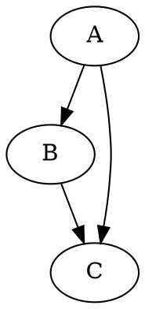

- [ ] **Step 3: Write `docs/02-graphviz-basics/01-dot-language-basics.md`**

```markdown
# DOT言語の基本

## この教材で身につくこと

- digraph/graphの違い
- ノードとエッジの最小記法
- コメントの書き方

## 概要

GraphvizはDOT言語でグラフを記述します。有向グラフは`digraph`、
無向グラフは`graph`で宣言します。

## 位置づけ

Mermaidのflowchartに近い役割ですが、DOT言語はより厳密で、
大規模な構造図やレイアウトの自動最適化に強みがあります。

## 基本文法・プロパティ解説

### 基本要素

| 要素 | 意味 |
|------|------|
| `digraph 名前 { ... }` | 有向グラフの宣言 |
| `graph 名前 { ... }` | 無向グラフの宣言 |
| `A -> B;` | 有向エッジ |
| `A -- B;` | 無向エッジ |
| `// コメント` | 1行コメント |

## 実ソースコード

`docs/02-graphviz-basics/examples/01-basic.dot`


## 演習課題

1. 4つのノードを持つ有向グラフを書け（A→B→C→D）
2. 無向グラフ（`graph`）でA-B-Cの関係を書け

## 理解度チェック

- [ ] digraphとgraphの違いが説明できる
- [ ] `->`と`--`の使い分けができる
- [ ] コメントを使って記述を補足できる

---

[← 02. Graphviz基礎 目次](00-README.md) | [次へ: ノード・エッジ属性 →](02-node-edge-attributes.md)
```

- [ ] **Step 4: Write `docs/02-graphviz-basics/examples/02-attributes.dot`**


- [ ] **Step 5: Write `docs/02-graphviz-basics/02-node-edge-attributes.md`**

```markdown
# ノード・エッジ属性

## この教材で身につくこと

- ノード全体・個別ノードへの属性指定
- shape/style/color/labelの使い方
- エッジの矢印・色の制御

## 概要

Graphvizは`node [...]`や`edge [...]`でデフォルト属性を一括指定でき、
個別ノード・エッジで上書きもできます。

## 位置づけ

01で作った最小グラフに「見た目」を加える段階です。
Skillアーキテクチャ図など、意味を色や形で区別したい場面で使います。

## 基本文法・プロパティ解説

### 主なノード属性

| 属性 | 意味 | 例 |
|------|------|-----|
| `shape` | 形 | `box`, `ellipse`, `diamond` |
| `style` | スタイル | `filled`, `rounded`, `dashed` |
| `fillcolor` | 塗りつぶし色 | `"#eef2ff"` |
| `label` | 表示テキスト | `"開始"` |
| `fontname` | フォント | `"Helvetica"` |

### 主なエッジ属性

| 属性 | 意味 | 例 |
|------|------|-----|
| `color` | 線の色 | `"#4b5563"` |
| `arrowhead` | 矢印の形 | `vee`, `normal`, `diamond` |
| `style` | 線種 | `dashed`, `dotted` |

## 実ソースコード

`docs/02-graphviz-basics/examples/02-attributes.dot`


## 演習課題

1. `node [...]`で全ノード共通のshape/styleを指定せよ
2. 特定のノードだけ`fillcolor`を変えて強調せよ

## 理解度チェック

- [ ] `node [...]`と個別ノード属性の優先順位が説明できる
- [ ] shape/style/fillcolorを組み合わせて意味を区別できる
- [ ] エッジのarrowheadを変更できる

---

[← 前へ: DOT言語の基本](01-dot-language-basics.md) | [次へ: レイアウト制御 →](03-layout-and-rankdir.md)
```

- [ ] **Step 6: Write `docs/02-graphviz-basics/examples/03-rankdir.dot`**

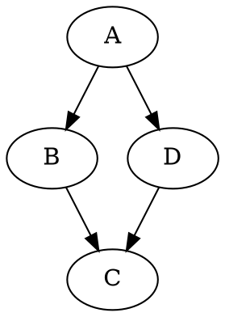

- [ ] **Step 7: Write `docs/02-graphviz-basics/examples/04-cluster.dot`**

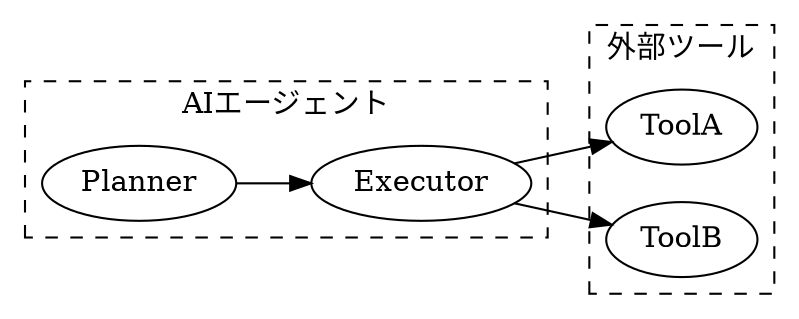

- [ ] **Step 8: Write `docs/02-graphviz-basics/03-layout-and-rankdir.md`**

```markdown
# レイアウト制御

## この教材で身につくこと

- rankdirによる全体方向の制御
- subgraph clusterによるグルーピング
- レイアウトが崩れたときの調整の考え方

## 概要

Graphvizはノード・エッジの配置を自動計算しますが、`rankdir`や
`subgraph cluster_*`で意図した構造に近づけることができます。

## 位置づけ

Mermaidのsubgraphに近い機能ですが、Graphvizは`cluster_`接頭辞と
`rankdir`の組み合わせでより精密にレイアウトを制御できます。

## 基本文法・プロパティ解説

### rankdirの値

| 値 | 方向 |
|----|------|
| `TB` | 上から下（既定） |
| `LR` | 左から右 |
| `BT` | 下から上 |
| `RL` | 右から左 |

### クラスタの書き方

サブグラフ名を`cluster_`で始めると、Graphvizが枠で囲って描画します。

```dot
subgraph cluster_名前 {
  label="表示名";
  style=dashed;
  ノードA;
  ノードB;
}
```

## 実ソースコード

`docs/02-graphviz-basics/examples/03-rankdir.dot`


`docs/02-graphviz-basics/examples/04-cluster.dot`


## 演習課題

1. `rankdir=LR`と`rankdir=TB`で同じグラフを描き、違いを比較せよ
2. クラスタを2つ使い、「エージェント側」「ツール側」を分けて表現せよ

## 理解度チェック

- [ ] rankdirの4つの値の違いが説明できる
- [ ] `cluster_`接頭辞でグルーピングできる
- [ ] クラスタ間のエッジがどう描画されるか説明できる

---

[← 前へ: ノード・エッジ属性](02-node-edge-attributes.md) | [次へ: 03. 図の選び方と整理法 →](../03-diagram-patterns/00-README.md)
```

- [ ] **Step 9: Commit**

```bash
git add docs/02-graphviz-basics
git commit -m "Add Graphviz basics category (content and .dot sources)"
```

---

### Task 6: Graphviz rendering script

**Files:**
- Create: `tools/render-graphviz.js`

**Interfaces:**
- Consumes: `docs/**/examples/*.dot` files (Task 5 produced the first batch; Task 9 adds more).
- Produces: matching `.png` files, referenced by Task 5/9 lesson Markdown via relative image links. Invoked as `npm run graphviz:render` (Task 1 already wired the script).

- [ ] **Step 1: Write `tools/render-graphviz.js`**

```javascript
/**
 * docs/<chapter>/examples/ 配下の全 .dot ファイルを
 * ローカルの `dot` コマンドでPNGにレンダリングするスクリプト。
 *
 * 使い方: node tools/render-graphviz.js
 * 前提: Graphviz (dot コマンド) がPATH上にインストールされていること。
 */

const { execFileSync } = require('child_process');
const path = require('path');
const fs = require('fs');

const DOCS_DIR = path.resolve(__dirname, '../docs');

function collectDotFiles(dir) {
  const entries = fs.readdirSync(dir, { withFileTypes: true });
  let results = [];

  for (const entry of entries) {
    const fullPath = path.join(dir, entry.name);

    if (entry.isDirectory()) {
      results = results.concat(collectDotFiles(fullPath));
      continue;
    }

    if (entry.isFile() && entry.name.endsWith('.dot')) {
      const normalized = fullPath.replace(/\\/g, '/');
      if (normalized.includes('/docs/') && normalized.includes('/examples/')) {
        results.push(fullPath);
      }
    }
  }

  return results;
}

function renderAll() {
  const files = collectDotFiles(DOCS_DIR).sort();

  if (files.length === 0) {
    console.log('examples 配下に.dotファイルが見つかりません: ' + DOCS_DIR);
    process.exit(1);
  }

  console.log(`${files.length} 個の.dotファイルを処理します...\n`);

  let success = 0;
  let failed = 0;

  for (const dotPath of files) {
    const baseName = path.basename(dotPath, '.dot');
    const pngPath = path.join(path.dirname(dotPath), baseName + '.png');
    const displayPath = path.relative(DOCS_DIR, dotPath).replace(/\\/g, '/');

    console.log(`[${success + failed + 1}/${files.length}] ${displayPath} ...`);

    try {
      execFileSync('dot', ['-Tpng', dotPath, '-o', pngPath], { stdio: 'pipe' });
      success++;
    } catch (err) {
      console.error(`  失敗: ${err.message}`);
      failed++;
    }
  }

  console.log(`\n完了: 成功 ${success} / 失敗 ${failed}`);
  if (failed > 0) {
    process.exit(1);
  }
}

renderAll();
```

- [ ] **Step 2: Commit (script only — running it requires Graphviz, done in Task 12)**

```bash
git add tools/render-graphviz.js
git commit -m "Add Graphviz PNG rendering script"
```

---

### Task 7: Category 03 — Diagram patterns

**Files:**
- Create: `docs/03-diagram-patterns/00-README.md`
- Create: `docs/03-diagram-patterns/01-mermaid-vs-graphviz.md`
- Create: `docs/03-diagram-patterns/02-choosing-the-right-diagram.md`
- Create: `docs/03-diagram-patterns/03-complex-diagram-organization.md`

**Interfaces:**
- Consumes: `tutorials/ideas/mermaid-study-notes.md` section 6.4 (comparison table) as source material.
- Produces: lesson filenames consumed by Task 10.

- [ ] **Step 1: Write `docs/03-diagram-patterns/00-README.md`**

```markdown
# 03. 図の選び方と整理法

このカテゴリでは、MermaidとGraphvizをどう使い分けるか、
そして複雑になった図をどう整理するかを学びます。

## 学習目標

- MermaidとGraphvizの違いと使い分け基準を説明できる
- 目的に応じて適切な図の種類を選べる
- 複雑な図を分割・整理する手法を知る

## 教材一覧

| # | 教材 | 内容 |
|---|------|------|
| 01 | [Mermaid vs Graphviz](01-mermaid-vs-graphviz.md) | 特性比較と使い分け基準 |
| 02 | [図の選び方](02-choosing-the-right-diagram.md) | 目的別の図の種類選定 |
| 03 | [複雑な図の整理法](03-complex-diagram-organization.md) | 分割・グルーピングの手法 |

## 学習の進め方

01 → 03 の順に進めることを推奨します。
```

- [ ] **Step 2: Write `docs/03-diagram-patterns/01-mermaid-vs-graphviz.md`**

```markdown
# Mermaid vs Graphviz

## この教材で身につくこと

- MermaidとGraphvizの特性の違い
- どちらを選ぶべきかの判断基準

## 概要

MermaidはMarkdownに埋め込みやすい手軽さが強みで、Graphvizは
レイアウト制御と大規模グラフの描画に強みがあります。

## 位置づけ

01・02カテゴリで両方の基本構文を学んだ上で、実務でどちらを
選ぶかを判断する基準を整理する教材です。

## 基本文法・プロパティ解説

### 特性比較

| 項目 | Mermaid | Graphviz |
|------|---------|----------|
| 用途 | ドキュメント内の簡易図 | 仕様・構造・大規模グラフ |
| 記法 | Markdownに埋め込みやすい | DOT言語 |
| レイアウト | シンプル | 高度に制御しやすい |
| GitHub/VS Codeでの表示 | ネイティブ描画される | されない（画像化が必要） |
| 生成AIとの相性 | 非常に良い、短い指示で生成できる | 良いが構文の厳密さがやや必要 |

## 実ソースコード

判断の目安をflowchartで示します。

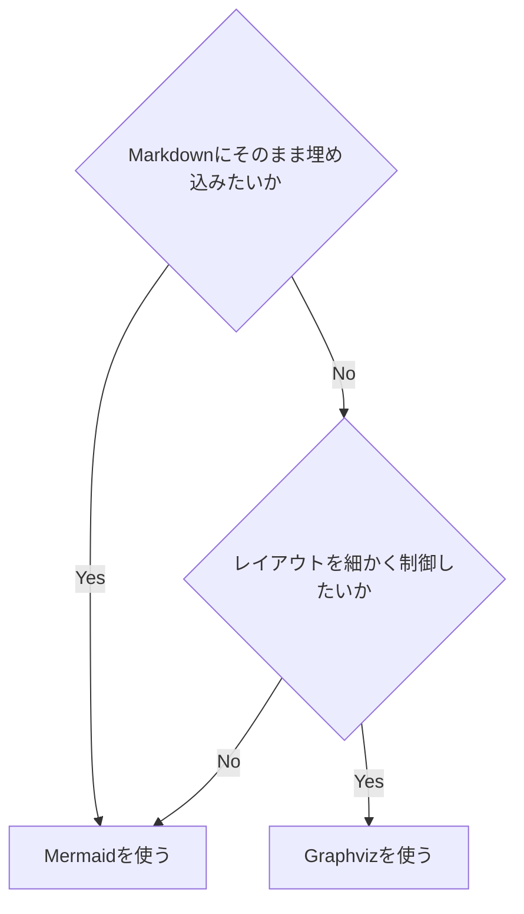

## 演習課題

1. 自分が最近作った図を1つ思い出し、Mermaid/Graphvizどちらが
   適していたか理由とともに答えよ

## 理解度チェック

- [ ] MermaidとGraphvizの表示方法の違いが説明できる
- [ ] レイアウト制御の必要性で使い分けを判断できる

---

[← 03. 図の選び方と整理法 目次](00-README.md) | [次へ: 図の選び方 →](02-choosing-the-right-diagram.md)
```

- [ ] **Step 3: Write `docs/03-diagram-patterns/02-choosing-the-right-diagram.md`**

```markdown
# 図の選び方

## この教材で身につくこと

- 目的別にMermaidの図の種類を選べる
- 「何を伝えたいか」から図の種類を逆算できる

## 概要

図の種類は目的によって決まります。ここでは目的から図の種類を
逆引きできる表を用意します。

## 位置づけ

01の使い分け基準を踏まえ、Mermaid内でさらに「どの図か」を
選ぶための実践的なチェックリストです。

## 基本文法・プロパティ解説

### 目的別の図の種類

| 伝えたいこと | 適した図 |
|---|---|
| 処理の流れ・分岐 | flowchart |
| 誰が何をいつ呼び出すか | sequenceDiagram |
| オブジェクトの構造・関係 | classDiagram |
| 状態の遷移 | stateDiagram |
| データの構造・関連 | erDiagram |
| スケジュール | gantt |
| アイデアの整理 | mindmap |
| 要件と実装の対応 | requirementDiagram |
| 大規模・複雑な構造 | Graphviz |

## 実ソースコード

```mermaid
flowchart LR
    A[伝えたいことを1文で書く] --> B[上の表と照合する]
    B --> C[候補が複数あれば一番シンプルな図を選ぶ]
```

## 演習課題

1. 「Skillが3つのツールをどの順番で呼ぶか」を伝えたい場合、
   どの図が適切か表を使って答えよ

## 理解度チェック

- [ ] 目的から図の種類を選べる
- [ ] 候補が複数あるとき、シンプルさを優先する判断ができる

---

[← 前へ: Mermaid vs Graphviz](01-mermaid-vs-graphviz.md) | [次へ: 複雑な図の整理法 →](03-complex-diagram-organization.md)
```

- [ ] **Step 4: Write `docs/03-diagram-patterns/03-complex-diagram-organization.md`**

```markdown
# 複雑な図の整理法

## この教材で身につくこと

- 大きくなった図を分割する判断基準
- subgraph/clusterでのグルーピング整理
- 「1つの図に詰め込みすぎない」ための工夫

## 概要

ノードやエッジが増えすぎた図は読みにくくなります。
分割・グルーピングで可読性を保つ手法を学びます。

## 位置づけ

01・02で選んだ図を、実際に運用可能なレベルまで整理する
仕上げの教材です。05カテゴリの実践例につながります。

## 基本文法・プロパティ解説

### 分割の目安

| 状況 | 対応 |
|------|------|
| ノードが15個を超える | 複数の図に分割する |
| 1つの図に3階層以上の詳細がある | 概要図と詳細図に分ける |
| 同じ意味のグループが繰り返される | subgraph/clusterでまとめる |

## 実ソースコード

概要図と詳細図に分割する例です。

```mermaid
flowchart TD
    subgraph Overview[概要図]
        User[ユーザー] --> Skill[Skill]
        Skill --> Result[結果]
    end
```

```mermaid
flowchart TD
    subgraph SkillDetail[Skill内部の詳細図]
        Input[入力解析] --> Plan[計画立案]
        Plan --> ToolCall[ツール呼び出し]
        ToolCall --> Format[結果整形]
    end
```

## 演習課題

1. ノード20個規模の図を想定し、どう2つの図に分割するか設計せよ
2. 繰り返し登場するグループをsubgraphでまとめよ

## 理解度チェック

- [ ] 図を分割すべきタイミングが判断できる
- [ ] 概要図と詳細図の役割の違いが説明できる

---

[← 前へ: 図の選び方](02-choosing-the-right-diagram.md) | [次へ: 04. 生成AIでのSkill開発への適用 →](../04-ai-skill-workflows/00-README.md)
```

- [ ] **Step 5: Commit**

```bash
git add docs/03-diagram-patterns
git commit -m "Add diagram patterns category"
```

---

### Task 8: Category 04 — AI Skill workflows

**Files:**
- Create: `docs/04-ai-skill-workflows/00-README.md`
- Create: `docs/04-ai-skill-workflows/01-documenting-skill-md-with-diagrams.md`
- Create: `docs/04-ai-skill-workflows/02-prompting-ai-to-generate-diagrams.md`
- Create: `docs/04-ai-skill-workflows/03-workflow-and-decision-diagrams-for-skills.md`
- Create: `docs/04-ai-skill-workflows/04-iterative-refinement-with-ai.md`

**Interfaces:**
- Consumes: `tutorials/ideas/mermaid-study-notes.md` section 12/9 (生成AIとの相性) as source material.
- Produces: lesson filenames consumed by Task 10.

- [ ] **Step 1: Write `docs/04-ai-skill-workflows/00-README.md`**

```markdown
# 04. 生成AIでのSkill開発への適用

このカテゴリでは、これまで学んだMermaid/Graphvizを、実際の
生成AI Skill開発（SKILL.md作成・エージェント設計）に適用します。

## 学習目標

- SKILL.mdに図を組み込む書き方を身につける
- 生成AIに図を生成・修正させるプロンプト設計ができる
- Skillのワークフロー・意思決定を図で表現できる
- AIとの反復修正で図の精度を上げられる

## 教材一覧

| # | 教材 | 内容 |
|---|------|------|
| 01 | [SKILL.mdへの図の組み込み](01-documenting-skill-md-with-diagrams.md) | Markdown内での配置方法 |
| 02 | [生成AIへの図生成プロンプト](02-prompting-ai-to-generate-diagrams.md) | プロンプト設計パターン |
| 03 | [ワークフロー・意思決定図](03-workflow-and-decision-diagrams-for-skills.md) | Skill内部ロジックの図化 |
| 04 | [AIとの反復修正](04-iterative-refinement-with-ai.md) | 修正指示の出し方 |

## 学習の進め方

01 → 04 の順に進めることを推奨します。
```

- [ ] **Step 2: Write `docs/04-ai-skill-workflows/01-documenting-skill-md-with-diagrams.md`**

```markdown
# SKILL.mdへの図の組み込み

## この教材で身につくこと

- SKILL.md内でMermaid図を使う典型パターン
- 図と本文説明を両立させる配置方法

## 概要

SKILL.mdはSkillの目的・使い方をAIエージェントと人間の両方に
伝えるドキュメントです。図を添えることで処理の全体像が伝わりやすくなります。

## 位置づけ

01-03カテゴリで学んだMermaid/Graphvizの構文を、実際のSKILL.md
というフォーマットに落とし込む最初の教材です。

## 基本文法・プロパティ解説

### 配置の基本方針

| 配置場所 | 目的 |
|---|---|
| 概要セクションの直後 | Skill全体の処理フローを示す |
| 個別手順の説明の直後 | その手順の詳細（分岐・ループ）を示す |
| トラブルシューティング欄 | エラー時の分岐を示す |

## 実ソースコード

SKILL.mdの一部を想定した例です。

```markdown
---
name: diagram-review
description: 図表付きドキュメントをレビューするSkill
---

# diagram-review Skill

## 処理の流れ

\`\`\`mermaid
flowchart TD
    Input[Markdown受領] --> Detect{図が含まれるか}
    Detect -->|Yes| Render[図の構文チェック]
    Detect -->|No| Skip[図なしとして通過]
    Render --> Report[レビュー結果を返す]
    Skip --> Report
\`\`\`

## 使い方

1. レビュー対象のMarkdownファイルを渡す
2. 図の構文エラーがあれば指摘される
```

## 演習課題

1. 自分のSkillの処理フローをMermaidで書き、SKILL.mdに追記せよ

## 理解度チェック

- [ ] SKILL.md内のどこに図を置くと伝わりやすいか説明できる
- [ ] コードフェンスのネスト（```markdown内の```mermaid）を正しく書ける

---

[← 04. 生成AIでのSkill開発への適用 目次](00-README.md) | [次へ: 生成AIへの図生成プロンプト →](02-prompting-ai-to-generate-diagrams.md)
```

- [ ] **Step 3: Write `docs/04-ai-skill-workflows/02-prompting-ai-to-generate-diagrams.md`**

```markdown
# 生成AIへの図生成プロンプト

## この教材で身につくこと

- 図を生成させるプロンプトに含めるべき要素
- Mermaid/Graphvizそれぞれのプロンプトの違い

## 概要

生成AIに「図の種類」「目的」「対象読者」を明示すると、
一発で使える図に近づきます。

## 位置づけ

01でSKILL.mdへの配置方法を学んだ後、その図を生成AI自身に
書かせる段階です。03の実践的な図の作成につながります。

## 基本文法・プロパティ解説

### プロンプトに含める要素

| 要素 | 例 |
|---|---|
| 図の種類 | 「flowchartで」「sequenceDiagramで」 |
| 対象 | 「ログインAPIの処理フローを」 |
| 対象読者 | 「初めてこのSkillを読む開発者向けに」 |
| 制約 | 「ノードは10個以内に」「日本語ラベルで」 |

## 実ソースコード

プロンプト例とその出力例です。

**プロンプト（Mermaid）:**

```markdown
Skillがユーザーからのリクエストを受け取り、外部APIを呼び出して
結果を返すまでの流れを、flowchartで書いてください。
ノードは日本語ラベル、5個以内にしてください。
```

**出力例:**

```mermaid
flowchart TD
    A[リクエスト受信] --> B[外部API呼び出し]
    B --> C[結果を整形]
    C --> D[レスポンス返却]
```

**プロンプト（Graphviz）:**

```markdown
SkillとAgentと2つの外部ツールの依存関係を、Graphvizのdigraphで
書いてください。rankdir=LRで、外部ツールはクラスタでまとめてください。
```

## 演習課題

1. 自分のSkillの構造を説明するプロンプトを、上の表の4要素を
   含めて書け

## 理解度チェック

- [ ] プロンプトに含めるべき4要素が説明できる
- [ ] Mermaid用とGraphviz用でプロンプトの書き方をどう変えるか説明できる

---

[← 前へ: SKILL.mdへの図の組み込み](01-documenting-skill-md-with-diagrams.md) | [次へ: ワークフロー・意思決定図 →](03-workflow-and-decision-diagrams-for-skills.md)
```

- [ ] **Step 4: Write `docs/04-ai-skill-workflows/03-workflow-and-decision-diagrams-for-skills.md`**

```markdown
# ワークフロー・意思決定図

## この教材で身につくこと

- Skillの内部ロジックをflowchart/stateDiagramで表現する方法
- 意思決定（条件分岐）を明示的に図示する方法

## 概要

Skillは「入力を受けて、条件によって処理を分岐し、結果を返す」
構造を持つことが多く、flowchart/stateDiagramと相性が良いです。

## 位置づけ

02で学んだプロンプト設計を使い、実際にSkillのロジックを
図として完成させる段階です。

## 基本文法・プロパティ解説

### Skillロジックとの対応

| Skillの要素 | 対応する図の要素 |
|---|---|
| 入力の検証 | 分岐ノード（ひし形） |
| ツール呼び出し | 平行四辺形ノード or sequenceDiagram |
| 状態（待機中/実行中/完了） | stateDiagram |
| エラー処理 | 分岐 + エラーノード |

## 実ソースコード

```mermaid
flowchart TD
    Input[入力受信] --> Validate{入力は妥当か}
    Validate -->|No| Reject[エラーを返す]
    Validate -->|Yes| Plan[実行計画を立てる]
    Plan --> Call[ツールを呼び出す]
    Call --> CheckResult{成功したか}
    CheckResult -->|No| Retry{リトライ回数上限か}
    Retry -->|No| Call
    Retry -->|Yes| Reject
    CheckResult -->|Yes| Return[結果を返す]
```

```mermaid
stateDiagram-v2
    [*] --> Validating
    Validating --> Rejected : 入力不正
    Validating --> Planning : 入力OK
    Planning --> CallingTool
    CallingTool --> Planning : リトライ
    CallingTool --> Succeeded : 成功
    CallingTool --> Rejected : リトライ上限
    Succeeded --> [*]
    Rejected --> [*]
```

## 演習課題

1. 自分のSkillの「入力検証→実行→結果返却」のflowchartを書け
2. 同じSkillをstateDiagramでも表現し、両者の違いを比較せよ

## 理解度チェック

- [ ] Skillのロジックをflowchartの分岐ノードで表現できる
- [ ] リトライ処理をflowchart/stateDiagram双方で表現できる

---

[← 前へ: 生成AIへの図生成プロンプト](02-prompting-ai-to-generate-diagrams.md) | [次へ: AIとの反復修正 →](04-iterative-refinement-with-ai.md)
```

- [ ] **Step 5: Write `docs/04-ai-skill-workflows/04-iterative-refinement-with-ai.md`**

```markdown
# AIとの反復修正

## この教材で身につくこと

- 生成された図を修正指示で改善する進め方
- 修正指示を具体的にするコツ

## 概要

生成AIが最初に出す図は完璧ではないことが多く、
具体的な修正指示を繰り返すことで精度を上げます。

## 位置づけ

02-03で作った図を、実際に使える品質まで磨き上げる
最後の教材です。05カテゴリの実践例に接続します。

## 基本文法・プロパティ解説

### 修正指示の型

| 悪い指示 | 良い指示 |
|---|---|
| 「もっと分かりやすくして」 | 「ノードXとYの間に条件分岐を追加して」 |
| 「見た目を整えて」 | 「rankdirをLRにして、エラー系ノードを赤系の色にして」 |
| 「図を直して」 | 「sequenceDiagramのactivate/deactivateが抜けているので追加して」 |

## 実ソースコード

修正前後の例です。

**修正前:**

```mermaid
flowchart TD
    A[入力] --> B[処理]
    B --> C[出力]
```

**修正指示:** 「BとCの間にエラー分岐を追加し、エラー時はAに戻すようにして」

**修正後:**

```mermaid
flowchart TD
    A[入力] --> B[処理]
    B --> C{成功したか}
    C -->|Yes| D[出力]
    C -->|No| A
```

## 演習課題

1. 自分が作った図を1つ選び、「悪い指示」「良い指示」の
   両方の例文を書け

## 理解度チェック

- [ ] 曖昧な修正指示と具体的な修正指示の違いが説明できる
- [ ] 修正前後の図を比較し、変更点を言語化できる

---

[← 前へ: ワークフロー・意思決定図](03-workflow-and-decision-diagrams-for-skills.md) | [次へ: 05. 実践例 →](../05-real-world-examples/00-README.md)
```

- [ ] **Step 6: Commit**

```bash
git add docs/04-ai-skill-workflows
git commit -m "Add AI skill workflows category"
```

---

### Task 9: Category 05 — Real-world examples

**Files:**
- Create: `docs/05-real-world-examples/00-README.md`
- Create: `docs/05-real-world-examples/01-skill-architecture-diagram.md`
- Create: `docs/05-real-world-examples/02-multi-agent-sequence-diagram.md`
- Create: `docs/05-real-world-examples/03-skill-development-doc-sample.md`
- Create: `docs/05-real-world-examples/examples/01-skill-architecture.dot`

**Interfaces:**
- Consumes: all prior categories' concepts; `tools/render-graphviz.js` (Task 6) to render `01-skill-architecture.dot`.
- Produces: nothing consumed further (last content category before Task 10 index files).

- [ ] **Step 1: Write `docs/05-real-world-examples/00-README.md`**

```markdown
# 05. 実践例

このカテゴリでは、これまでの内容を組み合わせた実践的な
図の作成例を扱います。

## 学習目標

- Graphvizで実務に近いSkillアーキテクチャ図を書ける
- Mermaidでマルチエージェントのやり取りを表現できる
- 図を組み合わせたSkill開発ドキュメントを作成できる

## 教材一覧

| # | 教材 | 内容 |
|---|------|------|
| 01 | [Skillアーキテクチャ図](01-skill-architecture-diagram.md) | Graphvizによる構造図 |
| 02 | [マルチエージェントのシーケンス図](02-multi-agent-sequence-diagram.md) | Mermaidによるやり取りの図 |
| 03 | [Skill開発ドキュメントのサンプル](03-skill-development-doc-sample.md) | 複数の図を組み合わせた総合例 |

## 学習の進め方

01 → 03 の順に進めることを推奨します。
```

- [ ] **Step 2: Write `docs/05-real-world-examples/examples/01-skill-architecture.dot`**

```dot
digraph SkillArchitecture {
  rankdir=LR;
  node [shape=box, style="rounded,filled", fontname="Helvetica"];

  User [shape=ellipse, fillcolor="#e0f2fe"];
  Skill [label="Skill\n(SKILL.md)", fillcolor="#eef2ff"];
  LLM [label="生成AI", fillcolor="#fef9c3"];

  subgraph cluster_tools {
    label="外部ツール群";
    style=dashed;
    Mermaid [label="Mermaid CLI"];
    Graphviz [label="Graphviz dot"];
  }

  User -> Skill -> LLM;
  LLM -> Mermaid;
  LLM -> Graphviz;
}
```

- [ ] **Step 3: Write `docs/05-real-world-examples/01-skill-architecture-diagram.md`**

```markdown
# Skillアーキテクチャ図

## この教材で身につくこと

- 実務規模のSkillアーキテクチャをGraphvizで表現する方法
- クラスタを使った関心事の分離

## 概要

ユーザー・Skill・生成AI・外部ツール群の関係を、
02-03カテゴリの知識を使って1つの図にまとめます。

## 位置づけ

このカテゴリの最初の教材として、02カテゴリ（Graphviz基礎）と
03カテゴリ（整理法）の総仕上げに位置づけられます。

## 基本文法・プロパティ解説

この図で使っている要素は、すべて02カテゴリで学んだものです。

| 要素 | 用途 |
|---|---|
| `rankdir=LR` | 左から右への流れを表現 |
| `subgraph cluster_tools` | 外部ツール群をグルーピング |
| `fillcolor` | 役割ごとに色分け |

## 実ソースコード

`docs/05-real-world-examples/examples/01-skill-architecture.dot`

```dot
digraph SkillArchitecture {
  rankdir=LR;
  node [shape=box, style="rounded,filled", fontname="Helvetica"];

  User [shape=ellipse, fillcolor="#e0f2fe"];
  Skill [label="Skill\n(SKILL.md)", fillcolor="#eef2ff"];
  LLM [label="生成AI", fillcolor="#fef9c3"];

  subgraph cluster_tools {
    label="外部ツール群";
    style=dashed;
    Mermaid [label="Mermaid CLI"];
    Graphviz [label="Graphviz dot"];
  }

  User -> Skill -> LLM;
  LLM -> Mermaid;
  LLM -> Graphviz;
}
```


## 演習課題

1. 自分のSkillの構成要素を洗い出し、同様の構造図を書け

## 理解度チェック

- [ ] クラスタで外部ツール群をまとめられる
- [ ] 役割ごとに色分けして意味を伝えられる

---

[← 05. 実践例 目次](00-README.md) | [次へ: マルチエージェントのシーケンス図 →](02-multi-agent-sequence-diagram.md)
```

- [ ] **Step 4: Write `docs/05-real-world-examples/02-multi-agent-sequence-diagram.md`**

```markdown
# マルチエージェントのシーケンス図

## この教材で身につくこと

- 複数エージェントが登場するsequenceDiagramの書き方
- オーケストレータを介した処理委譲の表現

## 概要

オーケストレータが複数のサブエージェントにタスクを振り分ける
構成を、MermaidのsequenceDiagramで表現します。

## 位置づけ

01カテゴリのsequenceDiagram、04カテゴリのSkillワークフロー
知識を組み合わせた実践例です。

## 基本文法・プロパティ解説

このシーケンス図で使う要素はすべて01カテゴリで学んだものです。

| 要素 | 用途 |
|---|---|
| `actor` | エンドユーザーを表す |
| `participant` | オーケストレータ・各エージェントを表す |
| `->>` / `-->>` | 依頼・結果報告のメッセージ |

## 実ソースコード

```mermaid
sequenceDiagram
    actor User
    participant Orchestrator as オーケストレータ
    participant AgentA as 調査エージェント
    participant AgentB as 実装エージェント

    User->>Orchestrator: タスク依頼
    Orchestrator->>AgentA: 調査を指示
    AgentA-->>Orchestrator: 調査結果
    Orchestrator->>AgentB: 実装を指示
    AgentB-->>Orchestrator: 実装完了
    Orchestrator-->>User: 完了報告
```

## 演習課題

1. 3つ目のエージェント（レビューエージェント）を追加した
   シーケンス図を書け

## 理解度チェック

- [ ] オーケストレータを介した処理委譲を表現できる
- [ ] 複数エージェントが登場する図を破綻なく書ける

---

[← 前へ: Skillアーキテクチャ図](01-skill-architecture-diagram.md) | [次へ: Skill開発ドキュメントのサンプル →](03-skill-development-doc-sample.md)
```

- [ ] **Step 5: Write `docs/05-real-world-examples/03-skill-development-doc-sample.md`**

```markdown
# Skill開発ドキュメントのサンプル

## この教材で身につくこと

- 複数の図を1つのドキュメントにまとめる構成力
- SKILL.md相当の完成ドキュメントを組み立てる流れ

## 概要

これまでの教材で作った図を1つのSkill開発ドキュメントとして
統合します。全体構造・処理フロー・エージェント間のやり取りを
1つのドキュメントで示す例です。

## 位置づけ

本チュートリアルの総仕上げです。01-04カテゴリすべての
知識を1つのサンプルとして統合します。

## 基本文法・プロパティ解説

サンプルドキュメントの構成は次の順序にしています。

| セクション | 使う図 |
|---|---|
| 全体構造 | Graphviz（アーキテクチャ図） |
| 処理フロー | Mermaid flowchart |
| エージェント間のやり取り | Mermaid sequenceDiagram |

## 実ソースコード

```markdown
---
name: multi-agent-review
description: 複数エージェントでコードレビューを行うSkill
---

# multi-agent-review Skill

## 全体構造

\`\`\`dot
digraph Architecture {
  rankdir=LR;
  User -> Orchestrator -> ReviewAgent;
  Orchestrator -> FixAgent;
}
\`\`\`

## 処理フロー

\`\`\`mermaid
flowchart TD
    Input[レビュー依頼] --> Review[ReviewAgentが指摘]
    Review --> HasIssue{指摘があるか}
    HasIssue -->|Yes| Fix[FixAgentが修正案を作成]
    HasIssue -->|No| Done[完了]
    Fix --> Done
\`\`\`

## エージェント間のやり取り

\`\`\`mermaid
sequenceDiagram
    participant Orchestrator
    participant ReviewAgent
    participant FixAgent

    Orchestrator->>ReviewAgent: レビュー依頼
    ReviewAgent-->>Orchestrator: 指摘一覧
    Orchestrator->>FixAgent: 修正依頼
    FixAgent-->>Orchestrator: 修正案
\`\`\`
```

## 演習課題

1. 自分のSkillについて、上記と同じ3セクション構成の
   ドキュメントを作成せよ

## 理解度チェック

- [ ] Graphviz・Mermaid flowchart・sequenceDiagramを
      1つのドキュメントに使い分けて配置できる
- [ ] 全体構造から詳細への流れでドキュメントを構成できる

---

[← 前へ: マルチエージェントのシーケンス図](02-multi-agent-sequence-diagram.md) | [トップに戻る →](../../README.md)
```

- [ ] **Step 6: Commit**

```bash
git add docs/05-real-world-examples
git commit -m "Add real-world examples category"
```

---

### Task 10: Top-level index files

**Files:**
- Create: `README.md`
- Create: `MASTER-INDEX.md`
- Create: `QUICK-REFERENCE.md`
- Create: `ROADMAP.md`
- Create: `CHANGELOG.md`
- Create: `VALIDATION_CHECKLIST.md`
- Create: `COMPLETION-REPORT.md`

**Interfaces:**
- Consumes: the exact category/lesson filenames created in Tasks 3-9.
- Produces: nothing consumed further.

- [ ] **Step 1: Write `README.md`**

```markdown
# Diagrams as Code 実践チュートリアル

Mermaid基礎知識の習得から、Graphvizによる高度なレイアウト制御、
そして生成AIでのSkill開発への実践的な適用までを段階的に学ぶ教材です。

> 💡 本チュートリアルは、[ideas/mermaid-study-notes.md](../ideas/mermaid-study-notes.md)
> の学習メモを土台に、体系的な教材として再構成したものです。

**📢 更新状況**: 🚧 作成中

- 全体索引: [MASTER-INDEX.md](MASTER-INDEX.md)
- スタイルガイド: [00_STYLE_GUIDE.md](00_STYLE_GUIDE.md)
- クイック参照: [QUICK-REFERENCE.md](QUICK-REFERENCE.md)
- 学習拡張計画: [ROADMAP.md](ROADMAP.md)

---

## 学習の進め方

1. [docs/00-COVER.md](docs/00-COVER.md) で全体像と学習目標を把握する
2. [docs/01-mermaid-basics/00-README.md](docs/01-mermaid-basics/00-README.md) でMermaid基礎を学ぶ
3. [docs/02-graphviz-basics/00-README.md](docs/02-graphviz-basics/00-README.md) でGraphviz基礎を学ぶ
4. [docs/03-diagram-patterns/00-README.md](docs/03-diagram-patterns/00-README.md) で図の選び方・整理法を学ぶ
5. [docs/04-ai-skill-workflows/00-README.md](docs/04-ai-skill-workflows/00-README.md) で生成AIでのSkill開発への適用を学ぶ
6. [docs/05-real-world-examples/00-README.md](docs/05-real-world-examples/00-README.md) で実践演習に取り組む

---

## カテゴリ入口

- [docs/00-COVER.md](docs/00-COVER.md)
- [docs/01-mermaid-basics/00-README.md](docs/01-mermaid-basics/00-README.md)
- [docs/02-graphviz-basics/00-README.md](docs/02-graphviz-basics/00-README.md)
- [docs/03-diagram-patterns/00-README.md](docs/03-diagram-patterns/00-README.md)
- [docs/04-ai-skill-workflows/00-README.md](docs/04-ai-skill-workflows/00-README.md)
- [docs/05-real-world-examples/00-README.md](docs/05-real-world-examples/00-README.md)
```

- [ ] **Step 2: Write `MASTER-INDEX.md`**

```markdown
# MASTER INDEX

**📢 対応状況**: 🚧 作成中

## Top Level
- [README.md](README.md)
- [00_STYLE_GUIDE.md](00_STYLE_GUIDE.md)
- [QUICK-REFERENCE.md](QUICK-REFERENCE.md)
- [ROADMAP.md](ROADMAP.md)

## Cover
- [docs/00-COVER.md](docs/00-COVER.md)

## 01. Mermaid基礎
- [docs/01-mermaid-basics/00-README.md](docs/01-mermaid-basics/00-README.md)
- [docs/01-mermaid-basics/01-flowchart.md](docs/01-mermaid-basics/01-flowchart.md) - flowchart
- [docs/01-mermaid-basics/02-sequence-diagram.md](docs/01-mermaid-basics/02-sequence-diagram.md) - sequenceDiagram
- [docs/01-mermaid-basics/03-state-and-class-diagram.md](docs/01-mermaid-basics/03-state-and-class-diagram.md) - class/stateDiagram
- [docs/01-mermaid-basics/04-other-diagrams.md](docs/01-mermaid-basics/04-other-diagrams.md) - ER/gantt/mindmap/requirementDiagram

## 02. Graphviz基礎
- [docs/02-graphviz-basics/00-README.md](docs/02-graphviz-basics/00-README.md)
- [docs/02-graphviz-basics/01-dot-language-basics.md](docs/02-graphviz-basics/01-dot-language-basics.md) - DOT言語の基本
- [docs/02-graphviz-basics/02-node-edge-attributes.md](docs/02-graphviz-basics/02-node-edge-attributes.md) - ノード・エッジ属性
- [docs/02-graphviz-basics/03-layout-and-rankdir.md](docs/02-graphviz-basics/03-layout-and-rankdir.md) - レイアウト制御

## 03. 図の選び方と整理法
- [docs/03-diagram-patterns/00-README.md](docs/03-diagram-patterns/00-README.md)
- [docs/03-diagram-patterns/01-mermaid-vs-graphviz.md](docs/03-diagram-patterns/01-mermaid-vs-graphviz.md) - Mermaid vs Graphviz
- [docs/03-diagram-patterns/02-choosing-the-right-diagram.md](docs/03-diagram-patterns/02-choosing-the-right-diagram.md) - 図の選び方
- [docs/03-diagram-patterns/03-complex-diagram-organization.md](docs/03-diagram-patterns/03-complex-diagram-organization.md) - 複雑な図の整理法

## 04. 生成AIでのSkill開発への適用
- [docs/04-ai-skill-workflows/00-README.md](docs/04-ai-skill-workflows/00-README.md)
- [docs/04-ai-skill-workflows/01-documenting-skill-md-with-diagrams.md](docs/04-ai-skill-workflows/01-documenting-skill-md-with-diagrams.md) - SKILL.mdへの図の組み込み
- [docs/04-ai-skill-workflows/02-prompting-ai-to-generate-diagrams.md](docs/04-ai-skill-workflows/02-prompting-ai-to-generate-diagrams.md) - 生成AIへの図生成プロンプト
- [docs/04-ai-skill-workflows/03-workflow-and-decision-diagrams-for-skills.md](docs/04-ai-skill-workflows/03-workflow-and-decision-diagrams-for-skills.md) - ワークフロー・意思決定図
- [docs/04-ai-skill-workflows/04-iterative-refinement-with-ai.md](docs/04-ai-skill-workflows/04-iterative-refinement-with-ai.md) - AIとの反復修正

## 05. 実践例
- [docs/05-real-world-examples/00-README.md](docs/05-real-world-examples/00-README.md)
- [docs/05-real-world-examples/01-skill-architecture-diagram.md](docs/05-real-world-examples/01-skill-architecture-diagram.md) - Skillアーキテクチャ図
- [docs/05-real-world-examples/02-multi-agent-sequence-diagram.md](docs/05-real-world-examples/02-multi-agent-sequence-diagram.md) - マルチエージェントのシーケンス図
- [docs/05-real-world-examples/03-skill-development-doc-sample.md](docs/05-real-world-examples/03-skill-development-doc-sample.md) - Skill開発ドキュメントのサンプル
```

- [ ] **Step 3: Write `QUICK-REFERENCE.md`**

```markdown
# クイック参照

## Mermaid 図の種類早見表

| 図の種類 | キーワード | 参照 |
|---|---|---|
| flowchart | `flowchart TD` / `flowchart LR` | [01-flowchart.md](docs/01-mermaid-basics/01-flowchart.md) |
| sequenceDiagram | `participant` / `actor` / `->>` | [02-sequence-diagram.md](docs/01-mermaid-basics/02-sequence-diagram.md) |
| classDiagram | `class` / `-->` | [03-state-and-class-diagram.md](docs/01-mermaid-basics/03-state-and-class-diagram.md) |
| stateDiagram | `stateDiagram-v2` / `[*]` | [03-state-and-class-diagram.md](docs/01-mermaid-basics/03-state-and-class-diagram.md) |
| erDiagram | `\|\|--o{` | [04-other-diagrams.md](docs/01-mermaid-basics/04-other-diagrams.md) |
| gantt | `dateFormat` / `section` | [04-other-diagrams.md](docs/01-mermaid-basics/04-other-diagrams.md) |
| mindmap | `root((...))` | [04-other-diagrams.md](docs/01-mermaid-basics/04-other-diagrams.md) |
| requirementDiagram | `requirement` / `satisfies` | [04-other-diagrams.md](docs/01-mermaid-basics/04-other-diagrams.md) |

## Graphviz 属性早見表

| 属性 | 対象 | 例 |
|---|---|---|
| `shape` | ノード | `box`, `ellipse`, `diamond` |
| `style` | ノード/エッジ | `filled`, `rounded`, `dashed` |
| `fillcolor` | ノード | `"#eef2ff"` |
| `rankdir` | グラフ全体 | `TB`, `LR`, `BT`, `RL` |
| `cluster_*` | subgraph名 | 枠付きグルーピング |

## コマンド早見表

| コマンド | 用途 |
|---|---|
| `npm run graphviz:render` | `.dot`ファイルを`.png`に一括変換 |
| `npm run ebook:step1` | 原稿レビュー用manuscript生成 |
| `npm run ebook:step3` | EPUB/PDF生成 |
```

- [ ] **Step 4: Write `ROADMAP.md`**

```markdown
# 学習拡張計画

## 現状のスコープ

- Mermaid基礎（flowchart / sequence / class / state / ER / gantt / mindmap / requirement）
- Graphviz基礎（DOT言語 / 属性 / レイアウト制御）
- 図の選び方と整理法
- 生成AIでのSkill開発への適用
- 実践例

## 将来の拡張候補

- PlantUML等、他のDiagrams-as-Codeツールとの比較教材
- Mermaidの`C4Context`など、アーキテクチャ記法専用の図
- 大規模図の自動レイアウト最適化のTips
- CI（GitHub Actions）での図の構文チェック自動化
```

- [ ] **Step 5: Write `CHANGELOG.md`**

```markdown
# Changelog

## [Unreleased]

### Added

- 初版教材一式（01-mermaid-basics 〜 05-real-world-examples）
- 電子書籍化パイプライン（css-tutorialと同一構成）
- Graphviz例のPNGレンダリングスクリプト
```

- [ ] **Step 6: Write `VALIDATION_CHECKLIST.md`**

```markdown
# 検証チェックリスト

## コンテンツ

- [ ] 全カテゴリに `00-README.md` があり、教材一覧が最新である
- [ ] 全レッスンが00_STYLE_GUIDEの見出し順に従っている
- [ ] 全レッスンに前後リンクがある
- [ ] MASTER-INDEX.mdのリンクが全て存在するファイルを指している

## Graphviz

- [ ] `docs/**/examples/*.dot` すべてに対応する `.png` がある
- [ ] `npm run graphviz:render` が成功する（終了コード0）

## Mermaid

- [ ] 全Mermaidコードブロックが `mermaid` 言語タグ付きである
- [ ] VS Code等のプレビューでMermaid図が壊れずに表示される

## 電子書籍ビルド

- [ ] `npm run ebook:step1` が `ebook-output/diagram-as-code-tutorial.manuscript.md` を生成する
- [ ] `npm run ebook:step3` が `ebook-output/diagram-as-code-tutorial.epub` と `.pdf` を生成する
- [ ] 生成された `.epub` / `.pdf` のファイルサイズが0バイトでない
```

- [ ] **Step 7: Write `COMPLETION-REPORT.md`**

```markdown
# 完了レポート

## 実施内容

- css-tutorialと同一のフォルダ・ファイル構成でdiagram-as-code-tutorialを新規作成
- Mermaid基礎・Graphviz基礎・図の選び方・生成AIでのSkill開発への適用・
  実践例の5カテゴリ、計17レッスン + 5カテゴリREADMEを作成
- Graphviz例（`.dot`）をローカルの`dot`コマンドでレンダリングし、
  PNGとして格納
- 電子書籍化パイプライン（EPUB/PDF）を実際に実行し、成果物を確認

## 未実施（スコープ外）

- GitHubリモートへのpush
- KDPへの実出品
- AI生成カバー画像の実生成

詳細は `docs/superpowers/specs/2026-07-11-diagram-as-code-tutorial-design.md`
セクション8を参照してください。
```

- [ ] **Step 8: Verify every link target in `MASTER-INDEX.md` exists**

```bash
node -e "
const fs = require('fs');
const path = require('path');
const text = fs.readFileSync('MASTER-INDEX.md', 'utf8');
const links = [...text.matchAll(/\]\(([^)]+\.md)\)/g)].map(m => m[1]);
let missing = 0;
for (const link of links) {
  if (!fs.existsSync(link)) {
    console.error('MISSING:', link);
    missing++;
  }
}
console.log(links.length, 'links checked,', missing, 'missing');
process.exit(missing > 0 ? 1 : 0);
"
```

Expected: `missing` is 0, exit code 0.

- [ ] **Step 9: Commit**

```bash
git add README.md MASTER-INDEX.md QUICK-REFERENCE.md ROADMAP.md CHANGELOG.md VALIDATION_CHECKLIST.md COMPLETION-REPORT.md
git commit -m "Add top-level index files"
```

---

### Task 11: GitHub config and ebook-build wiring

**Files:**
- Create: `.github/ISSUE_TEMPLATE/bug_report.yml`
- Create: `.github/ISSUE_TEMPLATE/config.yml`
- Create: `.github/ISSUE_TEMPLATE/feature_request.yml`
- Create: `.github/copilot-instructions.md`
- Create: `.github/pull_request_template.md`
- Create: `.github/workflows/validate.yml`
- Create: `.github/workflows/pages.yml`
- Create: `.github/skills-config/ebook-build/diagram-as-code-tutorial.build.json`
- Create: `.github/skills-config/ebook-build/diagram-as-code-tutorial.metadata.yaml`
- Create: `.github/skills-config/ebook-build/diagram-as-code-tutorial.kdp.yaml`
- Create: `.github/skills-config/ebook-build/invoke-build.ps1`
- Create: `.github/skills-config/ebook-build/mermaid.epub.config.json`
- Create: `.github/skills-config/ebook-build/mermaid.puppeteer.config.json`

**Interfaces:**
- Consumes: `css-tutorial/.github/**` and `css-tutorial/.github/skills-config/ebook-build/**` as templates; `shared-copilot-skills/ebook-build` at `../shared-copilot-skills/ebook-build` (relative to this repo's root) as the actual build engine.
- Produces: `npm run ebook:step1/step2/step3` become runnable, used by Task 13.

- [ ] **Step 1: Copy the three ISSUE_TEMPLATE files verbatim (they are generic, no CSS-specific content)**

```bash
mkdir -p /c/Dev/tutorials/diagram-as-code-tutorial/.github/ISSUE_TEMPLATE
cp /c/Dev/tutorials/css-tutorial/.github/ISSUE_TEMPLATE/bug_report.yml /c/Dev/tutorials/diagram-as-code-tutorial/.github/ISSUE_TEMPLATE/
cp /c/Dev/tutorials/css-tutorial/.github/ISSUE_TEMPLATE/config.yml /c/Dev/tutorials/diagram-as-code-tutorial/.github/ISSUE_TEMPLATE/
cp /c/Dev/tutorials/css-tutorial/.github/ISSUE_TEMPLATE/feature_request.yml /c/Dev/tutorials/diagram-as-code-tutorial/.github/ISSUE_TEMPLATE/
```

Open each copied file and replace any occurrence of "css" or "CSS" with wording appropriate to this repo (e.g. "教材" instead of "CSSチュートリアル"), if present. If the files are already generic, leave them unchanged.

- [ ] **Step 2: Write `.github/copilot-instructions.md`**

```markdown
# Copilot Instructions

このリポジトリは、生成AIでSkill開発を行う際にMermaid/Graphvizで
図を書く力を学ぶ教材です。

## 編集時の注意

- `00_STYLE_GUIDE.md` の構成ルールに従ってください。
- Mermaidは画像化せず、コードフェンスのまま記述してください。
- Graphvizの`.dot`を変更したら `npm run graphviz:render` でPNGを
  再生成してください。
- 新しい教材ファイルを追加したら `MASTER-INDEX.md` を更新してください。
```

- [ ] **Step 3: Copy the pull request template, adjusting wording**

```bash
cp /c/Dev/tutorials/css-tutorial/.github/pull_request_template.md /c/Dev/tutorials/diagram-as-code-tutorial/.github/pull_request_template.md
```

Open the copied file; if it references "CSS" specifically, replace with generic "教材" wording. Otherwise leave unchanged.

- [ ] **Step 4: Write `.github/workflows/validate.yml`**

```yaml
name: Validate tutorial repo

on:
  push:
    branches: [main]
  pull_request:
  workflow_dispatch:

jobs:
  validate:
    runs-on: ubuntu-latest
    steps:
      - name: Checkout repository
        uses: actions/checkout@v4
        with:
          submodules: recursive

      - name: Setup Node.js
        uses: actions/setup-node@v4
        with:
          node-version: 20
          cache: npm

      - name: Install dependencies
        run: npm install

      - name: Setup Pandoc
        uses: r-lib/actions/setup-pandoc@v2

      - name: Build ebook
        run: |
          npm run ebook:step1
          npm run ebook:step2
          npm run ebook:step3
          npm run ebook:step2b
```

- [ ] **Step 5: Write `.github/workflows/pages.yml`**

```yaml
name: Deploy docs to GitHub Pages

on:
  push:
    branches: [main]
  workflow_dispatch:

permissions:
  contents: read
  pages: write
  id-token: write

concurrency:
  group: pages
  cancel-in-progress: true

jobs:
  build:
    runs-on: ubuntu-latest
    steps:
      - name: Checkout repository
        uses: actions/checkout@v4
        with:
          submodules: recursive

      - name: Setup Pages
        uses: actions/configure-pages@v4

      - name: Build Jekyll site
        uses: actions/jekyll-build-pages@v1
        with:
          source: ./docs
          destination: ./_site

      - name: Upload Pages artifact
        uses: actions/upload-pages-artifact@v3
        with:
          path: ./_site

  deploy:
    environment:
      name: github-pages
      url: ${{ steps.deployment.outputs.page_url }}
    runs-on: ubuntu-latest
    needs: build
    if: github.ref == 'refs/heads/main'

    steps:
      - name: Deploy to GitHub Pages
        id: deployment
        uses: actions/deploy-pages@v4
```

- [ ] **Step 6: Write `.github/skills-config/ebook-build/invoke-build.ps1`**

```powershell
# Consumer repository wrapper for ebook-build skill.
# Delegates all build logic to the shared dispatcher in shared-copilot-skills.
#
# Usage:
#   pwsh invoke-build.ps1 -BuildStep step1
#   pwsh invoke-build.ps1 -BuildStep step2
#   pwsh invoke-build.ps1 -BuildStep step3

[CmdletBinding()]
param(
    [string]$ConfigFile = '.github/skills-config/ebook-build/diagram-as-code-tutorial.build.json',
    [Parameter(Mandatory = $true)]
    [ValidateSet('step1', 'step2', 'step2b', 'step3')]
    [string]$BuildStep
)

Set-StrictMode -Version Latest
$ErrorActionPreference = 'Stop'

$repoRoot = (Resolve-Path (Join-Path $PSScriptRoot '../../..')).Path

$sharedCandidates = @(
    (Join-Path $repoRoot '../shared-copilot-skills/ebook-build'),
    (Join-Path $repoRoot '.github/skills/shared-skills/ebook-build'),
    (Join-Path $repoRoot '.github/skills/shared-copilot-skills/ebook-build')
)

$sharedSkillRoot = $null
foreach ($candidate in $sharedCandidates) {
    if (Test-Path $candidate) {
        $sharedSkillRoot = (Resolve-Path $candidate).Path
        break
    }
}
if (-not $sharedSkillRoot) {
    throw "Shared ebook-build skill not found. Checked: $($sharedCandidates -join ', ')"
}

$dispatcherScript = Join-Path $sharedSkillRoot 'scripts/invoke-build.ps1'
if (-not (Test-Path $dispatcherScript)) {
    throw "Shared dispatcher not found: $dispatcherScript"
}

& pwsh -NoProfile -ExecutionPolicy Bypass -File $dispatcherScript `
    -RepoRoot   $repoRoot `
    -ConfigFile $ConfigFile `
    -BuildStep  $BuildStep

exit $LASTEXITCODE
```

- [ ] **Step 7: Write `.github/skills-config/ebook-build/diagram-as-code-tutorial.build.json`**

```json
{
  "sourceRoot": "./docs",
  "outputDir": "./ebook-output",
  "projectName": "diagram-as-code-tutorial",
  "formats": [
    "epub",
    "pdf",
    "kdp-markdown"
  ],
  "metadataFile": "./.github/skills-config/ebook-build/diagram-as-code-tutorial.metadata.yaml",
  "kdpMetadataFile": "./.github/skills-config/ebook-build/diagram-as-code-tutorial.kdp.yaml",
  "chapterDirPattern": "^\\d{2}-",
  "chapterFilePattern": "^(?!00-README\\.md$).+\\.md$",
  "headingNumbering": true,
  "tocDepth": 2,
  "coverFile": "00-COVER.md",
  "coverTemplateMode": "auto",
  "coverTemplate": "classic",
  "collectAssets": true,
  "normalizeManuscript": true,
  "requireManuscriptApproval": false,
  "approvalTokenFile": "./ebook-output/diagram-as-code-tutorial.manuscript.approved",
  "generateManuscriptReviewReport": false,
  "manuscriptReviewReviewer": "automated-baseline",
  "manuscriptReviewDecision": "Approve",
  "coverMode": "ai-image",
  "coverImagePromptSourceFile": "./docs/01-cover-prompt.md",
  "coverImagePromptFile": "./ebook-output/prompts/diagram-as-code-tutorial.cover-prompt.md",
  "mermaidMode": "required",
  "mermaidFormat": "svg",
  "failOnMermaidError": true,
  "mermaidConfigFile": "./.github/skills-config/ebook-build/mermaid.epub.config.json",
  "mermaidPuppeteerConfigFile": "./.github/skills-config/ebook-build/mermaid.puppeteer.config.json"
}
```

- [ ] **Step 8: Write `.github/skills-config/ebook-build/diagram-as-code-tutorial.metadata.yaml`**

```yaml
title: Diagrams as Code 実践チュートリアル
subtitle: Mermaid・Graphvizで学ぶ生成AI Skill設計図
creator: 杜 文吉
language: ja-JP
rights: Copyright (c) 杜 文吉
date: 2026-07-11
toc: true
toc-depth: 2
publisher: Duwenji Lab
identifier: diagram-as-code-tutorial
description: >
  Mermaid基礎文法からGraphvizのレイアウト制御、そして生成AIでの
  Skill開発への実践的な適用までを段階的に学べるチュートリアル。
  SKILL.mdへの図の組み込み方、生成AIへのプロンプト設計、
  マルチエージェントのシーケンス図作成力を養います。
keywords:
  - mermaid
  - graphviz
  - diagrams as code
  - ai skill development
  - generative ai
subject:
  - software development
  - ai agent development
chapters:
  dir-titles:
    01-mermaid-basics: Mermaid基礎
    02-graphviz-basics: Graphviz基礎
    03-diagram-patterns: 図の選び方と整理法
    04-ai-skill-workflows: 生成AIでのSkill開発への適用
    05-real-world-examples: 実践例
```

- [ ] **Step 9: Copy `css-tutorial.kdp.yaml` as a template and adjust identifiers**

```bash
cp /c/Dev/tutorials/css-tutorial/.github/skills-config/ebook-build/css-tutorial.kdp.yaml /c/Dev/tutorials/diagram-as-code-tutorial/.github/skills-config/ebook-build/diagram-as-code-tutorial.kdp.yaml
```

Open the copied file and replace every occurrence of `css-tutorial` with
`diagram-as-code-tutorial`, and the title/description fields with the
values from Step 8's metadata file. Keep all structural keys (`trimSize`,
`paperType`, etc.) unchanged.

- [ ] **Step 10: Copy the two mermaid config files verbatim (they are project-agnostic)**

```bash
cp /c/Dev/tutorials/css-tutorial/.github/skills-config/ebook-build/mermaid.epub.config.json /c/Dev/tutorials/diagram-as-code-tutorial/.github/skills-config/ebook-build/mermaid.epub.config.json
cp /c/Dev/tutorials/css-tutorial/.github/skills-config/ebook-build/mermaid.puppeteer.config.json /c/Dev/tutorials/diagram-as-code-tutorial/.github/skills-config/ebook-build/mermaid.puppeteer.config.json
```

- [ ] **Step 11: Verify the shared skill resolves from this repo's location**

```powershell
Test-Path "C:\Dev\tutorials\shared-copilot-skills\ebook-build\scripts\invoke-build.ps1"
```

Expected: `True`.

- [ ] **Step 12: Verify `diagram-as-code-tutorial.build.json` is valid JSON**

```bash
node -e "JSON.parse(require('fs').readFileSync('.github/skills-config/ebook-build/diagram-as-code-tutorial.build.json', 'utf8')); console.log('ok')"
```

Expected: prints `ok`.

- [ ] **Step 13: Commit**

```bash
git add .github
git commit -m "Add GitHub config and ebook-build pipeline wiring"
```

---

### Task 12: Install Graphviz and render example PNGs

**Files:**
- Modify: none (generates `docs/02-graphviz-basics/examples/*.png` and `docs/05-real-world-examples/examples/*.png`)

**Interfaces:**
- Consumes: `tools/render-graphviz.js` (Task 6), `.dot` files (Tasks 5, 9).
- Produces: `.png` files referenced by Task 5/9 Markdown image links.

- [ ] **Step 1: Install Graphviz via winget**

```powershell
winget install --id Graphviz.Graphviz -e --accept-source-agreements --accept-package-agreements
```

- [ ] **Step 2: Open a new shell and verify `dot` is on PATH**

```powershell
dot -V
```

Expected: prints a version string like `dot - graphviz version X.Y.Z`. If
`dot` is not found, close and reopen the terminal (PATH was updated by the
installer) and retry.

- [ ] **Step 3: Render all Graphviz examples**

```bash
cd /c/Dev/tutorials/diagram-as-code-tutorial
npm run graphviz:render
```

Expected output ends with `完了: 成功 5 / 失敗 0` (4 files from Task 5 +
1 file from Task 9), exit code 0.

- [ ] **Step 4: Verify every `.dot` has a matching `.png`**

```bash
node -e "
const fs = require('fs');
const path = require('path');
function walk(dir) {
  let dots = [];
  for (const entry of fs.readdirSync(dir, { withFileTypes: true })) {
    const p = path.join(dir, entry.name);
    if (entry.isDirectory()) dots = dots.concat(walk(p));
    else if (entry.name.endsWith('.dot')) dots.push(p);
  }
  return dots;
}
const dots = walk('docs');
let missing = 0;
for (const dot of dots) {
  const png = dot.replace(/\.dot$/, '.png');
  if (!fs.existsSync(png)) { console.error('MISSING PNG:', png); missing++; }
}
console.log(dots.length, 'dot files,', missing, 'missing png');
process.exit(missing > 0 ? 1 : 0);
"
```

Expected: `missing` is 0, exit code 0.

- [ ] **Step 5: Commit the rendered PNGs**

```bash
git add docs/02-graphviz-basics/examples docs/05-real-world-examples/examples
git commit -m "Render Graphviz examples to PNG"
```

---

### Task 13: Run the ebook build end-to-end and finalize

**Files:**
- Modify: none (generates `ebook-output/**`)

**Interfaces:**
- Consumes: everything from Tasks 1-12.
- Produces: `ebook-output/diagram-as-code-tutorial.epub`, `.pdf`, manuscript, cover placeholder, KDP registration note.

- [ ] **Step 1: Install npm dependencies**

```bash
cd /c/Dev/tutorials/diagram-as-code-tutorial
npm install
```

Expected: exits 0. There should be no dependency errors since `package.json`
declares no runtime dependencies.

- [ ] **Step 2: Run step1 (manuscript generation)**

```bash
npm run ebook:step1
```

Expected: exits 0 and creates `ebook-output/diagram-as-code-tutorial.manuscript.md`.
If it fails with a Mermaid conversion error, read the error output — it
will name the offending file and line; open that lesson file and fix the
Mermaid syntax, then re-run this step.

- [ ] **Step 3: Read the generated manuscript and confirm chapter order matches the design**

```bash
node -e "
const fs = require('fs');
const text = fs.readFileSync('ebook-output/diagram-as-code-tutorial.manuscript.md', 'utf8');
const headings = [...text.matchAll(/^#\s+.+$/gm)].map(m => m[0]).slice(0, 10);
console.log(headings.join('\n'));
"
```

Expected: headings appear in the order Cover → Mermaid基礎 → Graphviz基礎 →
図の選び方と整理法 → 生成AIでのSkill開発への適用 → 実践例.

- [ ] **Step 4: Run step2 (cover)**

```bash
npm run ebook:step2
```

Expected: exits 0 and creates a cover file under `ebook-output/` (either a
generated placeholder image or a template-based cover per
`coverTemplateMode: "auto"`).

- [ ] **Step 5: Run step3 (finalize EPUB/PDF/KDP markdown)**

```bash
npm run ebook:step3
```

Expected: exits 0 and creates `ebook-output/diagram-as-code-tutorial.epub`,
`ebook-output/diagram-as-code-tutorial.pdf`, and
`ebook-output/diagram-as-code-tutorial-kdp-registration.md`.

- [ ] **Step 6: Verify the EPUB and PDF are non-empty**

```bash
node -e "
const fs = require('fs');
for (const f of ['ebook-output/diagram-as-code-tutorial.epub', 'ebook-output/diagram-as-code-tutorial.pdf']) {
  const size = fs.statSync(f).size;
  console.log(f, size, 'bytes');
  if (size === 0) { console.error('EMPTY FILE:', f); process.exit(1); }
}
"
```

Expected: both files report a non-zero byte size, exit code 0.

- [ ] **Step 7: If step2b (paperback cover) tooling is available, run it; otherwise skip**

```bash
npm run ebook:step2b
```

This step depends on Python 3 + Pillow (auto-installed per the shared
skill's README) and optionally Ghostscript for CMYK conversion. If it
fails due to missing Python/Pillow and those cannot be installed in this
environment, note the failure in `COMPLETION-REPORT.md` under "未実施"
and continue — `step2b` is paperback-specific and not required for the
EPUB/PDF deliverables already verified in Steps 5-6.

- [ ] **Step 8: Update `COMPLETION-REPORT.md` with actual results**

Open `COMPLETION-REPORT.md` and add a dated entry confirming the EPUB/PDF
file sizes observed in Step 6, and whether step2b succeeded.

- [ ] **Step 9: Final commit**

```bash
git add COMPLETION-REPORT.md
git commit -m "Verify ebook build produces EPUB/PDF output"
git log --oneline
```

Expected: `git log` shows one commit per prior task, ending with this one.
`ebook-output/*.epub` and `*.pdf` are NOT committed (excluded by
`.gitignore` from Task 1) — they are build artifacts, verified but not
version-controlled, matching `css-tutorial`'s pattern of committing only
curated ebook outputs after manual review.
