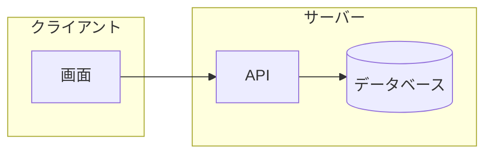
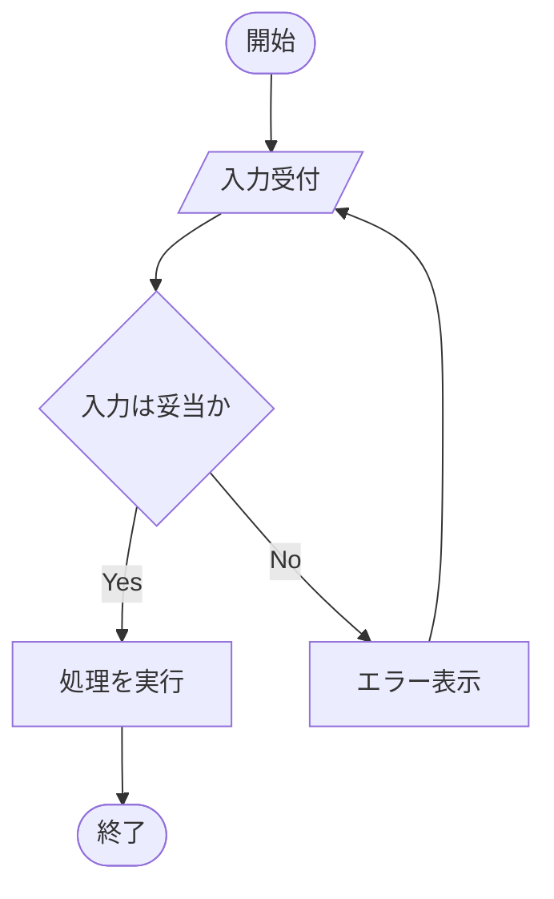
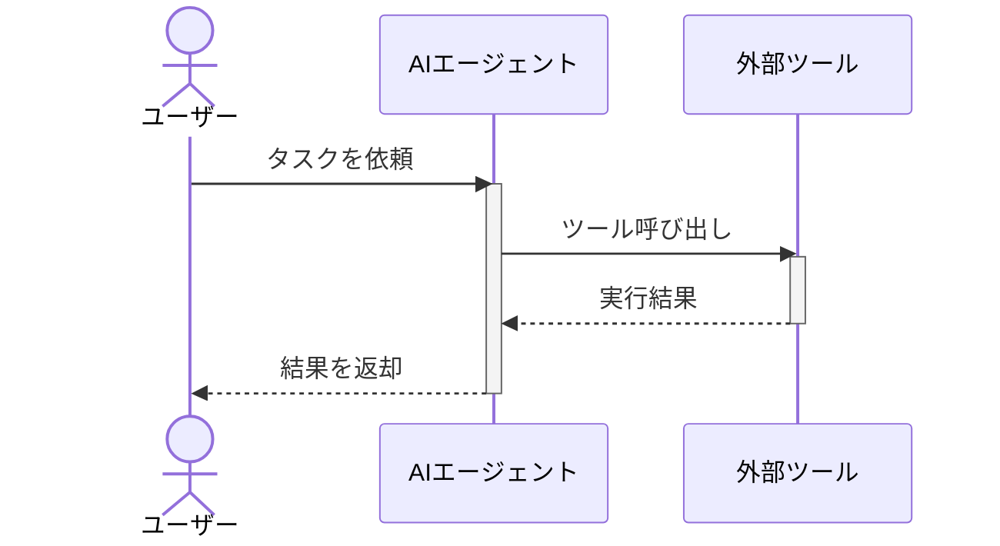
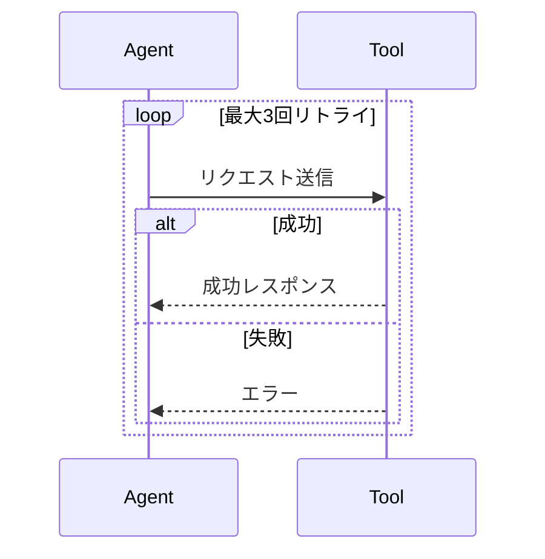
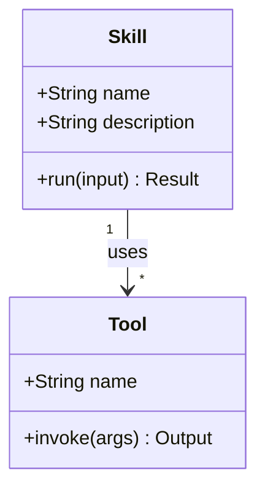
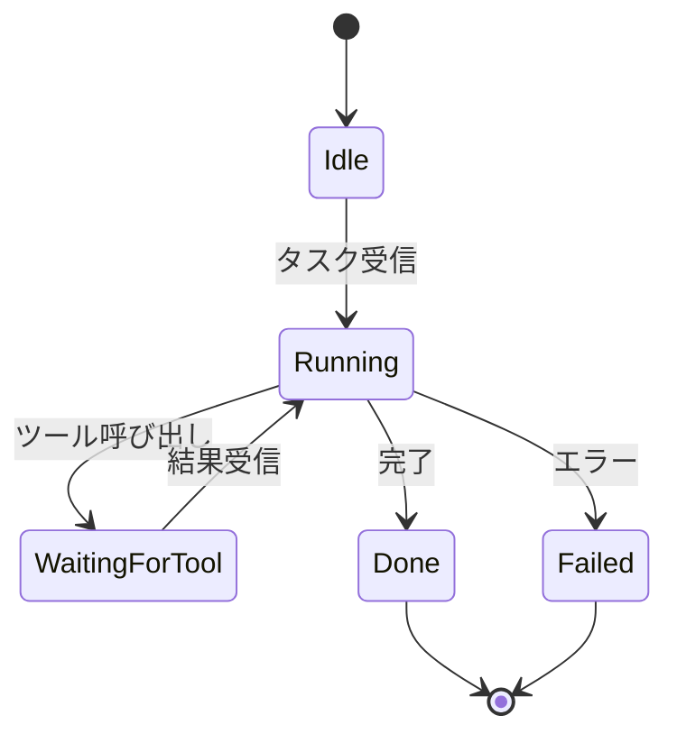
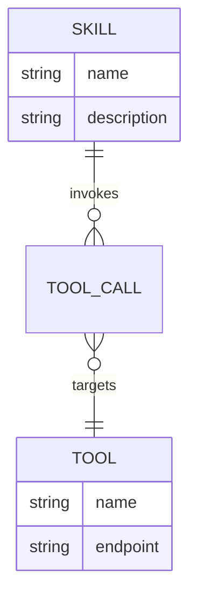
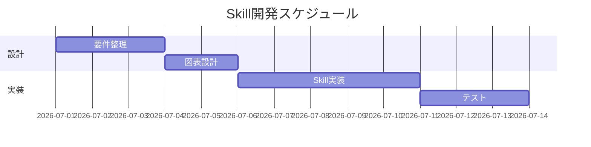
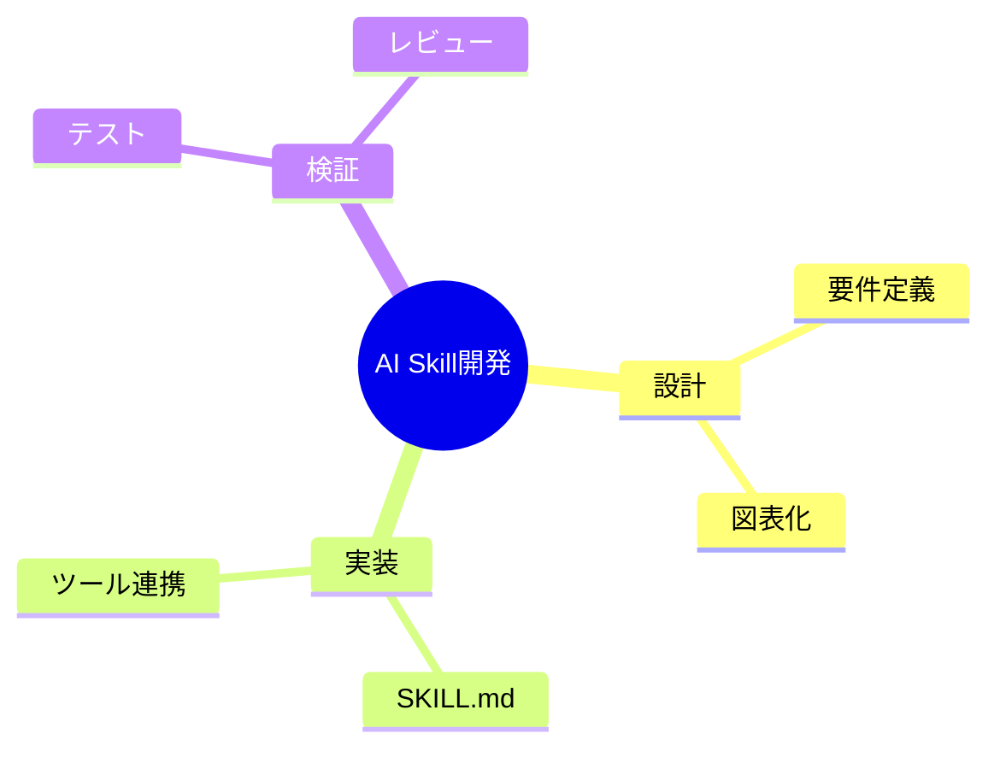
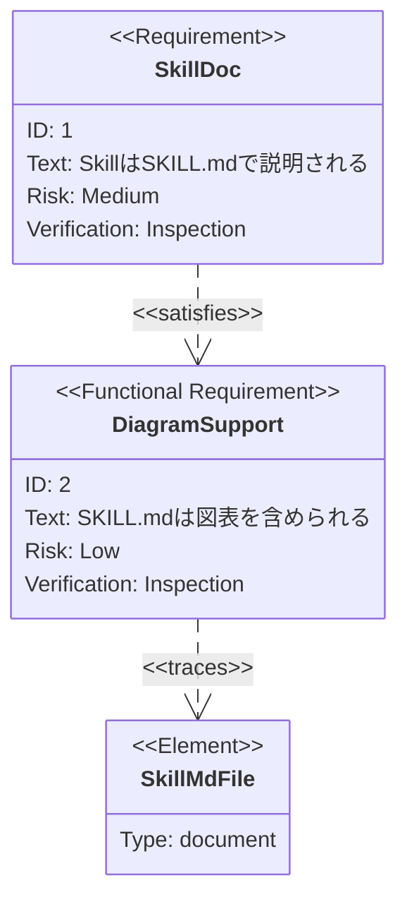

# Mermaidコード可視化・コード解説追記 Implementation Plan

> **For agentic workers:** REQUIRED SUB-SKILL: Use superpowers:subagent-driven-development (recommended) or superpowers:executing-plans to implement this plan task-by-task. Steps use checkbox (`- [ ]`) syntax for tracking.

**Goal:** `diagram-as-code-tutorial/docs` 配下の全17レッスンファイルに、電子書籍(EPUB/PDF)化しても消えないMermaidソースコードの複製と、実ソースコードの「コードのポイント」箇条書き解説を追加する。

**Architecture:** 各レッスンファイルの `## 実ソースコード` セクションに、パターンA(Mermaid: ```text複製 + ```mermaid + 箇条書き)、パターンB(Graphviz: 既存コード+画像の直後に箇条書きのみ)、パターンC(ネスト例: 箇条書きのみ)のいずれかを適用するテキスト編集タスクの集合。コード実行を伴わないドキュメント編集プロジェクトのため、「テスト」はNode製の一行スクリプトによるテキスト整合性検証とgrep確認に置き換える。

**Tech Stack:** Markdown, Node.js(検証スクリプトのみ、依存追加なし), Git。

## Global Constraints

- 設計書: `docs/superpowers/specs/2026-07-11-mermaid-code-visibility-design.md`
- リポジトリルート: `c:\Dev\tutorials\diagram-as-code-tutorial`(既存のスタンドアロンGitリポジトリ、リモートpushはしない)
- パターンA(Mermaid、電子書籍で消える): `## 実ソースコード` 内のトップレベル ` ```mermaid ` フェンスの直前に ` ```text ` フェンス(内容は```mermaid ```と1文字単位で同一)を追加し、直後に `**コードのポイント:**` の箇条書き(2〜4行、多くても6行)を追加する。
- パターンB(Graphviz、既に画像付きで残る): コード複製は不要。既存の コードブロック→画像 の直後に `**コードのポイント:**` の箇条書きのみ追加する。png画像が存在しない出力例(04-02のdotコード)も同様に箇条書きのみ追加する。
- パターンC(ネスト例、SKILL.md想定サンプル): 複製不要。```markdown ブロック全体の直後に、構成を要約する `**コードのポイント:**` の箇条書きを1つ追加する。
- 対象外: `## 基本文法・プロパティ解説` セクション内の構文断片コード、`00-README.md`、`00-COVER.md`、`01-cover-prompt.md`。
- 既存の `**修正前:**` / `**修正後:**` / `**出力例:**` のような太字ラベルがある箇所では、それを流用し新たに `**ソースコード:**` ラベルを重ねて追加しない。
- 全編集後、各ファイルの見出し順序(この教材で身につくこと→概要→位置づけ→基本文法・プロパティ解説→実ソースコード→演習課題→理解度チェック)は変更しない。

---

### Task 1: `docs/01-mermaid-basics/01-flowchart.md`

**Files:**
- Modify: `docs/01-mermaid-basics/01-flowchart.md`

**Interfaces:**
- Consumes: なし
- Produces: なし(独立した教材ファイル)

- [ ] **Step 1: `## 実ソースコード` セクションを置き換える**

置き換え前:

```markdown
## 実ソースコード


subgraphでグルーピングする例です。



## 演習課題
```

置き換え後:

```markdown
## 実ソースコード

**ソースコード:**

```text
flowchart TD
    Start([開始]) --> Input[/入力受付/]
    Input --> Check{入力は妥当か}
    Check -->|Yes| Process[処理を実行]
    Check -->|No| Error[エラー表示]
    Process --> End([終了])
    Error --> Input
```



**コードのポイント:**

- `Start([開始])` は開始ノード（楕円形）、`End([終了])` が終了ノード
- `Input[/入力受付/]` は平行四辺形で入出力を表す
- `Check{入力は妥当か}` はひし形の分岐ノード、`-->|Yes|`/`-->|No|` でラベル付き分岐を表現
- `Error --> Input` で入力からやり直すループになっている

subgraphでグルーピングする例です。

**ソースコード:**

```text
flowchart LR
    subgraph Client[クライアント]
        UI[画面]
    end
    subgraph Server[サーバー]
        API[API]
        DB[(データベース)]
    end
    UI --> API --> DB
```


**コードのポイント:**

- `subgraph Client[クライアント] ... end` でノードをグループ化し、枠付きで表示する
- `DB[(データベース)]` は円柱形でデータベースを表す
- グループ間の矢印（`UI --> API --> DB`）はグループ内ノードを指定するだけでよい

## 演習課題
```

- [ ] **Step 2: text/mermaidブロックの内容一致を検証する**

Run:

```bash
node -e "
const fs = require('fs');
const text = fs.readFileSync('docs/01-mermaid-basics/01-flowchart.md', 'utf8');
const pairs = [...text.matchAll(/```text\n([\s\S]*?)```\n\n```mermaid\n([\s\S]*?)```/g)];
if (pairs.length !== 2) { console.error('Expected 2 pairs, got ' + pairs.length); process.exit(1); }
pairs.forEach(([, a, b], i) => { if (a !== b) { console.error('Mismatch in pair ' + i); process.exit(1); } });
console.log(pairs.length + ' pair(s) verified OK');
"
```

Expected: `2 pair(s) verified OK`

- [ ] **Step 3: Commit**

```bash
git add docs/01-mermaid-basics/01-flowchart.md
git commit -m "Add printable source + code walkthrough to flowchart lesson"
```

---

### Task 2: `docs/01-mermaid-basics/02-sequence-diagram.md`

**Files:**
- Modify: `docs/01-mermaid-basics/02-sequence-diagram.md`

**Interfaces:**
- Consumes: なし
- Produces: なし

- [ ] **Step 1: `## 実ソースコード` セクションを置き換える**

置き換え前:

```markdown
## 実ソースコード



`loop`と`alt`で繰り返し・条件分岐を表現する例です。



## 演習課題
```

置き換え後:

```markdown
## 実ソースコード

**ソースコード:**

```text
sequenceDiagram
    actor User as ユーザー
    participant Agent as AIエージェント
    participant Tool as 外部ツール

    User->>Agent: タスクを依頼
    activate Agent
    Agent->>Tool: ツール呼び出し
    activate Tool
    Tool-->>Agent: 実行結果
    deactivate Tool
    Agent-->>User: 結果を返却
    deactivate Agent
```


**コードのポイント:**

- `actor User as ユーザー` は人型アイコン、`participant` はシステムを表す
- `activate Agent` / `deactivate Agent` で処理中の帯を表示する
- `->>` は実線の依頼メッセージ、`-->>` は破線の応答メッセージ

`loop`と`alt`で繰り返し・条件分岐を表現する例です。

**ソースコード:**

```text
sequenceDiagram
    participant Agent
    participant Tool

    loop 最大3回リトライ
        Agent->>Tool: リクエスト送信
        alt 成功
            Tool-->>Agent: 成功レスポンス
        else 失敗
            Tool-->>Agent: エラー
        end
    end
```


**コードのポイント:**

- `loop 最大3回リトライ ... end` で繰り返し区間を囲む
- `alt 成功 ... else 失敗 ... end` で条件分岐を表現する
- ラベル文字列（`最大3回リトライ`、`成功`）はそのまま図に表示される

## 演習課題
```

- [ ] **Step 2: text/mermaidブロックの内容一致を検証する**

Run:

```bash
node -e "
const fs = require('fs');
const text = fs.readFileSync('docs/01-mermaid-basics/02-sequence-diagram.md', 'utf8');
const pairs = [...text.matchAll(/```text\n([\s\S]*?)```\n\n```mermaid\n([\s\S]*?)```/g)];
if (pairs.length !== 2) { console.error('Expected 2 pairs, got ' + pairs.length); process.exit(1); }
pairs.forEach(([, a, b], i) => { if (a !== b) { console.error('Mismatch in pair ' + i); process.exit(1); } });
console.log(pairs.length + ' pair(s) verified OK');
"
```

Expected: `2 pair(s) verified OK`

- [ ] **Step 3: Commit**

```bash
git add docs/01-mermaid-basics/02-sequence-diagram.md
git commit -m "Add printable source + code walkthrough to sequenceDiagram lesson"
```

---

### Task 3: `docs/01-mermaid-basics/03-state-and-class-diagram.md`

**Files:**
- Modify: `docs/01-mermaid-basics/03-state-and-class-diagram.md`

**Interfaces:**
- Consumes: なし
- Produces: なし

- [ ] **Step 1: `## 実ソースコード` セクションを置き換える**

置き換え前:

```markdown
## 実ソースコード





## 演習課題
```

置き換え後:

```markdown
## 実ソースコード

**ソースコード:**

```text
classDiagram
    class Skill {
        +String name
        +String description
        +run(input) Result
    }
    class Tool {
        +String name
        +invoke(args) Output
    }
    Skill "1" --> "*" Tool : uses
```


**コードのポイント:**

- `class Skill { ... }` の中に `+`（public）属性・メソッドを列挙する
- `run(input) Result` はメソッド名・引数・戻り値の順で書く
- `Skill "1" --> "*" Tool : uses` は「Skill 1つに対しTool複数」の多重度付き関連

**ソースコード:**

```text
stateDiagram-v2
    [*] --> Idle
    Idle --> Running : タスク受信
    Running --> WaitingForTool : ツール呼び出し
    WaitingForTool --> Running : 結果受信
    Running --> Done : 完了
    Running --> Failed : エラー
    Done --> [*]
    Failed --> [*]
```


**コードのポイント:**

- `[*] --> Idle` は初期状態、`Done --> [*]` / `Failed --> [*]` は終了状態を表す
- `A --> B : 条件` の`:`以降が遷移条件のラベルになる
- `Running`が複数の遷移先（`WaitingForTool`/`Done`/`Failed`）を持てる

## 演習課題
```

- [ ] **Step 2: text/mermaidブロックの内容一致を検証する**

Run:

```bash
node -e "
const fs = require('fs');
const text = fs.readFileSync('docs/01-mermaid-basics/03-state-and-class-diagram.md', 'utf8');
const pairs = [...text.matchAll(/```text\n([\s\S]*?)```\n\n```mermaid\n([\s\S]*?)```/g)];
if (pairs.length !== 2) { console.error('Expected 2 pairs, got ' + pairs.length); process.exit(1); }
pairs.forEach(([, a, b], i) => { if (a !== b) { console.error('Mismatch in pair ' + i); process.exit(1); } });
console.log(pairs.length + ' pair(s) verified OK');
"
```

Expected: `2 pair(s) verified OK`

- [ ] **Step 3: Commit**

```bash
git add docs/01-mermaid-basics/03-state-and-class-diagram.md
git commit -m "Add printable source + code walkthrough to class/stateDiagram lesson"
```

---

### Task 4: `docs/01-mermaid-basics/04-other-diagrams.md`

**Files:**
- Modify: `docs/01-mermaid-basics/04-other-diagrams.md`

**Interfaces:**
- Consumes: なし
- Produces: なし

- [ ] **Step 1: `## 実ソースコード` セクションを置き換える**

置き換え前:

```markdown
## 実ソースコード









## 演習課題
```

置き換え後:

```markdown
## 実ソースコード

**ソースコード:**

```text
erDiagram
    SKILL ||--o{ TOOL_CALL : invokes
    TOOL_CALL }o--|| TOOL : targets
    SKILL {
        string name
        string description
    }
    TOOL {
        string name
        string endpoint
    }
```


**コードのポイント:**

- `||--o{` は「1対多」、`}o--||` は「多対1」の関連を表す
- `SKILL { string name ... }` でエンティティの属性を列挙する
- `TOOL_CALL`を中間エンティティとして`SKILL`と`TOOL`をつないでいる

**ソースコード:**

```text
gantt
    title Skill開発スケジュール
    dateFormat YYYY-MM-DD
    section 設計
    要件整理 :a1, 2026-07-01, 3d
    図表設計 :a2, after a1, 2d
    section 実装
    Skill実装 :a3, after a2, 5d
    テスト :a4, after a3, 3d
```


**コードのポイント:**

- `dateFormat YYYY-MM-DD` で日付形式を指定する
- `section 設計` のようにセクションでタスクをグルーピングする
- `after a1` で前のタスク（`a1`）の完了後に開始することを表す

**ソースコード:**

```text
mindmap
  root((AI Skill開発))
    設計
      要件定義
      図表化
    実装
      SKILL.md
      ツール連携
    検証
      テスト
      レビュー
```


**コードのポイント:**

- `root((AI Skill開発))` がマインドマップの中心ノード
- インデントの深さが階層構造を表す
- 兄弟ノード（`設計`/`実装`/`検証`）は横並びの枝になる

**ソースコード:**

```text
requirementDiagram
    requirement SkillDoc {
      id: 1
      text: SkillはSKILL.mdで説明される
      risk: medium
      verifymethod: inspection
    }

    functionalRequirement DiagramSupport {
      id: 2
      text: SKILL.mdは図表を含められる
      risk: low
      verifymethod: inspection
    }

    element SkillMdFile {
      type: document
    }

    SkillDoc - satisfies -> DiagramSupport
    DiagramSupport - traces -> SkillMdFile
```


**コードのポイント:**

- `requirement`/`functionalRequirement` で要件の種類を宣言する
- `id`/`text`/`risk`/`verifymethod` が要件の属性
- `- satisfies ->` / `- traces ->` で要件と実装要素の対応関係を表す

## 演習課題
```

- [ ] **Step 2: text/mermaidブロックの内容一致を検証する**

Run:

```bash
node -e "
const fs = require('fs');
const text = fs.readFileSync('docs/01-mermaid-basics/04-other-diagrams.md', 'utf8');
const pairs = [...text.matchAll(/```text\n([\s\S]*?)```\n\n```mermaid\n([\s\S]*?)```/g)];
if (pairs.length !== 4) { console.error('Expected 4 pairs, got ' + pairs.length); process.exit(1); }
pairs.forEach(([, a, b], i) => { if (a !== b) { console.error('Mismatch in pair ' + i); process.exit(1); } });
console.log(pairs.length + ' pair(s) verified OK');
"
```

Expected: `4 pair(s) verified OK`

- [ ] **Step 3: Commit**

```bash
git add docs/01-mermaid-basics/04-other-diagrams.md
git commit -m "Add printable source + code walkthrough to other-diagrams lesson"
```

---

### Task 5: `docs/02-graphviz-basics/01-dot-language-basics.md`

**Files:**
- Modify: `docs/02-graphviz-basics/01-dot-language-basics.md`

**Interfaces:**
- Consumes: なし
- Produces: なし

- [ ] **Step 1: 画像の直後に「コードのポイント」を追加する**

置き換え前:

```markdown


## 演習課題
```

置き換え後:

```markdown


**コードのポイント:**

- `digraph Basic { ... }` で有向グラフを宣言する
- `A -> B;` のように`->`でエッジ（有向）をつなぐ
- `A -> C;` のように同じノードから複数のエッジを出せる

## 演習課題
```

- [ ] **Step 2: 追加を確認する**

Run:

```bash
node -e "
const fs = require('fs');
const text = fs.readFileSync('docs/02-graphviz-basics/01-dot-language-basics.md', 'utf8');
const count = (text.match(/\*\*コードのポイント:\*\*/g) || []).length;
if (count !== 1) { console.error('Expected 1 occurrence, got ' + count); process.exit(1); }
console.log('OK');
"
```

Expected: `OK`

- [ ] **Step 3: Commit**

```bash
git add docs/02-graphviz-basics/01-dot-language-basics.md
git commit -m "Add code walkthrough to DOT language basics lesson"
```

---

### Task 6: `docs/02-graphviz-basics/02-node-edge-attributes.md`

**Files:**
- Modify: `docs/02-graphviz-basics/02-node-edge-attributes.md`

**Interfaces:**
- Consumes: なし
- Produces: なし

- [ ] **Step 1: 画像の直後に「コードのポイント」を追加する**

置き換え前:

```markdown


## 演習課題
```

置き換え後:

```markdown


**コードのポイント:**

- `node [...]` で全ノード共通のデフォルト属性（shape/style/fillcolor/fontname）を設定する
- `Start [label="開始", ...]` のように個別ノードで属性を上書きできる
- `edge [color="#4b5563", arrowhead=vee]` でエッジのデフォルト属性を設定する

## 演習課題
```

- [ ] **Step 2: 追加を確認する**

Run:

```bash
node -e "
const fs = require('fs');
const text = fs.readFileSync('docs/02-graphviz-basics/02-node-edge-attributes.md', 'utf8');
const count = (text.match(/\*\*コードのポイント:\*\*/g) || []).length;
if (count !== 1) { console.error('Expected 1 occurrence, got ' + count); process.exit(1); }
console.log('OK');
"
```

Expected: `OK`

- [ ] **Step 3: Commit**

```bash
git add docs/02-graphviz-basics/02-node-edge-attributes.md
git commit -m "Add code walkthrough to node/edge attributes lesson"
```

---

### Task 7: `docs/02-graphviz-basics/03-layout-and-rankdir.md`

**Files:**
- Modify: `docs/02-graphviz-basics/03-layout-and-rankdir.md`

**Interfaces:**
- Consumes: なし
- Produces: なし

- [ ] **Step 1: 2つの画像それぞれの直後に「コードのポイント」を追加する**

置き換え前:

```markdown


`docs/02-graphviz-basics/examples/04-cluster.dot`
```

置き換え後:

```markdown


**コードのポイント:**

- `rankdir=TB` で上から下へのレイアウトになる（既定値と同じ）
- `A -> B -> C;` は `A -> B; B -> C;` と同じ意味のチェーン記法
- `A`から`B`経由と`D`経由の2系統が`C`で合流する構造

`docs/02-graphviz-basics/examples/04-cluster.dot`
```

- [ ] **Step 2: クラスタ例の画像の直後に「コードのポイント」を追加する**

置き換え前:

```markdown


## 演習課題
```

置き換え後:

```markdown


**コードのポイント:**

- `subgraph cluster_agent { ... }` のように`cluster_`で始めると枠付きで描画される
- `label="AIエージェント"` でクラスタ内に表示するラベルを指定する
- `Executor -> ToolA;` のようにクラスタ外のノードへもエッジを張れる

## 演習課題
```

- [ ] **Step 3: 追加を確認する**

Run:

```bash
node -e "
const fs = require('fs');
const text = fs.readFileSync('docs/02-graphviz-basics/03-layout-and-rankdir.md', 'utf8');
const count = (text.match(/\*\*コードのポイント:\*\*/g) || []).length;
if (count !== 2) { console.error('Expected 2 occurrences, got ' + count); process.exit(1); }
console.log('OK');
"
```

Expected: `OK`

- [ ] **Step 4: Commit**

```bash
git add docs/02-graphviz-basics/03-layout-and-rankdir.md
git commit -m "Add code walkthroughs to layout/rankdir lesson"
```

---

### Task 8: `docs/03-diagram-patterns/01-mermaid-vs-graphviz.md`

**Files:**
- Modify: `docs/03-diagram-patterns/01-mermaid-vs-graphviz.md`

**Interfaces:**
- Consumes: なし
- Produces: なし

- [ ] **Step 1: `## 実ソースコード` セクションを置き換える**

置き換え前:

```markdown
## 実ソースコード

判断の目安をflowchartで示します。

```mermaid
flowchart TD
    Q1{Markdownにそのまま埋め込みたいか}
    Q1 -->|Yes| Mermaid[Mermaidを使う]
    Q1 -->|No| Q2{レイアウトを細かく制御したいか}
    Q2 -->|Yes| Graphviz[Graphvizを使う]
    Q2 -->|No| Mermaid
```

## 演習課題
```

置き換え後:

```markdown
## 実ソースコード

判断の目安をflowchartで示します。

**ソースコード:**

```text
flowchart TD
    Q1{Markdownにそのまま埋め込みたいか}
    Q1 -->|Yes| Mermaid[Mermaidを使う]
    Q1 -->|No| Q2{レイアウトを細かく制御したいか}
    Q2 -->|Yes| Graphviz[Graphvizを使う]
    Q2 -->|No| Mermaid
```

```mermaid
flowchart TD
    Q1{Markdownにそのまま埋め込みたいか}
    Q1 -->|Yes| Mermaid[Mermaidを使う]
    Q1 -->|No| Q2{レイアウトを細かく制御したいか}
    Q2 -->|Yes| Graphviz[Graphvizを使う]
    Q2 -->|No| Mermaid
```

**コードのポイント:**

- `Q1{...}`/`Q2{...}` はひし形の判断ノード
- `-->|Yes|`/`-->|No|` のラベルで分岐条件を明示する
- `Q2 -->|No| Mermaid` のように既存ノードへ戻す形で最終的な結論を示せる

## 演習課題
```

- [ ] **Step 2: text/mermaidブロックの内容一致を検証する**

Run:

```bash
node -e "
const fs = require('fs');
const text = fs.readFileSync('docs/03-diagram-patterns/01-mermaid-vs-graphviz.md', 'utf8');
const pairs = [...text.matchAll(/```text\n([\s\S]*?)```\n\n```mermaid\n([\s\S]*?)```/g)];
if (pairs.length !== 1) { console.error('Expected 1 pair, got ' + pairs.length); process.exit(1); }
pairs.forEach(([, a, b], i) => { if (a !== b) { console.error('Mismatch in pair ' + i); process.exit(1); } });
console.log(pairs.length + ' pair(s) verified OK');
"
```

Expected: `1 pair(s) verified OK`

- [ ] **Step 3: Commit**

```bash
git add docs/03-diagram-patterns/01-mermaid-vs-graphviz.md
git commit -m "Add printable source + code walkthrough to mermaid-vs-graphviz lesson"
```

---

### Task 9: `docs/03-diagram-patterns/02-choosing-the-right-diagram.md`

**Files:**
- Modify: `docs/03-diagram-patterns/02-choosing-the-right-diagram.md`

**Interfaces:**
- Consumes: なし
- Produces: なし

- [ ] **Step 1: `## 実ソースコード` セクションを置き換える**

置き換え前:

```markdown
## 実ソースコード

```mermaid
flowchart LR
    A[伝えたいことを1文で書く] --> B[上の表と照合する]
    B --> C[候補が複数あれば一番シンプルな図を選ぶ]
```

## 演習課題
```

置き換え後:

```markdown
## 実ソースコード

**ソースコード:**

```text
flowchart LR
    A[伝えたいことを1文で書く] --> B[上の表と照合する]
    B --> C[候補が複数あれば一番シンプルな図を選ぶ]
```

```mermaid
flowchart LR
    A[伝えたいことを1文で書く] --> B[上の表と照合する]
    B --> C[候補が複数あれば一番シンプルな図を選ぶ]
```

**コードのポイント:**

- `flowchart LR` で左から右への3ステップの流れを表す
- 各ノードのテキストがそのまま手順の説明になっている
- 分岐がない単純な直線フローの例

## 演習課題
```

- [ ] **Step 2: text/mermaidブロックの内容一致を検証する**

Run:

```bash
node -e "
const fs = require('fs');
const text = fs.readFileSync('docs/03-diagram-patterns/02-choosing-the-right-diagram.md', 'utf8');
const pairs = [...text.matchAll(/```text\n([\s\S]*?)```\n\n```mermaid\n([\s\S]*?)```/g)];
if (pairs.length !== 1) { console.error('Expected 1 pair, got ' + pairs.length); process.exit(1); }
pairs.forEach(([, a, b], i) => { if (a !== b) { console.error('Mismatch in pair ' + i); process.exit(1); } });
console.log(pairs.length + ' pair(s) verified OK');
"
```

Expected: `1 pair(s) verified OK`

- [ ] **Step 3: Commit**

```bash
git add docs/03-diagram-patterns/02-choosing-the-right-diagram.md
git commit -m "Add printable source + code walkthrough to choosing-the-right-diagram lesson"
```

---

### Task 10: `docs/03-diagram-patterns/03-complex-diagram-organization.md`

**Files:**
- Modify: `docs/03-diagram-patterns/03-complex-diagram-organization.md`

**Interfaces:**
- Consumes: なし
- Produces: なし

- [ ] **Step 1: `## 実ソースコード` セクションを置き換える**

置き換え前:

```markdown
## 実ソースコード

概要図と詳細図に分割する例です。

```mermaid
flowchart TD
    subgraph Overview[概要図]
        User[ユーザー] --> Skill[Skill]
        Skill --> Result[結果]
    end
```

```mermaid
flowchart TD
    subgraph SkillDetail[Skill内部の詳細図]
        Input[入力解析] --> Plan[計画立案]
        Plan --> ToolCall[ツール呼び出し]
        ToolCall --> Format[結果整形]
    end
```

## 演習課題
```

置き換え後:

```markdown
## 実ソースコード

概要図と詳細図に分割する例です。

**ソースコード:**

```text
flowchart TD
    subgraph Overview[概要図]
        User[ユーザー] --> Skill[Skill]
        Skill --> Result[結果]
    end
```

```mermaid
flowchart TD
    subgraph Overview[概要図]
        User[ユーザー] --> Skill[Skill]
        Skill --> Result[結果]
    end
```

**コードのポイント:**

- `subgraph Overview[概要図] ... end` で概要図全体を1つの枠にまとめている
- ノード数は3個のみに抑え、全体の流れだけを示す

**ソースコード:**

```text
flowchart TD
    subgraph SkillDetail[Skill内部の詳細図]
        Input[入力解析] --> Plan[計画立案]
        Plan --> ToolCall[ツール呼び出し]
        ToolCall --> Format[結果整形]
    end
```

```mermaid
flowchart TD
    subgraph SkillDetail[Skill内部の詳細図]
        Input[入力解析] --> Plan[計画立案]
        Plan --> ToolCall[ツール呼び出し]
        ToolCall --> Format[結果整形]
    end
```

**コードのポイント:**

- `subgraph SkillDetail[Skill内部の詳細図] ... end` で概要図の`Skill`ノードを詳細化している
- 4ステップの内部処理（入力解析→計画立案→ツール呼び出し→結果整形）を示す
- 概要図と詳細図を分けることで、それぞれのノード数を少なく保てる

## 演習課題
```

- [ ] **Step 2: text/mermaidブロックの内容一致を検証する**

Run:

```bash
node -e "
const fs = require('fs');
const text = fs.readFileSync('docs/03-diagram-patterns/03-complex-diagram-organization.md', 'utf8');
const pairs = [...text.matchAll(/```text\n([\s\S]*?)```\n\n```mermaid\n([\s\S]*?)```/g)];
if (pairs.length !== 2) { console.error('Expected 2 pairs, got ' + pairs.length); process.exit(1); }
pairs.forEach(([, a, b], i) => { if (a !== b) { console.error('Mismatch in pair ' + i); process.exit(1); } });
console.log(pairs.length + ' pair(s) verified OK');
"
```

Expected: `2 pair(s) verified OK`

- [ ] **Step 3: Commit**

```bash
git add docs/03-diagram-patterns/03-complex-diagram-organization.md
git commit -m "Add printable source + code walkthrough to complex-diagram-organization lesson"
```

---

### Task 11: `docs/04-ai-skill-workflows/01-documenting-skill-md-with-diagrams.md`

**Files:**
- Modify: `docs/04-ai-skill-workflows/01-documenting-skill-md-with-diagrams.md`

**Interfaces:**
- Consumes: なし
- Produces: なし

- [ ] **Step 1: ネスト例の直後に「コードのポイント」を追加する（パターンC、複製不要）**

置き換え前:

```markdown
## 使い方

1. レビュー対象のMarkdownファイルを渡す
2. 図の構文エラーがあれば指摘される
```

### この図を生成AIに作らせるプロンプト例
```

置き換え後:

```markdown
## 使い方

1. レビュー対象のMarkdownファイルを渡す
2. 図の構文エラーがあれば指摘される
```

**コードのポイント:**

- `---`で囲んだYAML frontmatterに`name`/`description`を書くのがSKILL.mdの決まり
- 見出し（`## 処理の流れ`）の直後に \`\`\`mermaid ブロックを置くと、処理全体が一目で伝わる
- 図の直後に「## 使い方」で具体的な手順を続けることで、図と文章が補完し合う

### この図を生成AIに作らせるプロンプト例
```

- [ ] **Step 2: 追加を確認する**

Run:

```bash
node -e "
const fs = require('fs');
const text = fs.readFileSync('docs/04-ai-skill-workflows/01-documenting-skill-md-with-diagrams.md', 'utf8');
const count = (text.match(/\*\*コードのポイント:\*\*/g) || []).length;
if (count !== 1) { console.error('Expected 1 occurrence, got ' + count); process.exit(1); }
console.log('OK');
"
```

Expected: `OK`

- [ ] **Step 3: Commit**

```bash
git add docs/04-ai-skill-workflows/01-documenting-skill-md-with-diagrams.md
git commit -m "Add code walkthrough to SKILL.md diagram embedding lesson"
```

---

### Task 12: `docs/04-ai-skill-workflows/02-prompting-ai-to-generate-diagrams.md`

**Files:**
- Modify: `docs/04-ai-skill-workflows/02-prompting-ai-to-generate-diagrams.md`

**Interfaces:**
- Consumes: なし
- Produces: なし

- [ ] **Step 1: Mermaid出力例をパターンAに、Graphviz出力例をパターンBに変更する**

置き換え前:

```markdown
**出力例:**

```mermaid
flowchart TD
    A[リクエスト受信] --> B[外部API呼び出し]
    B --> C[結果を整形]
    C --> D[レスポンス返却]
```

**プロンプト（Graphviz）:**

```markdown
SkillとAgentと2つの外部ツールの依存関係を、Graphvizのdigraphで
書いてください。rankdir=LRで、外部ツールはクラスタでまとめてください。
```

**出力例:**

```dot
digraph SkillDependency {
  rankdir=LR;
  node [shape=box, style="rounded,filled", fillcolor="#eef2ff"];

  Skill -> Agent;

  subgraph cluster_tools {
    label="外部ツール";
    style=dashed;
    ToolA;
    ToolB;
  }

  Agent -> ToolA;
  Agent -> ToolB;
}
```

## 演習課題
```

置き換え後:

```markdown
**出力例:**

```text
flowchart TD
    A[リクエスト受信] --> B[外部API呼び出し]
    B --> C[結果を整形]
    C --> D[レスポンス返却]
```

```mermaid
flowchart TD
    A[リクエスト受信] --> B[外部API呼び出し]
    B --> C[結果を整形]
    C --> D[レスポンス返却]
```

**コードのポイント:**

- 指定した「5個以内」の制約通り、ノードは4個に収まっている
- 日本語ラベル（`リクエスト受信`など）がそのままプロンプトの指示を反映している
- 分岐のない直線的なflowchartになっている

**プロンプト（Graphviz）:**

```markdown
SkillとAgentと2つの外部ツールの依存関係を、Graphvizのdigraphで
書いてください。rankdir=LRで、外部ツールはクラスタでまとめてください。
```

**出力例:**

```dot
digraph SkillDependency {
  rankdir=LR;
  node [shape=box, style="rounded,filled", fillcolor="#eef2ff"];

  Skill -> Agent;

  subgraph cluster_tools {
    label="外部ツール";
    style=dashed;
    ToolA;
    ToolB;
  }

  Agent -> ToolA;
  Agent -> ToolB;
}
```

**コードのポイント:**

- `rankdir=LR`でプロンプト通り左から右のレイアウトになっている
- `subgraph cluster_tools { ... }`で「外部ツールはクラスタでまとめる」指示を反映している
- `Agent -> ToolA;` / `Agent -> ToolB;` のようにクラスタ外からクラスタ内ノードへエッジを張れる

## 演習課題
```

- [ ] **Step 2: text/mermaidブロックの内容一致と箇条書き数を検証する**

Run:

```bash
node -e "
const fs = require('fs');
const text = fs.readFileSync('docs/04-ai-skill-workflows/02-prompting-ai-to-generate-diagrams.md', 'utf8');
const pairs = [...text.matchAll(/```text\n([\s\S]*?)```\n\n```mermaid\n([\s\S]*?)```/g)];
if (pairs.length !== 1) { console.error('Expected 1 text/mermaid pair, got ' + pairs.length); process.exit(1); }
pairs.forEach(([, a, b], i) => { if (a !== b) { console.error('Mismatch in pair ' + i); process.exit(1); } });
const count = (text.match(/\*\*コードのポイント:\*\*/g) || []).length;
if (count !== 2) { console.error('Expected 2 コードのポイント occurrences, got ' + count); process.exit(1); }
console.log('OK');
"
```

Expected: `OK`

- [ ] **Step 3: Commit**

```bash
git add docs/04-ai-skill-workflows/02-prompting-ai-to-generate-diagrams.md
git commit -m "Add printable source + code walkthroughs to AI-prompting lesson"
```

---

### Task 13: `docs/04-ai-skill-workflows/03-workflow-and-decision-diagrams-for-skills.md`

**Files:**
- Modify: `docs/04-ai-skill-workflows/03-workflow-and-decision-diagrams-for-skills.md`

**Interfaces:**
- Consumes: なし
- Produces: なし

- [ ] **Step 1: `## 実ソースコード` セクションを置き換える**

置き換え前:

```markdown
## 実ソースコード

**プロンプト例:** 「入力検証→実行計画→ツール呼び出し→リトライ→結果返却、
という一連の処理をflowchartで書いてください。リトライは3回までとし、
上限に達したらエラーを返すようにしてください。」

```mermaid
flowchart TD
    Input[入力受信] --> Validate{入力は妥当か}
    Validate -->|No| Reject[エラーを返す]
    Validate -->|Yes| Plan[実行計画を立てる]
    Plan --> Call[ツールを呼び出す]
    Call --> CheckResult{成功したか}
    CheckResult -->|No| Retry{リトライ回数上限か}
    Retry -->|No| Call
    Retry -->|Yes| Reject
    CheckResult -->|Yes| Return[結果を返す]
```

**プロンプト例:** 「同じロジックをstateDiagram-v2で書いてください。
状態はValidating・Planning・CallingTool・Succeeded・Rejectedの
5つにしてください。」

```mermaid
stateDiagram-v2
    [*] --> Validating
    Validating --> Rejected : 入力不正
    Validating --> Planning : 入力OK
    Planning --> CallingTool
    CallingTool --> Planning : リトライ
    CallingTool --> Succeeded : 成功
    CallingTool --> Rejected : リトライ上限
    Succeeded --> [*]
    Rejected --> [*]
```

## 演習課題
```

置き換え後:

```markdown
## 実ソースコード

**プロンプト例:** 「入力検証→実行計画→ツール呼び出し→リトライ→結果返却、
という一連の処理をflowchartで書いてください。リトライは3回までとし、
上限に達したらエラーを返すようにしてください。」

**ソースコード:**

```text
flowchart TD
    Input[入力受信] --> Validate{入力は妥当か}
    Validate -->|No| Reject[エラーを返す]
    Validate -->|Yes| Plan[実行計画を立てる]
    Plan --> Call[ツールを呼び出す]
    Call --> CheckResult{成功したか}
    CheckResult -->|No| Retry{リトライ回数上限か}
    Retry -->|No| Call
    Retry -->|Yes| Reject
    CheckResult -->|Yes| Return[結果を返す]
```

```mermaid
flowchart TD
    Input[入力受信] --> Validate{入力は妥当か}
    Validate -->|No| Reject[エラーを返す]
    Validate -->|Yes| Plan[実行計画を立てる]
    Plan --> Call[ツールを呼び出す]
    Call --> CheckResult{成功したか}
    CheckResult -->|No| Retry{リトライ回数上限か}
    Retry -->|No| Call
    Retry -->|Yes| Reject
    CheckResult -->|Yes| Return[結果を返す]
```

**コードのポイント:**

- `Retry -->|No| Call` でツール呼び出しに戻るリトライループを表現している
- `Retry{リトライ回数上限か}` の分岐で無限ループを防いでいる
- 成功時（`CheckResult -->|Yes|`）と失敗時（`Reject`）で異なる終端に到達する

**プロンプト例:** 「同じロジックをstateDiagram-v2で書いてください。
状態はValidating・Planning・CallingTool・Succeeded・Rejectedの
5つにしてください。」

**ソースコード:**

```text
stateDiagram-v2
    [*] --> Validating
    Validating --> Rejected : 入力不正
    Validating --> Planning : 入力OK
    Planning --> CallingTool
    CallingTool --> Planning : リトライ
    CallingTool --> Succeeded : 成功
    CallingTool --> Rejected : リトライ上限
    Succeeded --> [*]
    Rejected --> [*]
```

```mermaid
stateDiagram-v2
    [*] --> Validating
    Validating --> Rejected : 入力不正
    Validating --> Planning : 入力OK
    Planning --> CallingTool
    CallingTool --> Planning : リトライ
    CallingTool --> Succeeded : 成功
    CallingTool --> Rejected : リトライ上限
    Succeeded --> [*]
    Rejected --> [*]
```

**コードのポイント:**

- 5つの状態（`Validating`/`Planning`/`CallingTool`/`Succeeded`/`Rejected`）がプロンプト通り宣言されている
- `CallingTool --> Planning : リトライ` で失敗時に計画立案へ戻る遷移を表す
- `Succeeded --> [*]` / `Rejected --> [*]` の2通りの終了状態がある

## 演習課題
```

- [ ] **Step 2: text/mermaidブロックの内容一致を検証する**

Run:

```bash
node -e "
const fs = require('fs');
const text = fs.readFileSync('docs/04-ai-skill-workflows/03-workflow-and-decision-diagrams-for-skills.md', 'utf8');
const pairs = [...text.matchAll(/```text\n([\s\S]*?)```\n\n```mermaid\n([\s\S]*?)```/g)];
if (pairs.length !== 2) { console.error('Expected 2 pairs, got ' + pairs.length); process.exit(1); }
pairs.forEach(([, a, b], i) => { if (a !== b) { console.error('Mismatch in pair ' + i); process.exit(1); } });
console.log(pairs.length + ' pair(s) verified OK');
"
```

Expected: `2 pair(s) verified OK`

- [ ] **Step 3: Commit**

```bash
git add docs/04-ai-skill-workflows/03-workflow-and-decision-diagrams-for-skills.md
git commit -m "Add printable source + code walkthroughs to workflow/decision lesson"
```

---

### Task 14: `docs/04-ai-skill-workflows/04-iterative-refinement-with-ai.md`

**Files:**
- Modify: `docs/04-ai-skill-workflows/04-iterative-refinement-with-ai.md`

**Interfaces:**
- Consumes: なし
- Produces: なし

- [ ] **Step 1: `## 実ソースコード` セクションを置き換える（既存の修正前/修正後ラベルを流用）**

置き換え前:

```markdown
## 実ソースコード

修正前後の例です。

**修正前:**

```mermaid
flowchart TD
    A[入力] --> B[処理]
    B --> C[出力]
```

**修正指示:** 「BとCの間にエラー分岐を追加し、エラー時はAに戻すようにして」

**修正後:**

```mermaid
flowchart TD
    A[入力] --> B[処理]
    B --> C{成功したか}
    C -->|Yes| D[出力]
    C -->|No| A
```

## 演習課題
```

置き換え後:

```markdown
## 実ソースコード

修正前後の例です。

**修正前:**

```text
flowchart TD
    A[入力] --> B[処理]
    B --> C[出力]
```

```mermaid
flowchart TD
    A[入力] --> B[処理]
    B --> C[出力]
```

**修正指示:** 「BとCの間にエラー分岐を追加し、エラー時はAに戻すようにして」

**修正後:**

```text
flowchart TD
    A[入力] --> B[処理]
    B --> C{成功したか}
    C -->|Yes| D[出力]
    C -->|No| A
```

```mermaid
flowchart TD
    A[入力] --> B[処理]
    B --> C{成功したか}
    C -->|Yes| D[出力]
    C -->|No| A
```

**コードのポイント:**

- 修正前は分岐がなく`A→B→C`の直線フロー
- 修正後は`C{成功したか}`の判断ノードが追加され、`C -->|No| A`でAに戻るエラー分岐ができた
- ノード`D`が新設され、成功時のみ`D[出力]`に到達する

## 演習課題
```

- [ ] **Step 2: text/mermaidブロックの内容一致を検証する**

Run:

```bash
node -e "
const fs = require('fs');
const text = fs.readFileSync('docs/04-ai-skill-workflows/04-iterative-refinement-with-ai.md', 'utf8');
const pairs = [...text.matchAll(/```text\n([\s\S]*?)```\n\n```mermaid\n([\s\S]*?)```/g)];
if (pairs.length !== 2) { console.error('Expected 2 pairs, got ' + pairs.length); process.exit(1); }
pairs.forEach(([, a, b], i) => { if (a !== b) { console.error('Mismatch in pair ' + i); process.exit(1); } });
console.log(pairs.length + ' pair(s) verified OK');
"
```

Expected: `2 pair(s) verified OK`

- [ ] **Step 3: Commit**

```bash
git add docs/04-ai-skill-workflows/04-iterative-refinement-with-ai.md
git commit -m "Add printable source + code walkthrough to iterative-refinement lesson"
```

---

### Task 15: `docs/05-real-world-examples/01-skill-architecture-diagram.md`

**Files:**
- Modify: `docs/05-real-world-examples/01-skill-architecture-diagram.md`

**Interfaces:**
- Consumes: なし
- Produces: なし

- [ ] **Step 1: 画像の直後に「コードのポイント」を追加する**

置き換え前:

```markdown


## 演習課題
```

置き換え後:

```markdown


**コードのポイント:**

- `rankdir=LR`で左から右の流れ（User→Skill→生成AI→外部ツール）を表現している
- `subgraph cluster_tools { ... }`で外部ツール群をグルーピングしている
- `fillcolor`で役割ごとに色分け（User/Skill/生成AI）している

## 演習課題
```

- [ ] **Step 2: 追加を確認する**

Run:

```bash
node -e "
const fs = require('fs');
const text = fs.readFileSync('docs/05-real-world-examples/01-skill-architecture-diagram.md', 'utf8');
const count = (text.match(/\*\*コードのポイント:\*\*/g) || []).length;
if (count !== 1) { console.error('Expected 1 occurrence, got ' + count); process.exit(1); }
console.log('OK');
"
```

Expected: `OK`

- [ ] **Step 3: Commit**

```bash
git add docs/05-real-world-examples/01-skill-architecture-diagram.md
git commit -m "Add code walkthrough to skill-architecture-diagram lesson"
```

---

### Task 16: `docs/05-real-world-examples/02-multi-agent-sequence-diagram.md`

**Files:**
- Modify: `docs/05-real-world-examples/02-multi-agent-sequence-diagram.md`

**Interfaces:**
- Consumes: なし
- Produces: なし

- [ ] **Step 1: `## 実ソースコード` セクションを置き換える**

置き換え前:

```markdown
## 実ソースコード

```mermaid
sequenceDiagram
    actor User
    participant Orchestrator as オーケストレータ
    participant AgentA as 調査エージェント
    participant AgentB as 実装エージェント

    User->>Orchestrator: タスク依頼
    Orchestrator->>AgentA: 調査を指示
    AgentA-->>Orchestrator: 調査結果
    Orchestrator->>AgentB: 実装を指示
    AgentB-->>Orchestrator: 実装完了
    Orchestrator-->>User: 完了報告
```

## 演習課題
```

置き換え後:

```markdown
## 実ソースコード

**ソースコード:**

```text
sequenceDiagram
    actor User
    participant Orchestrator as オーケストレータ
    participant AgentA as 調査エージェント
    participant AgentB as 実装エージェント

    User->>Orchestrator: タスク依頼
    Orchestrator->>AgentA: 調査を指示
    AgentA-->>Orchestrator: 調査結果
    Orchestrator->>AgentB: 実装を指示
    AgentB-->>Orchestrator: 実装完了
    Orchestrator-->>User: 完了報告
```

```mermaid
sequenceDiagram
    actor User
    participant Orchestrator as オーケストレータ
    participant AgentA as 調査エージェント
    participant AgentB as 実装エージェント

    User->>Orchestrator: タスク依頼
    Orchestrator->>AgentA: 調査を指示
    AgentA-->>Orchestrator: 調査結果
    Orchestrator->>AgentB: 実装を指示
    AgentB-->>Orchestrator: 実装完了
    Orchestrator-->>User: 完了報告
```

**コードのポイント:**

- `Orchestrator`が`User`からの依頼を受け、`AgentA`/`AgentB`へ順に指示を出す構成
- `->>`が指示、`-->>`が結果報告のメッセージを表す
- 各エージェントは`Orchestrator`とだけやり取りし、エージェント同士は直接通信しない

## 演習課題
```

- [ ] **Step 2: text/mermaidブロックの内容一致を検証する**

Run:

```bash
node -e "
const fs = require('fs');
const text = fs.readFileSync('docs/05-real-world-examples/02-multi-agent-sequence-diagram.md', 'utf8');
const pairs = [...text.matchAll(/```text\n([\s\S]*?)```\n\n```mermaid\n([\s\S]*?)```/g)];
if (pairs.length !== 1) { console.error('Expected 1 pair, got ' + pairs.length); process.exit(1); }
pairs.forEach(([, a, b], i) => { if (a !== b) { console.error('Mismatch in pair ' + i); process.exit(1); } });
console.log(pairs.length + ' pair(s) verified OK');
"
```

Expected: `1 pair(s) verified OK`

- [ ] **Step 3: Commit**

```bash
git add docs/05-real-world-examples/02-multi-agent-sequence-diagram.md
git commit -m "Add printable source + code walkthrough to multi-agent-sequence lesson"
```

---

### Task 17: `docs/05-real-world-examples/03-skill-development-doc-sample.md`

**Files:**
- Modify: `docs/05-real-world-examples/03-skill-development-doc-sample.md`

**Interfaces:**
- Consumes: なし
- Produces: なし

- [ ] **Step 1: ネスト例の直後に「コードのポイント」を追加する（パターンC、複製不要）**

置き換え前:

```markdown
    Orchestrator->>FixAgent: 修正依頼
    FixAgent-->>Orchestrator: 修正案
\`\`\`
```

## 演習課題
```

置き換え後:

```markdown
    Orchestrator->>FixAgent: 修正依頼
    FixAgent-->>Orchestrator: 修正案
\`\`\`
```

**コードのポイント:**

- 「全体構造」はGraphviz、「処理フロー」「エージェント間のやり取り」はMermaidと使い分けている
- 全体構造（依存関係）→処理フロー（分岐）→やり取り（時系列）の順で、抽象度の高い図から詳細な図へ展開している
- 3つの図はすべて同じSkill（`multi-agent-review`）を異なる視点で説明しており、互いに矛盾しない構成になっている

## 演習課題
```

- [ ] **Step 2: 追加を確認する**

Run:

```bash
node -e "
const fs = require('fs');
const text = fs.readFileSync('docs/05-real-world-examples/03-skill-development-doc-sample.md', 'utf8');
const count = (text.match(/\*\*コードのポイント:\*\*/g) || []).length;
if (count !== 1) { console.error('Expected 1 occurrence, got ' + count); process.exit(1); }
console.log('OK');
"
```

Expected: `OK`

- [ ] **Step 3: Commit**

```bash
git add docs/05-real-world-examples/03-skill-development-doc-sample.md
git commit -m "Add code walkthrough to skill-development-doc-sample lesson"
```

---

### Task 18: スタイルガイド・CHANGELOGの更新

**Files:**
- Modify: `00_STYLE_GUIDE.md`
- Modify: `CHANGELOG.md`

**Interfaces:**
- Consumes: Task 1〜17で確立したパターンA/B/C
- Produces: 今後の執筆者向けの規約

- [ ] **Step 1: `00_STYLE_GUIDE.md` の「6. 図表教材固有ルール」に規約を追加する**

置き換え前:

```markdown
## 6. 図表教材固有ルール

- Mermaidのコード例は、GitHub/VS CodeでそのままプレビューできることをPRの前に確認する
- Graphvizのコード例を追加・変更したら `npm run graphviz:render` を実行し、`.png` を最新化してからコミットする
- 04-ai-skill-workflows配下の教材は、「生成AIへのプロンプト例」と「そのプロンプトから得られる図」を必ずセットで示す
```

置き換え後:

```markdown
## 6. 図表教材固有ルール

- Mermaidのコード例は、GitHub/VS CodeでそのままプレビューできることをPRの前に確認する
- Graphvizのコード例を追加・変更したら `npm run graphviz:render` を実行し、`.png` を最新化してからコミットする
- 04-ai-skill-workflows配下の教材は、「生成AIへのプロンプト例」と「そのプロンプトから得られる図」を必ずセットで示す
- Mermaidの実ソースコードは ` ```text ` 複製 → ` ```mermaid ` の順でセットにして書く
  （電子書籍化時に ` ```mermaid ` は画像化されるため、` ```text ` が唯一残るテキスト表現になる）
- 実ソースコード（Mermaid/Graphviz）の直後には「**コードのポイント:**」で
  重要行・要素の箇条書き解説（2〜4行、多くても6行）を置く
```

- [ ] **Step 2: `CHANGELOG.md` にエントリを追加する**

置き換え前:

```markdown
## [Unreleased]

### Added

- 初版教材一式（01-mermaid-basics 〜 05-real-world-examples）
- 電子書籍化パイプライン（css-tutorialと同一構成）
- Graphviz例のPNGレンダリングスクリプト
```

置き換え後:

```markdown
## [Unreleased]

### Added

- 初版教材一式（01-mermaid-basics 〜 05-real-world-examples）
- 電子書籍化パイプライン（css-tutorialと同一構成）
- Graphviz例のPNGレンダリングスクリプト

### Changed

- 全教材の実ソースコードに「コードのポイント」箇条書き解説を追加
- Mermaidの実ソースコードに、電子書籍化しても消えない```text複製を追加
```

- [ ] **Step 3: 変更内容を確認する**

Run:

```bash
node -e "
const fs = require('fs');
const style = fs.readFileSync('00_STYLE_GUIDE.md', 'utf8');
const changelog = fs.readFileSync('CHANGELOG.md', 'utf8');
if (!style.includes('コードのポイント')) { console.error('STYLE_GUIDE missing rule'); process.exit(1); }
if (!changelog.includes('コードのポイント')) { console.error('CHANGELOG missing entry'); process.exit(1); }
console.log('OK');
"
```

Expected: `OK`

- [ ] **Step 4: Commit**

```bash
git add 00_STYLE_GUIDE.md CHANGELOG.md
git commit -m "Document the mermaid text-duplication and code-walkthrough convention"
```

---

### Task 19: 全体検証（横断チェック + 電子書籍ビルド確認）

**Files:**
- なし（既存ファイルの検証のみ）

**Interfaces:**
- Consumes: Task 1〜18の全変更
- Produces: このplanの完了確認

- [ ] **Step 1: リポジトリ全体で「コードのポイント」の出現数を確認する**

Run:

```bash
node -e "
const fs = require('fs');
const path = require('path');

function walk(dir) {
  let files = [];
  for (const entry of fs.readdirSync(dir, { withFileTypes: true })) {
    const full = path.join(dir, entry.name);
    if (entry.isDirectory()) files = files.concat(walk(full));
    else if (entry.name.endsWith('.md')) files.push(full);
  }
  return files;
}

const files = walk('docs').filter(f => !f.includes('superpowers'));
let total = 0;
for (const f of files) {
  const text = fs.readFileSync(f, 'utf8');
  total += (text.match(/\*\*コードのポイント:\*\*/g) || []).length;
}
console.log('total コードのポイント occurrences:', total);
if (total !== 27) { console.error('Expected 27, got ' + total); process.exit(1); }
console.log('OK');
"
```

Expected: `total コードのポイント occurrences: 27` then `OK`

- [ ] **Step 2: 全ファイルのtext/mermaidペアが1文字単位で一致することを横断確認する**

Run:

```bash
node -e "
const fs = require('fs');
const path = require('path');

function walk(dir) {
  let files = [];
  for (const entry of fs.readdirSync(dir, { withFileTypes: true })) {
    const full = path.join(dir, entry.name);
    if (entry.isDirectory()) files = files.concat(walk(full));
    else if (entry.name.endsWith('.md')) files.push(full);
  }
  return files;
}

const files = walk('docs').filter(f => !f.includes('superpowers'));
let totalPairs = 0;
let failures = 0;
for (const f of files) {
  const text = fs.readFileSync(f, 'utf8');
  const pairs = [...text.matchAll(/```text\n([\s\S]*?)```\n\n```mermaid\n([\s\S]*?)```/g)];
  totalPairs += pairs.length;
  pairs.forEach(([, a, b], i) => {
    if (a !== b) { console.error('Mismatch in ' + f + ' pair ' + i); failures++; }
  });
}
console.log('total text/mermaid pairs:', totalPairs);
if (totalPairs !== 20) { console.error('Expected 20 pairs, got ' + totalPairs); process.exit(1); }
if (failures > 0) { process.exit(1); }
console.log('OK');
"
```

Expected: `total text/mermaid pairs: 20` then `OK`

- [ ] **Step 3: ebookのstep1（原稿生成）で```textブロックが変換されずに残ることを確認する**

Run:

```bash
npm run ebook:step1
```

生成された `ebook-output/diagram-as-code-tutorial.manuscript.md` を開き、
`01-flowchart.md` に対応する箇所で次を目視確認する。

- 追加した ` ```text ` ブロックの中身（例: `flowchart TD` から始まるMermaidソース）が
  そのままプレーンテキストとして残っている
- 直後の ` ```mermaid ` ブロックが画像参照（``）に
  置き換わっている

- [ ] **Step 4: 最終コミット（検証専用の変更がなければスキップ可）**

このタスクはファイルを変更しないため、コミット不要。Step 1〜3の確認結果を
作業ログに記録して完了とする。
