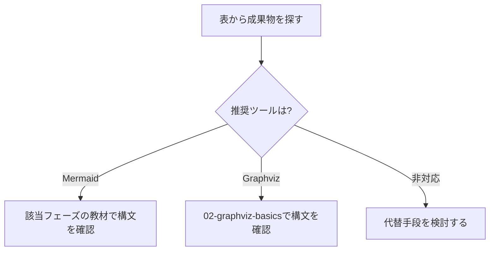

# 06カテゴリ 全体マッピング表 反映 Implementation Plan

> **For agentic workers:** REQUIRED SUB-SKILL: Use superpowers:subagent-driven-development (recommended) or superpowers:executing-plans to implement this plan task-by-task. Steps use checkbox (`- [ ]`) syntax for tracking.

**Goal:** `docs/06-project-phase-diagrams/00-README.md` にしかない「フェーズ×成果物×図 全体マッピング表」を、電子書籍ビルドに含まれる新規教材ファイルへ移し、カテゴリ内の全参照を更新する。

**Architecture:** 新規ファイル `01-diagram-catalog-overview.md` を作成して表を移設し、既存の `01-requirements-phase.md`〜`06-agile-artifacts.md` を `02-`〜`07-` へ繰り下げる。`00-README.md` は他カテゴリと同じ「学習目標＋教材一覧」の体裁に整え、表本体は持たない。

**Tech Stack:** Markdown、`git mv`、`grep`（検証用）、既存の ebook-build パイプライン（`npm run ebook:step1`）

## Global Constraints

- ファイル構成規約: カテゴリ先頭は必ず `00-README.md`、個別教材は連番（`00_STYLE_GUIDE.md` 1節）
- 個別教材の見出し順: この教材で身につくこと → 概要 → 位置づけ → 基本文法・プロパティ解説 → 実ソースコード → 演習課題 → 理解度チェック（`00_STYLE_GUIDE.md` 2節）
- 1文60文字以内を目安にする（`00_STYLE_GUIDE.md` 3節）
- コードブロックは言語指定必須。Mermaidの実ソースコードは ` ```text ` 複製 → ` ```mermaid ` の順（`00_STYLE_GUIDE.md` 6節）
- 各ファイル末尾に前後リンクを置く（`00_STYLE_GUIDE.md` 5節）
- 電子書籍ビルドは `chapterFilePattern: "^(?!00-README\\.md$).+\\.md$"` により `00-README.md` のみを除外する（新規ファイルは自動的にビルド対象になる）

---

### Task 1: 新規教材ファイル `01-diagram-catalog-overview.md` を作成する

**Files:**
- Create: `diagram-as-code-tutorial/docs/06-project-phase-diagrams/01-diagram-catalog-overview.md`

**Interfaces:**
- Produces: `01-diagram-catalog-overview.md`（以降のTaskがリンク先として参照するファイル名・見出し「開発フェーズ×図カタログ 全体マッピング」）

- [ ] **Step 1: ファイルが存在しないことを確認する**

Run: `ls diagram-as-code-tutorial/docs/06-project-phase-diagrams/01-diagram-catalog-overview.md`
Expected: `No such file or directory`

- [ ] **Step 2: 次の内容でファイルを作成する**

```markdown
# 開発フェーズ×図カタログ 全体マッピング

## この教材で身につくこと

- 開発フェーズごとの成果物と、対応するMermaid/Graphvizの図の種類を一覧できる
- 表から自分の担当フェーズに必要な図の種類をすぐに引ける
- Mermaid/Graphvizで表現できない成果物とその代替手段を把握する

## 概要

このカテゴリ全体で扱う20種類の成果物と、対応する推奨ツール・図の種類を
一覧できるマッピング表を提供します。02〜07の各教材は、この表の該当行を
深掘りする構成になっています。

## 位置づけ

既存の「03. 図の選び方と整理法」が「伝えたいこと」起点のマッピングであるのに
対し、本カテゴリは「開発フェーズ」起点のマッピングです。本教材はその全体像を
示す索引であり、個々の成果物の実例・実ソースコードは02〜07の各教材で扱います。

## 基本文法・プロパティ解説

### フェーズ×成果物×図 全体マッピング表

| フェーズ | 主な成果物 | 推奨ツール | 図の種類 | 備考 |
|---|---|---|---|---|
| 要件定義 | 業務フロー図 | Mermaid | flowchart | スイムレーンは`subgraph`で代用 |
| 要件定義 | 概念データモデル | Mermaid | erDiagram | 詳細化は基本設計のER図で行う |
| 要件定義 | 要件トレーサビリティ | Mermaid | requirementDiagram | [01-mermaid-basics/04](../01-mermaid-basics/04-other-diagrams.md)参照 |
| 要件定義 | ユースケース図 | ─ | 非対応 | 専用記法なし。flowchartでの代替表現を示す |
| 基本設計 | システム構成図 | Mermaid/Graphviz | flowchart / DOT | 外部連携が多い場合はGraphviz推奨 |
| 基本設計 | 画面遷移図 | Mermaid | stateDiagram | 画面を状態として表現 |
| 基本設計 | ER図（論理） | Mermaid | erDiagram | |
| 基本設計 | シーケンス概要図 | Mermaid | sequenceDiagram | |
| 詳細設計 | クラス図 | Mermaid | classDiagram | |
| 詳細設計 | ステートマシン図 | Mermaid | stateDiagram | 複合状態を扱う |
| 詳細設計 | 詳細シーケンス図 | Mermaid | sequenceDiagram | alt/loopを扱う |
| 詳細設計 | DFD（データフロー図） | Graphviz | DOT | Mermaid非対応のため代替 |
| 実装・テスト | モジュール依存図 | Graphviz | DOT | 複雑化時は[03-03](../03-diagram-patterns/03-complex-diagram-organization.md)の整理法を参照 |
| 実装・テスト | テストケース分岐図 | Mermaid | flowchart | デシジョンテーブルの可視化 |
| 実装・テスト | テストスケジュール | Mermaid | gantt | |
| リリース・運用 | デプロイフロー図 | Mermaid | flowchart | |
| リリース・運用 | インフラ構成図 | Graphviz | DOT | ネットワーク階層表現 |
| リリース・運用 | 障害対応フロー | Mermaid | flowchart | |
| アジャイル | スプリント計画 | Mermaid | gantt | |
| アジャイル | バーンダウンチャート | ─ | 非対応 | 他ツール（表計算/BIツール等）併用を明記 |

「非対応」の項目は隠さず明記しています。Mermaid/Graphvizの限界を理解した上で、
必要に応じて他ツールと併用してください。

## 実ソースコード

表の読み方を示す例です。成果物から推奨ツールへとたどる判断フローです。

**ソースコード:**

```text
flowchart TD
    A[表から成果物を探す] --> B{推奨ツールは?}
    B -->|Mermaid| C[該当フェーズの教材で構文を確認]
    B -->|Graphviz| D[02-graphviz-basicsで構文を確認]
    B -->|非対応| E[代替手段を検討する]
```



**コードのポイント:**

- `B{推奨ツールは?}` のひし形ノードが表の「推奨ツール」列に対応する分岐
- 「Mermaid/Graphviz」のように2つ並ぶ行は、規模に応じて選択することを示す
- 「非対応」の行は隠さず、代替手段を検討する分岐として明示する

## 演習課題

1. 表から自分が過去に作成したことのある成果物を1つ選び、対応する図の種類と
   その理由を書け
2. 「非対応」の項目を1つ選び、代替手段（他ツール名）を調べて書け

## 理解度チェック

- [ ] 表の「フェーズ」「成果物」「推奨ツール」「図の種類」「備考」列の意味を説明できる
- [ ] 「非対応」の項目がなぜMermaid/Graphvizで表現できないか説明できる
- [ ] 自分の担当フェーズでどの成果物にどの図を使うか、表からすぐに引ける

---

[← 06. プロジェクト開発フェーズと図 目次](00-README.md) | [次へ: 要件定義フェーズ →](02-requirements-phase.md)
```

- [ ] **Step 3: ファイルが作成されたことを確認する**

Run: `ls diagram-as-code-tutorial/docs/06-project-phase-diagrams/01-diagram-catalog-overview.md`
Expected: ファイルパスが出力される

- [ ] **Step 4: コミット**

```bash
cd diagram-as-code-tutorial
git add docs/06-project-phase-diagrams/01-diagram-catalog-overview.md
git commit -m "06カテゴリに全体マッピング表の教材ファイルを追加"
```

---

### Task 2: `00-README.md` を他カテゴリと同じ体裁に整える

**Files:**
- Modify: `diagram-as-code-tutorial/docs/06-project-phase-diagrams/00-README.md`

**Interfaces:**
- Consumes: Task 1で作成した `01-diagram-catalog-overview.md`

- [ ] **Step 1: 現在のファイル内容を読む**

Run: `cat diagram-as-code-tutorial/docs/06-project-phase-diagrams/00-README.md`

- [ ] **Step 2: ファイル全体を次の内容に置き換える**

```markdown
# 06. プロジェクト開発フェーズと図

このカテゴリでは、プロジェクト開発の各フェーズでよく作られる成果物を洗い出し、
それぞれをMermaidまたはGraphvizでどう表現するかを学びます。
既存の「03. 図の選び方と整理法」が「伝えたいこと」起点のマッピングであるのに対し、
このカテゴリは「開発フェーズ」起点のマッピングです。

## 学習目標

- 開発フェーズごとに、どんな成果物が作られるかを説明できる
- 各成果物をMermaid/Graphvizのどの図で表現するか選べる
- Mermaid/Graphvizで表現できない成果物を把握し、代替手段を判断できる

## 教材一覧

| # | 教材 | 内容 |
|---|------|------|
| 01 | [開発フェーズ×図カタログ 全体マッピング](01-diagram-catalog-overview.md) | フェーズ×成果物×図の全体マッピング表 |
| 02 | [要件定義フェーズ](02-requirements-phase.md) | 業務フロー図・概念データモデル・要件トレーサビリティ |
| 03 | [基本設計フェーズ](03-basic-design-phase.md) | システム構成図・画面遷移図・ER図・シーケンス概要図 |
| 04 | [詳細設計フェーズ](04-detailed-design-phase.md) | クラス図・ステートマシン図・詳細シーケンス図・DFD |
| 05 | [実装・テストフェーズ](05-implementation-testing-phase.md) | モジュール依存図・テストケース分岐図・テストスケジュール |
| 06 | [リリース・運用保守フェーズ](06-release-operations-phase.md) | デプロイフロー図・インフラ構成図・障害対応フロー |
| 07 | [アジャイル開発での当てはめ](07-agile-artifacts.md) | スプリント計画・開発サイクル図・カタログのアジャイルへの対応付け |

成果物×推奨ツールの全体マッピング表は
[01-diagram-catalog-overview.md](01-diagram-catalog-overview.md)を参照してください。

## 学習の進め方

01 → 07 の順に進めることを推奨します。
01で全体マッピング表を確認したあと、02〜06でウォーターフォール型の
開発フェーズを通して図の使い分けを学び、07でアジャイル開発への
当てはめ方を確認してください。
```

- [ ] **Step 3: 差分を確認する**

Run: `cd diagram-as-code-tutorial && git diff docs/06-project-phase-diagrams/00-README.md`
Expected: 全体マッピング表（20行のテーブル）が削除され、教材一覧が7行になっていること

- [ ] **Step 4: コミット**

```bash
git add docs/06-project-phase-diagrams/00-README.md
git commit -m "00-README.mdから全体マッピング表を除き他カテゴリと体裁を統一"
```

---

### Task 3: `06-agile-artifacts.md` を `07-agile-artifacts.md` へ改名し参照を更新する

**Files:**
- Rename: `06-agile-artifacts.md` → `07-agile-artifacts.md`

- [ ] **Step 1: `git mv` で改名する**

```bash
cd diagram-as-code-tutorial
git mv docs/06-project-phase-diagrams/06-agile-artifacts.md docs/06-project-phase-diagrams/07-agile-artifacts.md
```

- [ ] **Step 2: 「この教材で身につくこと」内の連番表記を更新する**

old_string:
```
- 01〜05で学んだ図のカタログを、アジャイルの反復サイクルに当てはめられる
```
new_string:
```
- 02〜06で学んだ図のカタログを、アジャイルの反復サイクルに当てはめられる
```

- [ ] **Step 3: 「概要」内の連番表記を更新する**

old_string:
```
短いサイクル（スプリント）を繰り返します。01〜05で扱った成果物の多くは
```
new_string:
```
短いサイクル（スプリント）を繰り返します。02〜06で扱った成果物の多くは
```

- [ ] **Step 4: 「位置づけ」を新しいリンク先・連番に更新する**

old_string:
```
[00-README.md](00-README.md)の全体マッピング表のうち「アジャイル」行を
深掘りする教材です。01〜05（ウォーターフォール型フェーズ）の内容を
前提とします。
```
new_string:
```
[01-diagram-catalog-overview.md](01-diagram-catalog-overview.md)の全体マッピング表のうち「アジャイル」行を
深掘りする教材です。02〜06（ウォーターフォール型フェーズ）の内容を
前提とします。
```

- [ ] **Step 5: 「成果物別の対応表」の見出しと表内リンクを更新する**

old_string:
```
### 01〜05カタログのアジャイルへの対応付け

| ウォーターフォールでの成果物 | アジャイルでの当てはめタイミング |
|---|---|
| [業務フロー図](01-requirements-phase.md) | プロダクトバックログ作成時に、対象業務の理解のため作成 |
| [システム構成図](02-basic-design-phase.md) | 最初のスプリント計画前に、全体アーキテクチャの合意として作成 |
| [クラス図・詳細シーケンス図](03-detailed-design-phase.md) | 各スプリント内で、対象機能の実装直前に必要な範囲だけ作成 |
| [テストケース分岐図](04-implementation-testing-phase.md) | 各スプリントのテストタスクで、対象機能分だけ作成 |
| [デプロイフロー図・インフラ構成図](05-release-operations-phase.md) | 継続的デリバリー環境の構築時に作成し、以降のスプリントで再利用 |
```
new_string:
```
### 02〜06カタログのアジャイルへの対応付け

| ウォーターフォールでの成果物 | アジャイルでの当てはめタイミング |
|---|---|
| [業務フロー図](02-requirements-phase.md) | プロダクトバックログ作成時に、対象業務の理解のため作成 |
| [システム構成図](03-basic-design-phase.md) | 最初のスプリント計画前に、全体アーキテクチャの合意として作成 |
| [クラス図・詳細シーケンス図](04-detailed-design-phase.md) | 各スプリント内で、対象機能の実装直前に必要な範囲だけ作成 |
| [テストケース分岐図](05-implementation-testing-phase.md) | 各スプリントのテストタスクで、対象機能分だけ作成 |
| [デプロイフロー図・インフラ構成図](06-release-operations-phase.md) | 継続的デリバリー環境の構築時に作成し、以降のスプリントで再利用 |
```

- [ ] **Step 6: 「コードのポイント」内のリンクを更新する**

old_string:
```
- [実装・テストフェーズ](04-implementation-testing-phase.md)のganttと違い、
```
new_string:
```
- [実装・テストフェーズ](05-implementation-testing-phase.md)のganttと違い、
```

- [ ] **Step 7: 開発サイクル図「コードのポイント」内の連番表記を更新する**

old_string:
```
- 01〜05のフェーズ別成果物は、この`Sprint[スプリント実施]`の中で
```
new_string:
```
- 02〜06のフェーズ別成果物は、この`Sprint[スプリント実施]`の中で
```

- [ ] **Step 8: 「演習課題」内のリンクを更新する**

old_string:
```
2. [00-README.md](00-README.md)の全体マッピング表から成果物を3つ選び、
```
new_string:
```
2. [01-diagram-catalog-overview.md](01-diagram-catalog-overview.md)の全体マッピング表から成果物を3つ選び、
```

- [ ] **Step 9: 「理解度チェック」内の連番表記を更新する**

old_string:
```
- [ ] 01〜05のフェーズ別カタログがアジャイルのどのタイミングに対応するか説明できる
```
new_string:
```
- [ ] 02〜06のフェーズ別カタログがアジャイルのどのタイミングに対応するか説明できる
```

- [ ] **Step 10: 末尾の前後リンクを更新する**

old_string:
```
[← 前へ: リリース・運用保守フェーズ](05-release-operations-phase.md) | [06. プロジェクト開発フェーズと図 目次へ →](00-README.md)
```
new_string:
```
[← 前へ: リリース・運用保守フェーズ](06-release-operations-phase.md) | [06. プロジェクト開発フェーズと図 目次へ →](00-README.md)
```

- [ ] **Step 11: 古いファイル名への参照が残っていないことを確認する**

Run: `cd diagram-as-code-tutorial && grep -nE '01-requirements-phase\.md|02-basic-design-phase\.md|03-detailed-design-phase\.md|04-implementation-testing-phase\.md|05-release-operations-phase\.md|00-README\.md\)の全体マッピング表' docs/06-project-phase-diagrams/07-agile-artifacts.md`
Expected: 出力なし

- [ ] **Step 12: コミット**

```bash
git add docs/06-project-phase-diagrams/07-agile-artifacts.md
git commit -m "06-agile-artifacts.mdを07へ改名し全体マッピング表参照を更新"
```

---

### Task 4: `05-release-operations-phase.md` を `06-release-operations-phase.md` へ改名し参照を更新する

**Files:**
- Rename: `05-release-operations-phase.md` → `06-release-operations-phase.md`

- [ ] **Step 1: `git mv` で改名する**

```bash
cd diagram-as-code-tutorial
git mv docs/06-project-phase-diagrams/05-release-operations-phase.md docs/06-project-phase-diagrams/06-release-operations-phase.md
```

- [ ] **Step 2: 「位置づけ」を更新する**

old_string:
```
[00-README.md](00-README.md)の全体マッピング表のうち「リリース・運用」行を
深掘りする教材です。[基本設計フェーズ](02-basic-design-phase.md)の
システム構成図を、ここでは実際のサーバー冗長構成にまで具体化します。
```
new_string:
```
[01-diagram-catalog-overview.md](01-diagram-catalog-overview.md)の全体マッピング表のうち「リリース・運用」行を
深掘りする教材です。[基本設計フェーズ](03-basic-design-phase.md)の
システム構成図を、ここでは実際のサーバー冗長構成にまで具体化します。
```

- [ ] **Step 3: 末尾の前後リンクを更新する**

old_string:
```
[← 前へ: 実装・テストフェーズ](04-implementation-testing-phase.md) | [次へ: アジャイル開発での当てはめ →](06-agile-artifacts.md)
```
new_string:
```
[← 前へ: 実装・テストフェーズ](05-implementation-testing-phase.md) | [次へ: アジャイル開発での当てはめ →](07-agile-artifacts.md)
```

- [ ] **Step 4: 古い参照が残っていないことを確認する**

Run: `cd diagram-as-code-tutorial && grep -nE '00-README\.md|02-basic-design-phase\.md|04-implementation-testing-phase\.md|06-agile-artifacts\.md' docs/06-project-phase-diagrams/06-release-operations-phase.md`
Expected: 出力なし

- [ ] **Step 5: コミット**

```bash
git add docs/06-project-phase-diagrams/06-release-operations-phase.md
git commit -m "05-release-operations-phase.mdを06へ改名し参照を更新"
```

---

### Task 5: `04-implementation-testing-phase.md` を `05-implementation-testing-phase.md` へ改名し参照を更新する

**Files:**
- Rename: `04-implementation-testing-phase.md` → `05-implementation-testing-phase.md`

- [ ] **Step 1: `git mv` で改名する**

```bash
cd diagram-as-code-tutorial
git mv docs/06-project-phase-diagrams/04-implementation-testing-phase.md docs/06-project-phase-diagrams/05-implementation-testing-phase.md
```

- [ ] **Step 2: 「位置づけ」を更新する**

old_string:
```
[00-README.md](00-README.md)の全体マッピング表のうち「実装・テスト」行を
深掘りする教材です。[詳細設計フェーズ](03-detailed-design-phase.md)の
クラス図をもとに、実際のモジュール構成へ落とし込みます。
```
new_string:
```
[01-diagram-catalog-overview.md](01-diagram-catalog-overview.md)の全体マッピング表のうち「実装・テスト」行を
深掘りする教材です。[詳細設計フェーズ](04-detailed-design-phase.md)の
クラス図をもとに、実際のモジュール構成へ落とし込みます。
```

- [ ] **Step 3: 「演習課題」内のリンクを更新する**

old_string:
```
1. [詳細設計フェーズ](03-detailed-design-phase.md)のクラス図（Order/OrderItem/Customer）
```
new_string:
```
1. [詳細設計フェーズ](04-detailed-design-phase.md)のクラス図（Order/OrderItem/Customer）
```

- [ ] **Step 4: 末尾の前後リンクを更新する**

old_string:
```
[← 前へ: 詳細設計フェーズ](03-detailed-design-phase.md) | [次へ: リリース・運用保守フェーズ →](05-release-operations-phase.md)
```
new_string:
```
[← 前へ: 詳細設計フェーズ](04-detailed-design-phase.md) | [次へ: リリース・運用保守フェーズ →](06-release-operations-phase.md)
```

- [ ] **Step 5: 古い参照が残っていないことを確認する**

Run: `cd diagram-as-code-tutorial && grep -nE '00-README\.md|03-detailed-design-phase\.md|05-release-operations-phase\.md' docs/06-project-phase-diagrams/05-implementation-testing-phase.md`
Expected: 出力なし

- [ ] **Step 6: コミット**

```bash
git add docs/06-project-phase-diagrams/05-implementation-testing-phase.md
git commit -m "04-implementation-testing-phase.mdを05へ改名し参照を更新"
```

---

### Task 6: `03-detailed-design-phase.md` を `04-detailed-design-phase.md` へ改名し参照を更新する

**Files:**
- Rename: `03-detailed-design-phase.md` → `04-detailed-design-phase.md`

- [ ] **Step 1: `git mv` で改名する**

```bash
cd diagram-as-code-tutorial
git mv docs/06-project-phase-diagrams/03-detailed-design-phase.md docs/06-project-phase-diagrams/04-detailed-design-phase.md
```

- [ ] **Step 2: 「位置づけ」を更新する**

old_string:
```
[00-README.md](00-README.md)の全体マッピング表のうち「詳細設計」行を
深掘りする教材です。[基本設計フェーズ](02-basic-design-phase.md)の
シーケンス概要図・画面遷移図を、ここではより詳細な条件分岐・複合状態を
含む形に発展させます。
```
new_string:
```
[01-diagram-catalog-overview.md](01-diagram-catalog-overview.md)の全体マッピング表のうち「詳細設計」行を
深掘りする教材です。[基本設計フェーズ](03-basic-design-phase.md)の
シーケンス概要図・画面遷移図を、ここではより詳細な条件分岐・複合状態を
含む形に発展させます。
```

- [ ] **Step 3: 「基本文法・プロパティ解説」内のリンクを更新する**

old_string:
```
- [基本設計フェーズ](02-basic-design-phase.md)のER図（CUSTOMER/ORDER/ORDER_ITEM）と
```
new_string:
```
- [基本設計フェーズ](03-basic-design-phase.md)のER図（CUSTOMER/ORDER/ORDER_ITEM）と
```

- [ ] **Step 4: 「演習課題」内のリンクを更新する**

old_string:
```
1. [基本設計フェーズ](02-basic-design-phase.md)のER図に対応するクラス図を、
```
new_string:
```
1. [基本設計フェーズ](03-basic-design-phase.md)のER図に対応するクラス図を、
```

- [ ] **Step 5: 末尾の前後リンクを更新する**

old_string:
```
[← 前へ: 基本設計フェーズ](02-basic-design-phase.md) | [次へ: 実装・テストフェーズ →](04-implementation-testing-phase.md)
```
new_string:
```
[← 前へ: 基本設計フェーズ](03-basic-design-phase.md) | [次へ: 実装・テストフェーズ →](05-implementation-testing-phase.md)
```

- [ ] **Step 6: 古い参照が残っていないことを確認する**

Run: `cd diagram-as-code-tutorial && grep -nE '00-README\.md|02-basic-design-phase\.md|04-implementation-testing-phase\.md' docs/06-project-phase-diagrams/04-detailed-design-phase.md`
Expected: 出力なし

- [ ] **Step 7: コミット**

```bash
git add docs/06-project-phase-diagrams/04-detailed-design-phase.md
git commit -m "03-detailed-design-phase.mdを04へ改名し参照を更新"
```

---

### Task 7: `02-basic-design-phase.md` を `03-basic-design-phase.md` へ改名し参照を更新する

**Files:**
- Rename: `02-basic-design-phase.md` → `03-basic-design-phase.md`

- [ ] **Step 1: `git mv` で改名する**

```bash
cd diagram-as-code-tutorial
git mv docs/06-project-phase-diagrams/02-basic-design-phase.md docs/06-project-phase-diagrams/03-basic-design-phase.md
```

- [ ] **Step 2: 「位置づけ」を更新する**

old_string:
```
[00-README.md](00-README.md)の全体マッピング表のうち「基本設計」行を
深掘りする教材です。要件定義フェーズ（[01](01-requirements-phase.md)）の
概念データモデルを、ここでは属性付きの論理ER図へと詳細化します。
```
new_string:
```
[01-diagram-catalog-overview.md](01-diagram-catalog-overview.md)の全体マッピング表のうち「基本設計」行を
深掘りする教材です。要件定義フェーズ（[02](02-requirements-phase.md)）の
概念データモデルを、ここでは属性付きの論理ER図へと詳細化します。
```

- [ ] **Step 3: 「基本文法・プロパティ解説」内のリンクを更新する**

old_string:
```
- [要件定義フェーズ](01-requirements-phase.md)の概念モデルに属性を追加して詳細化している
```
new_string:
```
- [要件定義フェーズ](02-requirements-phase.md)の概念モデルに属性を追加して詳細化している
```

- [ ] **Step 4: 末尾の前後リンクを更新する**

old_string:
```
[← 前へ: 要件定義フェーズ](01-requirements-phase.md) | [次へ: 詳細設計フェーズ →](03-detailed-design-phase.md)
```
new_string:
```
[← 前へ: 要件定義フェーズ](02-requirements-phase.md) | [次へ: 詳細設計フェーズ →](04-detailed-design-phase.md)
```

- [ ] **Step 5: 古い参照が残っていないことを確認する**

Run: `cd diagram-as-code-tutorial && grep -nE '00-README\.md|01-requirements-phase\.md|03-detailed-design-phase\.md' docs/06-project-phase-diagrams/03-basic-design-phase.md`
Expected: 出力なし

- [ ] **Step 6: コミット**

```bash
git add docs/06-project-phase-diagrams/03-basic-design-phase.md
git commit -m "02-basic-design-phase.mdを03へ改名し参照を更新"
```

---

### Task 8: `01-requirements-phase.md` を `02-requirements-phase.md` へ改名し参照を更新する

**Files:**
- Rename: `01-requirements-phase.md` → `02-requirements-phase.md`

- [ ] **Step 1: `git mv` で改名する**

```bash
cd diagram-as-code-tutorial
git mv docs/06-project-phase-diagrams/01-requirements-phase.md docs/06-project-phase-diagrams/02-requirements-phase.md
```

- [ ] **Step 2: 「位置づけ」を更新する**

old_string:
```
[00-README.md](00-README.md)の全体マッピング表のうち「要件定義」行を
深掘りする教材です。個々の図の詳細構文は
```
new_string:
```
[01-diagram-catalog-overview.md](01-diagram-catalog-overview.md)の全体マッピング表のうち「要件定義」行を
深掘りする教材です。個々の図の詳細構文は
```

- [ ] **Step 3: 末尾の前後リンクを更新する**

old_string:
```
[← 06. プロジェクト開発フェーズと図 目次](00-README.md) | [次へ: 基本設計フェーズ →](02-basic-design-phase.md)
```
new_string:
```
[← 前へ: 開発フェーズ×図カタログ 全体マッピング](01-diagram-catalog-overview.md) | [次へ: 基本設計フェーズ →](03-basic-design-phase.md)
```

- [ ] **Step 4: 古い参照が残っていないことを確認する**

Run: `cd diagram-as-code-tutorial && grep -nE '00-README\.md|02-basic-design-phase\.md' docs/06-project-phase-diagrams/02-requirements-phase.md`
Expected: 出力なし

- [ ] **Step 5: コミット**

```bash
git add docs/06-project-phase-diagrams/02-requirements-phase.md
git commit -m "01-requirements-phase.mdを02へ改名し参照を更新"
```

---

### Task 9: `MASTER-INDEX.md` と `CHANGELOG.md` を更新する

**Files:**
- Modify: `diagram-as-code-tutorial/MASTER-INDEX.md`
- Modify: `diagram-as-code-tutorial/CHANGELOG.md`

- [ ] **Step 1: `MASTER-INDEX.md` の06カテゴリ節を更新する**

old_string:
```
## 06. プロジェクト開発フェーズと図
- [docs/06-project-phase-diagrams/00-README.md](docs/06-project-phase-diagrams/00-README.md)
- [docs/06-project-phase-diagrams/01-requirements-phase.md](docs/06-project-phase-diagrams/01-requirements-phase.md) - 要件定義フェーズ
- [docs/06-project-phase-diagrams/02-basic-design-phase.md](docs/06-project-phase-diagrams/02-basic-design-phase.md) - 基本設計フェーズ
- [docs/06-project-phase-diagrams/03-detailed-design-phase.md](docs/06-project-phase-diagrams/03-detailed-design-phase.md) - 詳細設計フェーズ
- [docs/06-project-phase-diagrams/04-implementation-testing-phase.md](docs/06-project-phase-diagrams/04-implementation-testing-phase.md) - 実装・テストフェーズ
- [docs/06-project-phase-diagrams/05-release-operations-phase.md](docs/06-project-phase-diagrams/05-release-operations-phase.md) - リリース・運用保守フェーズ
- [docs/06-project-phase-diagrams/06-agile-artifacts.md](docs/06-project-phase-diagrams/06-agile-artifacts.md) - アジャイル開発での当てはめ
```
new_string:
```
## 06. プロジェクト開発フェーズと図
- [docs/06-project-phase-diagrams/00-README.md](docs/06-project-phase-diagrams/00-README.md)
- [docs/06-project-phase-diagrams/01-diagram-catalog-overview.md](docs/06-project-phase-diagrams/01-diagram-catalog-overview.md) - フェーズ×成果物×図 全体マッピング
- [docs/06-project-phase-diagrams/02-requirements-phase.md](docs/06-project-phase-diagrams/02-requirements-phase.md) - 要件定義フェーズ
- [docs/06-project-phase-diagrams/03-basic-design-phase.md](docs/06-project-phase-diagrams/03-basic-design-phase.md) - 基本設計フェーズ
- [docs/06-project-phase-diagrams/04-detailed-design-phase.md](docs/06-project-phase-diagrams/04-detailed-design-phase.md) - 詳細設計フェーズ
- [docs/06-project-phase-diagrams/05-implementation-testing-phase.md](docs/06-project-phase-diagrams/05-implementation-testing-phase.md) - 実装・テストフェーズ
- [docs/06-project-phase-diagrams/06-release-operations-phase.md](docs/06-project-phase-diagrams/06-release-operations-phase.md) - リリース・運用保守フェーズ
- [docs/06-project-phase-diagrams/07-agile-artifacts.md](docs/06-project-phase-diagrams/07-agile-artifacts.md) - アジャイル開発での当てはめ
```

- [ ] **Step 2: `CHANGELOG.md` の `[Unreleased] > Changed` に追記する**

old_string:
```
### Changed

- 全教材の実ソースコードに「コードのポイント」箇条書き解説を追加
- Mermaidの実ソースコードに、電子書籍化しても消えない```text複製を追加
```
new_string:
```
### Changed

- 全教材の実ソースコードに「コードのポイント」箇条書き解説を追加
- Mermaidの実ソースコードに、電子書籍化しても消えない```text複製を追加
- 06-project-phase-diagramsの全体マッピング表を`00-README.md`から新規
  `01-diagram-catalog-overview.md`へ移設し、電子書籍に反映されるよう修正
  （既存教材は02〜07へ連番繰り下げ）
```

- [ ] **Step 3: 差分を確認する**

Run: `cd diagram-as-code-tutorial && git diff MASTER-INDEX.md CHANGELOG.md`
Expected: 上記の置き換えが反映されている

- [ ] **Step 4: コミット**

```bash
git add MASTER-INDEX.md CHANGELOG.md
git commit -m "MASTER-INDEXとCHANGELOGを06カテゴリの連番変更に合わせて更新"
```

---

### Task 10: 全体検証とビルド確認

**Files:**
- なし（検証のみ）

- [ ] **Step 1: カテゴリ内に古いファイル名への参照が残っていないことを確認する**

Run:
```bash
cd diagram-as-code-tutorial
grep -rnE '\]\(00-README\.md\)の全体マッピング表|\]\(01-requirements-phase\.md\)|\]\(02-basic-design-phase\.md\)|\]\(03-detailed-design-phase\.md\)|\]\(04-implementation-testing-phase\.md\)|\]\(05-release-operations-phase\.md\)|\]\(06-agile-artifacts\.md\)' docs/06-project-phase-diagrams/
```
Expected: 出力なし

- [ ] **Step 2: カテゴリのファイル一覧が01〜07＋00-README.mdの8ファイルであることを確認する**

Run: `ls diagram-as-code-tutorial/docs/06-project-phase-diagrams/`
Expected: `00-README.md 01-diagram-catalog-overview.md 02-requirements-phase.md 03-basic-design-phase.md 04-detailed-design-phase.md 05-implementation-testing-phase.md 06-release-operations-phase.md 07-agile-artifacts.md`

- [ ] **Step 3: 全教材ファイルに`00-README.md`以外でMermaidブロックがあることを確認する（既存の検証パターンを踏襲）**

Run: `cd diagram-as-code-tutorial && grep -rL '```mermaid' docs/06-project-phase-diagrams/*.md | grep -v '00-README.md'`
Expected: 出力なし（全教材ファイルにMermaidブロックがある）

- [ ] **Step 4: 電子書籍ビルドのstep1を実行し、マニフェストに全体マッピング表が含まれることを確認する**

Run: `cd diagram-as-code-tutorial && npm run ebook:step1`
Expected: ビルドが正常終了する

Run: `grep -c 'フェーズ×成果物×図 全体マッピング表' diagram-as-code-tutorial/ebook-output/diagram-as-code-tutorial.manuscript.md`
Expected: `1`以上（生成されたmanuscriptに表の見出しが含まれる）

- [ ] **Step 5: 前後リンクが01→07まで一直線につながることを目視で確認する**

Run:
```bash
cd diagram-as-code-tutorial
grep -h '^\[←' docs/06-project-phase-diagrams/01-diagram-catalog-overview.md docs/06-project-phase-diagrams/02-requirements-phase.md docs/06-project-phase-diagrams/03-basic-design-phase.md docs/06-project-phase-diagrams/04-detailed-design-phase.md docs/06-project-phase-diagrams/05-implementation-testing-phase.md docs/06-project-phase-diagrams/06-release-operations-phase.md docs/06-project-phase-diagrams/07-agile-artifacts.md
```
Expected: 7行が出力され、それぞれの「次へ」リンクが次のファイル名と一致する（目視確認）
