# プロジェクト開発フェーズ別 図カタログ Implementation Plan

> **For agentic workers:** REQUIRED SUB-SKILL: Use superpowers:subagent-driven-development (recommended) or superpowers:executing-plans to implement this plan task-by-task. Steps use checkbox (`- [ ]`) syntax for tracking.

**Goal:** `diagram-as-code-tutorial` に新規カテゴリ `docs/06-project-phase-diagrams/` を追加し、
プロジェクト開発フェーズ（要件定義〜運用保守、アジャイル）の成果物をMermaid/Graphvizで
どう表現するかを7ファイルでカタログ化する。

**Architecture:** 既存カテゴリ（01〜05）と同じファイル構成規約（`00-README.md` + 連番教材）に
従う。ウォーターフォール型の6フェーズ相当（要件定義・基本設計・詳細設計・実装/テスト・
リリース/運用・アジャイル）を1ファイルずつ、`00-README.md`に全体マッピング表を置く。

**Tech Stack:** Markdown, Mermaid（`mmdc` v11.14.0でのレンダリング検証）, Graphviz DOT
（`dot`コマンドでのPNGレンダリング）, Node.js（検証用一時スクリプト）

## Global Constraints

- 見出し順序は `00_STYLE_GUIDE.md` の「2. 見出しの標準順序」に厳密に従う: この教材で
  身につくこと → 概要 → 位置づけ → 基本文法・プロパティ解説 → 実ソースコード →
  演習課題 → 理解度チェック
- Mermaidの実ソースコードは必ず ```text 複製 → ```mermaid の順でセットにし、
  2つのブロックの中身は1文字単位で完全一致させる（電子書籍化でmermaidブロックが
  画像に置換されても```textが残るため）
- 実ソースコード（Mermaid/Graphviz）の直後には「**コードのポイント:**」で
  2〜4行（多くても6行）の箇条書き解説を置く
- Graphviz例は `examples/` 配下に `.dot` と対応する `.png`（`dot`コマンドで生成）を
  並べて置く。本文には`**ソースコード:**`ラベルは付けず、ファイルパスの行 → ```dot
  コードブロック → `` の順で書く（`docs/02-graphviz-basics/`
  の既存教材と同じ形式）
- コードブロックには必ず言語タグを付ける（`mermaid`, `text`, `dot`, `markdown`）
- 各ファイル末尾に前後リンクを置く。カテゴリ内の最初のファイルへの「戻る」リンクは
  `00-README.md`
- 1文は60文字以内を目安に短く保つ
- Mermaidのノード/状態/エンティティのIDは英数字（例: `CUSTOMER`, `OrderService`）とし、
  日本語は`label`やブラケット内の表示テキスト（例: `CUSTOMER[顧客]`）として書く
  （既存教材`docs/01-mermaid-basics/`全体の慣習）
- Graphvizのノードも同様にIDは英数字、日本語は`label="..."`属性で指定する
  （既存教材`docs/02-graphviz-basics/`の慣習）
- Graphvizの`dot`コマンドはこの環境では `C:\Program Files\Graphviz\bin` にインストール
  済みで、ユーザーPATHに追加済み。新しいシェルセッションでは`dot`とだけ打てば実行できる
  はずだが、反映されていない場合は
  `export PATH="$PATH:/c/Program Files/Graphviz/bin"`（Bash）または
  `$env:Path += ';C:\Program Files\Graphviz\bin'`（PowerShell）を先に実行する

---

## Task 1: 検証用一時スクリプトの作成とカテゴリ目次(00-README.md)の追加

**Files:**
- Create: `diagram-as-code-tutorial/.tmp-verify-mermaid.js`（一時ファイル、コミットしない）
- Create: `diagram-as-code-tutorial/docs/06-project-phase-diagrams/00-README.md`

**Interfaces:**
- Consumes: `docs/superpowers/specs/2026-07-11-project-phase-diagrams-design.md` の
  「3. 全体マッピング表」
- Produces: `docs/06-project-phase-diagrams/00-README.md`（Task 2〜7が前後リンクで参照する
  カテゴリ入口ファイル）、`.tmp-verify-mermaid.js`（Task 2〜7が実ソースコード検証に使う
  一時ツール）

- [ ] **Step 1: 検証用一時スクリプトを作成する**

`diagram-as-code-tutorial/.tmp-verify-mermaid.js` を次の内容で作成する。
このスクリプトは指定したMarkdownファイル内の ```text/```mermaid ペアを検出し、
(1) 2つのブロックの内容が完全一致すること、(2) `mmdc`でエラーなくレンダリングできること
を確認する。

```javascript
// .tmp-verify-mermaid.js
// 一時検証スクリプト。リポジトリにコミットしない。
// 使い方: node .tmp-verify-mermaid.js <markdownファイルパス>
const fs = require('fs');
const path = require('path');
const { execFileSync } = require('child_process');

const target = process.argv[2];
if (!target) {
  console.error('使い方: node .tmp-verify-mermaid.js <markdownファイルパス>');
  process.exit(1);
}

const content = fs.readFileSync(target, 'utf8');
const fenceRe = /```(text|mermaid)\n([\s\S]*?)```/g;
const blocks = [];
let match;
while ((match = fenceRe.exec(content)) !== null) {
  blocks.push({ lang: match[1], body: match[2] });
}

let pairIndex = 0;
let ok = true;

for (let i = 0; i < blocks.length; i++) {
  if (blocks[i].lang === 'text' && blocks[i + 1] && blocks[i + 1].lang === 'mermaid') {
    pairIndex++;
    const textBody = blocks[i].body;
    const mermaidBody = blocks[i + 1].body;

    if (textBody !== mermaidBody) {
      console.error(`[NG] ペア${pairIndex}: text/mermaidの内容が一致しません`);
      ok = false;
      continue;
    }

    const tmpFile = path.join(__dirname, `.tmp-block-${pairIndex}.mmd`);
    const tmpSvg = tmpFile + '.svg';
    fs.writeFileSync(tmpFile, mermaidBody);
    try {
      execFileSync('npx', ['mmdc', '-i', tmpFile, '-o', tmpSvg], { stdio: 'pipe' });
      console.log(`[OK] ペア${pairIndex}: レンダリング成功`);
    } catch (err) {
      console.error(`[NG] ペア${pairIndex}: レンダリング失敗`);
      console.error(err.message);
      ok = false;
    } finally {
      fs.rmSync(tmpFile, { force: true });
      fs.rmSync(tmpSvg, { force: true });
    }
  }
}

console.log(`\n検証したペア数: ${pairIndex}`);
if (pairIndex === 0) {
  console.error('text/mermaidペアが1つも見つかりませんでした');
  process.exit(1);
}
if (!ok) {
  process.exit(1);
}
```

- [ ] **Step 2: スクリプトの動作を既存ファイルで確認する**

Run: `cd diagram-as-code-tutorial && node .tmp-verify-mermaid.js docs/01-mermaid-basics/01-flowchart.md`

Expected: `検証したペア数: 2` が出力され、2件とも `[OK]`、終了コード0。

- [ ] **Step 3: カテゴリディレクトリと`00-README.md`を作成する**

`diagram-as-code-tutorial/docs/06-project-phase-diagrams/00-README.md` を次の内容で作成する。

```markdown
# 06. プロジェクト開発フェーズと図

このカテゴリでは、プロジェクト開発の各フェーズでよく作られる成果物を洗い出し、
それぞれをMermaidまたはGraphvizでどう表現するかを学びます。
既存の「03. 図の選び方と整理法」が「伝えたいこと」起点のマッピングであるのに対し、
このカテゴリは「開発フェーズ」起点のマッピングです。

## 学習目標

- 開発フェーズごとに、どんな成果物が作られるかを説明できる
- 各成果物をMermaid/Graphvizのどの図で表現するか選べる
- Mermaid/Graphvizで表現できない成果物を把握し、代替手段を判断できる

## 教材一覧

| # | 教材 | 内容 |
|---|------|------|
| 01 | [要件定義フェーズ](01-requirements-phase.md) | 業務フロー図・概念データモデル・要件トレーサビリティ |
| 02 | [基本設計フェーズ](02-basic-design-phase.md) | システム構成図・画面遷移図・ER図・シーケンス概要図 |
| 03 | [詳細設計フェーズ](03-detailed-design-phase.md) | クラス図・ステートマシン図・詳細シーケンス図・DFD |
| 04 | [実装・テストフェーズ](04-implementation-testing-phase.md) | モジュール依存図・テストケース分岐図・テストスケジュール |
| 05 | [リリース・運用保守フェーズ](05-release-operations-phase.md) | デプロイフロー図・インフラ構成図・障害対応フロー |
| 06 | [アジャイル開発での当てはめ](06-agile-artifacts.md) | スプリント計画・開発サイクル図・カタログのアジャイルへの対応付け |

## フェーズ×成果物×図 全体マッピング表

| フェーズ | 主な成果物 | 推奨ツール | 図の種類 | 備考 |
|---|---|---|---|---|
| 要件定義 | 業務フロー図 | Mermaid | flowchart | スイムレーンは`subgraph`で代用 |
| 要件定義 | 概念データモデル | Mermaid | erDiagram | 詳細化は基本設計のER図で行う |
| 要件定義 | 要件トレーサビリティ | Mermaid | requirementDiagram | [01-mermaid-basics/04](../01-mermaid-basics/04-other-diagrams.md)参照 |
| 要件定義 | ユースケース図 | ─ | 非対応 | 専用記法なし。flowchartでの代替表現を示す |
| 基本設計 | システム構成図 | Mermaid/Graphviz | flowchart / DOT | 外部連携が多い場合はGraphviz推奨 |
| 基本設計 | 画面遷移図 | Mermaid | stateDiagram | 画面を状態として表現 |
| 基本設計 | ER図（論理） | Mermaid | erDiagram | |
| 基本設計 | シーケンス概要図 | Mermaid | sequenceDiagram | |
| 詳細設計 | クラス図 | Mermaid | classDiagram | |
| 詳細設計 | ステートマシン図 | Mermaid | stateDiagram | 複合状態を扱う |
| 詳細設計 | 詳細シーケンス図 | Mermaid | sequenceDiagram | alt/loopを扱う |
| 詳細設計 | DFD（データフロー図） | Graphviz | DOT | Mermaid非対応のため代替 |
| 実装・テスト | モジュール依存図 | Graphviz | DOT | 複雑化時は[03-03](../03-diagram-patterns/03-complex-diagram-organization.md)の整理法を参照 |
| 実装・テスト | テストケース分岐図 | Mermaid | flowchart | デシジョンテーブルの可視化 |
| 実装・テスト | テストスケジュール | Mermaid | gantt | |
| リリース・運用 | デプロイフロー図 | Mermaid | flowchart | |
| リリース・運用 | インフラ構成図 | Graphviz | DOT | ネットワーク階層表現 |
| リリース・運用 | 障害対応フロー | Mermaid | flowchart | |
| アジャイル | スプリント計画 | Mermaid | gantt | |
| アジャイル | バーンダウンチャート | ─ | 非対応 | 他ツール（表計算/BIツール等）併用を明記 |

「非対応」の項目は隠さず明記しています。Mermaid/Graphvizの限界を理解した上で、
必要に応じて他ツールと併用してください。

## 学習の進め方

01 → 06 の順に進めることを推奨します。
ウォーターフォール型の開発フェーズ（01〜05）を通して図の使い分けを学んだあと、
06でアジャイル開発への当てはめ方を確認してください。
```

- [ ] **Step 4: リンク切れがないか確認する**

Run: `cd diagram-as-code-tutorial && grep -o '\[.*\](\.\./[^)]*)' docs/06-project-phase-diagrams/00-README.md`

Expected: `../01-mermaid-basics/04-other-diagrams.md` と
`../03-diagram-patterns/03-complex-diagram-organization.md` が出力される。
両方とも `ls docs/01-mermaid-basics/04-other-diagrams.md docs/03-diagram-patterns/03-complex-diagram-organization.md`
で実在確認する。

- [ ] **Step 5: コミット**

```bash
cd diagram-as-code-tutorial
git add docs/06-project-phase-diagrams/00-README.md
git commit -m "$(cat <<'EOF'
06-project-phase-diagramsカテゴリの目次を追加

プロジェクト開発フェーズ別の図カタログ新規カテゴリの入口ファイルとして、
フェーズ×成果物×図の全体マッピング表を追加した。

Co-Authored-By: Claude Sonnet 5 <noreply@anthropic.com>
EOF
)"
```

`.tmp-verify-mermaid.js` はステージしないこと（`git status`で untracked のままで
あることを確認する）。

---

## Task 2: 01-requirements-phase.md（要件定義フェーズ）の作成

**Files:**
- Create: `diagram-as-code-tutorial/docs/06-project-phase-diagrams/01-requirements-phase.md`

**Interfaces:**
- Consumes: Task 1で作成した`00-README.md`（前後リンクの参照先）、
  `.tmp-verify-mermaid.js`（検証に使用）
- Produces: `01-requirements-phase.md`（Task 3が「前へ」リンクで参照）

- [ ] **Step 1: ファイルを作成する**

`diagram-as-code-tutorial/docs/06-project-phase-diagrams/01-requirements-phase.md`
を次の内容で作成する。

```markdown
# 要件定義フェーズ

## この教材で身につくこと

- 要件定義フェーズの主な成果物を把握する
- 業務フロー図・概念データモデル・要件トレーサビリティをMermaidで書ける
- ユースケース図（Mermaid非対応）の代替表現を選べる

## 概要

要件定義フェーズでは、業務の流れやデータの概念構造、要件そのものを
整理した成果物が作られます。ここでは代表的な4つの成果物を扱います。

## 位置づけ

[00-README.md](00-README.md)の全体マッピング表のうち「要件定義」行を
深掘りする教材です。個々の図の詳細構文は
[01-mermaid-basics](../01-mermaid-basics/00-README.md)を参照してください。

## 基本文法・プロパティ解説

### 成果物別の対応表

| 成果物 | 図の種類 | 適する理由 |
|---|---|---|
| 業務フロー図 | flowchart | 担当者ごとの処理順序・分岐を可視化できる |
| 概念データモデル | erDiagram | エンティティ間の関連を早期に整理できる |
| 要件トレーサビリティ | requirementDiagram | 要件と満足関係を追跡できる |
| ユースケース図 | 非対応（flowchartで代替） | 専用記法はないが、アクターと機能をノードで表現できる |

## 実ソースコード

業務フロー図の例です。`subgraph`で担当者ごとの処理をグルーピングし、
スイムレーンのように表現します。

**ソースコード:**

```text
flowchart TD
    subgraph Customer[顧客]
        A[問い合わせ] --> B[見積依頼]
    end
    subgraph Sales[営業担当]
        B --> C[見積作成]
        C --> D{承認が必要か}
    end
    subgraph Manager[上長]
        D -->|必要| E[見積承認]
    end
    D -->|不要| F[見積送付]
    E --> F
```

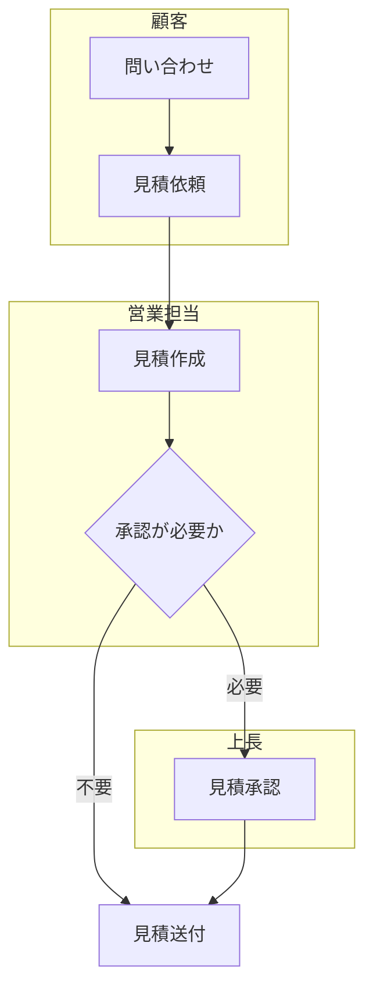

**コードのポイント:**

- `subgraph Customer[顧客] ... end` のように担当者ごとにグループ化し、スイムレーンを表現する
- `D{承認が必要か}` はひし形の分岐ノードで、`-->|必要|`/`-->|不要|`と対応させる
- グループをまたぐ矢印（`B --> C`）はグループ内ノードを指定するだけでよい

概念データモデルの例です。要件定義段階では属性は最小限にとどめます。

**ソースコード:**

```text
erDiagram
    CUSTOMER ||--o{ ORDER : "発注する"
    ORDER ||--|{ ORDER_ITEM : "含む"
    PRODUCT ||--o{ ORDER_ITEM : "含まれる"
```

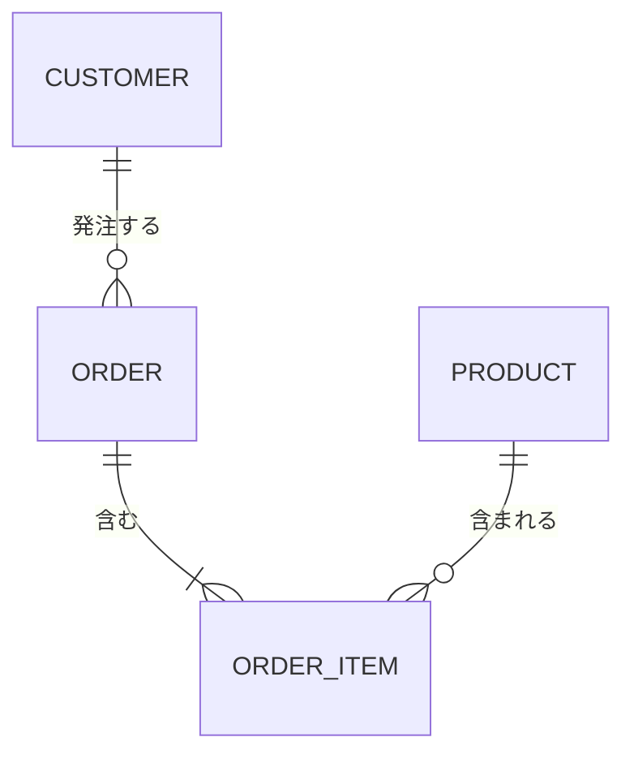

**コードのポイント:**

- `CUSTOMER ||--o{ ORDER` は「顧客1人が0件以上の注文を持つ」を表す
- `ORDER_ITEM`を中間エンティティとして`ORDER`と`PRODUCT`をつないでいる
- 要件定義段階では属性（`{ }`）は書かず、関連の整理に集中する

要件トレーサビリティの例です。要件と実装予定機能の対応を早期に記録します。

**ソースコード:**

```text
requirementDiagram
    requirement MemberRegistration {
        id: REQ-001
        text: 会員はメールアドレスで登録できること
        risk: medium
        verifymethod: test
    }

    element MemberRegistrationFeature {
        type: feature
    }

    MemberRegistrationFeature - satisfies -> MemberRegistration
```

```mermaid
requirementDiagram
    requirement MemberRegistration {
        id: REQ-001
        text: 会員はメールアドレスで登録できること
        risk: medium
        verifymethod: test
    }

    element MemberRegistrationFeature {
        type: feature
    }

    MemberRegistrationFeature - satisfies -> MemberRegistration
```

**コードのポイント:**

- `requirement MemberRegistration { ... }` で要件をID・本文・リスク付きで宣言する
- `element MemberRegistrationFeature { type: feature }` が要件を満たす実装要素
- `- satisfies ->` で「どの実装要素がどの要件を満たすか」を対応付ける

ユースケース図の代替表現です。Mermaidに専用記法がないため、
flowchartでアクターとユースケースをノードとして表現します。

**ソースコード:**

```text
flowchart LR
    Actor((利用者)) --> UC1[会員登録する]
    Actor --> UC2[注文履歴を確認する]
    Admin((管理者)) --> UC3[注文を承認する]
```

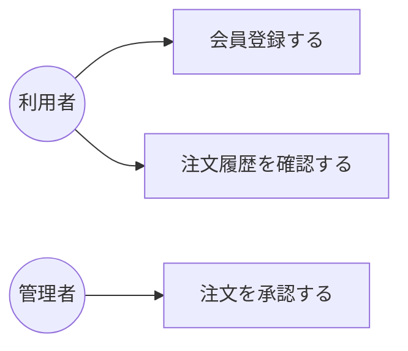

**コードのポイント:**

- `Actor((利用者))` の円形ノードでアクターを表す（UML本来の記法とは異なる代替表現）
- `UC1[会員登録する]`のように四角ノードでユースケースを表す
- 汎化・包含・拡張などUML特有の関係線は表現できない点に注意する

## 演習課題

1. 自分の業務や身近な手続きから1つの業務フローを選び、`subgraph`で
   担当者ごとにグルーピングしたflowchartを書け
2. 「利用者」「管理者」の2アクターを持つユースケース図を、flowchartの
   代替表現で書け

## 理解度チェック

- [ ] 業務フロー図をflowchartの`subgraph`で表現できる
- [ ] 要件定義段階の概念データモデルをerDiagramで書ける
- [ ] requirementDiagramで要件と実装要素の対応を書ける
- [ ] ユースケース図がMermaidで非対応であることと、その代替表現を説明できる

---

[← 06. プロジェクト開発フェーズと図 目次](00-README.md) | [次へ: 基本設計フェーズ →](02-basic-design-phase.md)
```

- [ ] **Step 2: Mermaidブロックを検証する**

Run: `cd diagram-as-code-tutorial && node .tmp-verify-mermaid.js docs/06-project-phase-diagrams/01-requirements-phase.md`

Expected: `検証したペア数: 4`、4件とも`[OK]`、終了コード0。

- [ ] **Step 3: コミット**

```bash
cd diagram-as-code-tutorial
git add docs/06-project-phase-diagrams/01-requirements-phase.md
git commit -m "$(cat <<'EOF'
要件定義フェーズの図カタログ教材を追加

業務フロー図・概念データモデル・要件トレーサビリティ・ユースケース図の
代替表現をMermaidコード例とともにまとめた。

Co-Authored-By: Claude Sonnet 5 <noreply@anthropic.com>
EOF
)"
```

---

## Task 3: 02-basic-design-phase.md（基本設計フェーズ）の作成

**Files:**
- Create: `diagram-as-code-tutorial/docs/06-project-phase-diagrams/02-basic-design-phase.md`
- Create: `diagram-as-code-tutorial/docs/06-project-phase-diagrams/examples/01-system-architecture.dot`
- Create (generated): `diagram-as-code-tutorial/docs/06-project-phase-diagrams/examples/01-system-architecture.png`

**Interfaces:**
- Consumes: Task 2で作成した`01-requirements-phase.md`（「前へ」リンク先）
- Produces: `02-basic-design-phase.md`（Task 4が「前へ」リンクで参照）、
  `examples/01-system-architecture.dot`/`.png`

- [ ] **Step 1: Graphviz例のディレクトリとファイルを作成する**

`diagram-as-code-tutorial/docs/06-project-phase-diagrams/examples/01-system-architecture.dot`
を次の内容で作成する。

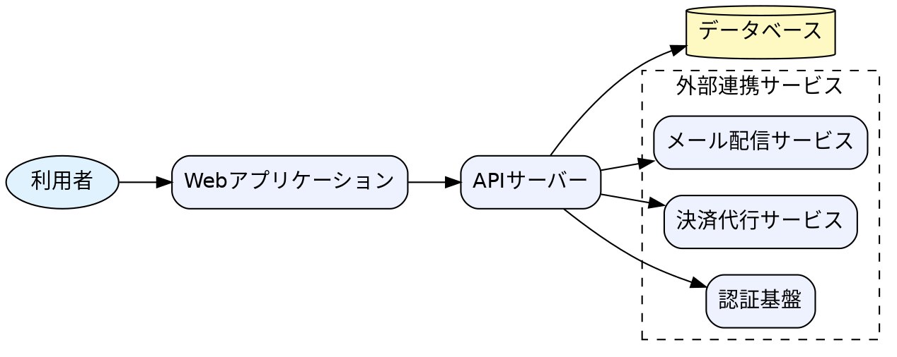

- [ ] **Step 2: PNGをレンダリングする**

Run:
```bash
cd diagram-as-code-tutorial
export PATH="$PATH:/c/Program Files/Graphviz/bin"
npm run graphviz:render
```

Expected: `完了: 成功 6 / 失敗 0`（既存5件 + 新規1件）。
`ls docs/06-project-phase-diagrams/examples/01-system-architecture.png` でファイルが
生成されていることを確認する。

- [ ] **Step 3: ファイルを作成する**

`diagram-as-code-tutorial/docs/06-project-phase-diagrams/02-basic-design-phase.md`
を次の内容で作成する。

```markdown
# 基本設計フェーズ

## この教材で身につくこと

- 基本設計フェーズの主な成果物を把握する
- システム構成図をMermaid/Graphviz双方で書き分けられる
- 画面遷移図・ER図（論理）・シーケンス概要図をMermaidで書ける

## 概要

基本設計フェーズでは、システム全体の構造や画面・データ・処理の
概要を整理した成果物が作られます。ここでは代表的な4つの成果物を扱います。

## 位置づけ

[00-README.md](00-README.md)の全体マッピング表のうち「基本設計」行を
深掘りする教材です。要件定義フェーズ（[01](01-requirements-phase.md)）の
概念データモデルを、ここでは属性付きの論理ER図へと詳細化します。

## 基本文法・プロパティ解説

### 成果物別の対応表

| 成果物 | 図の種類 | 適する理由 |
|---|---|---|
| システム構成図（シンプル） | flowchart | 主要コンポーネントの関係を素早く共有できる |
| システム構成図（複雑） | Graphviz DOT | 外部連携が多い場合、自動レイアウトで整理しやすい |
| 画面遷移図 | stateDiagram | 画面を状態、遷移操作をラベル付き矢印で表現できる |
| ER図（論理） | erDiagram | エンティティの属性・関連を明確化できる |

## 実ソースコード

システム構成図（シンプル版）です。コンポーネント数が少ないうちはMermaidで
十分に表現できます。

**ソースコード:**

```text
flowchart LR
    User[利用者] --> WebApp[Webアプリケーション]
    WebApp --> API[APIサーバー]
    API --> DB[(データベース)]
    API --> Mail[メール配信サービス]
```

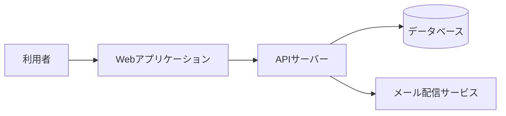

**コードのポイント:**

- `flowchart LR` で左から右へのデータ・処理の流れを表す
- `DB[(データベース)]` は円柱形でデータベースを表す
- 外部サービス（`Mail`）が増えるとノードが横に伸び、読みにくくなっていく

外部連携が増えて複雑になった場合の、Graphviz版です。クラスタで
外部サービスをグルーピングし、レイアウトが崩れにくくしています。

`docs/06-project-phase-diagrams/examples/01-system-architecture.dot`


**コードのポイント:**

- `subgraph cluster_external { ... }` で外部連携サービスをグルーピングしている
- 外部サービスが増えても`cluster_external`内に追加するだけでよく、
  Graphvizが自動的にレイアウトを整理する
- どちらを使うかの判断基準は
  [03-diagram-patterns/01](../03-diagram-patterns/01-mermaid-vs-graphviz.md)を参照

> **補足:** Mermaidにはアーキテクチャ専用記法の`C4Context`もあります。
> コンテキスト図（システムと利用者・外部システムの関係を示す図）を
> 標準化された記法で書きたい場合の選択肢です。本教材では扱わず、
> 詳細は[ROADMAP.md](../../ROADMAP.md)の将来拡張候補を参照してください。

画面遷移図の例です。

**ソースコード:**

```text
stateDiagram-v2
    [*] --> Login
    Login --> Home : ログイン成功
    Home --> ProductDetail : 商品選択
    ProductDetail --> Cart : カートに追加
    Cart --> Checkout : レジに進む
    Checkout --> Complete : 決済成功
    Complete --> [*]
```

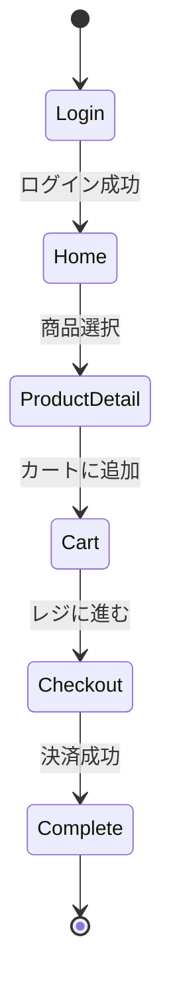

**コードのポイント:**

- 画面（`Login`, `Home`など）を状態として扱い、`stateDiagram-v2`で表現する
- `A --> B : 条件`の`:`以降が画面遷移のきっかけ（ボタン操作等）になる
- `[*]`はアプリの起動・終了に対応する

ER図（論理）の例です。要件定義段階のモデルに属性を追加して詳細化します。

**ソースコード:**

```text
erDiagram
    CUSTOMER {
        int customer_id PK
        string name
        string email
    }
    ORDER {
        int order_id PK
        int customer_id FK
        date order_date
    }
    ORDER_ITEM {
        int order_item_id PK
        int order_id FK
        int product_id FK
        int quantity
    }
    PRODUCT {
        int product_id PK
        string name
        int price
    }
    CUSTOMER ||--o{ ORDER : "発注する"
    ORDER ||--|{ ORDER_ITEM : "含む"
    PRODUCT ||--o{ ORDER_ITEM : "含まれる"
```

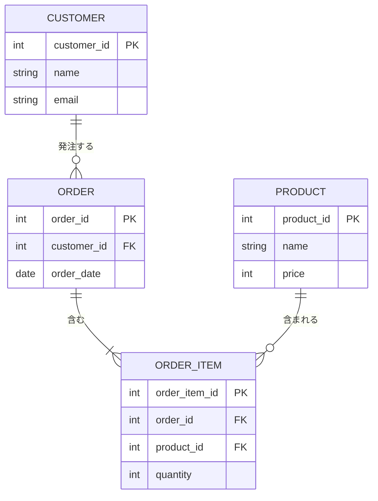

**コードのポイント:**

- `PK`/`FK`で主キー・外部キーを明示する
- [要件定義フェーズ](01-requirements-phase.md)の概念モデルに属性を追加して詳細化している
- 型（`int`/`string`/`date`）を明記し、実装時のカラム定義の土台にする

## 演習課題

1. 自分の身近なシステム（例: 予約サイト）のシステム構成図を、まずMermaidの
   flowchartで書き、次に外部連携を3つ以上追加してGraphvizのcluster版に
   書き直せ
2. 3画面以上のstateDiagramで画面遷移図を書け

## 理解度チェック

- [ ] システム構成図をMermaid/Graphviz両方で書ける
- [ ] 複雑さに応じてMermaidとGraphvizを使い分ける判断ができる
- [ ] stateDiagramで画面遷移を表現できる
- [ ] ER図に主キー・外部キーを明記できる

---

[← 前へ: 要件定義フェーズ](01-requirements-phase.md) | [次へ: 詳細設計フェーズ →](03-detailed-design-phase.md)
```

- [ ] **Step 4: Mermaidブロックを検証する**

Run: `cd diagram-as-code-tutorial && node .tmp-verify-mermaid.js docs/06-project-phase-diagrams/02-basic-design-phase.md`

Expected: `検証したペア数: 3`（flowchart/stateDiagram/erDiagramの3件。Graphviz版はtext/mermaidペアの対象外）、3件とも`[OK]`、終了コード0。

- [ ] **Step 5: コミット**

```bash
cd diagram-as-code-tutorial
git add docs/06-project-phase-diagrams/02-basic-design-phase.md docs/06-project-phase-diagrams/examples/01-system-architecture.dot docs/06-project-phase-diagrams/examples/01-system-architecture.png
git commit -m "$(cat <<'EOF'
基本設計フェーズの図カタログ教材を追加

システム構成図（Mermaid/Graphviz両方）・画面遷移図・ER図（論理）を
コード例とともにまとめた。

Co-Authored-By: Claude Sonnet 5 <noreply@anthropic.com>
EOF
)"
```

---

## Task 4: 03-detailed-design-phase.md（詳細設計フェーズ）の作成

**Files:**
- Create: `diagram-as-code-tutorial/docs/06-project-phase-diagrams/03-detailed-design-phase.md`
- Create: `diagram-as-code-tutorial/docs/06-project-phase-diagrams/examples/02-dfd.dot`
- Create (generated): `diagram-as-code-tutorial/docs/06-project-phase-diagrams/examples/02-dfd.png`

**Interfaces:**
- Consumes: Task 3で作成した`02-basic-design-phase.md`（「前へ」リンク先）
- Produces: `03-detailed-design-phase.md`（Task 5が「前へ」リンクで参照）、
  `examples/02-dfd.dot`/`.png`

- [ ] **Step 1: Graphviz例（DFD）を作成する**

`diagram-as-code-tutorial/docs/06-project-phase-diagrams/examples/02-dfd.dot`
を次の内容で作成する。

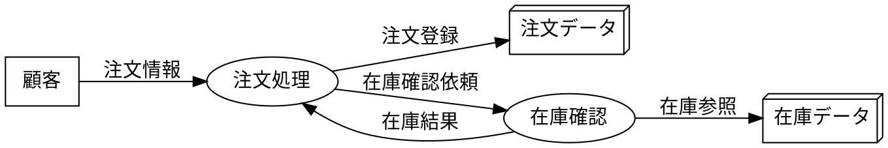

- [ ] **Step 2: PNGをレンダリングする**

Run:
```bash
cd diagram-as-code-tutorial
export PATH="$PATH:/c/Program Files/Graphviz/bin"
npm run graphviz:render
```

Expected: `完了: 成功 7 / 失敗 0`。
`ls docs/06-project-phase-diagrams/examples/02-dfd.png` で生成確認する。

- [ ] **Step 3: ファイルを作成する**

`diagram-as-code-tutorial/docs/06-project-phase-diagrams/03-detailed-design-phase.md`
を次の内容で作成する。

```markdown
# 詳細設計フェーズ

## この教材で身につくこと

- 詳細設計フェーズの主な成果物を把握する
- クラス図・複合状態を含むステートマシン図・詳細シーケンス図をMermaidで書ける
- DFD（データフロー図）をGraphvizで書ける

## 概要

詳細設計フェーズでは、基本設計で決めた構造をさらに掘り下げ、
クラスやオブジェクトの内部構造・状態遷移・処理のやり取りを
具体化した成果物が作られます。

## 位置づけ

[00-README.md](00-README.md)の全体マッピング表のうち「詳細設計」行を
深掘りする教材です。[基本設計フェーズ](02-basic-design-phase.md)の
シーケンス概要図・画面遷移図を、ここではより詳細な条件分岐・複合状態を
含む形に発展させます。

## 基本文法・プロパティ解説

### 成果物別の対応表

| 成果物 | 図の種類 | 適する理由 |
|---|---|---|
| クラス図 | classDiagram | オブジェクトの属性・メソッド・関連を表現できる |
| ステートマシン図 | stateDiagram | 複合状態（サブ状態）で処理の内部段階を表現できる |
| 詳細シーケンス図 | sequenceDiagram | alt/loopでリトライや分岐を含むやり取りを表現できる |
| DFD（データフロー図） | Graphviz DOT | Mermaid非対応のため、形状指定で代替表現する |

## 実ソースコード

クラス図の例です。

**ソースコード:**

```text
classDiagram
    class Order {
        +int orderId
        +Date orderDate
        +addItem(item) void
        +calculateTotal() int
    }
    class OrderItem {
        +int quantity
        +int unitPrice
    }
    class Customer {
        +String name
        +String email
    }
    Customer "1" --> "*" Order : places
    Order "1" --> "*" OrderItem : contains
```

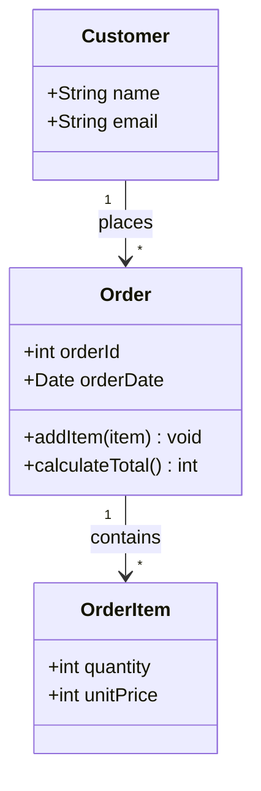

**コードのポイント:**

- `class Order { ... }` にメソッド（`addItem`, `calculateTotal`）を含めて実装レベルに近づける
- `Customer "1" --> "*" Order : places` は「顧客1人が複数の注文を持つ」多重度付き関連
- [基本設計フェーズ](02-basic-design-phase.md)のER図（CUSTOMER/ORDER/ORDER_ITEM）と
  対応する構造になっている

複合状態を含むステートマシン図の例です。「処理中」の内部段階を
サブ状態として表現します。

**ソースコード:**

```text
stateDiagram-v2
    [*] --> Pending
    Pending --> Processing : 支払い確認
    state Processing {
        [*] --> Picking
        Picking --> Packing : ピッキング完了
        Packing --> [*]
    }
    Processing --> Shipped : 出荷完了
    Shipped --> Delivered : 配達完了
    Delivered --> [*]
```

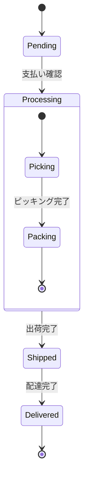

**コードのポイント:**

- `state Processing { ... }` で複合状態（サブ状態を持つ状態）を宣言する
- サブ状態内にも独自の`[*]`（開始・終了）を持てる
- 外側から見ると`Processing`は1つの状態のままなので、全体像を保ったまま詳細化できる

詳細シーケンス図の例です。決済のリトライを`loop`/`alt`で表現します。

**ソースコード:**

```text
sequenceDiagram
    participant WebApp as Webアプリ
    participant API as APIサーバー
    participant Payment as 決済代行サービス

    WebApp->>API: 注文確定リクエスト
    activate API
    loop 最大3回リトライ
        API->>Payment: 決済実行
        alt 決済成功
            Payment-->>API: 成功レスポンス
        else 決済失敗
            Payment-->>API: エラー
        end
    end
    API-->>WebApp: 注文結果
    deactivate API
```

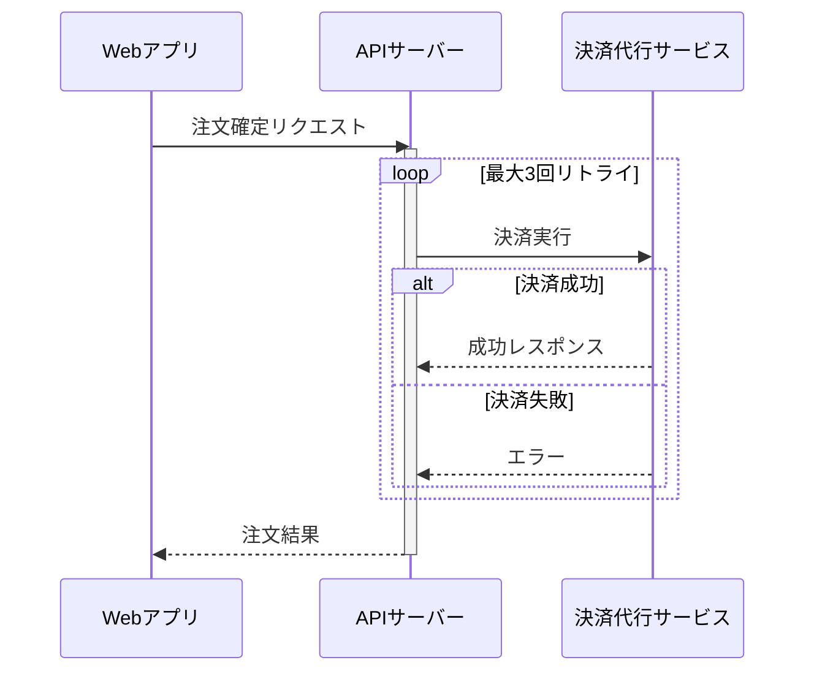

**コードのポイント:**

- `loop 最大3回リトライ ... end` の中に`alt`を入れ子にし、リトライ処理を表現する
- `activate API`/`deactivate API`で注文確定リクエスト全体の処理区間を示す
- 基本設計の「シーケンス概要図」に対し、リトライという実装詳細を追加している

DFD（データフロー図）の例です。Mermaidに専用記法がないため、Graphvizの
`shape`でプロセス・データストア・外部エンティティを描き分けます。

`docs/06-project-phase-diagrams/examples/02-dfd.dot`


**コードのポイント:**

- `shape=box`は外部エンティティ（顧客）、`shape=ellipse`はプロセス（注文処理・在庫確認）
- `shape=box3d`はデータストア（注文データ・在庫データ）を表す、DFDでよく使われる形状の代替
- エッジのラベル（`label="注文情報"`等）がデータフローの名前になる

## 演習課題

1. [基本設計フェーズ](02-basic-design-phase.md)のER図に対応するクラス図を、
   メソッドを2つ以上加えて書け
2. 「処理中」に相当する状態を1つ選び、複合状態として2段階以上のサブ状態に
   分解したstateDiagramを書け
3. 何らかの外部APIリクエストを題材に、`loop`と`alt`を組み合わせた
   詳細シーケンス図を書け

## 理解度チェック

- [ ] classDiagramでメソッドを含む詳細なクラス構造を書ける
- [ ] `state 名前 { ... }`で複合状態を表現できる
- [ ] `loop`と`alt`を組み合わせた詳細シーケンス図を書ける
- [ ] DFDをGraphvizの`shape`使い分けで表現できる

---

[← 前へ: 基本設計フェーズ](02-basic-design-phase.md) | [次へ: 実装・テストフェーズ →](04-implementation-testing-phase.md)
```

- [ ] **Step 4: Mermaidブロックを検証する**

Run: `cd diagram-as-code-tutorial && node .tmp-verify-mermaid.js docs/06-project-phase-diagrams/03-detailed-design-phase.md`

Expected: `検証したペア数: 3`、3件とも`[OK]`、終了コード0。

- [ ] **Step 5: コミット**

```bash
cd diagram-as-code-tutorial
git add docs/06-project-phase-diagrams/03-detailed-design-phase.md docs/06-project-phase-diagrams/examples/02-dfd.dot docs/06-project-phase-diagrams/examples/02-dfd.png
git commit -m "$(cat <<'EOF'
詳細設計フェーズの図カタログ教材を追加

クラス図・複合状態のステートマシン図・詳細シーケンス図・DFDを
コード例とともにまとめた。

Co-Authored-By: Claude Sonnet 5 <noreply@anthropic.com>
EOF
)"
```

---

## Task 5: 04-implementation-testing-phase.md（実装・テストフェーズ）の作成

**Files:**
- Create: `diagram-as-code-tutorial/docs/06-project-phase-diagrams/04-implementation-testing-phase.md`
- Create: `diagram-as-code-tutorial/docs/06-project-phase-diagrams/examples/03-module-dependency.dot`
- Create (generated): `diagram-as-code-tutorial/docs/06-project-phase-diagrams/examples/03-module-dependency.png`

**Interfaces:**
- Consumes: Task 4で作成した`03-detailed-design-phase.md`（「前へ」リンク先）
- Produces: `04-implementation-testing-phase.md`（Task 6が「前へ」リンクで参照）、
  `examples/03-module-dependency.dot`/`.png`

- [ ] **Step 1: Graphviz例（モジュール依存図）を作成する**

`diagram-as-code-tutorial/docs/06-project-phase-diagrams/examples/03-module-dependency.dot`
を次の内容で作成する。

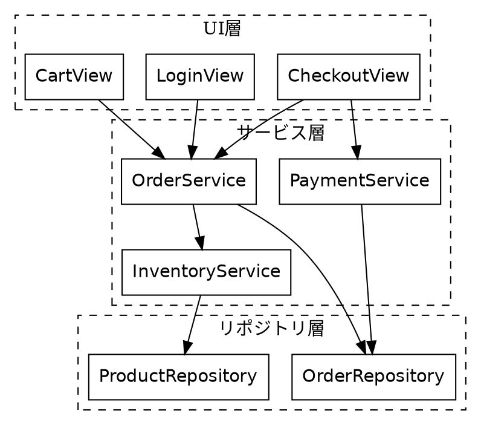

- [ ] **Step 2: PNGをレンダリングする**

Run:
```bash
cd diagram-as-code-tutorial
export PATH="$PATH:/c/Program Files/Graphviz/bin"
npm run graphviz:render
```

Expected: `完了: 成功 8 / 失敗 0`。
`ls docs/06-project-phase-diagrams/examples/03-module-dependency.png` で生成確認する。

- [ ] **Step 3: ファイルを作成する**

`diagram-as-code-tutorial/docs/06-project-phase-diagrams/04-implementation-testing-phase.md`
を次の内容で作成する。

```markdown
# 実装・テストフェーズ

## この教材で身につくこと

- 実装・テストフェーズの主な成果物を把握する
- モジュール依存図をGraphvizのクラスタで書ける
- テストケース分岐図・テストスケジュールをMermaidで書ける

## 概要

実装フェーズではモジュール間の依存関係を整理し、テストフェーズでは
テストケースの網羅性やスケジュールを可視化した成果物が作られます。

## 位置づけ

[00-README.md](00-README.md)の全体マッピング表のうち「実装・テスト」行を
深掘りする教材です。[詳細設計フェーズ](03-detailed-design-phase.md)の
クラス図をもとに、実際のモジュール構成へ落とし込みます。

## 基本文法・プロパティ解説

### 成果物別の対応表

| 成果物 | 図の種類 | 適する理由 |
|---|---|---|
| モジュール依存図 | Graphviz DOT | クラスタで層を分け、大規模でも自動整理できる |
| テストケース分岐図 | flowchart | デシジョンテーブルの条件組み合わせを可視化できる |
| テストスケジュール | gantt | タスクの依存関係・期間を時系列で共有できる |

## 実ソースコード

モジュール依存図の例です。UI層・サービス層・リポジトリ層をクラスタで
分けています。

`docs/06-project-phase-diagrams/examples/03-module-dependency.dot`


**コードのポイント:**

- `rankdir=TB`でUI層→サービス層→リポジトリ層という上位から下位への依存方向を表す
- 3つの`cluster_*`で層ごとにグルーピングし、層をまたぐ依存が視覚的にわかる
- モジュールが増えて依存が複雑化した場合の整理法は
  [03-diagram-patterns/03](../03-diagram-patterns/03-complex-diagram-organization.md)を参照

テストケース分岐図の例です。デシジョンテーブル（年齢×年収の組み合わせ）を
flowchartの分岐として可視化します。

**ソースコード:**

```text
flowchart TD
    Age{年齢} -->|18歳未満| Reject[利用不可]
    Age -->|18歳以上65歳未満| Income{年収}
    Age -->|65歳以上| SeniorPlan[シニア向けプラン]
    Income -->|300万円未満| StandardPlan[スタンダードプラン]
    Income -->|300万円以上| PremiumPlan[プレミアムプラン]
```

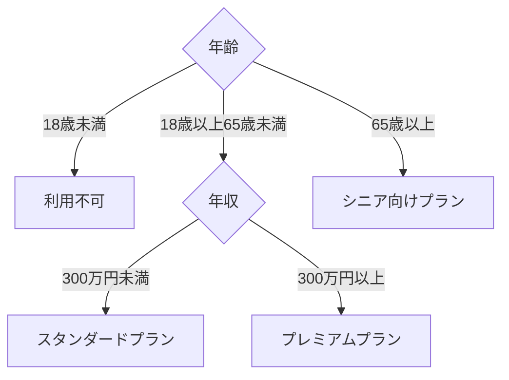

**コードのポイント:**

- `Age{年齢}`と`Income{年収}`の2つの分岐ノードで条件の組み合わせを表す
- 終端ノード（`Reject`/`SeniorPlan`/`StandardPlan`/`PremiumPlan`）の数が
  テストケース数の目安になる
- 条件の組み合わせ漏れ・重複がないかを図で確認できる

テストスケジュールの例です。

**ソースコード:**

```text
gantt
    title 結合テストスケジュール
    dateFormat YYYY-MM-DD
    section 準備
    テスト計画書作成 :t1, 2026-08-01, 3d
    テストデータ準備 :t2, after t1, 2d
    section 実施
    結合テスト実施 :t3, after t2, 5d
    不具合修正 :t4, after t3, 3d
    section 完了
    再テスト :t5, after t4, 2d
```

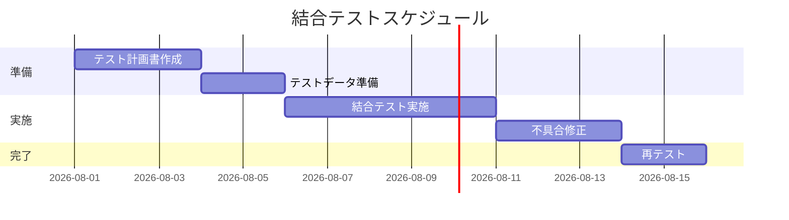

**コードのポイント:**

- `section 準備`/`section 実施`/`section 完了`でテスト工程をグルーピングする
- `after t2`のように前タスクの完了を起点にでき、依存関係を表現できる
- 不具合修正・再テストのように手戻りタスクも1つのタスクとして計画に組み込める

## 演習課題

1. [詳細設計フェーズ](03-detailed-design-phase.md)のクラス図（Order/OrderItem/Customer）
   をもとに、4層以上のモジュール依存図をGraphvizで書け
2. 3つ以上の条件を組み合わせたデシジョンテーブルを、flowchartの分岐として書け
3. 単体テスト→結合テスト→受入テストの3段階を含むganttチャートを書け

## 理解度チェック

- [ ] Graphvizのクラスタでモジュールを層ごとに分けられる
- [ ] デシジョンテーブルをflowchartの分岐として可視化できる
- [ ] ganttでタスクの依存関係を含むテストスケジュールを書ける

---

[← 前へ: 詳細設計フェーズ](03-detailed-design-phase.md) | [次へ: リリース・運用保守フェーズ →](05-release-operations-phase.md)
```

- [ ] **Step 4: Mermaidブロックを検証する**

Run: `cd diagram-as-code-tutorial && node .tmp-verify-mermaid.js docs/06-project-phase-diagrams/04-implementation-testing-phase.md`

Expected: `検証したペア数: 2`、2件とも`[OK]`、終了コード0。

- [ ] **Step 5: コミット**

```bash
cd diagram-as-code-tutorial
git add docs/06-project-phase-diagrams/04-implementation-testing-phase.md docs/06-project-phase-diagrams/examples/03-module-dependency.dot docs/06-project-phase-diagrams/examples/03-module-dependency.png
git commit -m "$(cat <<'EOF'
実装・テストフェーズの図カタログ教材を追加

モジュール依存図・テストケース分岐図・テストスケジュールを
コード例とともにまとめた。

Co-Authored-By: Claude Sonnet 5 <noreply@anthropic.com>
EOF
)"
```

---

## Task 6: 05-release-operations-phase.md（リリース・運用保守フェーズ）の作成

**Files:**
- Create: `diagram-as-code-tutorial/docs/06-project-phase-diagrams/05-release-operations-phase.md`
- Create: `diagram-as-code-tutorial/docs/06-project-phase-diagrams/examples/04-infra-architecture.dot`
- Create (generated): `diagram-as-code-tutorial/docs/06-project-phase-diagrams/examples/04-infra-architecture.png`

**Interfaces:**
- Consumes: Task 5で作成した`04-implementation-testing-phase.md`（「前へ」リンク先）
- Produces: `05-release-operations-phase.md`（Task 7が「前へ」リンクで参照）、
  `examples/04-infra-architecture.dot`/`.png`

- [ ] **Step 1: Graphviz例（インフラ構成図）を作成する**

`diagram-as-code-tutorial/docs/06-project-phase-diagrams/examples/04-infra-architecture.dot`
を次の内容で作成する。

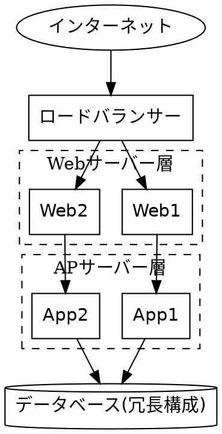

- [ ] **Step 2: PNGをレンダリングする**

Run:
```bash
cd diagram-as-code-tutorial
export PATH="$PATH:/c/Program Files/Graphviz/bin"
npm run graphviz:render
```

Expected: `完了: 成功 9 / 失敗 0`。
`ls docs/06-project-phase-diagrams/examples/04-infra-architecture.png` で生成確認する。

- [ ] **Step 3: ファイルを作成する**

`diagram-as-code-tutorial/docs/06-project-phase-diagrams/05-release-operations-phase.md`
を次の内容で作成する。

```markdown
# リリース・運用保守フェーズ

## この教材で身につくこと

- リリース・運用保守フェーズの主な成果物を把握する
- デプロイフロー図・障害対応フローをMermaidで書ける
- インフラ構成図をGraphvizで書ける

## 概要

リリース・運用保守フェーズでは、デプロイの手順やインフラの構成、
障害発生時の対応手順を整理した成果物が作られます。

## 位置づけ

[00-README.md](00-README.md)の全体マッピング表のうち「リリース・運用」行を
深掘りする教材です。[基本設計フェーズ](02-basic-design-phase.md)の
システム構成図を、ここでは実際のサーバー冗長構成にまで具体化します。

## 基本文法・プロパティ解説

### 成果物別の対応表

| 成果物 | 図の種類 | 適する理由 |
|---|---|---|
| デプロイフロー図 | flowchart | ビルド〜デプロイ〜検証の手順と分岐を表現できる |
| インフラ構成図 | Graphviz DOT | サーバー冗長構成など階層的な構造を整理しやすい |
| 障害対応フロー | flowchart | 検知から復旧までの対応手順・エスカレーションを表現できる |

## 実ソースコード

デプロイフロー図の例です。

**ソースコード:**

```text
flowchart TD
    Start([リリース判定]) --> Build[ビルド実行]
    Build --> Test{テスト成功}
    Test -->|Yes| Deploy[本番環境へデプロイ]
    Test -->|No| Notify[開発チームに通知]
    Deploy --> Verify{ヘルスチェックOK}
    Verify -->|Yes| Done([リリース完了])
    Verify -->|No| Rollback[ロールバック]
    Rollback --> Notify
```

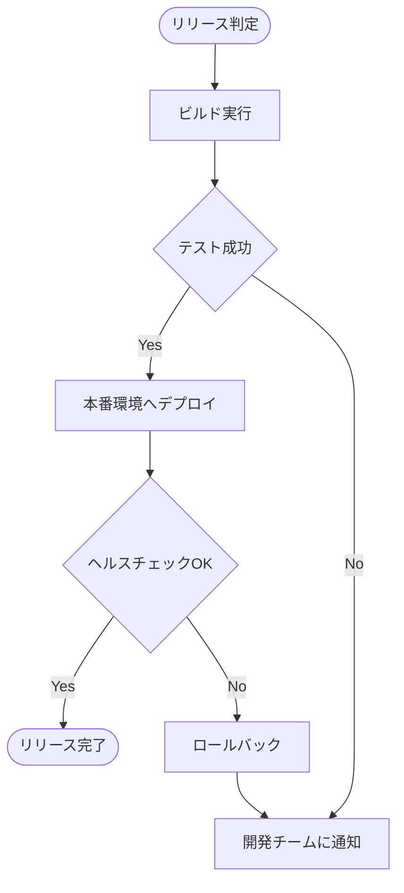

**コードのポイント:**

- `Test{テスト成功}`と`Verify{ヘルスチェックOK}`の2段階で成功可否を判定する
- `Verify -->|No| Rollback` のように失敗時はロールバックに分岐させる
- `Rollback --> Notify` で失敗時も通知フローに合流させている

インフラ構成図の例です。Webサーバー・APサーバーを冗長化した構成を
クラスタで表現します。

`docs/06-project-phase-diagrams/examples/04-infra-architecture.dot`

```dot
digraph InfraArchitecture {
  rankdir=TB;
  node [shape=box, fontname="Helvetica"];

  Internet [shape=ellipse, label="インターネット"];
  LB [label="ロードバランサー"];

  subgraph cluster_web {
    label="Webサーバー層";
    style=dashed;
    Web1 [label="Web1"];
    Web2 [label="Web2"];
  }

  subgraph cluster_app {
    label="APサーバー層";
    style=dashed;
    App1 [label="App1"];
    App2 [label="App2"];
  }

  DB [shape=cylinder, label="データベース(冗長構成)"];

  Internet -> LB;
  LB -> Web1;
  LB -> Web2;
  Web1 -> App1;
  Web2 -> App2;
  App1 -> DB;
  App2 -> DB;
}
```


**コードのポイント:**

- `LB -> Web1; LB -> Web2;` でロードバランサーから冗長化されたWebサーバーへの
  分岐を表現する
- `cluster_web`/`cluster_app`で層ごとにサーバーをグルーピングしている
- `DB [shape=cylinder, label="データベース(冗長構成)"]` のようにラベル文字列に
  補足情報（冗長構成であること）を含められる

障害対応フローの例です。

**ソースコード:**

```text
flowchart TD
    Detect([障害検知]) --> Assess{影響範囲}
    Assess -->|軽微| Log[ログに記録]
    Assess -->|重大| Escalate[エスカレーション]
    Escalate --> WarRoom[緊急対応チーム招集]
    WarRoom --> Fix[原因調査・復旧]
    Fix --> Verify{復旧確認}
    Verify -->|OK| Report[報告書作成]
    Verify -->|NG| Fix
    Log --> Report
```

```mermaid
flowchart TD
    Detect([障害検知]) --> Assess{影響範囲}
    Assess -->|軽微| Log[ログに記録]
    Assess -->|重大| Escalate[エスカレーション]
    Escalate --> WarRoom[緊急対応チーム招集]
    WarRoom --> Fix[原因調査・復旧]
    Fix --> Verify{復旧確認}
    Verify -->|OK| Report[報告書作成]
    Verify -->|NG| Fix
    Log --> Report
```

**コードのポイント:**

- `Assess{影響範囲}`の分岐で軽微/重大の対応を分ける
- `Verify -->|NG| Fix` のように復旧確認に失敗した場合は原因調査に戻すループがある
- 軽微・重大どちらの経路も最終的に`Report`（報告書作成）へ合流する

## 演習課題

1. ロールバック処理を含むデプロイフロー図を、自分のプロジェクトを想定して書け
2. Webサーバーを3台以上に冗長化したインフラ構成図をGraphvizで書け
3. 「検知」「影響範囲判定」「復旧」「報告」の4段階を含む障害対応フローを書け

## 理解度チェック

- [ ] デプロイフロー図に成功/失敗の分岐とロールバックを含められる
- [ ] Graphvizのクラスタで冗長化されたインフラ構成を表現できる
- [ ] 障害対応フローに検知からエスカレーション・復旧確認までの流れを書ける

---

[← 前へ: 実装・テストフェーズ](04-implementation-testing-phase.md) | [次へ: アジャイル開発での当てはめ →](06-agile-artifacts.md)
```

- [ ] **Step 4: Mermaidブロックを検証する**

Run: `cd diagram-as-code-tutorial && node .tmp-verify-mermaid.js docs/06-project-phase-diagrams/05-release-operations-phase.md`

Expected: `検証したペア数: 2`、2件とも`[OK]`、終了コード0。

- [ ] **Step 5: コミット**

```bash
cd diagram-as-code-tutorial
git add docs/06-project-phase-diagrams/05-release-operations-phase.md docs/06-project-phase-diagrams/examples/04-infra-architecture.dot docs/06-project-phase-diagrams/examples/04-infra-architecture.png
git commit -m "$(cat <<'EOF'
リリース・運用保守フェーズの図カタログ教材を追加

デプロイフロー図・インフラ構成図・障害対応フローをコード例とともにまとめた。

Co-Authored-By: Claude Sonnet 5 <noreply@anthropic.com>
EOF
)"
```

---

## Task 7: 06-agile-artifacts.md（アジャイル開発での当てはめ）の作成

**Files:**
- Create: `diagram-as-code-tutorial/docs/06-project-phase-diagrams/06-agile-artifacts.md`

**Interfaces:**
- Consumes: Task 6で作成した`05-release-operations-phase.md`（「前へ」リンク先）、
  Task 1〜6で作成した01〜05フェーズファイル（フェーズ対応表からのリンク先）
- Produces: `06-agile-artifacts.md`（カテゴリ最終ファイル。「次へ」リンクなし）

- [ ] **Step 1: ファイルを作成する**

`diagram-as-code-tutorial/docs/06-project-phase-diagrams/06-agile-artifacts.md`
を次の内容で作成する。

```markdown
# アジャイル開発での当てはめ

## この教材で身につくこと

- アジャイル開発特有の成果物（スプリント計画・開発サイクル）を把握する
- 01〜05で学んだ図のカタログを、アジャイルの反復サイクルに当てはめられる
- Mermaid/Graphvizで表現できないアジャイル成果物（バーンダウンチャート等）を把握する

## 概要

アジャイル開発ではウォーターフォールのような明確なフェーズ区切りがなく、
短いサイクル（スプリント）を繰り返します。01〜05で扱った成果物の多くは
「フェーズ」ではなく「タイミング」を変えてアジャイルの中でも作られます。

## 位置づけ

[00-README.md](00-README.md)の全体マッピング表のうち「アジャイル」行を
深掘りする教材です。01〜05（ウォーターフォール型フェーズ）の内容を
前提とします。

## 基本文法・プロパティ解説

### 成果物別の対応表

| 成果物 | 図の種類 | 適する理由 |
|---|---|---|
| スプリント計画 | gantt | 短期間のタスクと期間を時系列で共有できる |
| 開発サイクル図 | flowchart | バックログ→計画→実施→レビュー→改善の反復を表現できる |
| バックログ優先度 | 表（図ではなく表が適する） | Mermaid/Graphvizに専用の一覧表現はない |
| バーンダウンチャート | 非対応 | 日次の残作業量推移はMermaid/Graphvizで表現できない |

### 01〜05カタログのアジャイルへの対応付け

| ウォーターフォールでの成果物 | アジャイルでの当てはめタイミング |
|---|---|
| [業務フロー図](01-requirements-phase.md) | プロダクトバックログ作成時に、対象業務の理解のため作成 |
| [システム構成図](02-basic-design-phase.md) | 最初のスプリント計画前に、全体アーキテクチャの合意として作成 |
| [クラス図・詳細シーケンス図](03-detailed-design-phase.md) | 各スプリント内で、対象機能の実装直前に必要な範囲だけ作成 |
| [テストケース分岐図](04-implementation-testing-phase.md) | 各スプリントのテストタスクで、対象機能分だけ作成 |
| [デプロイフロー図・インフラ構成図](05-release-operations-phase.md) | 継続的デリバリー環境の構築時に作成し、以降のスプリントで再利用 |

ウォーターフォールでは「フェーズの成果物」として一括で作られていたものが、
アジャイルでは「スプリントごとに必要な範囲だけ」作られる点が違いです。

## 実ソースコード

スプリント計画の例です。

**ソースコード:**

```text
gantt
    title スプリント計画（2週間スプリント）
    dateFormat YYYY-MM-DD
    section スプリント1
    ログイン機能実装 :s1, 2026-08-03, 4d
    カート機能実装 :s2, after s1, 4d
    section スプリント2
    決済機能実装 :s3, 2026-08-17, 5d
    リリース準備 :s4, after s3, 3d
```

```mermaid
gantt
    title スプリント計画（2週間スプリント）
    dateFormat YYYY-MM-DD
    section スプリント1
    ログイン機能実装 :s1, 2026-08-03, 4d
    カート機能実装 :s2, after s1, 4d
    section スプリント2
    決済機能実装 :s3, 2026-08-17, 5d
    リリース準備 :s4, after s3, 3d
```

**コードのポイント:**

- `section スプリント1`/`section スプリント2`でスプリントごとにタスクを分ける
- [実装・テストフェーズ](04-implementation-testing-phase.md)のganttと違い、
  対象期間は1〜2スプリント分（数週間）に短くなる
- タスク名は機能単位（ログイン機能実装など）で、実装からテストまで含む粒度にする

開発サイクル図の例です。

**ソースコード:**

```text
flowchart LR
    Backlog[プロダクトバックログ] --> Planning[スプリント計画]
    Planning --> Sprint[スプリント実施]
    Sprint --> Review[スプリントレビュー]
    Review --> Retro[レトロスペクティブ]
    Retro --> Backlog
```

```mermaid
flowchart LR
    Backlog[プロダクトバックログ] --> Planning[スプリント計画]
    Planning --> Sprint[スプリント実施]
    Sprint --> Review[スプリントレビュー]
    Review --> Retro[レトロスペクティブ]
    Retro --> Backlog
```

**コードのポイント:**

- `Retro --> Backlog` で最後のノードから最初のノードへ戻し、反復サイクルを表現する
- 01〜05のフェーズ別成果物は、この`Sprint[スプリント実施]`の中で
  必要な範囲だけ作られる
- ウォーターフォールのflowchart（直線的な流れ）との違いは、終端が
  開始点に戻る点

## 演習課題

1. 自分のチーム（または想定のチーム）で2スプリント分のスプリント計画を
   ganttで書け
2. [00-README.md](00-README.md)の全体マッピング表から成果物を3つ選び、
   それぞれがアジャイルのどのタイミング（バックログ作成時/スプリント内/
   継続的デリバリー環境構築時）で作られるかを表にまとめよ

## 理解度チェック

- [ ] スプリント計画をganttで書ける
- [ ] 開発サイクル図で反復（レトロスペクティブから次のバックログへの戻り）を表現できる
- [ ] 01〜05のフェーズ別カタログがアジャイルのどのタイミングに対応するか説明できる
- [ ] バーンダウンチャートがMermaid/Graphvizで非対応であることを説明できる

---

[← 前へ: リリース・運用保守フェーズ](05-release-operations-phase.md) | [06. プロジェクト開発フェーズと図 目次へ →](00-README.md)
```

- [ ] **Step 2: Mermaidブロックを検証する**

Run: `cd diagram-as-code-tutorial && node .tmp-verify-mermaid.js docs/06-project-phase-diagrams/06-agile-artifacts.md`

Expected: `検証したペア数: 2`、2件とも`[OK]`、終了コード0。

- [ ] **Step 3: コミット**

```bash
cd diagram-as-code-tutorial
git add docs/06-project-phase-diagrams/06-agile-artifacts.md
git commit -m "$(cat <<'EOF'
アジャイル開発での当てはめ教材を追加

スプリント計画・開発サイクル図と、01〜05のフェーズ別図カタログを
アジャイルサイクルに対応付ける表をまとめた。

Co-Authored-By: Claude Sonnet 5 <noreply@anthropic.com>
EOF
)"
```

---

## Task 8: ナビゲーション・索引ファイルの更新

**Files:**
- Modify: `diagram-as-code-tutorial/MASTER-INDEX.md`
- Modify: `diagram-as-code-tutorial/README.md`
- Modify: `diagram-as-code-tutorial/ROADMAP.md`
- Modify: `diagram-as-code-tutorial/CHANGELOG.md`
- Modify: `diagram-as-code-tutorial/docs/03-diagram-patterns/02-choosing-the-right-diagram.md`

**Interfaces:**
- Consumes: Task 1〜7で作成した`docs/06-project-phase-diagrams/`配下の7ファイル
- Produces: 更新済みナビゲーションファイル（Task 9の検証対象）

- [ ] **Step 1: MASTER-INDEX.mdに06セクションを追加する**

`diagram-as-code-tutorial/MASTER-INDEX.md`の末尾（05セクションの後）に、
次のセクションを追加する。

現在の末尾（`## 05. 実践例`セクションの最後の行）:

```markdown
- [docs/05-real-world-examples/03-skill-development-doc-sample.md](docs/05-real-world-examples/03-skill-development-doc-sample.md) - Skill開発ドキュメントのサンプル
```

これを次のように変更する（末尾に06セクションを追加）:

```markdown
- [docs/05-real-world-examples/03-skill-development-doc-sample.md](docs/05-real-world-examples/03-skill-development-doc-sample.md) - Skill開発ドキュメントのサンプル

## 06. プロジェクト開発フェーズと図
- [docs/06-project-phase-diagrams/00-README.md](docs/06-project-phase-diagrams/00-README.md)
- [docs/06-project-phase-diagrams/01-requirements-phase.md](docs/06-project-phase-diagrams/01-requirements-phase.md) - 要件定義フェーズ
- [docs/06-project-phase-diagrams/02-basic-design-phase.md](docs/06-project-phase-diagrams/02-basic-design-phase.md) - 基本設計フェーズ
- [docs/06-project-phase-diagrams/03-detailed-design-phase.md](docs/06-project-phase-diagrams/03-detailed-design-phase.md) - 詳細設計フェーズ
- [docs/06-project-phase-diagrams/04-implementation-testing-phase.md](docs/06-project-phase-diagrams/04-implementation-testing-phase.md) - 実装・テストフェーズ
- [docs/06-project-phase-diagrams/05-release-operations-phase.md](docs/06-project-phase-diagrams/05-release-operations-phase.md) - リリース・運用保守フェーズ
- [docs/06-project-phase-diagrams/06-agile-artifacts.md](docs/06-project-phase-diagrams/06-agile-artifacts.md) - アジャイル開発での当てはめ
```

- [ ] **Step 2: README.mdの学習の進め方とカテゴリ入口を更新する**

`diagram-as-code-tutorial/README.md`の「## 学習の進め方」内、次の行:

```markdown
6. [docs/05-real-world-examples/00-README.md](docs/05-real-world-examples/00-README.md) で実践演習に取り組む
```

を次のように変更する:

```markdown
6. [docs/05-real-world-examples/00-README.md](docs/05-real-world-examples/00-README.md) で実践演習に取り組む
7. [docs/06-project-phase-diagrams/00-README.md](docs/06-project-phase-diagrams/00-README.md) で開発フェーズ別の図カタログを学ぶ
```

同じファイルの「## カテゴリ入口」内、次の行:

```markdown
- [docs/05-real-world-examples/00-README.md](docs/05-real-world-examples/00-README.md)
```

を次のように変更する:

```markdown
- [docs/05-real-world-examples/00-README.md](docs/05-real-world-examples/00-README.md)
- [docs/06-project-phase-diagrams/00-README.md](docs/06-project-phase-diagrams/00-README.md)
```

- [ ] **Step 3: ROADMAP.mdの現状スコープに追加する**

`diagram-as-code-tutorial/ROADMAP.md`の「## 現状のスコープ」内、次の行:

```markdown
- 実践例
```

を次のように変更する:

```markdown
- 実践例
- プロジェクト開発フェーズ別の図カタログ（要件定義〜運用保守、アジャイル）
```

- [ ] **Step 4: CHANGELOG.mdにエントリを追加する**

`diagram-as-code-tutorial/CHANGELOG.md`の`## [Unreleased]`の`### Added`内、
次の行:

```markdown
- Graphviz例のPNGレンダリングスクリプト
```

を次のように変更する:

```markdown
- Graphviz例のPNGレンダリングスクリプト
- 06-project-phase-diagramsカテゴリ（プロジェクト開発フェーズ別の図カタログ、全7ファイル）
```

- [ ] **Step 5: 03-diagram-patterns/02-choosing-the-right-diagram.mdに相互参照を追加する**

`diagram-as-code-tutorial/docs/03-diagram-patterns/02-choosing-the-right-diagram.md`の
「## 演習課題」セクションの直前、次の行:

```markdown
## 演習課題
```

を次のように変更する（「基本文法・プロパティ解説」セクションの末尾に相互参照を追加）:

```markdown
開発フェーズごとにどの成果物でどの図を使うかは
[06-project-phase-diagrams](../06-project-phase-diagrams/00-README.md)で
詳しく扱います。

## 演習課題
```

- [ ] **Step 6: 全リンクが実在するファイルを指しているか確認する**

Run:
```bash
cd diagram-as-code-tutorial
grep -oE '\(docs/06-project-phase-diagrams/[^)]*\)' MASTER-INDEX.md README.md | sed 's/^[^(]*(//;s/)$//' | sort -u
```

Expected: 出力された各パスに対して `ls <パス>` を実行し、すべて存在することを確認する
（`00-README.md`から`06-agile-artifacts.md`までの7ファイル）。

- [ ] **Step 7: コミット**

```bash
cd diagram-as-code-tutorial
git add MASTER-INDEX.md README.md ROADMAP.md CHANGELOG.md docs/03-diagram-patterns/02-choosing-the-right-diagram.md
git commit -m "$(cat <<'EOF'
06-project-phase-diagramsカテゴリをナビゲーションに反映

MASTER-INDEX/README/ROADMAP/CHANGELOGを更新し、既存の図の選び方教材から
新カテゴリへの相互参照を追加した。

Co-Authored-By: Claude Sonnet 5 <noreply@anthropic.com>
EOF
)"
```

---

## Task 9: 全体検証とクリーンアップ

**Files:**
- Delete: `diagram-as-code-tutorial/.tmp-verify-mermaid.js`（および残っていれば
  `.tmp-block-*.mmd` / `.tmp-block-*.mmd.svg`）
- No new files created

**Interfaces:**
- Consumes: Task 1〜8で作成・更新した全ファイル
- Produces: なし（検証のみ）

- [ ] **Step 1: スタイルガイドのレビュー用チェックリストを確認する**

`00_STYLE_GUIDE.md`の「7. レビュー用チェックリスト」に沿って、
`docs/06-project-phase-diagrams/`配下の7ファイルを目視確認する。

Run:
```bash
cd diagram-as-code-tutorial
grep -L "## この教材で身につくこと" docs/06-project-phase-diagrams/0[1-6]-*.md
```

Expected: 出力なし（`0[1-6]-*.md`で`00-README.md`を除外している。
01〜06の全教材ファイルにこの見出しが含まれることを確認する）。

- [ ] **Step 2: 03-diagram-patterns/02との内容重複がないか確認する**

`02-choosing-the-right-diagram.md`は「伝えたいこと→図の種類」の目的軸、
本カテゴリは「開発フェーズ→成果物→図の種類」の工程軸というように、
軸が異なることを確認する。

Run:
```bash
cd diagram-as-code-tutorial
diff <(grep -oE '\| [^|]+ \|' docs/03-diagram-patterns/02-choosing-the-right-diagram.md | sort -u) \
     <(grep -oE '\| [^|]+ \|' docs/06-project-phase-diagrams/00-README.md | sort -u) | grep '^>' | head -20
```

Expected: 表の列見出し（`| 成果物 |`等）以外に、2ファイルの表内容が
文言レベルで丸ごと一致する行がないことを目視確認する
（マッピング表の軸が異なるため、内容の重複ではなく補完関係になっているはず）。

- [ ] **Step 3: 全Graphviz例が最新化されているか確認する**

Run:
```bash
cd diagram-as-code-tutorial
export PATH="$PATH:/c/Program Files/Graphviz/bin"
npm run graphviz:render
```

Expected: `完了: 成功 9 / 失敗 0`（既存5件 + 新規4件）。

- [ ] **Step 4: VALIDATION_CHECKLIST.mdの基準で全体を再確認する**

Run:
```bash
cd diagram-as-code-tutorial
grep -rL '```mermaid' docs/06-project-phase-diagrams/*.md | grep -v '00-README.md'
```

Expected: 出力なし（`00-README.md`以外の全教材ファイルにMermaidブロックが
含まれることを確認する）。

- [ ] **Step 5: 一時検証スクリプトを削除する**

Run:
```bash
cd diagram-as-code-tutorial
rm -f .tmp-verify-mermaid.js .tmp-block-*.mmd .tmp-block-*.mmd.svg
git status
```

Expected: `git status`で`.tmp-*`ファイルが一切表示されない
（もともとuntrackedで、削除により消えている）。

- [ ] **Step 6: 電子書籍ビルドの原稿生成を確認する（任意、フルビルドは不要）**

Run: `cd diagram-as-code-tutorial && npm run ebook:step1`

Expected: 終了コード0。生成された
`ebook-output/diagram-as-code-tutorial.manuscript.md`に
`docs/06-project-phase-diagrams/`配下の内容が含まれることを確認する。

```bash
grep -c "要件定義フェーズ" ebook-output/diagram-as-code-tutorial.manuscript.md
```

Expected: 1以上の数値が出力される。

- [ ] **Step 7: 最終コミット（クリーンアップの反映）**

`.tmp-verify-mermaid.js`はもともと未コミットのため、削除によるコミットは
不要。`git status`で他に未コミットの変更がないことを確認する。

Run: `cd diagram-as-code-tutorial && git status`

Expected: `nothing to commit, working tree clean`
（`ebook-output/`が`.gitignore`対象でない場合はStep 5で生成された成果物が
表示されることがあるため、その場合は`git status`の出力のみ確認しコミットは
不要）。
