# Diagrams as Code 実践チュートリアル

## Mermaid & Graphvizで学ぶ、生成AI時代のSkill設計図

生成AIでSkill開発を行うとき、フロー・シーケンス・構造をどう図で示すかが
設計品質を大きく左右します。本チュートリアルは、Mermaidの手軽さと
Graphvizの制御力を使い分け、AI Skillのドキュメントに落とし込む力を
段階的に養います。

## この教材で学べること

- Mermaidの主要な図（flowchart / sequence / state / class / ER / gantt / mindmap / requirement）
- GraphvizのDOT言語とレイアウト制御
- 図の選び方・複雑な図の整理手法
- 生成AIへのプロンプト設計とSKILL.mdへの図の組み込み方
- 実務を想定したSkillアーキテクチャ図・シーケンス図の作成
- 要件定義からリリース・運用保守・アジャイル開発まで、
  開発フェーズ別に成果物をどの図で表現するかのカタログ

## 対象読者

- 生成AIでSkill・エージェントを開発するエンジニア
- 設計ドキュメントを図で整理したいテックリード
- Mermaid/Graphvizを基礎から体系的に学びたい人
- 開発フェーズごとに作る成果物と、それを表現する図の選び方を
  知りたいプロジェクトリーダー・PM

# 1. Mermaid基礎

## 1.1 flowchart

### 1.1.1 この教材で身につくこと

- flowchartの基本構文（ノード・矢印・方向指定）
- 分岐（条件ノード）の書き方
- subgraphによるグルーピング

### 1.1.2 概要

flowchartは、処理の流れや構造を箱と矢印で表す最も基本的なMermaid図です。
`TD`（上から下）や`LR`（左から右）で全体の向きを指定します。

### 1.1.3 位置づけ

生成AIでSkillを設計する際、処理フローや条件分岐を最初に整理する
土台として使います。他のMermaid図の前提知識になります。

### 1.1.4 基本文法・プロパティ解説

#### 1.1.4.1 ノードの形

| 記法 | 意味 | 例 |
|------|------|-----|
| `[テキスト]` | 四角形 | `A[処理]` |
| `(テキスト)` | 角丸四角形 | `A(処理)` |
| `([テキスト])` | 楕円（開始/終了） | `A([開始])` |
| `{テキスト}` | ひし形（分岐） | `A{条件}` |
| `[(テキスト)]` | 円柱（データベース） | `A[(DB)]` |
| `[/テキスト/]` | 平行四辺形（入出力） | `A[/入力/]` |

#### 1.1.4.2 矢印の種類

| 記法 | 意味 |
|------|------|
| `-->` | 実線矢印 |
| `-.->` | 破線矢印 |
| `==>` | 太線矢印 |
| `-->\|ラベル\|` | ラベル付き矢印 |

### 1.1.5 実ソースコード

**ソースコード:**

```text
flowchart TD
    Start([開始]) --> Input[/入力受付/]
    Input --> Check{入力は妥当か}
    Check -->|Yes| Process[処理を実行]
    Check -->|No| Error[エラー表示]
    Process --> End([終了])
    Error --> Input
```

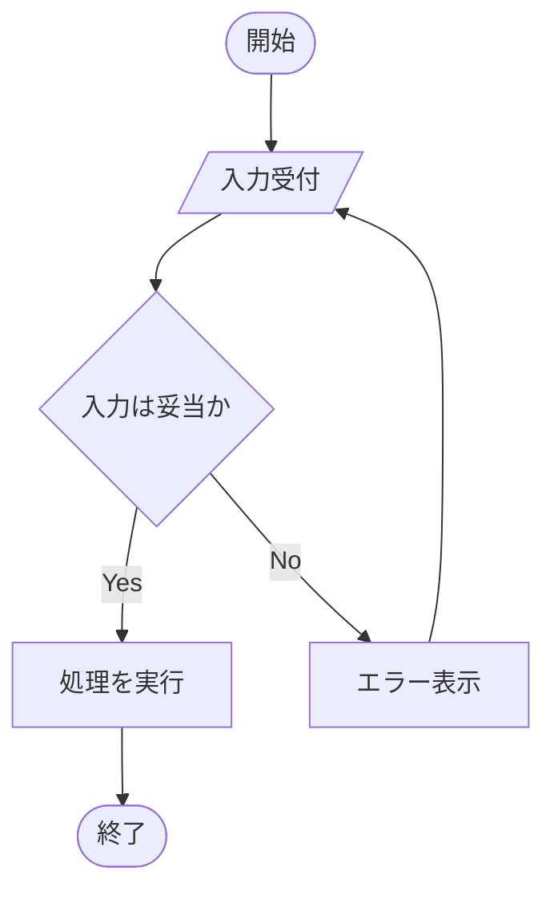

**コードのポイント:**

- `Start([開始])` は開始ノード（楕円形）、`End([終了])` が終了ノード
- `Input[/入力受付/]` は平行四辺形で入出力を表す
- `Check{入力は妥当か}` はひし形の分岐ノード、`-->|Yes|`/`-->|No|` でラベル付き分岐を表現
- `Error --> Input` で入力からやり直すループになっている

subgraphでグルーピングする例です。

**ソースコード:**

```text
flowchart LR
    subgraph Client[クライアント]
        UI[画面]
    end
    subgraph Server[サーバー]
        API[API]
        DB[(データベース)]
    end
    UI --> API --> DB
```

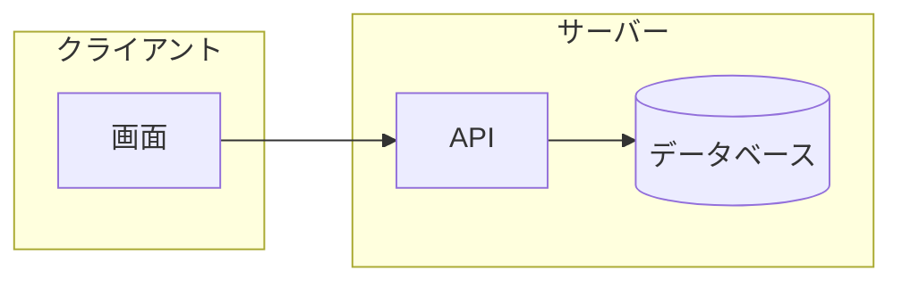

**コードのポイント:**

- `subgraph Client[クライアント] ... end` でノードをグループ化し、枠付きで表示する
- `DB[(データベース)]` は円柱形でデータベースを表す
- グループ間の矢印（`UI --> API --> DB`）はグループ内ノードを指定するだけでよい

### 1.1.6 演習課題

1. 「ログイン成功/失敗」を分岐させるflowchartを書け
2. subgraphを2つ使い、クライアントとサーバーの処理を分けて表現せよ

### 1.1.7 理解度チェック

- [ ] ノードの形の使い分けが説明できる
- [ ] 分岐ノード（ひし形）とラベル付き矢印を組み合わせて書ける
- [ ] subgraphで処理をグルーピングできる

---

[← 01. Mermaid基礎 目次](00-README.md) | [次へ: sequenceDiagram →](02-sequence-diagram.md)

## 1.2 sequenceDiagram

### 1.2.1 この教材で身につくこと

- participant/actorの使い分け
- メッセージ矢印の種類とactivate/deactivate
- loop/altブロックによる繰り返し・条件分岐の表現

### 1.2.2 概要

sequenceDiagramは、複数の登場人物（人・システム・エージェント）の間で
やり取りされるメッセージを時系列に沿って表す図です。

### 1.2.3 位置づけ

生成AIエージェントとツール呼び出しのやり取りなど、「誰が・いつ・何を
呼び出すか」を明確にしたい場面で使います。flowchartでは表現しにくい
時系列の詳細を補います。

### 1.2.4 基本文法・プロパティ解説

#### 1.2.4.1 登場人物の宣言

| 記法 | 意味 |
|------|------|
| `participant X` | システムなどの登場人物 |
| `participant X as 表示名` | 表示名を指定 |
| `actor X as 表示名` | 人型アイコンの登場人物 |

#### 1.2.4.2 メッセージ矢印

| 記法 | 意味 |
|------|------|
| `->>` | 実線・非同期メッセージ |
| `-->>` | 破線・応答メッセージ |
| `activate X` / `deactivate X` | 処理中であることを示す帯 |

### 1.2.5 実ソースコード

**ソースコード:**

```text
sequenceDiagram
    actor User as ユーザー
    participant Agent as AIエージェント
    participant Tool as 外部ツール

    User->>Agent: タスクを依頼
    activate Agent
    Agent->>Tool: ツール呼び出し
    activate Tool
    Tool-->>Agent: 実行結果
    deactivate Tool
    Agent-->>User: 結果を返却
    deactivate Agent
```

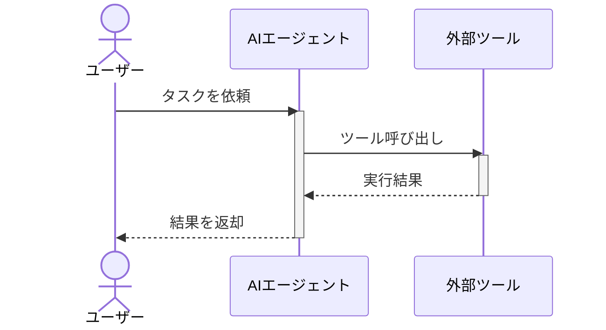

**コードのポイント:**

- `actor User as ユーザー` は人型アイコン、`participant` はシステムを表す
- `activate Agent` / `deactivate Agent` で処理中の帯を表示する
- `->>` は実線の依頼メッセージ、`-->>` は破線の応答メッセージ

`loop`と`alt`で繰り返し・条件分岐を表現する例です。

**ソースコード:**

```text
sequenceDiagram
    participant Agent
    participant Tool

    loop 最大3回リトライ
        Agent->>Tool: リクエスト送信
        alt 成功
            Tool-->>Agent: 成功レスポンス
        else 失敗
            Tool-->>Agent: エラー
        end
    end
```

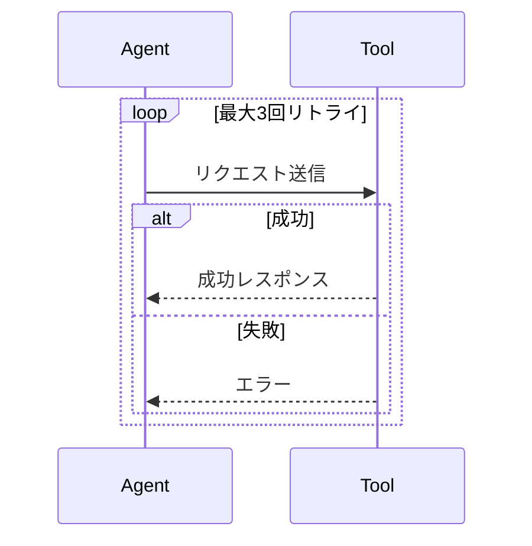

**コードのポイント:**

- `loop 最大3回リトライ ... end` で繰り返し区間を囲む
- `alt 成功 ... else 失敗 ... end` で条件分岐を表現する
- ラベル文字列（`最大3回リトライ`、`成功`）はそのまま図に表示される

### 1.2.6 演習課題

1. ユーザー・エージェント・2つのツールが登場するsequenceDiagramを書け
2. `alt`を使い、ツール呼び出しの成功/失敗を分岐させよ

### 1.2.7 理解度チェック

- [ ] participantとactorの違いが説明できる
- [ ] activate/deactivateで処理中区間を表現できる
- [ ] loop/altで繰り返し・条件分岐を表現できる

---

[← 前へ: flowchart](01-flowchart.md) | [次へ: class/stateDiagram →](03-state-and-class-diagram.md)

## 1.3 classDiagram / stateDiagram

### 1.3.1 この教材で身につくこと

- classDiagramでの構造・関連の表現
- stateDiagram-v2での状態と遷移条件の表現
- SkillやAgentのようなオブジェクト設計への応用

### 1.3.2 概要

classDiagramは「モノの構造と関係」を、stateDiagramは「モノの状態遷移」
を表す図です。AI Skillの内部設計を整理する際によく使います。

### 1.3.3 位置づけ

flowchart/sequenceDiagramが「処理の流れ」を表すのに対し、
classDiagram/stateDiagramは「構造」と「状態」に焦点を当てます。
[生成AIでのSkill開発への適用](../04-ai-skill-workflows/00-README.md)での実践例の前提知識になります。

### 1.3.4 基本文法・プロパティ解説

#### 1.3.4.1 classDiagramの関連記法

| 記法 | 意味 |
|------|------|
| `-->` | 関連 |
| `"1" --> "*"` | 多重度付き関連 |
| `+field` | public属性 |
| `+method() 戻り値` | メソッド |

#### 1.3.4.2 stateDiagramの記法

| 記法 | 意味 |
|------|------|
| `[*] --> State` | 初期状態 |
| `State --> [*]` | 終了状態 |
| `A --> B : 条件` | 遷移条件ラベル |

### 1.3.5 実ソースコード

**ソースコード:**

```text
classDiagram
    class Skill {
        +String name
        +String description
        +run(input) Result
    }
    class Tool {
        +String name
        +invoke(args) Output
    }
    Skill "1" --> "*" Tool : uses
```

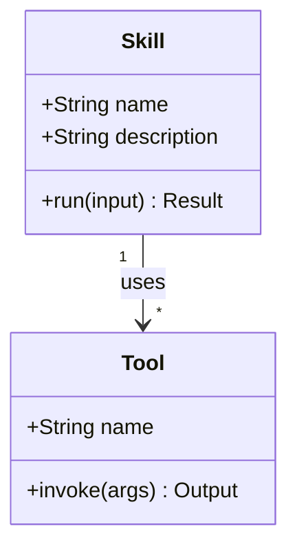

**コードのポイント:**

- `class Skill { ... }` の中に `+`（public）属性・メソッドを列挙する
- `run(input) Result` はメソッド名・引数・戻り値の順で書く
- `Skill "1" --> "*" Tool : uses` は「Skill 1つに対しTool複数」の多重度付き関連

**ソースコード:**

```text
stateDiagram-v2
    [*] --> Idle
    Idle --> Running : タスク受信
    Running --> WaitingForTool : ツール呼び出し
    WaitingForTool --> Running : 結果受信
    Running --> Done : 完了
    Running --> Failed : エラー
    Done --> [*]
    Failed --> [*]
```

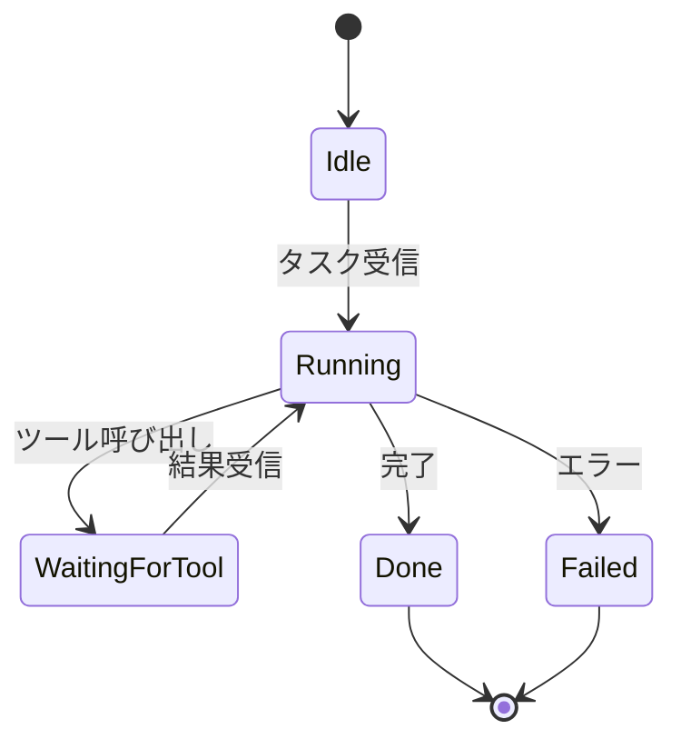

**コードのポイント:**

- `[*] --> Idle` は初期状態、`Done --> [*]` / `Failed --> [*]` は終了状態を表す
- `A --> B : 条件` の`:`以降が遷移条件のラベルになる
- `Running`が複数の遷移先（`WaitingForTool`/`Done`/`Failed`）を持てる

### 1.3.6 演習課題

1. Skillが複数のToolを保持するclassDiagramを、多重度付きで書け
2. 「待機中→実行中→完了/失敗」のstateDiagramを書け

### 1.3.7 理解度チェック

- [ ] classDiagramで多重度付き関連が書ける
- [ ] stateDiagramで初期状態と終了状態を表現できる
- [ ] 遷移条件をラベルとして書ける

---

[← 前へ: sequenceDiagram](02-sequence-diagram.md) | [次へ: その他の図 →](04-other-diagrams.md)

## 1.4 その他の図（ER・gantt・mindmap・requirementDiagram）

### 1.4.1 この教材で身につくこと

- erDiagramでのデータ構造表現
- ganttでのスケジュール表現
- mindmapでのアイデア整理
- requirementDiagramでの要件・実装要素の対応表現

### 1.4.2 概要

Mermaidにはflowchart/sequence/class/state以外にも、目的に応じた
図の種類が用意されています。ここでは代表的な4種を扱います。

### 1.4.3 位置づけ

これらは頻度は低いものの、要件定義・スケジュール調整・
アイデア出しなど、Skill開発の周辺工程で役立ちます。

### 1.4.4 基本文法・プロパティ解説

#### 1.4.4.1 主な要素

| 図の種類 | 主なキーワード | 用途 |
|---|---|---|
| erDiagram | `\|\|--o{`, `}o--\|\|` | データ構造・関連 |
| gantt | `dateFormat`, `section` | スケジュール |
| mindmap | `root((...))` | アイデア整理 |
| requirementDiagram | `requirement`, `element`, `satisfies` | 要件と実装の対応 |

### 1.4.5 実ソースコード

**ソースコード:**

```text
erDiagram
    SKILL ||--o{ TOOL_CALL : invokes
    TOOL_CALL }o--|| TOOL : targets
    SKILL {
        string name
        string description
    }
    TOOL {
        string name
        string endpoint
    }
```

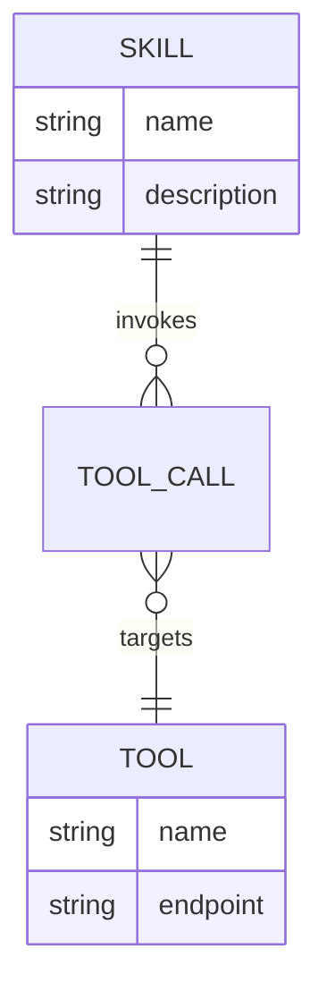

**コードのポイント:**

- `||--o{` は「1対多」、`}o--||` は「多対1」の関連を表す
- `SKILL { string name ... }` でエンティティの属性を列挙する
- `TOOL_CALL`を中間エンティティとして`SKILL`と`TOOL`をつないでいる

**ソースコード:**

```text
gantt
    title Skill開発スケジュール
    dateFormat YYYY-MM-DD
    section 設計
    要件整理 :a1, 2026-07-01, 3d
    図表設計 :a2, after a1, 2d
    section 実装
    Skill実装 :a3, after a2, 5d
    テスト :a4, after a3, 3d
```

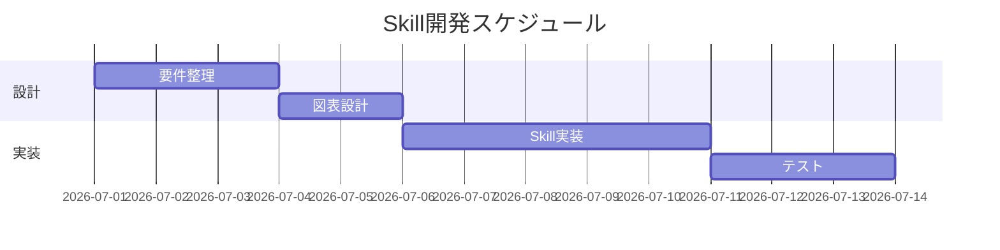

**コードのポイント:**

- `dateFormat YYYY-MM-DD` で日付形式を指定する
- `section 設計` のようにセクションでタスクをグルーピングする
- `after a1` で前のタスク（`a1`）の完了後に開始することを表す

**ソースコード:**

```text
mindmap
  root((AI Skill開発))
    設計
      要件定義
      図表化
    実装
      SKILL.md
      ツール連携
    検証
      テスト
      レビュー
```

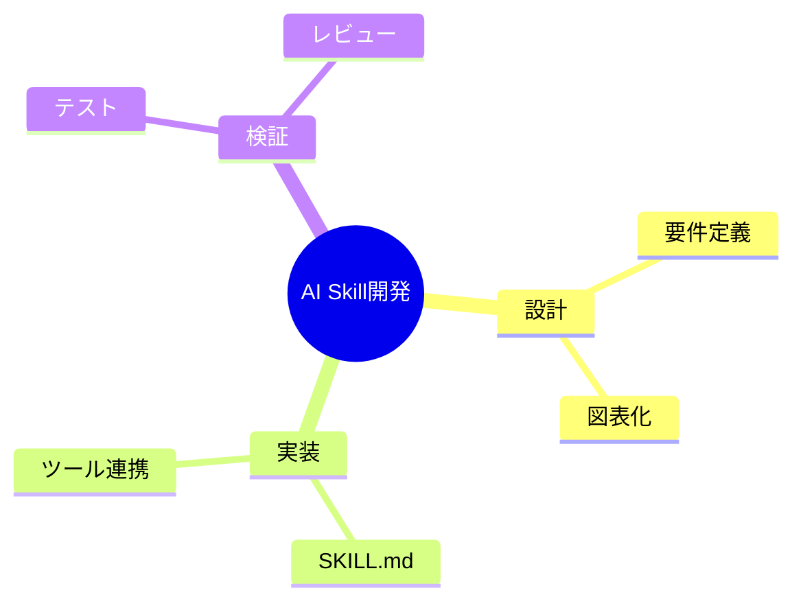

**コードのポイント:**

- `root((AI Skill開発))` がマインドマップの中心ノード
- インデントの深さが階層構造を表す
- 兄弟ノード（`設計`/`実装`/`検証`）は横並びの枝になる

**ソースコード:**

```text
requirementDiagram
    requirement SkillDoc {
      id: 1
      text: SkillはSKILL.mdで説明される
      risk: medium
      verifymethod: inspection
    }

    functionalRequirement DiagramSupport {
      id: 2
      text: SKILL.mdは図表を含められる
      risk: low
      verifymethod: inspection
    }

    element SkillMdFile {
      type: document
    }

    SkillDoc - satisfies -> DiagramSupport
    DiagramSupport - traces -> SkillMdFile
```

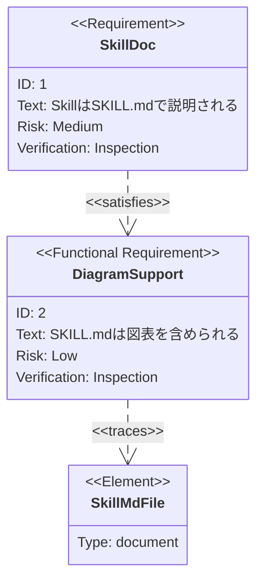

**コードのポイント:**

- `requirement`/`functionalRequirement` で要件の種類を宣言する
- `id`/`text`/`risk`/`verifymethod` が要件の属性
- `- satisfies ->` / `- traces ->` で要件と実装要素の対応関係を表す

### 1.4.6 演習課題

1. SkillとToolの1対多関係をerDiagramで書け
2. 自分のSkill開発タスクを3つ、mindmapで整理せよ

### 1.4.7 理解度チェック

- [ ] erDiagramの多重度記法（`\|\|`, `o{`）が説明できる
- [ ] ganttでタスクの依存関係（`after`）を表現できる
- [ ] requirementDiagramで要件と実装要素の対応が書ける

---

[← 前へ: class/stateDiagram](03-state-and-class-diagram.md) | [次へ: リリース履歴 →](05-release-history.md)

## 1.5 Mermaidのリリース履歴

### 1.5.1 この教材で身につくこと

- Mermaidのバージョンがどう進化してきたかの全体像
- メジャーバージョンごとの破壊的変更・注目機能
- 「今使っているMermaidが古いかどうか」を判断する視点

### 1.5.2 概要

Mermaidは2014年にKnut Sveidqvist氏が個人で作ったツールですが、
2022年のGitHubネイティブ対応を境に採用が急拡大し、
現在も数週間おきにマイナーバージョンがリリースされています。

### 1.5.3 位置づけ

01-04で構文を学んだ上で、「なぜこの書き方ができる/できないのか」を
バージョンの違いから理解するための補足教材です。
新しい構文が動かないときは、まずバージョンを疑う習慣をつけます。

### 1.5.4 基本文法・プロパティ解説

#### 1.5.4.1 メジャーバージョンの年表

| バージョン | リリース日 | 主な変更点 |
|---|---|---|
| 最初のリリース | 2014-12 | flowchart・sequenceDiagramの2種類のみ |
| v6.0.0 | 2016-05-29 | 内部構造の整理 |
| v7.0.0 | 2017-01-29 | 内部構造の整理 |
| v8.0.0 | 2018-12-18 | d3.js v4対応、SVGにスタイルをインライン化 |
| （GitHub対応） | 2022-02-14 | GitHubがMarkdown内Mermaidのネイティブ描画に対応 |
| v9.0.0 | 2022-04-07 | mindmap追加（v9.2、2022-11-01） |
| v10.0.0 | 2023-02-21 | ESM専用化（CommonJS廃止）、`render()`が非同期APIに |
| v11.0.0 | 2024-08-23 | 描画エンジン刷新、レイアウトアルゴリズム切替対応、packet図追加 |
| v11.16.0（最新） | 2026-06-25 | Cynefinフレームワーク図、Railroad図、Swimlane単独図 |

#### 1.5.4.2 なぜ知る必要があるか

- **`render()`の非同期化（v10）**: v9以前のコールバック前提のコードは
  v10以降そのままでは動かない
- **ESM専用化（v10）**: `require('mermaid')`のCommonJS読み込みが不可になった
- **描画エンジン刷新（v11）**: レイアウトアルゴリズムを`elk`などに
  切り替えられるようになり、大規模フローチャートの見え方が変わる
- **GitHub対応（2022-02-14）**: この日を境にREADME等へMermaidを
  埋め込む文化が急速に広まった

### 1.5.5 実ソースコード

年表をMermaidの`timeline`図で表現します。

**ソースコード:**

```text
timeline
    title Mermaidの主要リリース年表
    2014 : 初版公開（flowchart・sequenceDiagramのみ）
    2018 : v8.0.0（d3 v4対応）
    2022 : GitHubネイティブ描画対応 : v9.0.0
    2023 : v10.0.0（ESM専用化）
    2024 : v11.0.0（描画エンジン刷新）
    2026 : v11.16.0（最新、Railroad図など）
```

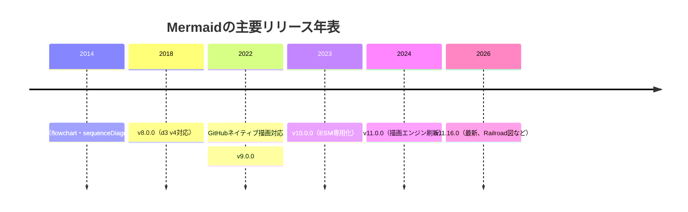

**コードのポイント:**

- `title` で年表全体のタイトルを指定する
- `年 : 出来事` の形式で1つの時点に複数の出来事を`:`区切りで並べられる
- 年の指定は昇順である必要があり、逆順にするとレイアウトが崩れる

### 1.5.6 演習課題

1. 自分が使っているMermaidのバージョンを`npm list mermaid`等で確認し、
   このページの年表のどこに位置するか答えよ
2. v10のESM専用化が、自分のプロジェクトに影響するか調査せよ

### 1.5.7 理解度チェック

- [ ] v10でのESM専用化・非同期API化の影響が説明できる
- [ ] v11で描画エンジンが刷新されたことを説明できる
- [ ] `timeline`図で年表を表現できる

---

[← 前へ: その他の図](04-other-diagrams.md) | [次へ: 02. Graphviz基礎 →](../02-graphviz-basics/00-README.md)

# 2. Graphviz基礎

## 2.1 DOT言語の基本

### 2.1.1 この教材で身につくこと

- digraph/graphの違い
- ノードとエッジの最小記法
- コメントの書き方

### 2.1.2 概要

GraphvizはDOT言語でグラフを記述します。有向グラフは`digraph`、
無向グラフは`graph`で宣言します。

### 2.1.3 位置づけ

Mermaidのflowchartに近い役割ですが、DOT言語はより厳密で、
大規模な構造図やレイアウトの自動最適化に強みがあります。

### 2.1.4 基本文法・プロパティ解説

#### 2.1.4.1 基本要素

| 要素 | 意味 |
|------|------|
| `digraph 名前 { ... }` | 有向グラフの宣言 |
| `graph 名前 { ... }` | 無向グラフの宣言 |
| `A -> B;` | 有向エッジ |
| `A -- B;` | 無向エッジ |
| `// コメント` | 1行コメント |

### 2.1.5 実ソースコード

`docs/02-graphviz-basics/examples/01-basic.dot`

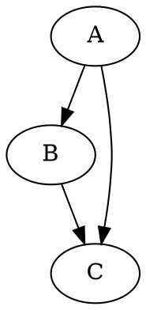

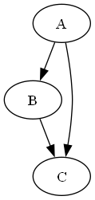

**コードのポイント:**

- `digraph Basic { ... }` で有向グラフを宣言する
- `A -> B;` のように`->`でエッジ（有向）をつなぐ
- `A -> C;` のように同じノードから複数のエッジを出せる

### 2.1.6 演習課題

1. 4つのノードを持つ有向グラフを書け（A→B→C→D）
2. 無向グラフ（`graph`）でA-B-Cの関係を書け

### 2.1.7 理解度チェック

- [ ] digraphとgraphの違いが説明できる
- [ ] `->`と`--`の使い分けができる
- [ ] コメントを使って記述を補足できる

---

[← 02. Graphviz基礎 目次](00-README.md) | [次へ: ノード・エッジ属性 →](02-node-edge-attributes.md)

## 2.2 ノード・エッジ属性

### 2.2.1 この教材で身につくこと

- ノード全体・個別ノードへの属性指定
- shape/style/color/labelの使い方
- エッジの矢印・色の制御

### 2.2.2 概要

Graphvizは`node [...]`や`edge [...]`でデフォルト属性を一括指定でき、
個別ノード・エッジで上書きもできます。

### 2.2.3 位置づけ

01で作った最小グラフに「見た目」を加える段階です。
Skillアーキテクチャ図など、意味を色や形で区別したい場面で使います。

### 2.2.4 基本文法・プロパティ解説

#### 2.2.4.1 主なノード属性

| 属性 | 意味 | 例 |
|------|------|-----|
| `shape` | 形 | `box`, `ellipse`, `diamond` |
| `style` | スタイル | `filled`, `rounded`, `dashed` |
| `fillcolor` | 塗りつぶし色 | `"#eef2ff"` |
| `label` | 表示テキスト | `"開始"` |
| `fontname` | フォント | `"Meiryo"` |

#### 2.2.4.2 主なエッジ属性

| 属性 | 意味 | 例 |
|------|------|-----|
| `color` | 線の色 | `"#4b5563"` |
| `arrowhead` | 矢印の形 | `vee`, `normal`, `diamond` |
| `style` | 線種 | `dashed`, `dotted` |

### 2.2.5 実ソースコード

`docs/02-graphviz-basics/examples/02-attributes.dot`

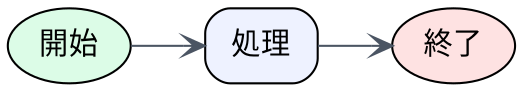

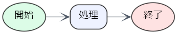

**コードのポイント:**

- `node [...]` で全ノード共通のデフォルト属性（shape/style/fillcolor/fontname）を設定する
- `Start [label="開始", ...]` のように個別ノードで属性を上書きできる
- `edge [color="#4b5563", arrowhead=vee]` でエッジのデフォルト属性を設定する

### 2.2.6 演習課題

1. `node [...]`で全ノード共通のshape/styleを指定せよ
2. 特定のノードだけ`fillcolor`を変えて強調せよ

### 2.2.7 理解度チェック

- [ ] `node [...]`と個別ノード属性の優先順位が説明できる
- [ ] shape/style/fillcolorを組み合わせて意味を区別できる
- [ ] エッジのarrowheadを変更できる

---

[← 前へ: DOT言語の基本](01-dot-language-basics.md) | [次へ: レイアウト制御 →](03-layout-and-rankdir.md)

## 2.3 レイアウト制御

### 2.3.1 この教材で身につくこと

- rankdirによる全体方向の制御
- subgraph clusterによるグルーピング
- レイアウトが崩れたときの調整の考え方

### 2.3.2 概要

Graphvizはノード・エッジの配置を自動計算しますが、`rankdir`や
`subgraph cluster_*`で意図した構造に近づけることができます。

### 2.3.3 位置づけ

Mermaidのsubgraphに近い機能ですが、Graphvizは`cluster_`接頭辞と
`rankdir`の組み合わせでより精密にレイアウトを制御できます。

### 2.3.4 基本文法・プロパティ解説

#### 2.3.4.1 rankdirの値

| 値 | 方向 |
|----|------|
| `TB` | 上から下（既定） |
| `LR` | 左から右 |
| `BT` | 下から上 |
| `RL` | 右から左 |

#### 2.3.4.2 クラスタの書き方

サブグラフ名を`cluster_`で始めると、Graphvizが枠で囲って描画します。

```dot
subgraph cluster_名前 {
  label="表示名";
  style=dashed;
  ノードA;
  ノードB;
}
```

### 2.3.5 実ソースコード

`docs/02-graphviz-basics/examples/03-rankdir.dot`

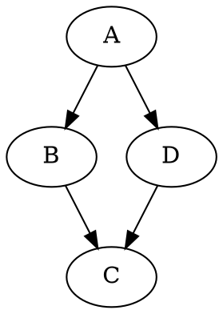


**コードのポイント:**

- `rankdir=TB` で上から下へのレイアウトになる（既定値と同じ）
- `A -> B -> C;` は `A -> B; B -> C;` と同じ意味のチェーン記法
- `A`から`B`経由と`D`経由の2系統が`C`で合流する構造

`docs/02-graphviz-basics/examples/04-cluster.dot`

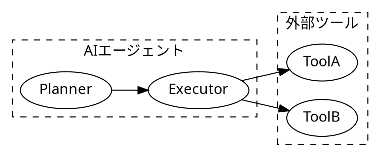

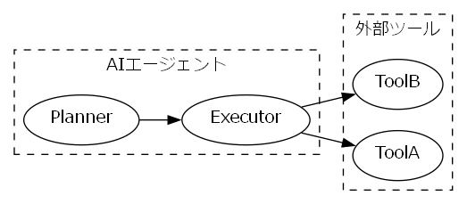

**コードのポイント:**

- `subgraph cluster_agent { ... }` のように`cluster_`で始めると枠付きで描画される
- `label="AIエージェント"` でクラスタ内に表示するラベルを指定する
- `Executor -> ToolA;` のようにクラスタ外のノードへもエッジを張れる

### 2.3.6 演習課題

1. `rankdir=LR`と`rankdir=TB`で同じグラフを描き、違いを比較せよ
2. クラスタを2つ使い、「エージェント側」「ツール側」を分けて表現せよ

### 2.3.7 理解度チェック

- [ ] rankdirの4つの値の違いが説明できる
- [ ] `cluster_`接頭辞でグルーピングできる
- [ ] クラスタ間のエッジがどう描画されるか説明できる

---

[← 前へ: ノード・エッジ属性](02-node-edge-attributes.md) | [次へ: リリース履歴 →](04-release-history.md)

## 2.4 Graphvizのリリース履歴

### 2.4.1 この教材で身につくこと

- Graphvizのバージョン番号の意味と、その変遷
- なぜ短期間でメジャーバージョンが13まで進んだのかの理解
- 「最新版か古い実装か」を見分ける視点

### 2.4.2 概要

Graphvizは1980年代後半にAT&T Bell研究所で生まれた歴史あるツールです。
2021年末まで「偶数マイナー=安定版」という独自の番号方式でしたが、
2022年に厳密なSemVerへ移行し、以降は毎年メジャーバージョンが
上がっています。

### 2.4.3 位置づけ

01-03でDOT言語の基本を学んだ上で、「バージョンによる違い」を
理解し、古い解説記事の情報を鵜呑みにしないための補足教材です。

### 2.4.4 基本文法・プロパティ解説

#### 2.4.4.1 バージョン番号方式の変遷

| 期間 | 方式 | 内容 |
|---|---|---|
| 〜2021 | 偶数=安定版 | マイナー番号が偶数なら安定版、奇数なら開発版 |
| 2022〜 | 厳密なSemVer | 破壊的変更があれば必ずメジャー番号を上げる |

厳密なSemVer移行後は、内部API・出力フォーマットの小さな変更でも
メジャー番号が上がるため、「メジャーバージョンが違う=大幅刷新」
とは限らない点に注意してください。

#### 2.4.4.2 メジャーバージョンの年表

| バージョン | リリース日 | 備考 |
|---|---|---|
| 1.7.4（最古の記録） | 2000-12-15 | オープンソース公開後の初期バージョン |
| 2.0.0 | 2004-12-11 | |
| 2.40.0 | 2016-12-20 | 偶数=安定版方式の終盤 |
| 2.50.0 | 2021-12-04 | 旧番号方式での最終リリース |
| 3.0.0 | 2022-02-26 | SemVer移行後の最初のメジャーリリース |
| 7.0.0 | 2022-10-23 | |
| 9.0.0 | 2023-09-11 | |
| 11.0.0 | 2024-04-28 | |
| 13.0.0 | 2025-06-08 | |
| 15.1.0（最新） | 2026-06-18 | |

### 2.4.5 実ソースコード

`docs/02-graphviz-basics/examples/05-release-history.dot`

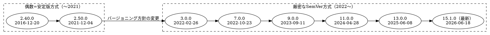

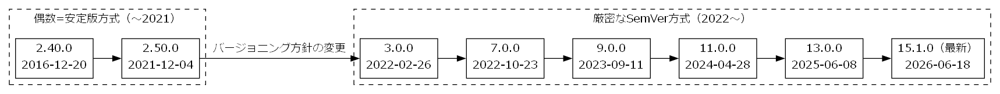

**コードのポイント:**

- `cluster_old`/`cluster_new` の2クラスタで番号方式の前後を分けている
- クラスタ間の`v2_50 -> v3_0`エッジにラベルを付け、移行点を明示している
- チェーン記法（`v3_0 -> v7_0 -> ...`）で同方式内の推移を1行で表現している

### 2.4.6 演習課題

1. `dot -V` で自分の環境のGraphvizバージョンを確認し、年表上の位置を答えよ
2. 旧番号方式（偶数=安定版）と現行のSemVer方式の違いを1文で説明せよ

### 2.4.7 理解度チェック

- [ ] 2021年を境にバージョン番号の付け方が変わったことを説明できる
- [ ] メジャーバージョンが違っても大幅刷新とは限らない理由が説明できる
- [ ] クラスタを使って「方式ごとのグループ」を表現できる

---

[← 前へ: レイアウト制御](03-layout-and-rankdir.md) | [次へ: 03. 図の選び方と整理法 →](../03-diagram-patterns/00-README.md)

# 3. 図の選び方と整理法

## 3.1 Mermaid vs Graphviz

### 3.1.1 この教材で身につくこと

- MermaidとGraphvizの特性の違い
- どちらを選ぶべきかの判断基準

### 3.1.2 概要

MermaidはMarkdownに埋め込みやすい手軽さが強みで、Graphvizは
レイアウト制御と大規模グラフの描画に強みがあります。

### 3.1.3 位置づけ

01・02カテゴリで両方の基本構文を学んだ上で、実務でどちらを
選ぶかを判断する基準を整理する教材です。

### 3.1.4 基本文法・プロパティ解説

#### 3.1.4.1 特性比較

| 項目 | Mermaid | Graphviz |
|------|---------|----------|
| 用途 | ドキュメント内の簡易図 | 仕様・構造・大規模グラフ |
| 記法 | Markdownに埋め込みやすい | DOT言語 |
| レイアウト | シンプル | 高度に制御しやすい |
| GitHub/VS Codeでの表示 | ネイティブ描画される | されない（画像化が必要） |
| 生成AIとの相性 | 非常に良い、短い指示で生成できる | 良いが構文の厳密さがやや必要 |

### 3.1.5 実ソースコード

判断の目安をflowchartで示します。

**ソースコード:**

```text
flowchart TD
    Q1{Markdownにそのまま埋め込みたいか}
    Q1 -->|Yes| Mermaid[Mermaidを使う]
    Q1 -->|No| Q2{レイアウトを細かく制御したいか}
    Q2 -->|Yes| Graphviz[Graphvizを使う]
    Q2 -->|No| Mermaid
```

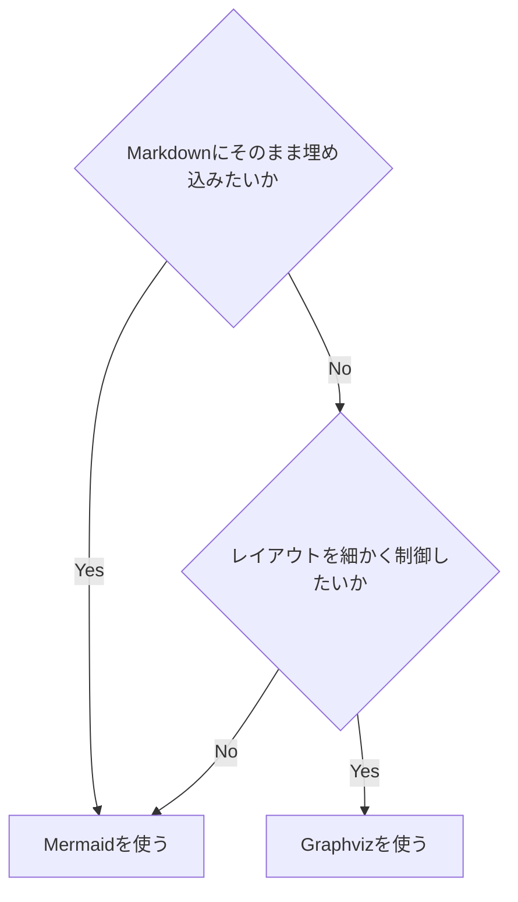

**コードのポイント:**

- `Q1{...}`/`Q2{...}` はひし形の判断ノード
- `-->|Yes|`/`-->|No|` のラベルで分岐条件を明示する
- `Q2 -->|No| Mermaid` のように既存ノードへ戻す形で最終的な結論を示せる

### 3.1.6 演習課題

1. 自分が最近作った図を1つ思い出し、Mermaid/Graphvizどちらが
   適していたか理由とともに答えよ

### 3.1.7 理解度チェック

- [ ] MermaidとGraphvizの表示方法の違いが説明できる
- [ ] レイアウト制御の必要性で使い分けを判断できる

---

[← 03. 図の選び方と整理法 目次](00-README.md) | [次へ: 図の選び方 →](02-choosing-the-right-diagram.md)

## 3.2 図の選び方

### 3.2.1 この教材で身につくこと

- 目的別にMermaidの図の種類を選べる
- 「何を伝えたいか」から図の種類を逆算できる

### 3.2.2 概要

図の種類は目的によって決まります。ここでは目的から図の種類を
逆引きできる表を用意します。

### 3.2.3 位置づけ

01の使い分け基準を踏まえ、Mermaid内でさらに「どの図か」を
選ぶための実践的なチェックリストです。

### 3.2.4 基本文法・プロパティ解説

#### 3.2.4.1 目的別の図の種類

| 伝えたいこと | 適した図 |
|---|---|
| 処理の流れ・分岐 | flowchart |
| 誰が何をいつ呼び出すか | sequenceDiagram |
| オブジェクトの構造・関係 | classDiagram |
| 状態の遷移 | stateDiagram |
| データの構造・関連 | erDiagram |
| スケジュール | gantt |
| アイデアの整理 | mindmap |
| 要件と実装の対応 | requirementDiagram |
| 大規模・複雑な構造 | Graphviz |

### 3.2.5 実ソースコード

**ソースコード:**

```text
flowchart LR
    A[伝えたいことを1文で書く] --> B[上の表と照合する]
    B --> C[候補が複数あれば一番シンプルな図を選ぶ]
```

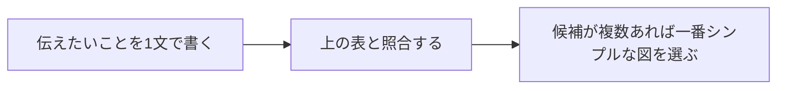

**コードのポイント:**

- `flowchart LR` で左から右への3ステップの流れを表す
- 各ノードのテキストがそのまま手順の説明になっている
- 分岐がない単純な直線フローの例

開発フェーズごとにどの成果物でどの図を使うかは
[06. プロジェクト開発フェーズと図](../06-project-phase-diagrams/00-README.md)で
詳しく扱います。

### 3.2.6 演習課題

1. 「Skillが3つのツールをどの順番で呼ぶか」を伝えたい場合、
   どの図が適切か表を使って答えよ

### 3.2.7 理解度チェック

- [ ] 目的から図の種類を選べる
- [ ] 候補が複数あるとき、シンプルさを優先する判断ができる

---

[← 前へ: Mermaid vs Graphviz](01-mermaid-vs-graphviz.md) | [次へ: 複雑な図の整理法 →](03-complex-diagram-organization.md)

## 3.3 複雑な図の整理法

### 3.3.1 この教材で身につくこと

- 大きくなった図を分割する判断基準
- subgraph/clusterでのグルーピング整理
- 「1つの図に詰め込みすぎない」ための工夫

### 3.3.2 概要

ノードやエッジが増えすぎた図は読みにくくなります。
分割・グルーピングで可読性を保つ手法を学びます。

### 3.3.3 位置づけ

01・02で選んだ図を、実際に運用可能なレベルまで整理する
仕上げの教材です。05カテゴリの実践例につながります。

### 3.3.4 基本文法・プロパティ解説

#### 3.3.4.1 分割の目安

| 状況 | 対応 |
|------|------|
| ノードが15個を超える | 複数の図に分割する |
| 1つの図に3階層以上の詳細がある | 概要図と詳細図に分ける |
| 同じ意味のグループが繰り返される | subgraph/clusterでまとめる |

### 3.3.5 実ソースコード

概要図と詳細図に分割する例です。

**ソースコード:**

```text
flowchart TD
    subgraph Overview[概要図]
        User[ユーザー] --> Skill[Skill]
        Skill --> Result[結果]
    end
```

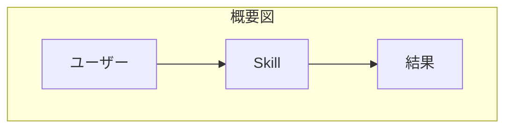

**コードのポイント:**

- `subgraph Overview[概要図] ... end` で概要図全体を1つの枠にまとめている
- ノード数は3個のみに抑え、全体の流れだけを示す

**ソースコード:**

```text
flowchart TD
    subgraph SkillDetail[Skill内部の詳細図]
        Input[入力解析] --> Plan[計画立案]
        Plan --> ToolCall[ツール呼び出し]
        ToolCall --> Format[結果整形]
    end
```

```mermaid
flowchart TD
    subgraph SkillDetail[Skill内部の詳細図]
        Input[入力解析] --> Plan[計画立案]
        Plan --> ToolCall[ツール呼び出し]
        ToolCall --> Format[結果整形]
    end
```

**コードのポイント:**

- `subgraph SkillDetail[Skill内部の詳細図] ... end` で概要図の`Skill`ノードを詳細化している
- 4ステップの内部処理（入力解析→計画立案→ツール呼び出し→結果整形）を示す
- 概要図と詳細図を分けることで、それぞれのノード数を少なく保てる

### 3.3.6 演習課題

1. ノード20個規模の図を想定し、どう2つの図に分割するか設計せよ
2. 繰り返し登場するグループをsubgraphでまとめよ

### 3.3.7 理解度チェック

- [ ] 図を分割すべきタイミングが判断できる
- [ ] 概要図と詳細図の役割の違いが説明できる

---

[← 前へ: 図の選び方](02-choosing-the-right-diagram.md) | [次へ: 04. 生成AIでのSkill開発への適用 →](../04-ai-skill-workflows/00-README.md)

# 4. 生成AIでのSkill開発への適用

## 4.1 SKILL.mdへの図の組み込み

### 4.1.1 この教材で身につくこと

- SKILL.md内でMermaid図を使う典型パターン
- 図と本文説明を両立させる配置方法

### 4.1.2 概要

SKILL.mdはSkillの目的・使い方をAIエージェントと人間の両方に
伝えるドキュメントです。図を添えることで処理の全体像が伝わりやすくなります。

### 4.1.3 位置づけ

01-03カテゴリで学んだMermaid/Graphvizの構文を、実際のSKILL.md
というフォーマットに落とし込む最初の教材です。

### 4.1.4 基本文法・プロパティ解説

#### 4.1.4.1 配置の基本方針

| 配置場所 | 目的 |
|---|---|
| 概要セクションの直後 | Skill全体の処理フローを示す |
| 個別手順の説明の直後 | その手順の詳細（分岐・ループ）を示す |
| トラブルシューティング欄 | エラー時の分岐を示す |

### 4.1.5 実ソースコード

SKILL.mdの一部を想定した例です。

```markdown
---
name: diagram-review
description: 図表付きドキュメントをレビューするSkill
---

# diagram-review Skill

## 処理の流れ

\`\`\`mermaid
flowchart TD
    Input[Markdown受領] --> Detect{図が含まれるか}
    Detect -->|Yes| Render[図の構文チェック]
    Detect -->|No| Skip[図なしとして通過]
    Render --> Report[レビュー結果を返す]
    Skip --> Report
\`\`\`

## 使い方

1. レビュー対象のMarkdownファイルを渡す
2. 図の構文エラーがあれば指摘される
```

**コードのポイント:**

- `---`で囲んだYAML frontmatterに`name`/`description`を書くのがSKILL.mdの決まり
- 見出し（`## 処理の流れ`）の直後に \`\`\`mermaid ブロックを置くと、処理全体が一目で伝わる
- 図の直後に「## 使い方」で具体的な手順を続けることで、図と文章が補完し合う

#### 4.1.5.1 この図を生成AIに作らせるプロンプト例

```markdown
diagram-review Skillの処理フローをflowchartで書いてください。
「Markdown受領→図が含まれるか判定→構文チェック or 通過→
レビュー結果を返す」の4ステップにし、日本語ラベルで
SKILL.mdにそのまま貼り付けられる形にしてください。
```

このプロンプトから得られる図が、上のSKILL.md例に埋め込まれている
flowchartです。

### 4.1.6 演習課題

1. 自分のSkillの処理フローをMermaidで書き、SKILL.mdに追記せよ

### 4.1.7 理解度チェック

- [ ] SKILL.md内のどこに図を置くと伝わりやすいか説明できる
- [ ] コードフェンスのネスト（```markdown内の```mermaid）を正しく書ける

---

[← 04. 生成AIでのSkill開発への適用 目次](00-README.md) | [次へ: 生成AIへの図生成プロンプト →](02-prompting-ai-to-generate-diagrams.md)

## 4.2 生成AIへの図生成プロンプト

### 4.2.1 この教材で身につくこと

- 図を生成させるプロンプトに含めるべき要素
- Mermaid/Graphvizそれぞれのプロンプトの違い

### 4.2.2 概要

生成AIに「図の種類」「目的」「対象読者」を明示すると、
一発で使える図に近づきます。

### 4.2.3 位置づけ

01でSKILL.mdへの配置方法を学んだ後、その図を生成AI自身に
書かせる段階です。03の実践的な図の作成につながります。

### 4.2.4 基本文法・プロパティ解説

#### 4.2.4.1 プロンプトに含める要素

| 要素 | 例 |
|---|---|
| 図の種類 | 「flowchartで」「sequenceDiagramで」 |
| 対象 | 「ログインAPIの処理フローを」 |
| 対象読者 | 「初めてこのSkillを読む開発者向けに」 |
| 制約 | 「ノードは10個以内に」「日本語ラベルで」 |

### 4.2.5 実ソースコード

プロンプト例とその出力例です。

**プロンプト（Mermaid）:**

```markdown
Skillがユーザーからのリクエストを受け取り、外部APIを呼び出して
結果を返すまでの流れを、flowchartで書いてください。
ノードは日本語ラベル、5個以内にしてください。
```

**出力例:**

```text
flowchart TD
    A[リクエスト受信] --> B[外部API呼び出し]
    B --> C[結果を整形]
    C --> D[レスポンス返却]
```

```mermaid
flowchart TD
    A[リクエスト受信] --> B[外部API呼び出し]
    B --> C[結果を整形]
    C --> D[レスポンス返却]
```

**コードのポイント:**

- 指定した「5個以内」の制約通り、ノードは4個に収まっている
- 日本語ラベル（`リクエスト受信`など）がそのままプロンプトの指示を反映している
- 分岐のない直線的なflowchartになっている

**プロンプト（Graphviz）:**

```markdown
SkillとAgentと2つの外部ツールの依存関係を、Graphvizのdigraphで
書いてください。rankdir=LRで、外部ツールはクラスタでまとめてください。
```

**出力例:**

```dot
digraph SkillDependency {
  rankdir=LR;
  node [shape=box, style="rounded,filled", fillcolor="#eef2ff"];

  Skill -> Agent;

  subgraph cluster_tools {
    label="外部ツール";
    style=dashed;
    ToolA;
    ToolB;
  }

  Agent -> ToolA;
  Agent -> ToolB;
}
```

**コードのポイント:**

- `rankdir=LR`でプロンプト通り左から右のレイアウトになっている
- `subgraph cluster_tools { ... }`で「外部ツールはクラスタでまとめる」指示を反映している
- `Agent -> ToolA;` / `Agent -> ToolB;` のようにクラスタ外からクラスタ内ノードへエッジを張れる

### 4.2.6 演習課題

1. 自分のSkillの構造を説明するプロンプトを、上の表の4要素を
   含めて書け

### 4.2.7 理解度チェック

- [ ] プロンプトに含めるべき4要素が説明できる
- [ ] Mermaid用とGraphviz用でプロンプトの書き方をどう変えるか説明できる

---

[← 前へ: SKILL.mdへの図の組み込み](01-documenting-skill-md-with-diagrams.md) | [次へ: ワークフロー・意思決定図 →](03-workflow-and-decision-diagrams-for-skills.md)

## 4.3 ワークフロー・意思決定図

### 4.3.1 この教材で身につくこと

- Skillの内部ロジックをflowchart/stateDiagramで表現する方法
- 意思決定（条件分岐）を明示的に図示する方法

### 4.3.2 概要

Skillは「入力を受けて、条件によって処理を分岐し、結果を返す」
構造を持つことが多く、flowchart/stateDiagramと相性が良いです。

### 4.3.3 位置づけ

02で学んだプロンプト設計を使い、実際にSkillのロジックを
図として完成させる段階です。

### 4.3.4 基本文法・プロパティ解説

#### 4.3.4.1 Skillロジックとの対応

| Skillの要素 | 対応する図の要素 |
|---|---|
| 入力の検証 | 分岐ノード（ひし形） |
| ツール呼び出し | 平行四辺形ノード or sequenceDiagram |
| 状態（待機中/実行中/完了） | stateDiagram |
| エラー処理 | 分岐 + エラーノード |

### 4.3.5 実ソースコード

**プロンプト例:** 「入力検証→実行計画→ツール呼び出し→リトライ→結果返却、
という一連の処理をflowchartで書いてください。リトライは3回までとし、
上限に達したらエラーを返すようにしてください。」

**ソースコード:**

```text
flowchart TD
    Input[入力受信] --> Validate{入力は妥当か}
    Validate -->|No| Reject[エラーを返す]
    Validate -->|Yes| Plan[実行計画を立てる]
    Plan --> Call[ツールを呼び出す]
    Call --> CheckResult{成功したか}
    CheckResult -->|No| Retry{リトライ回数上限か}
    Retry -->|No| Call
    Retry -->|Yes| Reject
    CheckResult -->|Yes| Return[結果を返す]
```

```mermaid
flowchart TD
    Input[入力受信] --> Validate{入力は妥当か}
    Validate -->|No| Reject[エラーを返す]
    Validate -->|Yes| Plan[実行計画を立てる]
    Plan --> Call[ツールを呼び出す]
    Call --> CheckResult{成功したか}
    CheckResult -->|No| Retry{リトライ回数上限か}
    Retry -->|No| Call
    Retry -->|Yes| Reject
    CheckResult -->|Yes| Return[結果を返す]
```

**コードのポイント:**

- `Retry -->|No| Call` でツール呼び出しに戻るリトライループを表現している
- `Retry{リトライ回数上限か}` の分岐で無限ループを防いでいる
- 成功時（`CheckResult -->|Yes|`）と失敗時（`Reject`）で異なる終端に到達する

**プロンプト例:** 「同じロジックをstateDiagram-v2で書いてください。
状態はValidating・Planning・CallingTool・Succeeded・Rejectedの
5つにしてください。」

**ソースコード:**

```text
stateDiagram-v2
    [*] --> Validating
    Validating --> Rejected : 入力不正
    Validating --> Planning : 入力OK
    Planning --> CallingTool
    CallingTool --> Planning : リトライ
    CallingTool --> Succeeded : 成功
    CallingTool --> Rejected : リトライ上限
    Succeeded --> [*]
    Rejected --> [*]
```

```mermaid
stateDiagram-v2
    [*] --> Validating
    Validating --> Rejected : 入力不正
    Validating --> Planning : 入力OK
    Planning --> CallingTool
    CallingTool --> Planning : リトライ
    CallingTool --> Succeeded : 成功
    CallingTool --> Rejected : リトライ上限
    Succeeded --> [*]
    Rejected --> [*]
```

**コードのポイント:**

- 5つの状態（`Validating`/`Planning`/`CallingTool`/`Succeeded`/`Rejected`）がプロンプト通り宣言されている
- `CallingTool --> Planning : リトライ` で失敗時に計画立案へ戻る遷移を表す
- `Succeeded --> [*]` / `Rejected --> [*]` の2通りの終了状態がある

### 4.3.6 演習課題

1. 自分のSkillの「入力検証→実行→結果返却」のflowchartを書け
2. 同じSkillをstateDiagramでも表現し、両者の違いを比較せよ

### 4.3.7 理解度チェック

- [ ] Skillのロジックをflowchartの分岐ノードで表現できる
- [ ] リトライ処理をflowchart/stateDiagram双方で表現できる

---

[← 前へ: 生成AIへの図生成プロンプト](02-prompting-ai-to-generate-diagrams.md) | [次へ: AIとの反復修正 →](04-iterative-refinement-with-ai.md)

## 4.4 AIとの反復修正

### 4.4.1 この教材で身につくこと

- 生成された図を修正指示で改善する進め方
- 修正指示を具体的にするコツ

### 4.4.2 概要

生成AIが最初に出す図は完璧ではないことが多く、
具体的な修正指示を繰り返すことで精度を上げます。

### 4.4.3 位置づけ

02-03で作った図を、実際に使える品質まで磨き上げる
最後の教材です。05カテゴリの実践例に接続します。

### 4.4.4 基本文法・プロパティ解説

#### 4.4.4.1 修正指示の型

| 悪い指示 | 良い指示 |
|---|---|
| 「もっと分かりやすくして」 | 「ノードXとYの間に条件分岐を追加して」 |
| 「見た目を整えて」 | 「rankdirをLRにして、エラー系ノードを赤系の色にして」 |
| 「図を直して」 | 「sequenceDiagramのactivate/deactivateが抜けているので追加して」 |

### 4.4.5 実ソースコード

修正前後の例です。

**修正前:**

```text
flowchart TD
    A[入力] --> B[処理]
    B --> C[出力]
```

```mermaid
flowchart TD
    A[入力] --> B[処理]
    B --> C[出力]
```

**修正指示:** 「BとCの間にエラー分岐を追加し、エラー時はAに戻すようにして」

**修正後:**

```text
flowchart TD
    A[入力] --> B[処理]
    B --> C{成功したか}
    C -->|Yes| D[出力]
    C -->|No| A
```

```mermaid
flowchart TD
    A[入力] --> B[処理]
    B --> C{成功したか}
    C -->|Yes| D[出力]
    C -->|No| A
```

**コードのポイント:**

- 修正前は分岐がなく`A→B→C`の直線フロー
- 修正後は`C{成功したか}`の判断ノードが追加され、`C -->|No| A`でAに戻るエラー分岐ができた
- ノード`D`が新設され、成功時のみ`D[出力]`に到達する

### 4.4.6 演習課題

1. 自分が作った図を1つ選び、「悪い指示」「良い指示」の
   両方の例文を書け

### 4.4.7 理解度チェック

- [ ] 曖昧な修正指示と具体的な修正指示の違いが説明できる
- [ ] 修正前後の図を比較し、変更点を言語化できる

---

[← 前へ: ワークフロー・意思決定図](03-workflow-and-decision-diagrams-for-skills.md) | [次へ: 05. 実践例 →](../05-real-world-examples/00-README.md)

# 5. 実践例

## 5.1 Skillアーキテクチャ図

### 5.1.1 この教材で身につくこと

- 実務規模のSkillアーキテクチャをGraphvizで表現する方法
- クラスタを使った関心事の分離
- Mermaidのネイティブ記法（block-beta）とGraphvizの使い分けを判断できる

### 5.1.2 概要

ユーザー・Skill・生成AI・外部ツール群の関係を、
02-03カテゴリの知識を使って1つの図にまとめます。

### 5.1.3 位置づけ

このカテゴリの最初の教材として、02カテゴリ（Graphviz基礎）と
03カテゴリ（整理法）の総仕上げに位置づけられます。

### 5.1.4 基本文法・プロパティ解説

この図で使っている要素は、すべて02カテゴリで学んだものです。

| 要素 | 用途 |
|---|---|
| `rankdir=LR` | 左から右への流れを表現 |
| `subgraph cluster_tools` | 外部ツール群をグルーピング |
| `fillcolor` | 役割ごとに色分け |
| `block:id["..."]...end`（block-beta） | ブロックのグルーピング（Mermaidネイティブ版） |

### 5.1.5 実ソースコード

`docs/05-real-world-examples/examples/01-skill-architecture.dot`

```dot
digraph SkillArchitecture {
  rankdir=LR;
  fontname="Meiryo";
  node [shape=box, style="rounded,filled", fontname="Meiryo"];

  User [shape=ellipse, fillcolor="#e0f2fe"];
  Skill [label="Skill\n(SKILL.md)", fillcolor="#eef2ff"];
  LLM [label="生成AI", fillcolor="#fef9c3"];

  subgraph cluster_tools {
    label="外部ツール群";
    style=dashed;
    Mermaid [label="Mermaid CLI"];
    Graphviz [label="Graphviz dot"];
  }

  User -> Skill -> LLM;
  LLM -> Mermaid;
  LLM -> Graphviz;
}
```


**コードのポイント:**

- `rankdir=LR`で左から右の流れ（User→Skill→生成AI→外部ツール）を表現している
- `subgraph cluster_tools { ... }`で外部ツール群をグルーピングしている
- `fillcolor`で役割ごとに色分け（User/Skill/生成AI）している

同じ構成をMermaidの`block-beta`で書いた例です。依存パッケージなしで
GitHub上にそのままプレビューできます。

**ソースコード:**

```text
block-beta
  columns 1
  User(("利用者"))
  Skill["Skill\n(SKILL.md)"]
  LLM["生成AI"]
  block:tools["外部ツール群"]
    Mermaid["Mermaid CLI"]
    Graphviz["Graphviz dot"]
  end

  User --> Skill
  Skill --> LLM
  LLM --> Mermaid
  LLM --> Graphviz
```

```mermaid
block-beta
  columns 1
  User(("利用者"))
  Skill["Skill\n(SKILL.md)"]
  LLM["生成AI"]
  block:tools["外部ツール群"]
    Mermaid["Mermaid CLI"]
    Graphviz["Graphviz dot"]
  end

  User --> Skill
  Skill --> LLM
  LLM --> Mermaid
  LLM --> Graphviz
```

**コードのポイント:**

- `block:tools["外部ツール群"] ... end` でGraphvizの`subgraph cluster_tools`と
  同じグルーピングを表現する
- `columns 1`で縦方向のレイアウトを指定する（列数を変えると横並びにできる）
- Graphviz版と比べ、`dot`コマンドのインストールが不要でGitHub上に直接
  プレビューできる一方、レイアウトの自由度（`rankdir`のような細かい制御）は劣る
- block-betaは導入時はベータ機能として追加された（本教材ではv11.3系以降を目安とする）

### 5.1.6 演習課題

1. 自分のSkillの構成要素を洗い出し、同様の構造図を書け
2. 同じ構成図をblock-betaで書き、Graphviz版との書きやすさの違いを比較せよ

### 5.1.7 理解度チェック

- [ ] クラスタで外部ツール群をまとめられる
- [ ] 役割ごとに色分けして意味を伝えられる
- [ ] block-betaとGraphvizの使い分け基準（依存関係・レイアウト自由度）を説明できる

---

[← 05. 実践例 目次](00-README.md) | [次へ: マルチエージェントのシーケンス図 →](02-multi-agent-sequence-diagram.md)

## 5.2 マルチエージェントのシーケンス図

### 5.2.1 この教材で身につくこと

- 複数エージェントが登場するsequenceDiagramの書き方
- オーケストレータを介した処理委譲の表現

### 5.2.2 概要

オーケストレータが複数のサブエージェントにタスクを振り分ける
構成を、MermaidのsequenceDiagramで表現します。

### 5.2.3 位置づけ

01カテゴリのsequenceDiagram、04カテゴリのSkillワークフロー
知識を組み合わせた実践例です。

### 5.2.4 基本文法・プロパティ解説

このシーケンス図で使う要素はすべて01カテゴリで学んだものです。

| 要素 | 用途 |
|---|---|
| `actor` | エンドユーザーを表す |
| `participant` | オーケストレータ・各エージェントを表す |
| `->>` / `-->>` | 依頼・結果報告のメッセージ |

### 5.2.5 実ソースコード

**ソースコード:**

```text
sequenceDiagram
    actor User
    participant Orchestrator as オーケストレータ
    participant AgentA as 調査エージェント
    participant AgentB as 実装エージェント

    User->>Orchestrator: タスク依頼
    Orchestrator->>AgentA: 調査を指示
    AgentA-->>Orchestrator: 調査結果
    Orchestrator->>AgentB: 実装を指示
    AgentB-->>Orchestrator: 実装完了
    Orchestrator-->>User: 完了報告
```

```mermaid
sequenceDiagram
    actor User
    participant Orchestrator as オーケストレータ
    participant AgentA as 調査エージェント
    participant AgentB as 実装エージェント

    User->>Orchestrator: タスク依頼
    Orchestrator->>AgentA: 調査を指示
    AgentA-->>Orchestrator: 調査結果
    Orchestrator->>AgentB: 実装を指示
    AgentB-->>Orchestrator: 実装完了
    Orchestrator-->>User: 完了報告
```

**コードのポイント:**

- `Orchestrator`が`User`からの依頼を受け、`AgentA`/`AgentB`へ順に指示を出す構成
- `->>`が指示、`-->>`が結果報告のメッセージを表す
- 各エージェントは`Orchestrator`とだけやり取りし、エージェント同士は直接通信しない

### 5.2.6 演習課題

1. 3つ目のエージェント（レビューエージェント）を追加した
   シーケンス図を書け

### 5.2.7 理解度チェック

- [ ] オーケストレータを介した処理委譲を表現できる
- [ ] 複数エージェントが登場する図を破綻なく書ける

---

[← 前へ: Skillアーキテクチャ図](01-skill-architecture-diagram.md) | [次へ: Skill開発ドキュメントのサンプル →](03-skill-development-doc-sample.md)

## 5.3 Skill開発ドキュメントのサンプル

### 5.3.1 この教材で身につくこと

- 複数の図を1つのドキュメントにまとめる構成力
- SKILL.md相当の完成ドキュメントを組み立てる流れ

### 5.3.2 概要

これまでの教材で作った図を1つのSkill開発ドキュメントとして
統合します。全体構造・処理フロー・エージェント間のやり取りを
1つのドキュメントで示す例です。

### 5.3.3 位置づけ

本チュートリアルの総仕上げです。01-04カテゴリすべての
知識を1つのサンプルとして統合します。

### 5.3.4 基本文法・プロパティ解説

サンプルドキュメントの構成は次の順序にしています。

| セクション | 使う図 |
|---|---|
| 全体構造 | Graphviz（アーキテクチャ図） |
| 処理フロー | Mermaid flowchart |
| エージェント間のやり取り | Mermaid sequenceDiagram |

### 5.3.5 実ソースコード

```markdown
---
name: multi-agent-review
description: 複数エージェントでコードレビューを行うSkill
---

# multi-agent-review Skill

## 全体構造

\`\`\`dot
digraph Architecture {
  rankdir=LR;
  User -> Orchestrator -> ReviewAgent;
  Orchestrator -> FixAgent;
}
\`\`\`

## 処理フロー

\`\`\`mermaid
flowchart TD
    Input[レビュー依頼] --> Review[ReviewAgentが指摘]
    Review --> HasIssue{指摘があるか}
    HasIssue -->|Yes| Fix[FixAgentが修正案を作成]
    HasIssue -->|No| Done[完了]
    Fix --> Done
\`\`\`

## エージェント間のやり取り

\`\`\`mermaid
sequenceDiagram
    participant Orchestrator
    participant ReviewAgent
    participant FixAgent

    Orchestrator->>ReviewAgent: レビュー依頼
    ReviewAgent-->>Orchestrator: 指摘一覧
    Orchestrator->>FixAgent: 修正依頼
    FixAgent-->>Orchestrator: 修正案
\`\`\`
```

**コードのポイント:**

- 「全体構造」はGraphviz、「処理フロー」「エージェント間のやり取り」はMermaidと使い分けている
- 全体構造（依存関係）→処理フロー（分岐）→やり取り（時系列）の順で、抽象度の高い図から詳細な図へ展開している
- 3つの図はすべて同じSkill（`multi-agent-review`）を異なる視点で説明しており、互いに矛盾しない構成になっている

### 5.3.6 演習課題

1. 自分のSkillについて、上記と同じ3セクション構成の
   ドキュメントを作成せよ

### 5.3.7 理解度チェック

- [ ] Graphviz・Mermaid flowchart・sequenceDiagramを
      1つのドキュメントに使い分けて配置できる
- [ ] 全体構造から詳細への流れでドキュメントを構成できる

---

[← 前へ: マルチエージェントのシーケンス図](02-multi-agent-sequence-diagram.md) | [次へ: 06. プロジェクト開発フェーズと図 →](../06-project-phase-diagrams/00-README.md)

# 6. プロジェクト開発フェーズと図

## 6.1 開発フェーズ×図カタログ 全体マッピング

### 6.1.1 この教材で身につくこと

- 開発フェーズごとの成果物と、対応するMermaid/Graphvizの図の種類を一覧できる
- 表から自分の担当フェーズに必要な図の種類をすぐに引ける
- Mermaid/Graphvizで表現できない成果物とその代替手段を把握する
- timelineで開発フェーズ全体を俯瞰するロードマップを書ける

### 6.1.2 概要

このカテゴリ全体で扱う20種類の成果物と、対応する推奨ツール・図の種類を
一覧できるマッピング表を提供します。02〜07の各教材は、この表の該当行を
深掘りする構成になっています。

### 6.1.3 位置づけ

既存の「03. 図の選び方と整理法」が「伝えたいこと」起点のマッピングであるのに
対し、本カテゴリは「開発フェーズ」起点のマッピングです。本教材はその全体像を
示す索引であり、個々の成果物の実例・実ソースコードは02〜07の各教材で扱います。

### 6.1.4 基本文法・プロパティ解説

#### 6.1.4.1 フェーズ×成果物×図 全体マッピング表

| フェーズ | 主な成果物 | 推奨ツール | 図の種類 | 備考 |
|---|---|---|---|---|
| 要件定義 | 業務フロー図 | Mermaid | flowchart | スイムレーンは`subgraph`で代用 |
| 要件定義 | 概念データモデル | Mermaid | erDiagram | 詳細化は基本設計のER図で行う |
| 要件定義 | 要件トレーサビリティ | Mermaid | requirementDiagram | [その他の図](../01-mermaid-basics/04-other-diagrams.md)参照 |
| 要件定義 | ユースケース図 | ─ | 非対応 | 専用記法なし。flowchartでの代替表現を示す |
| 要件定義 | 要件優先度マトリクス | Mermaid | quadrantChart | 詳細は[要件定義フェーズ](02-requirements-phase.md)参照 |
| 基本設計 | システム構成図 | Mermaid/Graphviz | flowchart / DOT | 外部連携が多い場合はGraphviz推奨 |
| 基本設計 | 画面遷移図 | Mermaid | stateDiagram | 画面を状態として表現 |
| 基本設計 | ER図（論理） | Mermaid | erDiagram | |
| 基本設計 | シーケンス概要図 | Mermaid | sequenceDiagram | |
| 基本設計 | システムコンテキスト図 | Mermaid | C4Context | 実験的機能。詳細は[基本設計フェーズ](03-basic-design-phase.md)参照 |
| 詳細設計 | クラス図 | Mermaid | classDiagram | |
| 詳細設計 | ステートマシン図 | Mermaid | stateDiagram | 複合状態を扱う |
| 詳細設計 | 詳細シーケンス図 | Mermaid | sequenceDiagram | alt/loopを扱う |
| 詳細設計 | DFD（データフロー図） | Graphviz | DOT | Mermaid非対応のため代替 |
| 実装・テスト | モジュール依存図 | Graphviz | DOT | 複雑化時は[複雑な図の整理法](../03-diagram-patterns/03-complex-diagram-organization.md)を参照 |
| 実装・テスト | テストケース分岐図 | Mermaid | flowchart | デシジョンテーブルの可視化 |
| 実装・テスト | テストスケジュール | Mermaid | gantt | |
| リリース・運用 | デプロイフロー図 | Mermaid | flowchart | |
| リリース・運用 | インフラ構成図 | Mermaid/Graphviz | architecture-beta / DOT | シンプルな構成はMermaid、複雑なネットワーク階層はGraphviz推奨。v11.1+必須。詳細は[リリース・運用保守フェーズ](06-release-operations-phase.md)参照 |
| リリース・運用 | 障害対応フロー | Mermaid | flowchart | |
| リリース・運用 | ブランチ戦略図 | Mermaid | gitGraph | 詳細は[リリース・運用保守フェーズ](06-release-operations-phase.md)参照 |
| アジャイル | スプリント計画 | Mermaid | gantt | |
| アジャイル | バーンダウンチャート | Mermaid（制約あり） | xychart-beta | 日付軸非対応・累積値は事前計算が必要。v10.6+必須。詳細は[アジャイル開発での当てはめ](07-agile-artifacts.md)参照 |
| アジャイル | カンバンボード | Mermaid | kanban | 詳細は[アジャイル開発での当てはめ](07-agile-artifacts.md)参照 |

「非対応」の項目は隠さず明記しています。Mermaid/Graphvizの限界を理解した上で、
必要に応じて他ツールと併用してください。

### 6.1.5 実ソースコード

表の読み方を示す例です。成果物から推奨ツールへとたどる判断フローです。

**ソースコード:**

```text
flowchart TD
    A[表から成果物を探す] --> B{推奨ツールは?}
    B -->|Mermaid| C[該当フェーズの教材で構文を確認]
    B -->|Graphviz| D[Graphviz基礎の教材で構文を確認]
    B -->|非対応| E[代替手段を検討する]
```

```mermaid
flowchart TD
    A[表から成果物を探す] --> B{推奨ツールは?}
    B -->|Mermaid| C[該当フェーズの教材で構文を確認]
    B -->|Graphviz| D[Graphviz基礎の教材で構文を確認]
    B -->|非対応| E[代替手段を検討する]
```

**コードのポイント:**

- `B{推奨ツールは?}` のひし形ノードが表の「推奨ツール」列に対応する分岐
- 「Mermaid/Graphviz」のように2つ並ぶ行は、規模に応じて選択することを示す
- 「非対応」の行は隠さず、代替手段を検討する分岐として明示する

開発フェーズ全体を俯瞰するロードマップの例です。個々のフェーズに属さない
「全体像」を示す図として、timelineを使います。

**ソースコード:**

```text
timeline
    title Skill開発プロジェクト 全体ロードマップ
    要件定義 : 業務フロー整理 : 要件優先度マトリクス作成
    基本設計 : システム構成図作成 : 画面遷移図作成
    詳細設計 : クラス図作成 : 詳細シーケンス図作成
    実装・テスト : モジュール実装 : テストケース検証
    リリース・運用 : インフラ構築 : 障害対応フロー整備
```

```mermaid
timeline
    title Skill開発プロジェクト 全体ロードマップ
    要件定義 : 業務フロー整理 : 要件優先度マトリクス作成
    基本設計 : システム構成図作成 : 画面遷移図作成
    詳細設計 : クラス図作成 : 詳細シーケンス図作成
    実装・テスト : モジュール実装 : テストケース検証
    リリース・運用 : インフラ構築 : 障害対応フロー整備
```

**コードのポイント:**

- `要件定義 : 業務フロー整理 : 要件優先度マトリクス作成` の1行が1つの期間（フェーズ）を表し、
  `:`区切りで複数のイベントを時系列に並べられる
- ganttと異なり日付や期間の長さは指定せず、順序だけを表現する
- timelineはMermaid公式ドキュメントで今も「実験的機能」と明記されている点に注意する

### 6.1.6 演習課題

1. 表から自分が過去に作成したことのある成果物を1つ選び、対応する図の種類と
   その理由を書け
2. 「非対応」の項目を1つ選び、代替手段（他ツール名）を調べて書け
3. 自分が担当するプロジェクトの主要マイルストーンを3〜5個、timelineで書け

### 6.1.7 理解度チェック

- [ ] 表の「フェーズ」「成果物」「推奨ツール」「図の種類」「備考」列の意味を説明できる
- [ ] 「非対応」の項目がなぜMermaid/Graphvizで表現できないか説明できる
- [ ] 自分の担当フェーズでどの成果物にどの図を使うか、表からすぐに引ける
- [ ] timelineで開発フェーズ全体のロードマップを表現できる

---

[← 06. プロジェクト開発フェーズと図 目次](00-README.md) | [次へ: 要件定義フェーズ →](02-requirements-phase.md)

## 6.2 要件定義フェーズ

### 6.2.1 この教材で身につくこと

- 要件定義フェーズの主な成果物を把握する
- 業務フロー図・概念データモデル・要件トレーサビリティをMermaidで書ける
- ユースケース図（Mermaid非対応）の代替表現を選べる
- quadrantChartで要件の優先順位を可視化できる

### 6.2.2 概要

要件定義フェーズでは、業務の流れやデータの概念構造、要件そのものを
整理した成果物が作られます。ここでは代表的な4つの成果物を扱います。

### 6.2.3 位置づけ

[開発フェーズ×図カタログ 全体マッピング](01-diagram-catalog-overview.md)の全体マッピング表のうち「要件定義」行を
深掘りする教材です。個々の図の詳細構文は
[01. Mermaid基礎](../01-mermaid-basics/00-README.md)を参照してください。

### 6.2.4 基本文法・プロパティ解説

#### 6.2.4.1 成果物別の対応表

| 成果物 | 図の種類 | 適する理由 |
|---|---|---|
| 業務フロー図 | flowchart | 担当者ごとの処理順序・分岐を可視化できる |
| 概念データモデル | erDiagram | エンティティ間の関連を早期に整理できる |
| 要件トレーサビリティ | requirementDiagram | 要件と満足関係を追跡できる |
| ユースケース図 | 非対応（flowchartで代替） | 専用記法はないが、アクターと機能をノードで表現できる |
| 要件優先度マトリクス | quadrantChart | 影響度×工数の2軸で要件の優先順位を可視化できる |

### 6.2.5 実ソースコード

業務フロー図の例です。`subgraph`で担当者ごとの処理をグルーピングし、
スイムレーンのように表現します。

**ソースコード:**

```text
flowchart TD
    subgraph Customer[顧客]
        A[問い合わせ] --> B[見積依頼]
    end
    subgraph Sales[営業担当]
        B --> C[見積作成]
        C --> D{承認が必要か}
    end
    subgraph Manager[上長]
        D -->|必要| E[見積承認]
    end
    D -->|不要| F[見積送付]
    E --> F
```

```mermaid
flowchart TD
    subgraph Customer[顧客]
        A[問い合わせ] --> B[見積依頼]
    end
    subgraph Sales[営業担当]
        B --> C[見積作成]
        C --> D{承認が必要か}
    end
    subgraph Manager[上長]
        D -->|必要| E[見積承認]
    end
    D -->|不要| F[見積送付]
    E --> F
```

**コードのポイント:**

- `subgraph Customer[顧客] ... end` のように担当者ごとにグループ化し、スイムレーンを表現する
- `D{承認が必要か}` はひし形の分岐ノードで、`-->|必要|`/`-->|不要|`と対応させる
- グループをまたぐ矢印（`B --> C`）はグループ内ノードを指定するだけでよい

概念データモデルの例です。要件定義段階では属性は最小限にとどめます。

**ソースコード:**

```text
erDiagram
    CUSTOMER ||--o{ ORDER : "発注する"
    ORDER ||--|{ ORDER_ITEM : "含む"
    PRODUCT ||--o{ ORDER_ITEM : "含まれる"
```

```mermaid
erDiagram
    CUSTOMER ||--o{ ORDER : "発注する"
    ORDER ||--|{ ORDER_ITEM : "含む"
    PRODUCT ||--o{ ORDER_ITEM : "含まれる"
```

**コードのポイント:**

- `CUSTOMER ||--o{ ORDER` は「顧客1人が0件以上の注文を持つ」を表す
- `ORDER_ITEM`を中間エンティティとして`ORDER`と`PRODUCT`をつないでいる
- 要件定義段階では属性（`{ }`）は書かず、関連の整理に集中する

要件トレーサビリティの例です。要件と実装予定機能の対応を早期に記録します。

**ソースコード:**

```text
requirementDiagram
    requirement MemberRegistration {
        id: REQ001
        text: "会員はメールアドレスで登録できること"
        risk: medium
        verifymethod: test
    }

    element MemberRegistrationFeature {
        type: feature
    }

    MemberRegistrationFeature - satisfies -> MemberRegistration
```

```mermaid
requirementDiagram
    requirement MemberRegistration {
        id: REQ001
        text: "会員はメールアドレスで登録できること"
        risk: medium
        verifymethod: test
    }

    element MemberRegistrationFeature {
        type: feature
    }

    MemberRegistrationFeature - satisfies -> MemberRegistration
```

**コードのポイント:**

- `requirement MemberRegistration { ... }` で要件をID・本文・リスク付きで宣言する
- `element MemberRegistrationFeature { type: feature }` が要件を満たす実装要素
- `- satisfies ->` で「どの実装要素がどの要件を満たすか」を対応付ける

ユースケース図の代替表現です。Mermaidに専用記法がないため、
flowchartでアクターとユースケースをノードとして表現します。

**ソースコード:**

```text
flowchart LR
    Actor((利用者)) --> UC1[会員登録する]
    Actor --> UC2[注文履歴を確認する]
    Admin((管理者)) --> UC3[注文を承認する]
```

```mermaid
flowchart LR
    Actor((利用者)) --> UC1[会員登録する]
    Actor --> UC2[注文履歴を確認する]
    Admin((管理者)) --> UC3[注文を承認する]
```

**コードのポイント:**

- `Actor((利用者))` の円形ノードでアクターを表す（UML本来の記法とは異なる代替表現）
- `UC1[会員登録する]`のように四角ノードでユースケースを表す
- 汎化・包含・拡張などUML特有の関係線は表現できない点に注意する

要件優先度マトリクスの例です。影響度×工数の2軸で要件を配置し、
着手順序の合意形成に使います。

**ソースコード:**

```text
quadrantChart
    title 要件優先度マトリクス
    x-axis "低工数" --> "高工数"
    y-axis "低影響度" --> "高影響度"
    quadrant-1 "最優先で着手"
    quadrant-2 "計画的に着手"
    quadrant-3 "保留"
    quadrant-4 "効率化を検討"
    "会員登録の多要素認証化": [0.7, 0.9]
    "注文履歴のCSV出力": [0.2, 0.4]
    "決済手段の追加": [0.8, 0.8]
    "UIの微調整": [0.15, 0.2]
```

```mermaid
quadrantChart
    title 要件優先度マトリクス
    x-axis "低工数" --> "高工数"
    y-axis "低影響度" --> "高影響度"
    quadrant-1 "最優先で着手"
    quadrant-2 "計画的に着手"
    quadrant-3 "保留"
    quadrant-4 "効率化を検討"
    "会員登録の多要素認証化": [0.7, 0.9]
    "注文履歴のCSV出力": [0.2, 0.4]
    "決済手段の追加": [0.8, 0.8]
    "UIの微調整": [0.15, 0.2]
```

**コードのポイント:**

- `x-axis "低工数" --> "高工数"` / `y-axis "低影響度" --> "高影響度"` で軸のラベルと向きを定義する
- `quadrant-1`〜`quadrant-4` で各象限（右上/左上/左下/右下の順）に名前を付ける
- `"会員登録の多要素認証化": [0.7, 0.9]` は `[x座標, y座標]`（0〜1の範囲）で要件を配置する
- quadrantChartは早期のMermaidバージョン（v10.4系）から利用可能な安定機能

### 6.2.6 演習課題

1. 自分の業務や身近な手続きから1つの業務フローを選び、`subgraph`で
   担当者ごとにグルーピングしたflowchartを書け
2. 「利用者」「管理者」の2アクターを持つユースケース図を、flowchartの
   代替表現で書け
3. 自分が担当する要件を3件選び、影響度×工数でquadrantChartにプロットせよ

### 6.2.7 理解度チェック

- [ ] 業務フロー図をflowchartの`subgraph`で表現できる
- [ ] 要件定義段階の概念データモデルをerDiagramで書ける
- [ ] requirementDiagramで要件と実装要素の対応を書ける
- [ ] ユースケース図がMermaidで非対応であることと、その代替表現を説明できる
- [ ] quadrantChartで要件を影響度×工数の2軸に配置できる

---

[← 前へ: 開発フェーズ×図カタログ 全体マッピング](01-diagram-catalog-overview.md) | [次へ: 基本設計フェーズ →](03-basic-design-phase.md)

## 6.3 基本設計フェーズ

### 6.3.1 この教材で身につくこと

- 基本設計フェーズの主な成果物を把握する
- システム構成図をMermaid/Graphviz双方で書き分けられる
- 画面遷移図・ER図（論理）・シーケンス概要図をMermaidで書ける
- C4Contextで標準化されたシステムコンテキスト図を書ける

### 6.3.2 概要

基本設計フェーズでは、システム全体の構造や画面・データ・処理の
概要を整理した成果物が作られます。ここでは代表的な4つの成果物を扱います。

### 6.3.3 位置づけ

[開発フェーズ×図カタログ 全体マッピング](01-diagram-catalog-overview.md)の全体マッピング表のうち「基本設計」行を
深掘りする教材です。要件定義フェーズ（[02](02-requirements-phase.md)）の
概念データモデルを、ここでは属性付きの論理ER図へと詳細化します。

### 6.3.4 基本文法・プロパティ解説

#### 6.3.4.1 成果物別の対応表

| 成果物 | 図の種類 | 適する理由 |
|---|---|---|
| システム構成図（シンプル） | flowchart | 主要コンポーネントの関係を素早く共有できる |
| システム構成図（複雑） | Graphviz DOT | 外部連携が多い場合、自動レイアウトで整理しやすい |
| 画面遷移図 | stateDiagram | 画面を状態、遷移操作をラベル付き矢印で表現できる |
| ER図（論理） | erDiagram | エンティティの属性・関連を明確化できる |
| システムコンテキスト図 | C4Context | 標準化された記法でシステム境界と外部関係者の関係を表現できる（実験的機能） |

### 6.3.5 実ソースコード

システム構成図（シンプル版）です。コンポーネント数が少ないうちはMermaidで
十分に表現できます。

**ソースコード:**

```text
flowchart LR
    User[利用者] --> WebApp[Webアプリケーション]
    WebApp --> API[APIサーバー]
    API --> DB[(データベース)]
    API --> Mail[メール配信サービス]
```

```mermaid
flowchart LR
    User[利用者] --> WebApp[Webアプリケーション]
    WebApp --> API[APIサーバー]
    API --> DB[(データベース)]
    API --> Mail[メール配信サービス]
```

**コードのポイント:**

- `flowchart LR` で左から右へのデータ・処理の流れを表す
- `DB[(データベース)]` は円柱形でデータベースを表す
- 外部サービス（`Mail`）が増えるとノードが横に伸び、読みにくくなっていく

外部連携が増えて複雑になった場合の、Graphviz版です。クラスタで
外部サービスをグルーピングし、レイアウトが崩れにくくしています。

`docs/06-project-phase-diagrams/examples/01-system-architecture.dot`

```dot
digraph SystemArchitecture {
  rankdir=LR;
  fontname="Meiryo";
  node [shape=box, style="rounded,filled", fillcolor="#eef2ff", fontname="Meiryo"];

  User [shape=ellipse, label="利用者", fillcolor="#e0f2fe"];
  WebApp [label="Webアプリケーション"];
  API [label="APIサーバー"];
  DB [shape=cylinder, label="データベース", fillcolor="#fef9c3"];

  subgraph cluster_external {
    label="外部連携サービス";
    style=dashed;
    Mail [label="メール配信サービス"];
    Payment [label="決済代行サービス"];
    Auth [label="認証基盤"];
  }

  User -> WebApp;
  WebApp -> API;
  API -> DB;
  API -> Mail;
  API -> Payment;
  API -> Auth;
}
```

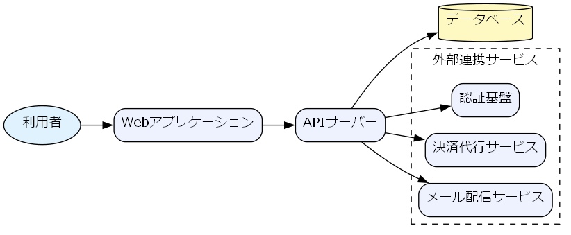

**コードのポイント:**

- `subgraph cluster_external { ... }` で外部連携サービスをグルーピングしている
- 外部サービスが増えても`cluster_external`内に追加するだけでよく、
  Graphvizが自動的にレイアウトを整理する
- どちらを使うかの判断基準は
  [Mermaid vs Graphviz](../03-diagram-patterns/01-mermaid-vs-graphviz.md)を参照

システムコンテキスト図の例です。C4Contextは、システムと利用者・外部システムの
関係を標準化された記法（Person/System/Rel）で表現します。

**ソースコード:**

```text
C4Context
    title システムコンテキスト図（ECサイト）

    Person(customer, "顧客", "商品を注文する利用者")
    System(ecSystem, "ECサイト", "商品検索・注文・決済を提供する")
    System_Ext(paymentGateway, "決済代行サービス", "外部の決済処理基盤")
    System_Ext(mailService, "メール配信サービス", "注文確認メールを送信する")

    Rel(customer, ecSystem, "商品を注文する")
    Rel(ecSystem, paymentGateway, "決済を依頼する")
    Rel(ecSystem, mailService, "注文確認を送信する")
```

```mermaid
C4Context
    title システムコンテキスト図（ECサイト）

    Person(customer, "顧客", "商品を注文する利用者")
    System(ecSystem, "ECサイト", "商品検索・注文・決済を提供する")
    System_Ext(paymentGateway, "決済代行サービス", "外部の決済処理基盤")
    System_Ext(mailService, "メール配信サービス", "注文確認メールを送信する")

    Rel(customer, ecSystem, "商品を注文する")
    Rel(ecSystem, paymentGateway, "決済を依頼する")
    Rel(ecSystem, mailService, "注文確認を送信する")
```

**コードのポイント:**

- `Person(customer, "顧客", "...")` / `System(ecSystem, "ECサイト", "...")` は
  `要素ID, 表示名, 説明` の順で宣言する
- `System_Ext` は自システムの外部にある関連システムを表す（`System`と区別する）
- `Rel(customer, ecSystem, "商品を注文する")` で要素間の関係とラベルを表現する
- C4Contextは公式ドキュメントで今も「実験的機能」と明記されており、
  構文が将来変更される可能性がある点に注意する
- Graphvizの`subgraph cluster_external`（自由なグルーピング）と異なり、
  C4Contextは`Person`/`System`/`System_Ext`という役割が固定された標準記法である

画面遷移図の例です。

**ソースコード:**

```text
stateDiagram-v2
    [*] --> Login
    Login --> Home : ログイン成功
    Home --> ProductDetail : 商品選択
    ProductDetail --> Cart : カートに追加
    Cart --> Checkout : レジに進む
    Checkout --> Complete : 決済成功
    Complete --> [*]
```

```mermaid
stateDiagram-v2
    [*] --> Login
    Login --> Home : ログイン成功
    Home --> ProductDetail : 商品選択
    ProductDetail --> Cart : カートに追加
    Cart --> Checkout : レジに進む
    Checkout --> Complete : 決済成功
    Complete --> [*]
```

**コードのポイント:**

- 画面（`Login`, `Home`など）を状態として扱い、`stateDiagram-v2`で表現する
- `A --> B : 条件`の`:`以降が画面遷移のきっかけ（ボタン操作等）になる
- `[*]`はアプリの起動・終了に対応する

ER図（論理）の例です。要件定義段階のモデルに属性を追加して詳細化します。

**ソースコード:**

```text
erDiagram
    CUSTOMER {
        int customer_id PK
        string name
        string email
    }
    ORDER {
        int order_id PK
        int customer_id FK
        date order_date
    }
    ORDER_ITEM {
        int order_item_id PK
        int order_id FK
        int product_id FK
        int quantity
    }
    PRODUCT {
        int product_id PK
        string name
        int price
    }
    CUSTOMER ||--o{ ORDER : "発注する"
    ORDER ||--|{ ORDER_ITEM : "含む"
    PRODUCT ||--o{ ORDER_ITEM : "含まれる"
```

```mermaid
erDiagram
    CUSTOMER {
        int customer_id PK
        string name
        string email
    }
    ORDER {
        int order_id PK
        int customer_id FK
        date order_date
    }
    ORDER_ITEM {
        int order_item_id PK
        int order_id FK
        int product_id FK
        int quantity
    }
    PRODUCT {
        int product_id PK
        string name
        int price
    }
    CUSTOMER ||--o{ ORDER : "発注する"
    ORDER ||--|{ ORDER_ITEM : "含む"
    PRODUCT ||--o{ ORDER_ITEM : "含まれる"
```

**コードのポイント:**

- `PK`/`FK`で主キー・外部キーを明示する
- [要件定義フェーズ](02-requirements-phase.md)の概念モデルに属性を追加して詳細化している
- 型（`int`/`string`/`date`）を明記し、実装時のカラム定義の土台にする

### 6.3.6 演習課題

1. 自分の身近なシステム（例: 予約サイト）のシステム構成図を、まずMermaidの
   flowchartで書き、次に外部連携を3つ以上追加してGraphvizのcluster版に
   書き直せ
2. 3画面以上のstateDiagramで画面遷移図を書け
3. 自分のシステムの利用者・外部連携先を洗い出し、C4Contextでシステム
   コンテキスト図を書け

### 6.3.7 理解度チェック

- [ ] システム構成図をMermaid/Graphviz両方で書ける
- [ ] 複雑さに応じてMermaidとGraphvizを使い分ける判断ができる
- [ ] stateDiagramで画面遷移を表現できる
- [ ] ER図に主キー・外部キーを明記できる
- [ ] C4Contextで`Person`/`System`/`System_Ext`/`Rel`を使い分けられる

---

[← 前へ: 要件定義フェーズ](02-requirements-phase.md) | [次へ: 詳細設計フェーズ →](04-detailed-design-phase.md)

## 6.4 詳細設計フェーズ

### 6.4.1 この教材で身につくこと

- 詳細設計フェーズの主な成果物を把握する
- クラス図・複合状態を含むステートマシン図・詳細シーケンス図をMermaidで書ける
- DFD（データフロー図）をGraphvizで書ける

### 6.4.2 概要

詳細設計フェーズでは、基本設計で決めた構造をさらに掘り下げ、
クラスやオブジェクトの内部構造・状態遷移・処理のやり取りを
具体化した成果物が作られます。

### 6.4.3 位置づけ

[開発フェーズ×図カタログ 全体マッピング](01-diagram-catalog-overview.md)の全体マッピング表のうち「詳細設計」行を
深掘りする教材です。[基本設計フェーズ](03-basic-design-phase.md)の
シーケンス概要図・画面遷移図を、ここではより詳細な条件分岐・複合状態を
含む形に発展させます。

### 6.4.4 基本文法・プロパティ解説

#### 6.4.4.1 成果物別の対応表

| 成果物 | 図の種類 | 適する理由 |
|---|---|---|
| クラス図 | classDiagram | オブジェクトの属性・メソッド・関連を表現できる |
| ステートマシン図 | stateDiagram | 複合状態（サブ状態）で処理の内部段階を表現できる |
| 詳細シーケンス図 | sequenceDiagram | alt/loopでリトライや分岐を含むやり取りを表現できる |
| DFD（データフロー図） | Graphviz DOT | Mermaid非対応のため、形状指定で代替表現する |

### 6.4.5 実ソースコード

クラス図の例です。

**ソースコード:**

```text
classDiagram
    class Order {
        +int orderId
        +Date orderDate
        +addItem(item) void
        +calculateTotal() int
    }
    class OrderItem {
        +int quantity
        +int unitPrice
    }
    class Customer {
        +String name
        +String email
    }
    Customer "1" --> "*" Order : places
    Order "1" --> "*" OrderItem : contains
```

```mermaid
classDiagram
    class Order {
        +int orderId
        +Date orderDate
        +addItem(item) void
        +calculateTotal() int
    }
    class OrderItem {
        +int quantity
        +int unitPrice
    }
    class Customer {
        +String name
        +String email
    }
    Customer "1" --> "*" Order : places
    Order "1" --> "*" OrderItem : contains
```

**コードのポイント:**

- `class Order { ... }` にメソッド（`addItem`, `calculateTotal`）を含めて実装レベルに近づける
- `Customer "1" --> "*" Order : places` は「顧客1人が複数の注文を持つ」多重度付き関連
- [基本設計フェーズ](03-basic-design-phase.md)のER図（CUSTOMER/ORDER/ORDER_ITEM）と
  対応する構造になっている

複合状態を含むステートマシン図の例です。「処理中」の内部段階を
サブ状態として表現します。

**ソースコード:**

```text
stateDiagram-v2
    [*] --> Pending
    Pending --> Processing : 支払い確認
    state Processing {
        [*] --> Picking
        Picking --> Packing : ピッキング完了
        Packing --> [*]
    }
    Processing --> Shipped : 出荷完了
    Shipped --> Delivered : 配達完了
    Delivered --> [*]
```

```mermaid
stateDiagram-v2
    [*] --> Pending
    Pending --> Processing : 支払い確認
    state Processing {
        [*] --> Picking
        Picking --> Packing : ピッキング完了
        Packing --> [*]
    }
    Processing --> Shipped : 出荷完了
    Shipped --> Delivered : 配達完了
    Delivered --> [*]
```

**コードのポイント:**

- `state Processing { ... }` で複合状態（サブ状態を持つ状態）を宣言する
- サブ状態内にも独自の`[*]`（開始・終了）を持てる
- 外側から見ると`Processing`は1つの状態のままなので、全体像を保ったまま詳細化できる

詳細シーケンス図の例です。決済のリトライを`loop`/`alt`で表現します。

**ソースコード:**

```text
sequenceDiagram
    participant WebApp as Webアプリ
    participant API as APIサーバー
    participant Payment as 決済代行サービス

    WebApp->>API: 注文確定リクエスト
    activate API
    loop 最大3回リトライ
        API->>Payment: 決済実行
        alt 決済成功
            Payment-->>API: 成功レスポンス
        else 決済失敗
            Payment-->>API: エラー
        end
    end
    API-->>WebApp: 注文結果
    deactivate API
```

```mermaid
sequenceDiagram
    participant WebApp as Webアプリ
    participant API as APIサーバー
    participant Payment as 決済代行サービス

    WebApp->>API: 注文確定リクエスト
    activate API
    loop 最大3回リトライ
        API->>Payment: 決済実行
        alt 決済成功
            Payment-->>API: 成功レスポンス
        else 決済失敗
            Payment-->>API: エラー
        end
    end
    API-->>WebApp: 注文結果
    deactivate API
```

**コードのポイント:**

- `loop 最大3回リトライ ... end` の中に`alt`を入れ子にし、リトライ処理を表現する
- `activate API`/`deactivate API`で注文確定リクエスト全体の処理区間を示す
- 基本設計の「シーケンス概要図」に対し、リトライという実装詳細を追加している

DFD（データフロー図）の例です。Mermaidに専用記法がないため、Graphvizの
`shape`でプロセス・データストア・外部エンティティを描き分けます。

`docs/06-project-phase-diagrams/examples/02-dfd.dot`

```dot
digraph DFD {
  rankdir=LR;
  node [fontname="Meiryo"];
  edge [fontname="Meiryo"];

  Customer [shape=box, label="顧客"];
  OrderProcess [shape=ellipse, label="注文処理"];
  OrderStore [shape=box3d, label="注文データ"];
  InventoryProcess [shape=ellipse, label="在庫確認"];
  InventoryStore [shape=box3d, label="在庫データ"];

  Customer -> OrderProcess [label="注文情報"];
  OrderProcess -> OrderStore [label="注文登録"];
  OrderProcess -> InventoryProcess [label="在庫確認依頼"];
  InventoryProcess -> InventoryStore [label="在庫参照"];
  InventoryProcess -> OrderProcess [label="在庫結果"];
}
```

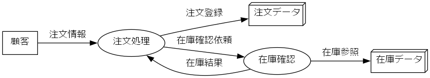

**コードのポイント:**

- `shape=box`は外部エンティティ（顧客）、`shape=ellipse`はプロセス（注文処理・在庫確認）
- `shape=box3d`はデータストア（注文データ・在庫データ）を表す、DFDでよく使われる形状の代替
- エッジのラベル（`label="注文情報"`等）がデータフローの名前になる

### 6.4.6 演習課題

1. [基本設計フェーズ](03-basic-design-phase.md)のER図に対応するクラス図を、
   メソッドを2つ以上加えて書け
2. 「処理中」に相当する状態を1つ選び、複合状態として2段階以上のサブ状態に
   分解したstateDiagramを書け
3. 何らかの外部APIリクエストを題材に、`loop`と`alt`を組み合わせた
   詳細シーケンス図を書け

### 6.4.7 理解度チェック

- [ ] classDiagramでメソッドを含む詳細なクラス構造を書ける
- [ ] `state 名前 { ... }`で複合状態を表現できる
- [ ] `loop`と`alt`を組み合わせた詳細シーケンス図を書ける
- [ ] DFDをGraphvizの`shape`使い分けで表現できる

---

[← 前へ: 基本設計フェーズ](03-basic-design-phase.md) | [次へ: 実装・テストフェーズ →](05-implementation-testing-phase.md)

## 6.5 実装・テストフェーズ

### 6.5.1 この教材で身につくこと

- 実装・テストフェーズの主な成果物を把握する
- モジュール依存図をGraphvizのクラスタで書ける
- テストケース分岐図・テストスケジュールをMermaidで書ける

### 6.5.2 概要

実装フェーズではモジュール間の依存関係を整理し、テストフェーズでは
テストケースの網羅性やスケジュールを可視化した成果物が作られます。

### 6.5.3 位置づけ

[開発フェーズ×図カタログ 全体マッピング](01-diagram-catalog-overview.md)の全体マッピング表のうち「実装・テスト」行を
深掘りする教材です。[詳細設計フェーズ](04-detailed-design-phase.md)の
クラス図をもとに、実際のモジュール構成へ落とし込みます。

### 6.5.4 基本文法・プロパティ解説

#### 6.5.4.1 成果物別の対応表

| 成果物 | 図の種類 | 適する理由 |
|---|---|---|
| モジュール依存図 | Graphviz DOT | クラスタで層を分け、大規模でも自動整理できる |
| テストケース分岐図 | flowchart | デシジョンテーブルの条件組み合わせを可視化できる |
| テストスケジュール | gantt | タスクの依存関係・期間を時系列で共有できる |

### 6.5.5 実ソースコード

モジュール依存図の例です。UI層・サービス層・リポジトリ層をクラスタで
分けています。

`docs/06-project-phase-diagrams/examples/03-module-dependency.dot`

```dot
digraph ModuleDependency {
  rankdir=TB;
  fontname="Meiryo";
  node [shape=box, fontname="Meiryo"];

  subgraph cluster_ui {
    label="UI層";
    style=dashed;
    LoginView [label="LoginView"];
    CartView [label="CartView"];
    CheckoutView [label="CheckoutView"];
  }

  subgraph cluster_service {
    label="サービス層";
    style=dashed;
    OrderService [label="OrderService"];
    PaymentService [label="PaymentService"];
    InventoryService [label="InventoryService"];
  }

  subgraph cluster_repository {
    label="リポジトリ層";
    style=dashed;
    OrderRepository [label="OrderRepository"];
    ProductRepository [label="ProductRepository"];
  }

  LoginView -> OrderService;
  CartView -> OrderService;
  CheckoutView -> OrderService;
  CheckoutView -> PaymentService;
  OrderService -> OrderRepository;
  OrderService -> InventoryService;
  PaymentService -> OrderRepository;
  InventoryService -> ProductRepository;
}
```

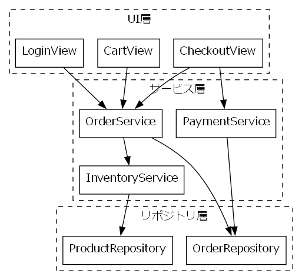

**コードのポイント:**

- `rankdir=TB`でUI層→サービス層→リポジトリ層という上位から下位への依存方向を表す
- 3つの`cluster_*`で層ごとにグルーピングし、層をまたぐ依存が視覚的にわかる
- モジュールが増えて依存が複雑化した場合の整理法は
  [複雑な図の整理法](../03-diagram-patterns/03-complex-diagram-organization.md)を参照

テストケース分岐図の例です。デシジョンテーブル（年齢×年収の組み合わせ）を
flowchartの分岐として可視化します。

**ソースコード:**

```text
flowchart TD
    Age{年齢} -->|18歳未満| Reject[利用不可]
    Age -->|18歳以上65歳未満| Income{年収}
    Age -->|65歳以上| SeniorPlan[シニア向けプラン]
    Income -->|300万円未満| StandardPlan[スタンダードプラン]
    Income -->|300万円以上| PremiumPlan[プレミアムプラン]
```

```mermaid
flowchart TD
    Age{年齢} -->|18歳未満| Reject[利用不可]
    Age -->|18歳以上65歳未満| Income{年収}
    Age -->|65歳以上| SeniorPlan[シニア向けプラン]
    Income -->|300万円未満| StandardPlan[スタンダードプラン]
    Income -->|300万円以上| PremiumPlan[プレミアムプラン]
```

**コードのポイント:**

- `Age{年齢}`と`Income{年収}`の2つの分岐ノードで条件の組み合わせを表す
- 終端ノード（`Reject`/`SeniorPlan`/`StandardPlan`/`PremiumPlan`）の数が
  テストケース数の目安になる
- 条件の組み合わせ漏れ・重複がないかを図で確認できる

テストスケジュールの例です。

**ソースコード:**

```text
gantt
    title 結合テストスケジュール
    dateFormat YYYY-MM-DD
    section 準備
    テスト計画書作成 :t1, 2026-08-01, 3d
    テストデータ準備 :t2, after t1, 2d
    section 実施
    結合テスト実施 :t3, after t2, 5d
    不具合修正 :t4, after t3, 3d
    section 完了
    再テスト :t5, after t4, 2d
```

```mermaid
gantt
    title 結合テストスケジュール
    dateFormat YYYY-MM-DD
    section 準備
    テスト計画書作成 :t1, 2026-08-01, 3d
    テストデータ準備 :t2, after t1, 2d
    section 実施
    結合テスト実施 :t3, after t2, 5d
    不具合修正 :t4, after t3, 3d
    section 完了
    再テスト :t5, after t4, 2d
```

**コードのポイント:**

- `section 準備`/`section 実施`/`section 完了`でテスト工程をグルーピングする
- `after t2`のように前タスクの完了を起点にでき、依存関係を表現できる
- 不具合修正・再テストのように手戻りタスクも1つのタスクとして計画に組み込める

### 6.5.6 演習課題

1. [詳細設計フェーズ](04-detailed-design-phase.md)のクラス図（Order/OrderItem/Customer）
   をもとに、4層以上のモジュール依存図をGraphvizで書け
2. 3つ以上の条件を組み合わせたデシジョンテーブルを、flowchartの分岐として書け
3. 単体テスト→結合テスト→受入テストの3段階を含むganttチャートを書け

### 6.5.7 理解度チェック

- [ ] Graphvizのクラスタでモジュールを層ごとに分けられる
- [ ] デシジョンテーブルをflowchartの分岐として可視化できる
- [ ] ganttでタスクの依存関係を含むテストスケジュールを書ける

---

[← 前へ: 詳細設計フェーズ](04-detailed-design-phase.md) | [次へ: リリース・運用保守フェーズ →](06-release-operations-phase.md)

## 6.6 リリース・運用保守フェーズ

### 6.6.1 この教材で身につくこと

- リリース・運用保守フェーズの主な成果物を把握する
- デプロイフロー図・障害対応フローをMermaidで書ける
- インフラ構成図をMermaid（architecture-beta）またはGraphvizで書ける
- gitGraphでブランチ戦略・リリースタイミングを可視化できる

### 6.6.2 概要

リリース・運用保守フェーズでは、デプロイの手順やインフラの構成、
障害発生時の対応手順を整理した成果物が作られます。

### 6.6.3 位置づけ

[開発フェーズ×図カタログ 全体マッピング](01-diagram-catalog-overview.md)の全体マッピング表のうち「リリース・運用」行を
深掘りする教材です。[基本設計フェーズ](03-basic-design-phase.md)の
システム構成図を、ここでは実際のサーバー冗長構成にまで具体化します。

### 6.6.4 基本文法・プロパティ解説

#### 6.6.4.1 成果物別の対応表

| 成果物 | 図の種類 | 適する理由 |
|---|---|---|
| デプロイフロー図 | flowchart | ビルド〜デプロイ〜検証の手順と分岐を表現できる |
| インフラ構成図 | Mermaid architecture-beta / Graphviz DOT | シンプルな冗長構成はMermaidで書けるが、サブネットや自由な形状を含む複雑な階層はGraphvizが得意 |
| 障害対応フロー | flowchart | 検知から復旧までの対応手順・エスカレーションを表現できる |
| ブランチ戦略図 | gitGraph | ブランチの分岐・マージ・リリースタイミングを可視化できる |

### 6.6.5 実ソースコード

デプロイフロー図の例です。

**ソースコード:**

```text
flowchart TD
    Start([リリース判定]) --> Build[ビルド実行]
    Build --> Test{テスト成功}
    Test -->|Yes| Deploy[本番環境へデプロイ]
    Test -->|No| Notify[開発チームに通知]
    Deploy --> Verify{ヘルスチェックOK}
    Verify -->|Yes| Done([リリース完了])
    Verify -->|No| Rollback[ロールバック]
    Rollback --> Notify
```

```mermaid
flowchart TD
    Start([リリース判定]) --> Build[ビルド実行]
    Build --> Test{テスト成功}
    Test -->|Yes| Deploy[本番環境へデプロイ]
    Test -->|No| Notify[開発チームに通知]
    Deploy --> Verify{ヘルスチェックOK}
    Verify -->|Yes| Done([リリース完了])
    Verify -->|No| Rollback[ロールバック]
    Rollback --> Notify
```

**コードのポイント:**

- `Test{テスト成功}`と`Verify{ヘルスチェックOK}`の2段階で成功可否を判定する
- `Verify -->|No| Rollback` のように失敗時はロールバックに分岐させる
- `Rollback --> Notify` で失敗時も通知フローに合流させている

インフラ構成図の例です。シンプルな冗長構成であれば、Mermaidの
`architecture-beta`で書けます。

**ソースコード:**

```text
architecture-beta
    service internet(internet)["インターネット"]
    service lb(server)["ロードバランサー"]

    group web(cloud)["Webサーバー層"]
    service web1(server)["Web1"] in web
    service web2(server)["Web2"] in web

    group app(cloud)["APサーバー層"]
    service app1(server)["App1"] in app
    service app2(server)["App2"] in app

    service db(database)["データベース冗長構成"]

    internet:B --> T:lb
    lb:B --> T:web1
    lb:B --> T:web2
    web1:B --> T:app1
    web2:B --> T:app2
    app1:B --> T:db
    app2:B --> T:db
```

```mermaid
architecture-beta
    service internet(internet)["インターネット"]
    service lb(server)["ロードバランサー"]

    group web(cloud)["Webサーバー層"]
    service web1(server)["Web1"] in web
    service web2(server)["Web2"] in web

    group app(cloud)["APサーバー層"]
    service app1(server)["App1"] in app
    service app2(server)["App2"] in app

    service db(database)["データベース冗長構成"]

    internet:B --> T:lb
    lb:B --> T:web1
    lb:B --> T:web2
    web1:B --> T:app1
    web2:B --> T:app2
    app1:B --> T:db
    app2:B --> T:db
```

**コードのポイント:**

- `group web(cloud)["Webサーバー層"]`でグループを作り、`service web1(server)["Web1"] in web`のように`in`で所属させる
- ラベルは`["インターネット"]`のように二重引用符で囲む。日本語など非ASCII文字を引用符なしで書くと`Syntax error in text`になる（flowchartと異なる制約）
- エッジは`internet:B --> T:lb`のように接続元・接続先の側面（`T`/`B`/`L`/`R`）を指定してつなぐ
- 組み込みアイコンは`cloud`/`database`/`disk`/`internet`/`server`の5種類のみ。追加の見た目が必要な場合はアイコンパックの追加設定が要る
- `architecture-beta`はMermaid v11.1.0以降が必要。ビルドに使うmermaid-cliのバージョン対応を事前に確認する

より複雑なネットワーク階層（サブネットや自由な形状のノードなど）を
表現する場合は、次のようにGraphvizの`cluster`を使います。

`docs/06-project-phase-diagrams/examples/04-infra-architecture.dot`

```dot
digraph InfraArchitecture {
  rankdir=TB;
  fontname="Meiryo";
  node [shape=box, fontname="Meiryo"];

  Internet [shape=ellipse, label="インターネット"];
  LB [label="ロードバランサー"];

  subgraph cluster_web {
    label="Webサーバー層";
    style=dashed;
    Web1 [label="Web1"];
    Web2 [label="Web2"];
  }

  subgraph cluster_app {
    label="APサーバー層";
    style=dashed;
    App1 [label="App1"];
    App2 [label="App2"];
  }

  DB [shape=cylinder, label="データベース(冗長構成)"];

  Internet -> LB;
  LB -> Web1;
  LB -> Web2;
  Web1 -> App1;
  Web2 -> App2;
  App1 -> DB;
  App2 -> DB;
}
```

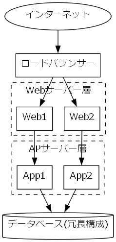

**コードのポイント:**

- `LB -> Web1; LB -> Web2;` でロードバランサーから冗長化されたWebサーバーへの
  分岐を表現する
- `cluster_web`/`cluster_app`で層ごとにサーバーをグルーピングしている
- `DB [shape=cylinder, label="データベース(冗長構成)"]` のようにラベル文字列に
  補足情報（冗長構成であること）を含められる

障害対応フローの例です。

**ソースコード:**

```text
flowchart TD
    Detect([障害検知]) --> Assess{影響範囲}
    Assess -->|軽微| Log[ログに記録]
    Assess -->|重大| Escalate[エスカレーション]
    Escalate --> WarRoom[緊急対応チーム招集]
    WarRoom --> Fix[原因調査・復旧]
    Fix --> Verify{復旧確認}
    Verify -->|OK| Report[報告書作成]
    Verify -->|NG| Fix
    Log --> Report
```

```mermaid
flowchart TD
    Detect([障害検知]) --> Assess{影響範囲}
    Assess -->|軽微| Log[ログに記録]
    Assess -->|重大| Escalate[エスカレーション]
    Escalate --> WarRoom[緊急対応チーム招集]
    WarRoom --> Fix[原因調査・復旧]
    Fix --> Verify{復旧確認}
    Verify -->|OK| Report[報告書作成]
    Verify -->|NG| Fix
    Log --> Report
```

**コードのポイント:**

- `Assess{影響範囲}`の分岐で軽微/重大の対応を分ける
- `Verify -->|NG| Fix` のように復旧確認に失敗した場合は原因調査に戻すループがある
- 軽微・重大どちらの経路も最終的に`Report`（報告書作成）へ合流する

ブランチ戦略図の例です。リリースブランチの運用と、緊急修正（hotfix）の
分岐・マージタイミングを可視化します。

**ソースコード:**

```text
gitGraph
    commit id: "初期リリース"
    branch develop
    checkout develop
    commit id: "機能A実装"
    branch feature/payment
    checkout feature/payment
    commit id: "決済機能実装"
    checkout develop
    merge feature/payment
    checkout main
    merge develop tag: "v1.1.0"
    branch hotfix/urgent-fix
    checkout hotfix/urgent-fix
    commit id: "緊急バグ修正"
    checkout main
    merge hotfix/urgent-fix tag: "v1.1.1"
```

```mermaid
gitGraph
    commit id: "初期リリース"
    branch develop
    checkout develop
    commit id: "機能A実装"
    branch feature/payment
    checkout feature/payment
    commit id: "決済機能実装"
    checkout develop
    merge feature/payment
    checkout main
    merge develop tag: "v1.1.0"
    branch hotfix/urgent-fix
    checkout hotfix/urgent-fix
    commit id: "緊急バグ修正"
    checkout main
    merge hotfix/urgent-fix tag: "v1.1.1"
```

**コードのポイント:**

- `branch feature/payment` → `checkout feature/payment` で作業用ブランチに切り替える
- `merge feature/payment` で`develop`に機能ブランチを取り込み、
  `merge develop tag: "v1.1.0"` でmainへのリリースにタグを付ける
- `branch hotfix/urgent-fix` のように、mainから直接切る緊急修正ブランチも表現できる
- gitGraphの基本機能はMermaidの早期バージョンから安定して利用できる

### 6.6.6 演習課題

1. ロールバック処理を含むデプロイフロー図を、自分のプロジェクトを想定して書け
2. Webサーバーを3台以上に冗長化したインフラ構成図を、Mermaid（architecture-beta）
   またはGraphvizで書け
3. 「検知」「影響範囲判定」「復旧」「報告」の4段階を含む障害対応フローを書け
4. featureブランチ2本とhotfixブランチ1本を含むブランチ戦略図を、
   自分のプロジェクトを想定して書け

### 6.6.7 理解度チェック

- [ ] デプロイフロー図に成功/失敗の分岐とロールバックを含められる
- [ ] Mermaidの`architecture-beta`でシンプルな冗長構成を表現できる
- [ ] Graphvizのクラスタで、より複雑な階層を持つインフラ構成を表現できる
- [ ] 障害対応フローに検知からエスカレーション・復旧確認までの流れを書ける
- [ ] gitGraphでブランチの分岐・マージ・タグ付けを表現できる

---

[← 前へ: 実装・テストフェーズ](05-implementation-testing-phase.md) | [次へ: アジャイル開発での当てはめ →](07-agile-artifacts.md)

## 6.7 アジャイル開発での当てはめ

### 6.7.1 この教材で身につくこと

- アジャイル開発特有の成果物（スプリント計画・開発サイクル）を把握する
- 02〜06で学んだ図のカタログを、アジャイルの反復サイクルに当てはめられる
- kanbanでスプリント中のタスク状態（Todo/Doing/Done）を可視化できる
- Mermaid/Graphvizでは十分に表現できないアジャイル成果物（バーンダウンチャート等）とその制約・代替手段を把握する

### 6.7.2 概要

アジャイル開発ではウォーターフォールのような明確なフェーズ区切りがなく、
短いサイクル（スプリント）を繰り返します。02〜06で扱った成果物の多くは
「フェーズ」ではなく「タイミング」を変えてアジャイルの中でも作られます。

### 6.7.3 位置づけ

[開発フェーズ×図カタログ 全体マッピング](01-diagram-catalog-overview.md)の全体マッピング表のうち「アジャイル」行を
深掘りする教材です。02〜06（ウォーターフォール型フェーズ）の内容を
前提とします。

### 6.7.4 基本文法・プロパティ解説

#### 6.7.4.1 成果物別の対応表

| 成果物 | 図の種類 | 適する理由 |
|---|---|---|
| スプリント計画 | gantt | 短期間のタスクと期間を時系列で共有できる |
| 開発サイクル図 | flowchart | バックログ→計画→実施→レビュー→改善の反復を表現できる |
| バックログ優先度 | 表（図ではなく表が適する） | Mermaid/Graphvizに専用の一覧表現はない |
| バーンダウンチャート | xychart-beta（制約あり） | 折れ線2本で理想線・実績線を表現できるが、日付軸非対応・累積値は事前計算が必要 |
| カンバンボード | kanban | Todo/Doing/Doneのタスク状態遷移を可視化できる |

#### 6.7.4.2 02〜06カタログのアジャイルへの対応付け

| ウォーターフォールでの成果物 | アジャイルでの当てはめタイミング |
|---|---|
| [業務フロー図](02-requirements-phase.md) | プロダクトバックログ作成時に、対象業務の理解のため作成 |
| [システム構成図](03-basic-design-phase.md) | 最初のスプリント計画前に、全体アーキテクチャの合意として作成 |
| [クラス図・詳細シーケンス図](04-detailed-design-phase.md) | 各スプリント内で、対象機能の実装直前に必要な範囲だけ作成 |
| [テストケース分岐図](05-implementation-testing-phase.md) | 各スプリントのテストタスクで、対象機能分だけ作成 |
| [デプロイフロー図・インフラ構成図](06-release-operations-phase.md) | 継続的デリバリー環境の構築時に作成し、以降のスプリントで再利用 |

ウォーターフォールでは「フェーズの成果物」として一括で作られていたものが、
アジャイルでは「スプリントごとに必要な範囲だけ」作られる点が違いです。

### 6.7.5 実ソースコード

スプリント計画の例です。

**ソースコード:**

```text
gantt
    title スプリント計画（2週間スプリント）
    dateFormat YYYY-MM-DD
    section スプリント1
    ログイン機能実装 :s1, 2026-08-03, 4d
    カート機能実装 :s2, after s1, 4d
    section スプリント2
    決済機能実装 :s3, 2026-08-17, 5d
    リリース準備 :s4, after s3, 3d
```

```mermaid
gantt
    title スプリント計画（2週間スプリント）
    dateFormat YYYY-MM-DD
    section スプリント1
    ログイン機能実装 :s1, 2026-08-03, 4d
    カート機能実装 :s2, after s1, 4d
    section スプリント2
    決済機能実装 :s3, 2026-08-17, 5d
    リリース準備 :s4, after s3, 3d
```

**コードのポイント:**

- `section スプリント1`/`section スプリント2`でスプリントごとにタスクを分ける
- [実装・テストフェーズ](05-implementation-testing-phase.md)のganttと違い、
  対象期間は1〜2スプリント分（数週間）に短くなる
- タスク名は機能単位（ログイン機能実装など）で、実装からテストまで含む粒度にする

開発サイクル図の例です。

**ソースコード:**

```text
flowchart LR
    Backlog[プロダクトバックログ] --> Planning[スプリント計画]
    Planning --> Sprint[スプリント実施]
    Sprint --> Review[スプリントレビュー]
    Review --> Retro[レトロスペクティブ]
    Retro --> Backlog
```

```mermaid
flowchart LR
    Backlog[プロダクトバックログ] --> Planning[スプリント計画]
    Planning --> Sprint[スプリント実施]
    Sprint --> Review[スプリントレビュー]
    Review --> Retro[レトロスペクティブ]
    Retro --> Backlog
```

**コードのポイント:**

- `Retro --> Backlog` で最後のノードから最初のノードへ戻し、反復サイクルを表現する
- 02〜06のフェーズ別成果物は、この`Sprint[スプリント実施]`の中で
  必要な範囲だけ作られる
- ウォーターフォールのflowchart（直線的な流れ）との違いは、終端が
  開始点に戻る点

バーンダウンチャートの例です。

**ソースコード:**

```text
xychart-beta
    title "スプリントバーンダウン（10日間）"
    x-axis [Day1, Day2, Day3, Day4, Day5, Day6, Day7, Day8, Day9, Day10]
    y-axis "残タスク(SP)" 0 --> 40
    line [40, 40, 34, 28, 28, 20, 14, 8, 4, 0]
    line [40, 36, 32, 28, 24, 20, 16, 12, 8, 0]
```

```mermaid
xychart-beta
    title "スプリントバーンダウン（10日間）"
    x-axis [Day1, Day2, Day3, Day4, Day5, Day6, Day7, Day8, Day9, Day10]
    y-axis "残タスク(SP)" 0 --> 40
    line [40, 40, 34, 28, 28, 20, 14, 8, 4, 0]
    line [40, 36, 32, 28, 24, 20, 16, 12, 8, 0]
```

**コードのポイント:**

- 1本目の`line`が実績線、2本目の`line`が理想線（毎日均等に消化した場合の直線）
- `x-axis`はカテゴリラベル（`Day1`など）のみで、Ganttの`dateFormat`のような日付型は使えない
- 各`line`の値は残タスク数を事前に計算した配列で、日次消化量からの自動集計はされない
- `xychart-beta`はMermaid v10.6.0以降が必要。ビルドに使うmermaid-cliのバージョン対応を事前に確認する
- スプリントを跨ぐ複数スプリント分の推移や、日次の自動更新が必要な場合は表計算/BIツールを使う

カンバンボードの例です。スプリント内のタスクを状態別に管理します。

**ソースコード:**

```text
kanban
    Todo
        task1[要件整理]
        task2[画面設計]
    Doing
        task3[決済機能実装]
    Done
        task4[ログイン機能実装]
        task5[DB設計]
```

```mermaid
kanban
    Todo
        task1[要件整理]
        task2[画面設計]
    Doing
        task3[決済機能実装]
    Done
        task4[ログイン機能実装]
        task5[DB設計]
```

**コードのポイント:**

- `Todo`/`Doing`/`Done`のように見出し（コロンなし）を書くと列（レーン）になる
- `task1[要件整理]` のように `id[表示ラベル]` でタスクカードを表現する
- ganttがスケジュール（期間）、kanbanが状態（進捗）を表す点で役割が異なる
- kanbanはMermaid v11.4.0で追加された比較的新しい機能

### 6.7.6 演習課題

1. 自分のチーム（または想定のチーム）で2スプリント分のスプリント計画を
   ganttで書け
2. [開発フェーズ×図カタログ 全体マッピング](01-diagram-catalog-overview.md)の全体マッピング表から成果物を3つ選び、
   それぞれがアジャイルのどのタイミング（バックログ作成時/スプリント内/
   継続的デリバリー環境構築時）で作られるかを表にまとめよ
3. 現在進行中のタスクを5件洗い出し、kanbanでTodo/Doing/Doneに分類せよ

### 6.7.7 理解度チェック

- [ ] スプリント計画をganttで書ける
- [ ] 開発サイクル図で反復（レトロスペクティブから次のバックログへの戻り）を表現できる
- [ ] 02〜06のフェーズ別カタログがアジャイルのどのタイミングに対応するか説明できる
- [ ] バーンダウンチャートをxychart-betaで表現する際の制約（日付軸非対応・累積値の事前計算）を説明できる
- [ ] kanbanでTodo/Doing/Doneのタスク状態を表現できる

---

[← 前へ: リリース・運用保守フェーズ](06-release-operations-phase.md) | [トップに戻る →](../../README.md)
